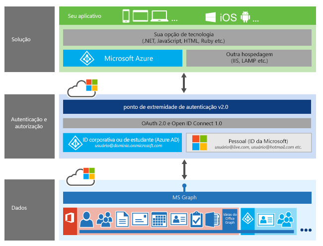

# Autenticação de aplicativo com o Microsoft Graph

Para acessar dados da Microsoft do usuário, seu aplicativo deve permitir que os usuários autentiquem a identidade deles e deem consentimento para o aplicativo executar ações no nome deles.

O Microsoft Graph é compatível com dois provedores de autenticação:

- Para autenticar os usuários com as contas pessoais da Microsoft, como contas do _live.com_ ou _outlook.com_, use o [ponto de extremidade do Azure Active Directory (Azure AD) v2.0](converged_auth.md).
- Para autenticar os usuários com contas de empresa (ou seja, corporativas ou de estudante), use o [Azure AD](app_authorization.md).

> **Criando aplicativos para clientes corporativos?** O aplicativo pode não funcionar caso o cliente corporativo habilite os recursos Enterprise Mobility + Security, como <a href="https://azure.microsoft.com/en-us/documentation/articles/active-directory-conditional-access-device-policies/" target="_newtab">acesso condicional ao dispositivo</a>.  

> Para fornecer suporte a **todos os clientes corporativos**, em **todos os cenários corporativos**, use o ponto de extremidade do Microsoft Azure AD e use o [Portal de Gerenciamento do Microsoft Azure](https://aka.ms/aadapplist) para gerenciar os aplicativos.

## Decidindo entre os pontos de extremidade do Azure AD e do Azure AD v2.0

A tabela a seguir resume os principais recursos compatíveis com os pontos de extremidade do Azure AD e do Azure AD v2.0, e fornece links para informações adicionais. A importância relativa desses recursos e, portanto, qual provedor de autenticação você escolher implementar em seu aplicativo, dependerão principalmente destes fatores:

- O tipo da conta (corporativo ou consumidor) compatível com seus aplicativos
- O tipo de aplicativo que você deseja criar
- O fluxo de autenticação obrigatório 

<table style="width:100%">
  <tr>
    <th></th>
    <th>Ponto de extremidade do Azure AD</th> 
    <th>Ponto de extremidade do Azure AD v2.0</th>
   </tr>
  <tr>
    <td>Tipos de concessão compatíveis</td>
    <td style="vertical-align: text-top;">
Código de autorização

Implícito

Credenciais do cliente

Credenciais de senha de proprietário do recurso
</td> 
    <td style="vertical-align: text-top;">
Código de autorização

Implícito

Credenciais do cliente
</td>
   </tr>
  <tr>
    <td>Tipos de aplicativo compatíveis</td>
    <td style="vertical-align: text-top;">
Aplicativos Web

APIs da Web

Aplicativos móveis e nativos

Aplicativo de página única (SPA)

APIs da Web autônomas

Daemons e aplicativos do lado do servidor

<a href="https://azure.microsoft.com/en-us/documentation/articles/active-directory-authentication-scenarios/" target="_newtab">mais informações</a>
</td> 
    <td style="vertical-align: text-top;">
Aplicativos Web

APIs da Web

Aplicativos móveis e nativos

Aplicativo de página única (SPA)

Daemons e aplicativos do lado do servidor

<a href="https://azure.microsoft.com/en-us/documentation/articles/active-directory-v2-flows/" target="_newtab">mais informações</a></td>
   </tr>
  <tr>
    <td>Políticas de dispositivo de acesso condicional</td>
     <td><a href="https://azure.microsoft.com/en-us/documentation/articles/active-directory-conditional-access-device-policies/" target="_newtab">Com suporte</a></td> 
    <td>Não há suporte atualmente</td>
   </tr>
  <tr>
    <td>Compatíveis com OAuth 2.0 e OpenID Connect</td>
    <td>Não</td> 
    <td>Sim</td>
  </tr>
  <tr>
    <td>Permissões</td>
    <td>Estático: Especificado durante o registro do aplicativo </td> 
    <td><a href ="https://azure.microsoft.com/en-us/documentation/articles/active-directory-v2-compare/#scopes-not-resources" target="_newtab">Dinâmico:</a> Solicitar durante o tempo de execução do aplicativo; inclui consentimento incremental</td>
  </tr>
  <tr>
    <td>Tipos de conta</td>
    <td> 
corporativa ou de estudante
</td> 
    <td>
corporativa ou de estudante

pessoal
 </td>
  </tr>
  <tr>
    <td>ID do aplicativo </td>
    <td>ID do aplicativo separado para cada plataforma</td> 
    <td><a href ="https://azure.microsoft.com/en-us/documentation/articles/active-directory-v2-compare/#one-app-id-for-all-platforms" target="_newtab">ID de aplicativo único para múltiplas plataformas</a></td>
  </tr>
  <tr>
    <td>Portal de registro </td>
    <td><a href ="https://manage.windowsazure.com/" target="_newtab">Gerenciamento do Microsoft Azure</a></td> 
    <td><a href ="https://apps.dev.microsoft.com" target="_newtab">Registro de aplicativo da Microsoft</a></td>
  </tr>
  <tr>
    <td>Bibliotecas de cliente </td>
    <td>SDKs de Autenticação do Active Directory (ADAL) para a maioria das plataformas de desenvolvimento</td> 
    <td>
<a href="https://www.nuget.org/packages/Microsoft.Identity.Client" target="_newtab">Biblioteca de Autenticação da Microsoft (visualização)</a>

<a href="https://azure.microsoft.com/en-us/documentation/articles/active-directory-v2-limitations/#restrictions-on-libraries-amp-sdks" target="_newtab">Bibliotecas OAuth 2.0 de código aberto (lista)</a>
 </td>
  </tr>
  <tr>
    <td>Outros recursos </td>
    <td>
Declarações de grupo para usuários do Azure AD

Funções do aplicativo e declarações de função
</td> 
    <td></td>
  </tr>
</table> 

Além disso, existem diferenças em escopos de permissão exigidas pelos dois provedores de autenticação, além de diferenças nas declarações retornadas em vários tokens. Para mais informações, confira [Escopos conhecidos](https://azure.microsoft.com/en-us/documentation/articles/active-directory-v2-compare/#well-known-scopes) e [Declarações do token](https://azure.microsoft.com/en-us/documentation/articles/active-directory-v2-compare/#token-claims) em [Qual é a diferença do ponto de extremidade v2.0?](https://azure.microsoft.com/en-us/documentation/articles/active-directory-v2-compare/).

Além disso, o ponto de extremidade do Azure AD v2.0 está em desenvolvimento ativo. Serão adicionados mais recursos e cenários compatíveis. Para obter uma lista atual de limitações e restrições para o ponto de extremidade do Azure AD v2.0, confira [Devo usar o ponto de extremidade v2.0?](https://azure.microsoft.com/en-us/documentation/articles/active-directory-v2-limitations/).

## Registrando seu aplicativo para autenticação 

Quando você decide qual provedor de autenticação atende aos requisitos do seu aplicativo, precisa registrar seu aplicativo no portal do provedor de autenticação. Registrar seu aplicativo estabelece a identidade do seu aplicativo com o provedor de autenticação e permite que ele especifique a própria identidade ao enviar solicitações de autenticação do usuário.

- Para registrar seu aplicativo com o Azure AD, use o [Portal do Azure](https://portal.azure.com/).

    <!--For Azure AD, you'll also need to associate your Office 365 account with Azure AD subscription in order to manage your apps.-->

- Para [registrar seu aplicativo com o ponto de extremidade do Azure AD v2.0](auth_register_app_v2.md), use o [Portal de registro do aplicativo da Microsoft](https://apps.dev.microsoft.com).

## Recursos para implementar a autenticação em seu aplicativo Microsoft Graph 

Depois que você registrar seu aplicativo com o portal de autenticação apropriado e tiver as informações de registro do aplicativo (ID do aplicativo, segredo do aplicativo, se aplicável, e o URI de redirecionamento) de que você precisa para estabelecer a identidade do seu aplicativo, estará pronto para implementar a autenticação em seu aplicativo. 

Novamente, isso variará dependendo do tipo de aplicativo que você está criando, sua plataforma de desenvolvimento, o fluxo de autenticação que você escolher e os outros requisitos de autenticação específicos do aplicativo. 

### Exemplos de conexão por provedor e plataforma de autenticação

A tabela a seguir lista os exemplos de conexão por provedor e plataforma de autenticação e observações se eles se conectaram ao Microsoft Graph usando REST ou uma biblioteca de cliente do Microsoft Graph.

<table>
  <tr>
    <th>Plataforma</th>
    <th>Ponto de extremidade do Azure AD</th> 
    <th>Ponto de extremidade do Azure AD v2.0</th>
  </tr>
  <tr>
    <td>Android</td>
    <td>
        <a href="https://github.com/microsoftgraph/android-java-connect-rest-sample">Exemplo de REST</a> ou <a href="https://github.com/microsoftgraph/android-java-connect-sample/tree/last_v1_auth">exemplo de SDK</a>
    </td> 
    <td>
        <a href="https://github.com/microsoftgraph/android-java-connect-sample">Exemplo de SDK</a>
    </td> 
  </tr>
  <tr>
    <td>ASP.NET</td>
    <td>
        <a href="https://github.com/microsoftgraph/aspnet-connect-rest-sample">Exemplo de REST</a>
    </td>     
    <td>
        <a href="https://github.com/microsoftgraph/aspnet-connect-sample">Exemplo de SDK</a>
    </td> 
  </tr>
  <tr>
    <td>iOS (Obj-C)</td>
    <td>
        <a href="https://github.com/microsoftgraph/ios-objectivec-connect-rest-sample">Exemplo de REST</a>
    </td>     
    <td>
        <a href="https://github.com/microsoftgraph/ios-objectivec-connect-sample">Exemplo de SDK</a>
    </td> 
  </tr>
  <tr>
    <td>iOS (Swift)</td>
    <td>
        <a href="https://github.com/microsoftgraph/ios-swift-connect-rest-sample">Exemplo de REST</a>
    </td>     
    <td>
        <a href="https://github.com/microsoftgraph/ios-swift-connect-sample">Exemplo de SDK</a>
    </td> 
  </tr>
  <tr>
    <td>Node.js</td>
    <td>
        <a href="https://github.com/microsoftgraph/nodejs-connect-rest-sample/tree/last_v1_auth">Exemplo de REST</a>
    </td>     
    <td>
        <a href="https://github.com/microsoftgraph/nodejs-connect-rest-sample">Exemplo de REST</a>
    </td> 
  </tr>
  <tr>
    <td>PHP</td>
    <td>
        <a href="https://github.com/microsoftgraph/php-connect-rest-sample/tree/last_v1_auth">Exemplo de REST</a>
    </td>     
    <td>
        <a href="https://github.com/microsoftgraph/php-connect-rest-sample">Exemplo de REST</a>
    </td> 
  </tr>
  <tr>
    <td>Python</td>
    <td>
        <a href="https://github.com/microsoftgraph/python3-connect-rest-sample">Exemplo de REST</a>
    </td>     
    <td>
    </td> 
  </tr>
  <tr>
    <td>Ruby</td>
    <td>
        <a href="https://github.com/microsoftgraph/ruby-connect-rest-sample/tree/last_v1_auth">Exemplo de REST</a>
    </td>     
    <td>
        <a href="https://github.com/microsoftgraph/ruby-connect-rest-sample">Exemplo de REST</a>
    </td> 
  </tr>
  <tr>
    <td>UWP</td>
    <td>
        <a href="https://github.com/microsoftgraph/uwp-csharp-connect-rest-sample/tree/last_v1_auth">Exemplo de REST</a>
    </td>     
    <td>
        <a href="https://github.com/microsoftgraph/uwp-csharp-connect-rest-sample">Exemplo de REST</a> ou <a href="https://github.com/microsoftgraph/uwp-csharp-connect-sample">exemplo de SDK</a>
    </td> 
  </tr>
  <tr>
    <td>Xamarin</td>
    <td>
    </td>     
    <td>
        <a href="https://github.com/microsoftgraph/xamarin-csharp-connect-sample">Exemplo de SDK</a>
    </td> 
  </tr>
</table>

Para explorar uma ampla variedade de projetos que se conectam ao Microsoft Graph por meio de uma ampla variedade de tecnologias, visite o [repositório do Microsoft Graph](https://github.com/microsoftgraph) no GitHub. 

### Introdução  

A seção [Introdução](http://developer.microsoft.com/en-us/graph/docs/platform/get-started) contém artigos detalhados que mostram como criar os aplicativos listados na tabela usando o ponto de extremidade do Azure AD v2.0 e aborda as bibliotecas de autenticação usadas em cada plataforma. 

## Ver também

- <a href="https://azure.microsoft.com/en-us/documentation/articles/active-directory-authentication-scenarios/#basics-of-authentication-in-azure-ad" target="_newtab">Cenários de autenticação para Azure AD</a>
- <a href="https://azure.microsoft.com/en-us/documentation/articles/?product=active-directory&term=v2.0+endpoint" target="_newtab">Documentação do ponto de extremidade do Azure AD v2.0 no Azure.com</a>
- <a href="https://azure.microsoft.com/en-us/documentation/articles/active-directory-v2-app-registration/#build-a-quick-start-app" target="_newtab">Inícios rápidos do código do Azure AD v2.0 no Azure.com</a>
