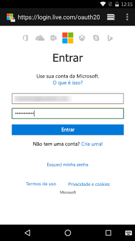

# <a name="get-started-with-microsoft-graph-in-an-android-app"></a><span data-ttu-id="b79ca-101">Introdução ao Microsoft Graph em um aplicativo Android</span><span class="sxs-lookup"><span data-stu-id="b79ca-101">Get started with Microsoft Graph in an Android app</span></span>

> <span data-ttu-id="b79ca-p101">**Criando aplicativos para clientes corporativos?** O aplicativo pode não funcionar caso o cliente corporativo habilite os recursos Enterprise Mobility + Security, como <a href="https://azure.microsoft.com/en-us/documentation/articles/active-directory-conditional-access-device-policies/" target="_newtab">acesso condicional ao dispositivo</a>. Nesse caso, pode ser que você não esteja ciente e seu cliente pode enfrentar problemas de erro.</span><span class="sxs-lookup"><span data-stu-id="b79ca-p101">**Building apps for enterprise customers?** Your app may not work if your enterprise customer turns on enterprise mobility security features like <a href="https://azure.microsoft.com/en-us/documentation/articles/active-directory-conditional-access-device-policies/" target="_newtab">conditional device access</a>. In this case, you may not know and your customers may experience errors.</span></span> 

> <span data-ttu-id="b79ca-p102">Para dar suporte a **todos os clientes corporativos**, em **todos os cenários corporativos**, use o ponto de extremidade do Microsoft Azure AD e gerencie seus aplicativos usando o [Portal do Azure](https://aka.ms/aadapplist). Para saber mais, confira o tópico [Decidindo entre os pontos de extremidade do Microsoft Azure AD e do Microsoft Azure AD versão 2.0](../concepts/auth_overview.md#deciding-between-the-azure-ad-and-azure-ad-v20-endpoints).</span><span class="sxs-lookup"><span data-stu-id="b79ca-p102">To support **all enterprise customers** across **all enterprise scenarios**, you must use the Azure AD endpoint and manage your apps using the [Azure Management Portal](https://aka.ms/aadapplist). For more information, see [Deciding between the Azure AD and Azure AD v2.0 endpoints](../concepts/auth_overview.md#deciding-between-the-azure-ad-and-azure-ad-v20-endpoints).</span></span>

<span data-ttu-id="b79ca-p103">Este artigo descreve as tarefas obrigatórias para obter um token de acesso do ponto de extremidade do Azure AD v2.0 e chamar o Microsoft Graph. Ele o orienta sobre como criar um [Exemplo do Connect para Android](https://github.com/microsoftgraph/android-java-connect-sample) e explica os principais conceitos que você implementa para utilizar o Microsoft Graph em seu aplicativo para Android. O artigo também descreve como acessar o Microsoft Graph usando o [SDK do Microsoft Graph para Android](https://github.com/microsoftgraph/msgraph-sdk-android) ou chamadas REST não processadas.</span><span class="sxs-lookup"><span data-stu-id="b79ca-p103">This article describes the tasks required to get an access token from the Azure AD v2.0 endpoint and call Microsoft Graph. It walks you through building the [Connect Sample for Android](https://github.com/microsoftgraph/android-java-connect-sample) and explains the main concepts that you implement to use Microsoft Graph in your app for Android. The article also describes how to access Microsoft Graph by using either the [Microsoft Graph SDK for Android](https://github.com/microsoftgraph/msgraph-sdk-android) or raw REST calls.</span></span>

<span data-ttu-id="b79ca-110">Para usar o Microsoft Graph no seu aplicativo para Android, você precisa mostrar a página de entrada da Microsoft aos seus usuários, conforme mostrado na captura de tela a seguir.</span><span class="sxs-lookup"><span data-stu-id="b79ca-110">To use Microsoft Graph in your app for Android, you need to show the Microsoft sign-in page to your users, as shown in the following screenshot.</span></span>



<br/>

<span data-ttu-id="b79ca-p104">**Não está com vontade de criar um aplicativo?** Comece rapidamente baixando o [Exemplo do Connect para Android](https://github.com/microsoftgraph/android-java-connect-sample) no qual este artigo se baseia.</span><span class="sxs-lookup"><span data-stu-id="b79ca-p104">**Don't feel like building an app?** Get up and running fast by downloading the [Connect Sample for Android](https://github.com/microsoftgraph/android-java-connect-sample) that this article is based on.</span></span>


## <a name="prerequisites"></a><span data-ttu-id="b79ca-114">Pré-requisitos</span><span class="sxs-lookup"><span data-stu-id="b79ca-114">Prerequisites</span></span>

<span data-ttu-id="b79ca-115">Para começar, será necessário:</span><span class="sxs-lookup"><span data-stu-id="b79ca-115">To get started, you'll need:</span></span> 

- <span data-ttu-id="b79ca-116">Uma [conta da Microsoft](https://www.outlook.com/) ou uma [conta corporativa ou de estudante](http://dev.office.com/devprogram)</span><span class="sxs-lookup"><span data-stu-id="b79ca-116">A [Microsoft account](https://www.outlook.com/) or a [work or school account](http://dev.office.com/devprogram)</span></span>
- <span data-ttu-id="b79ca-117">Android Studio 2.0 ou posterior</span><span class="sxs-lookup"><span data-stu-id="b79ca-117">Android Studio 2.0 or newer version</span></span>


## <a name="configure-a-new-project"></a><span data-ttu-id="b79ca-118">Configurar um novo projeto</span><span class="sxs-lookup"><span data-stu-id="b79ca-118">Configure a new project</span></span>

<span data-ttu-id="b79ca-119">Se você baixou o [Exemplo do Connect para Android](https://github.com/microsoftgraph/android-java-connect-sample), pule esta etapa.</span><span class="sxs-lookup"><span data-stu-id="b79ca-119">If you have downloaded the [Connect Sample for Android](https://github.com/microsoftgraph/android-java-connect-sample), skip this step.</span></span> 

<span data-ttu-id="b79ca-120">Inicie um novo projeto no Android Studio.</span><span class="sxs-lookup"><span data-stu-id="b79ca-120">Start a new project in Android Studio.</span></span> <span data-ttu-id="b79ca-121">Você pode manter os valores padrão para a maioria do assistente; apenas certifique-se de escolher as seguintes opções:</span><span class="sxs-lookup"><span data-stu-id="b79ca-121">You can leave the default values for most of the wizard; just make sure to choose the following options:</span></span>

- <span data-ttu-id="b79ca-122">Dispositivos Android de destino: **Telefone e tablet**</span><span class="sxs-lookup"><span data-stu-id="b79ca-122">Target Android Devices: **Phone and Tablet**</span></span>
- <span data-ttu-id="b79ca-123">SDK mínimo: **API 16: 4.1 Android (Jelly Bean)**</span><span class="sxs-lookup"><span data-stu-id="b79ca-123">Minimum SDK: **API 16: Android 4.1 (Jelly Bean)**</span></span>
- <span data-ttu-id="b79ca-124">Adicione uma atividade ao celular: **Atividade básica**</span><span class="sxs-lookup"><span data-stu-id="b79ca-124">Add an Activity to Mobile: **Basic Activity**</span></span>
 
<span data-ttu-id="b79ca-125">Isso fornece um projeto para Android com uma atividade e um botão que você pode usar para autenticar o usuário.</span><span class="sxs-lookup"><span data-stu-id="b79ca-125">This provides you with an Android project with an activity and a button that you can use to authenticate the user.</span></span>


## <a name="register-the-application"></a><span data-ttu-id="b79ca-126">Registrar o aplicativo</span><span class="sxs-lookup"><span data-stu-id="b79ca-126">Register the application</span></span>

<span data-ttu-id="b79ca-127">Você precisará registrar seu aplicativo no [Portal de Registro do Aplicativo da Microsoft](https://apps.dev.microsoft.com/) se tiver baixado o exemplo do Connect ou criado um novo projeto.</span><span class="sxs-lookup"><span data-stu-id="b79ca-127">You need to register your app on the [Microsoft App Registration Portal](https://apps.dev.microsoft.com/) whether you've downloaded the connect sample or created a new project.</span></span>

<span data-ttu-id="b79ca-p106">Registre um aplicativo no Portal de Registro de Aplicativos da Microsoft. Isso gera a ID do aplicativo que você usará para configurar o aplicativo.</span><span class="sxs-lookup"><span data-stu-id="b79ca-p106">Register an app on the Microsoft App Registration Portal. This generates the app ID that you'll use to configure the app.</span></span>

1. <span data-ttu-id="b79ca-130">Faça login no [Portal de registro de aplicativos da Microsoft](https://apps.dev.microsoft.com/) usando sua conta pessoal, corporativa ou de estudante.</span><span class="sxs-lookup"><span data-stu-id="b79ca-130">Sign in to the [Microsoft App Registration Portal](https://apps.dev.microsoft.com/) by using either your personal or work or school account.</span></span>

2. <span data-ttu-id="b79ca-131">Selecione **Adicionar um aplicativo**.</span><span class="sxs-lookup"><span data-stu-id="b79ca-131">Select **Add an app**.</span></span>

    > <span data-ttu-id="b79ca-132">**Dica:** se você baixou o [Exemplo de Conexão para Android](https://github.com/microsoftgraph/android-java-connect-sample) e está apenas criando um registro para ele, limpe a caixa de seleção **Instalação Interativa** antes de selecionar o botão **Criar**.</span><span class="sxs-lookup"><span data-stu-id="b79ca-132">**Tip:** If you have downloaded the [Connect Sample for Android](https://github.com/microsoftgraph/android-java-connect-sample) and are just creating a registration for it, clear the **Guided Setup** check box before selecting the **Create** button.</span></span>

3. <span data-ttu-id="b79ca-133">Digite um nome para o aplicativo e selecione **Criar**.</span><span class="sxs-lookup"><span data-stu-id="b79ca-133">Enter a name for the app, and then select **Create**.</span></span> 
    
    <span data-ttu-id="b79ca-134">Para o fluxo da **Instalação Interativa**:</span><span class="sxs-lookup"><span data-stu-id="b79ca-134">For the  **Guided Setup** flow:</span></span>
 
    <span data-ttu-id="b79ca-135">a.</span><span class="sxs-lookup"><span data-stu-id="b79ca-135">a.</span></span> <span data-ttu-id="b79ca-136">Selecione **Aplicativo móvel e de área de trabalho** para definir o tipo de aplicativo que você está criando.</span><span class="sxs-lookup"><span data-stu-id="b79ca-136">Select **Mobile and Desktop App** to define the kind of app you are creating.</span></span>

    <span data-ttu-id="b79ca-137">b.</span><span class="sxs-lookup"><span data-stu-id="b79ca-137">b.</span></span> <span data-ttu-id="b79ca-138">Selecione **Android** para definir a tecnologia móvel que você está usando.</span><span class="sxs-lookup"><span data-stu-id="b79ca-138">Select **Android** to define the mobile technology you are using.</span></span>

    <span data-ttu-id="b79ca-139">c.</span><span class="sxs-lookup"><span data-stu-id="b79ca-139">c.</span></span> <span data-ttu-id="b79ca-140">Revise o tópico introdutório e, quando terminar, selecione o botão **Configuração** no final da página.</span><span class="sxs-lookup"><span data-stu-id="b79ca-140">Review the introductory topic, and when finished, select the **Setup** button at the end of the page.</span></span>

    <span data-ttu-id="b79ca-p110">d. Siga as instruções na etapa **Instalação** para adicionar a biblioteca de MSAL ao aplicativo build.gradle.</span><span class="sxs-lookup"><span data-stu-id="b79ca-p110">d. Follow the instructions on the **Setup** step to add the MSAL library to your app build.gradle.</span></span>

    <span data-ttu-id="b79ca-143">e.</span><span class="sxs-lookup"><span data-stu-id="b79ca-143">e.</span></span> <span data-ttu-id="b79ca-144">Siga as instruções na etapa **Usar** para adicionar a lógica de MSAL ao novo projeto.</span><span class="sxs-lookup"><span data-stu-id="b79ca-144">Follow the directions on the **Use** step to add MSAL logic to your new project.</span></span>

    <span data-ttu-id="b79ca-p112">f. Na página **Configurar**, o portal criou uma identificação exclusiva do aplicativo para você. Use-a para configurar seu aplicativo.</span><span class="sxs-lookup"><span data-stu-id="b79ca-p112">f. On the **Configure** page, the portal has created a unique application ID for you. Use it to configure your app.</span></span>

    <br/>
    
    <span data-ttu-id="b79ca-148">Para o fluxo de não interativo:</span><span class="sxs-lookup"><span data-stu-id="b79ca-148">For the unguided flow:</span></span>

    <span data-ttu-id="b79ca-149">A página de registro é exibida, listando as propriedades do seu aplicativo.</span><span class="sxs-lookup"><span data-stu-id="b79ca-149">The registration page displays, listing the properties of your app.</span></span>

    <span data-ttu-id="b79ca-p113">a. Copie a ID do aplicativo. Esse é o identificador exclusivo do aplicativo.</span><span class="sxs-lookup"><span data-stu-id="b79ca-p113">a. Copy the application ID. This is the unique identifier for your app.</span></span> 

    <span data-ttu-id="b79ca-153">b.</span><span class="sxs-lookup"><span data-stu-id="b79ca-153">b.</span></span> <span data-ttu-id="b79ca-154">Selecione **Adicionar plataforma** e **Aplicativo nativo**.</span><span class="sxs-lookup"><span data-stu-id="b79ca-154">Select **Add Platform** and **Native Application**.</span></span>

      > <span data-ttu-id="b79ca-155">**Observação:** O Portal de registro de Aplicativos fornece um URI de redirecionamento com um valor de `msalENTER_YOUR_CLIENT_ID://auth`.</span><span class="sxs-lookup"><span data-stu-id="b79ca-155">**Note:** The Application Registration Portal provides a redirect URI with a value of `msalENTER_YOUR_CLIENT_ID://auth`.</span></span> <span data-ttu-id="b79ca-156">Não use URIs de redirecionamento incorporados.</span><span class="sxs-lookup"><span data-stu-id="b79ca-156">Do not use the built-in redirect URIs.</span></span> <span data-ttu-id="b79ca-157">O [Exemplo do Connect para Android](https://github.com/microsoftgraph/android-java-connect-sample) implementa a biblioteca de autenticação de MSAL que requer esse URI de redirecionamento.</span><span class="sxs-lookup"><span data-stu-id="b79ca-157">The [Connect Sample for Android](https://github.com/microsoftgraph/android-java-connect-sample) implements the MSAL authentication library that requires this redirect URI.</span></span> <span data-ttu-id="b79ca-158">Se estiver usando uma [biblioteca de terceiros com suporte](https://docs.microsoft.com/pt-BR/azure/active-directory/develop/active-directory-v2-libraries#compatible-client-libraries) ou uma biblioteca **ADAL**, você deverá usar URIs de redirecionamento incorporados.</span><span class="sxs-lookup"><span data-stu-id="b79ca-158">If you're using a [supported third-party library](https://docs.microsoft.com/pt-BR/azure/active-directory/develop/active-directory-v2-libraries#compatible-client-libraries) or the **ADAL** library, you must use the built-in redirect URIs.</span></span>
      
      <span data-ttu-id="b79ca-159">c.</span><span class="sxs-lookup"><span data-stu-id="b79ca-159">c.</span></span> <span data-ttu-id="b79ca-160">Adicione permissões delegadas.</span><span class="sxs-lookup"><span data-stu-id="b79ca-160">Add delegated permissions.</span></span> <span data-ttu-id="b79ca-161">Você precisará de **profile**, **Mail.ReadWrite**, **Mail.Send**, **Files.ReadWrite** e **User.ReadBasic.All**.</span><span class="sxs-lookup"><span data-stu-id="b79ca-161">You'll need **profile**, **Mail.ReadWrite**, **Mail.Send**, **Files.ReadWrite**, and **User.ReadBasic.All**.</span></span> 

      <span data-ttu-id="b79ca-162">d.</span><span class="sxs-lookup"><span data-stu-id="b79ca-162">d.</span></span> <span data-ttu-id="b79ca-163">Selecione **Salvar**.</span><span class="sxs-lookup"><span data-stu-id="b79ca-163">Select **Save**.</span></span>


## <a name="authenticate-the-user-and-get-an-access-token"></a><span data-ttu-id="b79ca-164">Autenticar o usuário e obter um token de acesso</span><span class="sxs-lookup"><span data-stu-id="b79ca-164">Authenticate the user and get an access token</span></span>

> <span data-ttu-id="b79ca-165">**Observação:** Se você seguiu as instruções no fluxo da **Instalação Interativa** do portal de registro do aplicativo para criar um novo aplicativo, ignore essas etapas.</span><span class="sxs-lookup"><span data-stu-id="b79ca-165">**Note:** If you followed the instructions in the **Guided Setup** flow from the application registration portal to create a new application, you can skip these steps.</span></span> <span data-ttu-id="b79ca-166">Saiba mais sobre a API de gráficos em [Chamar o Microsoft Graph usando o SDK do Microsoft Graph](#call-microsoft-graph-using-the-microsoft-graph-sdk).</span><span class="sxs-lookup"><span data-stu-id="b79ca-166">To learn more about the Graph API, see [Call Microsoft Graph using the Microsoft Graph SDK](#call-microsoft-graph-using-the-microsoft-graph-sdk).</span></span>

<span data-ttu-id="b79ca-167">Vamos examinar o [Exemplo do Connect para Android](https://github.com/microsoftgraph/android-java-connect-sample) para conhecer o MSAL e o código adicionado do Microsoft Graph.</span><span class="sxs-lookup"><span data-stu-id="b79ca-167">Let's walk through the [Connect Sample for Android](https://github.com/microsoftgraph/android-java-connect-sample) to learn about the MSAL and Microsoft Graph code we've added.</span></span>

### <a name="add-the-dependency-to-appbuildgradle"></a><span data-ttu-id="b79ca-168">Adicionar a dependência a app/build.gradle</span><span class="sxs-lookup"><span data-stu-id="b79ca-168">Add the dependency to app/build.gradle</span></span>

<span data-ttu-id="b79ca-169">Abra o arquivo `build.gradle` no módulo do aplicativo e localize a seguinte dependência:</span><span class="sxs-lookup"><span data-stu-id="b79ca-169">Open the `build.gradle` file in the app module and find the following dependency:</span></span>

```gradle
    compile ('com.microsoft.identity.client:msal:0.1.+') {
        exclude group: 'com.android.support', module: 'appcompat-v7'
    }
    compile 'com.android.volley:volley:1.0.0'
```

<br/>

### <a name="start-the-authentication-flow"></a><span data-ttu-id="b79ca-170">Iniciar o fluxo de autenticação</span><span class="sxs-lookup"><span data-stu-id="b79ca-170">Start the authentication flow</span></span>

1. <span data-ttu-id="b79ca-171">Abra o arquivo **AuthenticationManager** e encontre a declaração do objeto **PublicClientApplication** e a instanciação no método **getInstance**.</span><span class="sxs-lookup"><span data-stu-id="b79ca-171">Open the **AuthenticationManager** file and find the **PublicClientApplication** object declaration, and then the instantiation in the **getInstance** method.</span></span>

   ```java
    private static PublicClientApplication mPublicClientApplication;
    ....

    public static synchronized AuthenticationManager getInstance() {
        if (INSTANCE == null) {
            INSTANCE = new AuthenticationManager();
            if (mPublicClientApplication == null) {
                mPublicClientApplication = new PublicClientApplication(Connect.getInstance());
            }
        }
        return INSTANCE;
    }

   ```

<br/>

2. <span data-ttu-id="b79ca-p119">Na classe **ConnectActivity**, localize o manipulador de eventos do evento de clique de **mConnectButton**. Localize o método **onClick** e analise o código relevante.</span><span class="sxs-lookup"><span data-stu-id="b79ca-p119">In the **ConnectActivity** class, locate the event handler for the click event of the **mConnectButton**. Find the **onClick** method and review relevant code.</span></span>
  
    <span data-ttu-id="b79ca-174">O método **connect** habilita o log de informações de identificação pessoal (PII), obtém uma instância da classe auxiliar **AuthenticationManager** e obtém o conjunto de usuários do objeto da plataforma MSAL.</span><span class="sxs-lookup"><span data-stu-id="b79ca-174">The **connect** method enables personally identifiable information (PII) logging, gets an instance of the sample helper class **AuthenticationManager**, and gets the MSAL platform object users collection.</span></span> <span data-ttu-id="b79ca-175">Se não houver usuários, o novo usuário é levado para o fluxo de autorização e autenticação do Azure AD.</span><span class="sxs-lookup"><span data-stu-id="b79ca-175">If there are no users, the new user is taken to the Azure AD authentication and authorization flow.</span></span> <span data-ttu-id="b79ca-176">Caso contrário, um símbolo de autenticação é obtido no modo silencioso.</span><span class="sxs-lookup"><span data-stu-id="b79ca-176">Otherwise, an authentication token is obtained silently.</span></span>

   ```java
    @Override
    public void onClick(View view) {
        ....
        connect();
    }

        private void connect() {

        if (mEnablePiiLogging) {
            Logger.getInstance().setEnablePII(true);
        } else {
            Logger.getInstance().setEnablePII(false);
        }

        AuthenticationManager mgr = AuthenticationManager.getInstance();

        List<User> users = null;

        try {
            users = mgr.getPublicClient().getUsers();

            if (users != null && users.size() == 1) {
                mUser = users.get(0);
                mgr.callAcquireTokenSilent(mUser, true, this);
            } else {
                mgr.callAcquireToken(
                        this,
                        this);
            }
        } catch (MsalClientException e) {
            Log.d(TAG, "MSAL Exception Generated while getting users: " + e.toString());

        } catch (IndexOutOfBoundsException e) {
            Log.d(TAG, "User at this position does not exist: " + e.toString());
        }
    }

   ```
   
<br/>

3. <span data-ttu-id="b79ca-177">Encontre o manipulador de eventos que processa a resposta de redirecionamento do Azure AD gerada pelo Azure AD quando o usuário fecha a caixa de diálogo de autenticação.</span><span class="sxs-lookup"><span data-stu-id="b79ca-177">Find the event handler that processes the Azure AD redirect response generated by Azure AD when the user closes the authentication dialog.</span></span> <span data-ttu-id="b79ca-178">Esse manipulador está na classe **ConnectActivity**.</span><span class="sxs-lookup"><span data-stu-id="b79ca-178">This handler is in the **ConnectActivity** class.</span></span>

   ```java
       /**
     * Handles redirect response from https://login.microsoftonline.com/common and
     * notifies the MSAL library that the user has completed the authentication
     * dialog
     * @param requestCode
     * @param resultCode
     * @param data
     */
    @Override
    protected void onActivityResult(int requestCode, int resultCode, Intent data) {
        super.onActivityResult(requestCode, resultCode, data);
        if (AuthenticationManager
                .getInstance()
                .getPublicClient() != null) {
            AuthenticationManager
                    .getInstance()
                    .getPublicClient()
                    .handleInteractiveRequestRedirect(requestCode, resultCode, data);
        }
    }

   ```  
   
   <br/>

4. <span data-ttu-id="b79ca-179">Localize o método de retorno de autenticação que armazena em cache o token de autenticação usado em chamadas da API do Graph.</span><span class="sxs-lookup"><span data-stu-id="b79ca-179">Find the authentication callback method that caches the authentication token that is used in Graph API calls.</span></span>


```java
    /* Callback used for interactive request.  If succeeds we use the access
         * token to call the Microsoft Graph. Does not check cache
         */
    private AuthenticationCallback getAuthInteractiveCallback() {
        return new AuthenticationCallback() {
            @Override
            public void onSuccess(AuthenticationResult authenticationResult) {
            /* Successfully got a token, call graph now */
                Log.d(TAG, "Successfully authenticated");
                Log.d(TAG, "ID Token: " + authenticationResult.getIdToken());

            /* Store the auth result */
                mAuthResult = authenticationResult;
                if (mActivityCallback != null)
                    mActivityCallback.onSuccess(mAuthResult);
            }

            @Override
            public void onError(MsalException exception) {
            /* Failed to acquireToken */
                Log.d(TAG, "Authentication failed: " + exception.toString());
                if (mActivityCallback != null)
                    mActivityCallback.onError(exception);
            }

            @Override
            public void onCancel() {
            /* User canceled the authentication */
                Log.d(TAG, "User cancelled login.");
            }
        };
    }

```

<br/>
   
<span data-ttu-id="b79ca-180">O aplicativo de exemplo do Connect conta com um botão **Connect** na atividade principal.</span><span class="sxs-lookup"><span data-stu-id="b79ca-180">The connect sample app has a **Connect** button on the main activity.</span></span> <span data-ttu-id="b79ca-181">Se você selecionar o botão, no primeiro uso, o aplicativo apresentará uma página de autenticação usando o navegador do dispositivo.</span><span class="sxs-lookup"><span data-stu-id="b79ca-181">If you select the button, on first use, the app presents an authentication page using the device's browser.</span></span> <span data-ttu-id="b79ca-182">O próximo passo é manipular o código que o servidor de autorização envia para o URI de redirecionamento e trocá-lo por um token de acesso.</span><span class="sxs-lookup"><span data-stu-id="b79ca-182">The next step is to handle the code that the authorization server sends to the redirect URI and exchange it for an access token.</span></span>

### <a name="exchange-the-authorization-code-for-an-access-token"></a><span data-ttu-id="b79ca-183">Trocar o código de autorização para solicitar um token de acesso</span><span class="sxs-lookup"><span data-stu-id="b79ca-183">Exchange the authorization code for an access token</span></span>

<span data-ttu-id="b79ca-184">Você precisa preparar seu aplicativo para lidar com a resposta do servidor de autorização, que contém um código que você pode substituir por um token de acesso.</span><span class="sxs-lookup"><span data-stu-id="b79ca-184">You need to make your app ready to handle the authorization server response, which contains a code that you can exchange for an access token.</span></span>

1. <span data-ttu-id="b79ca-p123">Você precisa informar ao sistema Android que o aplicativo do Connect pode lidar com solicitações para a URL de redirecionamento configurada no registro do aplicativo. Para isso, abra o arquivo de recurso de cadeia de caracteres **string.xml** e adicione os seguintes filhos ao elemento**\<application/\>** do projeto.</span><span class="sxs-lookup"><span data-stu-id="b79ca-p123">You need to tell the Android system that Connect app can handle requests to the redirect URL configured in the application registration. To do this, open the **strings.xml** string resource file and add the following children to the projects  **\<application/\>** element.</span></span>

   ```xml
   <!DOCTYPE resources [
       <!ENTITY clientId "ENTER_YOUR_CLIENT_ID">
       ]>

    ...
    <string name="client_Id">&clientId;</string>
    <string name="msalPrefix">msal&clientId;</string>
   ```

   <br/>

   <span data-ttu-id="b79ca-187">Os recursos de cadeia de caracteres são usados no arquivo **AndroidManifest.xml**.</span><span class="sxs-lookup"><span data-stu-id="b79ca-187">The string resources are used in the **AndroidManifest.xml** file.</span></span> <span data-ttu-id="b79ca-188">A biblioteca **MSAL** lê a ID do cliente no tempo de execução e retorna respostas do REST para a URL de redirecionamento definida para a **BrowserTabActivity**.</span><span class="sxs-lookup"><span data-stu-id="b79ca-188">The **MSAL** library reads the client ID at runtime and returns REST responses to the redirect URL defined for the **BrowserTabActivity**.</span></span>

    ```xml
        <uses-sdk tools:overrideLibrary="com.microsoft.identity.msal" />
        <application ...>
            ...
           <activity
               android:name="com.microsoft.identity.client.BrowserTabActivity">
               <intent-filter>
                   <action android:name="android.intent.action.VIEW" />
                   <category android:name="android.intent.category.DEFAULT" />
                   <category android:name="android.intent.category.BROWSABLE" />
                   <data android:scheme="@string/msalPrefix"
                       android:host="auth" />
               </intent-filter>
           </activity>
           <meta-data
               android:name="https://login.microsoftonline.com/common"
               android:value="authority string"/>
           <meta-data
               android:name="com.microsoft.identity.client.ClientId"
               android:value="@string/client_Id"/>
        </application>
    ```


2. <span data-ttu-id="b79ca-p125">A biblioteca de **MSAL** precisa acessar a identificação do aplicativo atribuído através do portal de registro. **A biblioteca de MSAL refere-se à identificação do aplicativo como a "ID do cliente"**. Ela obtém a ID do Aplicativo (ID de cliente) no contexto do aplicativo passado no construtor da biblioteca.</span><span class="sxs-lookup"><span data-stu-id="b79ca-p125">The **MSAL** library needs access to the application Id assigned by the registration portal. **The MSAL library refers to the application Id as the "Client Id"**. It gets the application Id (Client Id) from the application context that you pass in the library constructor.</span></span> 

   > <span data-ttu-id="b79ca-192">**Observação:** Você também pode fornecer a ID de cliente em tempo de execução passando um parâmetro de cadeia de caracteres para o construtor.</span><span class="sxs-lookup"><span data-stu-id="b79ca-192">**Note:** You can also provide the client Id at run-time by passing a string parameter to the constructor.</span></span> 

3. <span data-ttu-id="b79ca-p126">A atividade é chamada quando o servidor de autorização enviar uma resposta. Solicite um token de acesso com a resposta do servidor de autorização. Vá para seu **AuthenticationManager** e localize o seguinte código na classe.</span><span class="sxs-lookup"><span data-stu-id="b79ca-p126">The activity is invoked when the authorization server sends a response. Request an access token with the response from the authorization server. Go to your **AuthenticationManager** and find the following code in the class.</span></span>

   ```java
    /**
     * Authenticates the user and lets the user authorize the app for the requested permissions.
     * An authentication token is returned via the getAuthInteractiveCalback method
     * @param activity
     * @param authenticationCallback
     */
    public void connect(Activity activity, final MSALAuthenticationCallback authenticationCallback){
        mActivityCallback = authenticationCallback;
        mPublicClientApplication.acquireToken(
                activity, Constants.SCOPES, getAuthInteractiveCallback());
    }


     /* Callback used for interactive request.  If succeeds we use the access
         * token to call the Microsoft Graph. Does not check cache
         */
    private AuthenticationCallback getAuthInteractiveCallback() {
        return new AuthenticationCallback() {
            @Override
            public void onSuccess(AuthenticationResult authenticationResult) {
            /* Successfully got a token, call graph now */
                Log.d(TAG, "Successfully authenticated");
                Log.d(TAG, "ID Token: " + authenticationResult.getIdToken());

            /* Store the auth result */
                mAuthResult = authenticationResult;
                if (mActivityCallback != null)
                    mActivityCallback.onSuccess(mAuthResult);
            }

            @Override
            public void onError(MsalException exception) {
            /* Failed to acquireToken */
                Log.d(TAG, "Authentication failed: " + exception.toString());
                if (mActivityCallback != null)
                    mActivityCallback.onError(exception);
            }

            @Override
            public void onCancel() {
            /* User canceled the authentication */
                Log.d(TAG, "User cancelled login.");
            }
        };
    }

     /**
     * Returns the access token obtained in authentication
     *
     * @return mAccessToken
     */
    public String getAccessToken() throws AuthenticatorException, IOException, OperationCanceledException {
        return  mAuthResult.getAccessToken();
    }

   ```

<br/>

## <a name="call-microsoft-graph"></a><span data-ttu-id="b79ca-196">Chamar o Microsoft Graph</span><span class="sxs-lookup"><span data-stu-id="b79ca-196">Call Microsoft Graph</span></span>

<span data-ttu-id="b79ca-197">Você pode [usar o SDK do Microsoft Graph](#call-microsoft-graph-using-the-microsoft-graph-sdk) ou a [API REST do Microsoft Graph](#call-microsoft-graph-using-the-microsoft-graph-rest-api) para chamar o Microsoft Graph.</span><span class="sxs-lookup"><span data-stu-id="b79ca-197">You can [use the Microsoft Graph SDK](#call-microsoft-graph-using-the-microsoft-graph-sdk) or the [Microsoft Graph REST API](#call-microsoft-graph-using-the-microsoft-graph-rest-api) to call Microsoft Graph.</span></span>

### <a name="call-microsoft-graph-using-the-microsoft-graph-sdk"></a><span data-ttu-id="b79ca-198">Chamar o Microsoft Graph usando o SDK do Microsoft Graph</span><span class="sxs-lookup"><span data-stu-id="b79ca-198">Call Microsoft Graph using the Microsoft Graph SDK</span></span>

<span data-ttu-id="b79ca-p127">O [SDK do Microsoft Graph para Android](https://github.com/microsoftgraph/msgraph-sdk-android) fornece classes que criam solicitações e processam resultados do Microsoft Graph. Siga estas etapas para usar o SDK do Microsoft Graph.</span><span class="sxs-lookup"><span data-stu-id="b79ca-p127">The [Microsoft Graph SDK for Android](https://github.com/microsoftgraph/msgraph-sdk-android) provides classes that build requests and process results from Microsoft Graph. Follow these steps to use the Microsoft Graph SDK.</span></span>

1. <span data-ttu-id="b79ca-p128">Adicione permissões de Internet ao seu aplicativo. Abra o arquivo **AndroidManifest** e adicione os seguintes filhos ao elemento de manifesto.</span><span class="sxs-lookup"><span data-stu-id="b79ca-p128">Add Internet permissions to your app. Open the **AndroidManifest** file and add the following child to the manifest element.</span></span>
    
    ```xml
    <uses-permission android:name="android.permission.INTERNET" />
    <uses-permission android:name="android.permission.ACCESS_NETWORK_STATE" />
    <uses-permission android:name="android.permission.READ_EXTERNAL_STORAGE" />
    <uses-permission android:name="android.permission.WRITE_EXTERNAL_STORAGE" />
    ```


2. <span data-ttu-id="b79ca-203">Adicione dependências ao SDK do Microsoft Graph e GSON.</span><span class="sxs-lookup"><span data-stu-id="b79ca-203">Add dependencies to the Microsoft Graph SDK and GSON.</span></span>
   
   ```gradle
    compile 'com.microsoft.graph:msgraph-sdk-android:1.3.2'
    compile 'com.google.code.gson:gson:2.7'
   ```


3. <span data-ttu-id="b79ca-204">Adicione o token de autenticação aos novos pedidos usando o método auxiliar **AuthenticateRequest**.</span><span class="sxs-lookup"><span data-stu-id="b79ca-204">Add authentication token to new requests by using the **AuthenticateRequest** helper method.</span></span> <span data-ttu-id="b79ca-205">Esse método implementa o mesmo método pela interface **IAuthenticationProvider** da Autenticação do Microsoft Graph</span><span class="sxs-lookup"><span data-stu-id="b79ca-205">This method implements the same method from the Microsoft Graph Authentication **IAuthenticationProvider** interface.</span></span>
    
   ```java
    /**
     * Appends an access token obtained from the {@link AuthenticationManager} class to the
     * Authorization header of the request.
     * @param request
     */
    @Override
    public void authenticateRequest(IHttpRequest request)  {
        try {
            request.addHeader("Authorization", "Bearer "
                    + AuthenticationManager.getInstance()
                    .getAccessToken());
            // This header has been added to identify this sample in the Microsoft Graph service.
            // If you're using this code for your project please remove the following line.
            request.addHeader("SampleID", "android-java-connect-sample");
        } catch (AuthenticatorException e) {
            e.printStackTrace();
        } catch (IOException e) {
            e.printStackTrace();
        }  catch (OperationCanceledException e) {
            e.printStackTrace();
        } catch (NullPointerException e) {
            e.printStackTrace();
        }
    }
   ```


4. <span data-ttu-id="b79ca-206">Crie um email de rascunho e envie-o usando os seguintes métodos auxiliares da classe auxiliar **GraphServiceController**.</span><span class="sxs-lookup"><span data-stu-id="b79ca-206">Create a draft email and send it by using the following helper methods from the **GraphServiceController** helper class.</span></span>

   ```java
    /**
     * Creates a draft email message using the Microsoft Graph API on Office 365. The mail is sent
     * from the address of the signed in user.
     *
     * @param senderPreferredName The mail senders principal user name (email addr)
     * @param emailAddress        The recipient email address.
     * @param subject             The subject to use in the mail message.
     * @param body                The body of the message.
     * @param callback            The callback method to invoke on completion of the POST request
     */
    public void createDraftMail(
            final String senderPreferredName,
            final String emailAddress,
            final String subject,
            final String body,
            ICallback<Message> callback
    ) {
        try {
            // create the email message
            Message message = createMessage(subject, body, emailAddress);
            mGraphServiceClient
                    .getMe()
                    .getMessages()
                    .buildRequest()
                    .post(message, callback);

        } catch (Exception ex) {
            showException(ex, "exception on send mail","Send mail failed", "The send mail method failed");
        }
    }

        /**
     * Creates a new Message object 
     */
    Message createMessage(
            String subject,
            String body,
            String address) {

        if (address == null || address.isEmpty()) {
            throw new IllegalArgumentException("The address parameter can't be null or empty.");
        } else {
            // perform a simple validation of the email address
            String addressParts[] = address.split("@");
            if (addressParts.length != 2 || addressParts[0].length() == 0 || addressParts[1].indexOf('.') == -1) {
                throw new IllegalArgumentException(
                        String.format("The address parameter must be a valid email address {0}", address)
                );
            }
        }
        Message message = new Message();
        EmailAddress emailAddress = new EmailAddress();
        emailAddress.address = address;
        Recipient recipient = new Recipient();
        recipient.emailAddress = emailAddress;
        message.toRecipients = Collections.singletonList(recipient);
        ItemBody itemBody = new ItemBody();
        itemBody.content = body;
        itemBody.contentType = BodyType.html;
        message.body = itemBody;
        message.subject = subject;
        return message;
    }
    /**
     * Sends a draft message to the specified recipients
     *
     * @param messageId String. The id of the message to send
     * @param callback
     */
    public void sendDraftMessage(String messageId,
                                 ICallback<Void> callback) {
        try {

            mGraphServiceClient
                    .getMe()
                    .getMessages(messageId)
                    .getSend()
                    .buildRequest()
                    .post(callback);

        } catch (Exception ex) {
            showException(ex, "exception on send draft message ","Send draft mail failed", "The send draft mail method failed");
        }
    }

   ```
  

### <a name="call-microsoft-graph-using-the-microsoft-graph-rest-api"></a><span data-ttu-id="b79ca-207">Chamar o Microsoft Graph usando a API REST do Microsoft Graph</span><span class="sxs-lookup"><span data-stu-id="b79ca-207">Call Microsoft Graph using the Microsoft Graph REST API</span></span>

<span data-ttu-id="b79ca-p130">A [API REST do Microsoft Graph](http://developer.microsoft.com/pt-BR/graph/docs) expõe várias APIs dos serviços em nuvem da Microsoft por meio de um único ponto de extremidade da API REST. Siga estas etapas para usar a API REST.</span><span class="sxs-lookup"><span data-stu-id="b79ca-p130">The [Microsoft Graph REST API](http://developer.microsoft.com/pt-BR/graph/docs) exposes multiple APIs from Microsoft cloud services through a single REST API endpoint. Follow these steps to use the REST API.</span></span>

1. <span data-ttu-id="b79ca-p131">Adicione permissões de Internet ao seu aplicativo. Abra o arquivo **AndroidManifest** e adicione os seguintes filhos ao elemento de manifesto.</span><span class="sxs-lookup"><span data-stu-id="b79ca-p131">Add Internet permissions to your app. Open the **AndroidManifest** file and add the following child to the manifest element.</span></span>
    
    ```xml
    <uses-permission android:name="android.permission.INTERNET" />
    ```


2. <span data-ttu-id="b79ca-212">Adicione uma dependência à biblioteca HTTP de Volley.</span><span class="sxs-lookup"><span data-stu-id="b79ca-212">Add a dependency to the Volley HTTP library.</span></span>

    ```gradle
    compile 'com.android.volley:volley:1.0.0'
    ```
   

3. <span data-ttu-id="b79ca-p132">Substitua a linha `String accessToken = tokenResponse.accessToken;` pelo código a seguir. Insira seu endereço de email no espaço reservado marcado com **\<SEU_ENDEREÇO_DE_EMAIL\>**.</span><span class="sxs-lookup"><span data-stu-id="b79ca-p132">Replace the line `String accessToken = tokenResponse.accessToken;` with the following code. Insert your email address in the placeholder marked with **\<YOUR_EMAIL_ADDRESS\>**.</span></span>
   
   ```java
    final String accessToken = tokenResponse.accessToken;

    final RequestQueue queue = Volley.newRequestQueue(getApplicationContext());
    String url ="https://graph.microsoft.com/v1.0/me/sendMail";
    final String body = "{" +
        "  Message: {" +
        "    subject: 'Sent using the Microsoft Graph REST API'," +
        "    body: {" +
        "      contentType: 'text'," +
        "      content: 'This is the email body'" +
        "    }," +
        "    toRecipients: [" +
        "      {" +
        "        emailAddress: {" +
        "          address: '<YOUR_EMAIL_ADDRESS>'" +
        "        }" +
        "      }" +
        "    ]}" +
        "}";

    final StringRequest stringRequest = new StringRequest(Request.Method.POST, url,
        new Response.Listener<String>() {
            @Override
            public void onResponse(String response) {
                Log.d("Response", response);
            }
        },
        new Response.ErrorListener() {
            @Override
            public void onErrorResponse(VolleyError error) {
                Log.d("ERROR","error => " + error.getMessage());
            }
        }
    ) {
        @Override
        public Map<String, String> getHeaders() throws AuthFailureError {
            Map<String,String> params = new HashMap<>();
            params.put("Authorization", "Bearer " + accessToken);
            params.put("Content-Length", String.valueOf(body.getBytes().length));
            return params;
        }
        @Override
        public String getBodyContentType() {
            return "application/json";
        }
        @Override
        public byte[] getBody() throws AuthFailureError {
            return body.getBytes();
        }
    };

    AsyncTask.execute(new Runnable() {
        @Override
        public void run() {
            queue.add(stringRequest);
        }
    });
   ```


## <a name="run-the-app"></a><span data-ttu-id="b79ca-215">Executar o aplicativo</span><span class="sxs-lookup"><span data-stu-id="b79ca-215">Run the app</span></span>
<span data-ttu-id="b79ca-216">Você está pronto para experimentar seu aplicativo Android.</span><span class="sxs-lookup"><span data-stu-id="b79ca-216">You're ready to try your Android app.</span></span>

1. <span data-ttu-id="b79ca-217">Inicie seu emulador Android ou conecte seu dispositivo físico ao seu computador.</span><span class="sxs-lookup"><span data-stu-id="b79ca-217">Start your Android emulator or connect your physical device to your computer.</span></span>
2. <span data-ttu-id="b79ca-218">No Android Studio, pressione Shift+F10 para executar seu aplicativo.</span><span class="sxs-lookup"><span data-stu-id="b79ca-218">In Android Studio, press Shift+F10 to run your app.</span></span>
3. <span data-ttu-id="b79ca-219">Escolha seu dispositivo ou emulador Android na caixa de diálogo de implantação.</span><span class="sxs-lookup"><span data-stu-id="b79ca-219">Choose your Android emulator or device from the deployment dialog box.</span></span>
4. <span data-ttu-id="b79ca-220">Toque no botão **Ação Flutuante** na atividade principal.</span><span class="sxs-lookup"><span data-stu-id="b79ca-220">Tap the **Floating Action** button on the main activity.</span></span>
5. <span data-ttu-id="b79ca-221">Entre com sua conta pessoal, corporativa ou de estudante, e conceda as permissões solicitadas.</span><span class="sxs-lookup"><span data-stu-id="b79ca-221">Sign in with your personal or work or school account and grant the requested permissions.</span></span>
6. <span data-ttu-id="b79ca-222">Na caixa de diálogo de seleção de aplicativo, toque em seu aplicativo para continuar.</span><span class="sxs-lookup"><span data-stu-id="b79ca-222">In the app selection dialog, tap your app to continue.</span></span>

<span data-ttu-id="b79ca-223">Verifique a caixa de entrada do endereço de email que você configurou em [Chamar Microsoft Graph](#call-microsoft-graph).</span><span class="sxs-lookup"><span data-stu-id="b79ca-223">Check the Inbox of the email address that you configured in [Call Microsoft Graph](#call-microsoft-graph).</span></span> <span data-ttu-id="b79ca-224">É provável que você tenha um email da conta que utilizou para entrar no aplicativo.</span><span class="sxs-lookup"><span data-stu-id="b79ca-224">You should have an email from the account that you used to sign in to the app.</span></span>

## <a name="next-steps"></a><span data-ttu-id="b79ca-225">Próximas etapas</span><span class="sxs-lookup"><span data-stu-id="b79ca-225">Next steps</span></span>

- <span data-ttu-id="b79ca-226">Experimente o [Explorador do Microsoft Graph](https://developer.microsoft.com/graph/graph-explorer).</span><span class="sxs-lookup"><span data-stu-id="b79ca-226">Try out the [Microsoft Graph Explorer](https://developer.microsoft.com/graph/graph-explorer).</span></span>
- <span data-ttu-id="b79ca-227">Encontre exemplos de operações comuns em [Exemplo de trechos para Android](https://github.com/microsoftgraph/android-java-snippets-sample) ou explore nossos outros [Exemplos para Android](https://github.com/microsoftgraph?utf8=%E2%9C%93&query=android) no GitHub.</span><span class="sxs-lookup"><span data-stu-id="b79ca-227">Find examples of common operations in the [Snippets Sample for Android](https://github.com/microsoftgraph/android-java-snippets-sample), or explore our other [Android samples](https://github.com/microsoftgraph?utf8=%E2%9C%93&query=android) on GitHub.</span></span>


## <a name="see-also"></a><span data-ttu-id="b79ca-228">Confira também</span><span class="sxs-lookup"><span data-stu-id="b79ca-228">See also</span></span>

- [<span data-ttu-id="b79ca-229">SDK do Microsoft Graph para Android</span><span class="sxs-lookup"><span data-stu-id="b79ca-229">Microsoft Graph SDK for Android</span></span>](https://github.com/microsoftgraph/msgraph-sdk-android) 
- [<span data-ttu-id="b79ca-230">Obter tokens de acesso para chamar o Microsoft Graph</span><span class="sxs-lookup"><span data-stu-id="b79ca-230">Get access tokens to call Microsoft Graph</span></span>](https://developer.microsoft.com/pt-BR/graph/docs/concepts/auth_overview)
- [<span data-ttu-id="b79ca-231">Obter acesso em nome de um usuário</span><span class="sxs-lookup"><span data-stu-id="b79ca-231">Get access on behalf of a user</span></span>](https://developer.microsoft.com/pt-BR/graph/docs/concepts/auth_v2_user)
- [<span data-ttu-id="b79ca-232">Obter acesso sem um usuário</span><span class="sxs-lookup"><span data-stu-id="b79ca-232">Get access without a user</span></span>](https://developer.microsoft.com/pt-BR/graph/docs/concepts/auth_v2_service)
