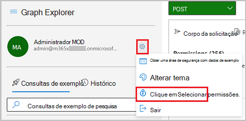

# <a name="configure-application-proxy-using-the-microsoft-graph-api"></a>Configurar Proxy de Aplicativo usando o Microsoft API do Graph

Neste artigo, você aprenderá a configurar Azure Active Directory (Azure AD) Proxy de Aplicativo para um aplicativo. Proxy de Aplicativo fornece acesso remoto seguro e logon único para aplicativos Web locais. Depois de Proxy de Aplicativo para um aplicativo, os usuários podem acessar seus aplicativos locais por meio de uma URL externa, do portal do Meus Aplicativos ou de outros portais de aplicativos internos.

## <a name="prerequisites"></a>Pré-requisitos

- Este tutorial pressupõe que você já instalou um conector e concluiu os [pré-requisitos](/azure/active-directory/app-proxy/application-proxy-add-on-premises-application#prerequisites) do Proxy de Aplicativo para que os conectores possam se comunicar com Azure AD serviços.
- Este tutorial pressupõe que você esteja usando o Graph Explorer, mas você pode usar o Postman ou criar seu próprio aplicativo cliente para chamar o Microsoft Graph. Para chamar apIs do Microsoft Graph neste tutorial, você precisa usar uma conta com a função de administrador global e as permissões apropriadas. Conclua as seguintes etapas para definir permissões no Graph Explorer:
    1. Inicie [Graph Explorer](https://developer.microsoft.com/graph/graph-explorer).
    2. Selecione **Entrar com a conta da Microsoft** e entre usando uma conta de administrador global do Azure AD. Uma vez acessado, você verá os detalhes da conta do usuário no painel esquerdo.
    3. Selecione o ícone de configurações à direita dos detalhes da conta do usuário e, em seguida, selecione **Selecionar permissões**.

        
        
    4. Percorra a lista de permissões para **o Diretório (3),** expanda e selecione `Directory.ReadWrite.All`.

        
    
    5. Selecione **Consentimento** e, em seguida, selecione **Aceitar** para aceitar o consentimento das permissões. Você não precisa consentir em nome da organização para essas permissões.

        

> [!NOTE]
> Os objetos de resposta mostrados podem ser reduzidos para legibilidade. 

## <a name="step-1-create-a-custom-application"></a>Etapa 1: Criar um aplicativo personalizado

Para configurar Proxy de Aplicativo aplicativo usando a API, primeiro crie um aplicativo personalizado e atualize a propriedade **onPremisesPublishing** do aplicativo para definir as configurações do Proxy de Aplicativo. Neste tutorial, você usará um modelo de aplicativo para criar uma instância de um aplicativo personalizado e uma entidade de serviço em seu locatário para gerenciamento. A ID do modelo para um aplicativo personalizado é `8adf8e6e-67b2-4cf2-a259-e3dc5476c621`.

Registre **a id**, **appId**, **servicePrincipalId** do aplicativo a ser usado posteriormente no tutorial.

#### <a name="request"></a>Solicitação

```http
POST https://graph.microsoft.com/v1.0/applicationTemplates/8adf8e6e-67b2-4cf2-a259-e3dc5476c621/instantiate
Content-type: application/json

{
  "displayName": "Contoso IWA App"
}
```

#### <a name="response"></a>Resposta

```http
HTTP/1.1 201 Created
Content-type: application/json

{
  "@odata.context": "https://graph.microsoft.com/beta/$metadata#applications/$entity",
  "id": "bf21f7e9-9d25-4da2-82ab-7fdd85049f83",
  "deletedDateTime": null,
  "addIns": [],
  "appId": "d7fbfe28-c60e-46d2-8335-841923950d3b",
  "applicationTemplateId": null,
  "identifierUris": [],
  "createdDateTime": "2020-08-11T21:07:47.5919755Z",
  "description": null,
  "displayName": "Contoso IWA App",
  "isAuthorizationServiceEnabled": false,
  "isDeviceOnlyAuthSupported": null,
  "isFallbackPublicClient": null,
  "groupMembershipClaims": null,
  "notes": null,
  "optionalClaims": null,
  "orgRestrictions": [],
  "publisherDomain": "f128.info",
  "signInAudience": "AzureADandPersonalMicrosoftAccount",
  "tags": [],
  "tokenEncryptionKeyId": null,
  "uniqueName": null,
  "verifiedPublisher": {
      "displayName": null,
      "verifiedPublisherId": null,
      "addedDateTime": null
  },
}
```

## <a name="step-2-configure-application-proxy"></a>Etapa 2: Configurar Proxy de Aplicativo

Use a **ID que** você registrou para o aplicativo para iniciar a configuração do Proxy de Aplicativo. Atualize as seguintes propriedades:

- **onPremisesPublishing** – neste exemplo, você está usando um aplicativo com a URL interna: `https://contosoiwaapp.com`. Você também usa o domínio padrão para a URL externa: `https://contosoiwaapp-contoso.msappproxy.net`. 
- **redirectUri**, **identifierUri** e **homepageUrl** – defina como a mesma URL externa configurada na **propriedade onPremisesPublishing** .
- **implicitGrantSettings** - Definido `true` como **para enabledTokenIssuance** `false` e **para enabledAccessTokenIssuance**.

#### <a name="request"></a>Solicitação

```http
PATCH https://graph.microsoft.com/beta/applications/bf21f7e9-9d25-4da2-82ab-7fdd85049f83
Content-type: application/json

{
  "onPremisesPublishing": {
    "externalAuthenticationType": "aadPreAuthentication",
    "internalUrl": "https://contosoiwaapp.com",
    "externalUrl": "https://contosoiwaapp-contoso.msappproxy.net"
  },
  "identifierUris": ["https://contosoiwaapp-contoso.msappproxy.net"],
  "web": {
    "redirectUris": ["https://contosoiwaapp-contoso.msappproxy.net"],
    "homePageUrl": "https://contosoiwaapp-contoso.msappproxy.net",
    "implicitGrantSettings": {
      "enableIdTokenIssuance": true,
      "enableAccessTokenIssuance": false
    }
  }
}
```

#### <a name="response"></a>Resposta

```http
HTTP/1.1 204 No content
```

## <a name="step-3-assign-a-connector-group-to-the-application"></a>Etapa 3: Atribuir um grupo de conectores ao aplicativo

### <a name="get-connectors"></a>Obter conectores

Liste os conectores disponíveis. Registre **a ID** do conector que você deseja atribuir a um grupo de conectores.

#### <a name="request"></a>Solicitação

```http
GET https://graph.microsoft.com/beta/onPremisesPublishingProfiles/applicationProxy/connectors
```

#### <a name="response"></a>Resposta

```http
HTTP/1.1 200 OK
Content-type: application/json

{
  "@odata.context": "https://graph.microsoft.com/beta/$metadata#connectors",
  "value": [
    {
      "id": "d2b1e8e8-8511-49d6-a4ba-323cb083fbb0",
      "machineName": "connectorA.redmond.contoso.com"",
      "externalIp": "131.137.147.164",
      "status": "active"
    },
    {
      "id": "f2cab422-a1c8-4d70-a47e-2cb297a2e051",
      "machineName": "connectorB.contoso.com"",
      "externalIp": "68.0.191.210",
      "status": "active"
    }
  ]
}
```

### <a name="create-a-connectorgroup"></a>Criar um connectorGroup

Para este exemplo, um novo connectorGroup é criado chamado `IWA Demo Connector Group` que é usado para o aplicativo. Registre **a ID** que será usada na próxima etapa.

#### <a name="request"></a>Solicitação

```http
POST https://graph.microsoft.com/beta/onPremisesPublishingProfiles/applicationProxy/connectorGroups

Content-type: application/json
{
  "name": "IWA Demo Connector Group"
}
```

#### <a name="response"></a>Resposta

```http
HTTP/1.1 201
Content-type: connectorGroup/json

{
  "@odata.context": "https://graph.microsoft.com/beta/$metadata#connectorGroups/$entity",
  "id": "3e6f4c35-a04b-4d03-b98a-66fff89b72e6",
  "name": "IWA Demo Connector Group",
  "connectorGroupType": "applicationProxy",
  "isDefault": false
}
```

### <a name="assign-a-connector-to-the-connectorgroup"></a>Atribuir um conector ao connectorGroup

#### <a name="request"></a>Solicitação

```http
POST https://graph.microsoft.com/beta/onPremisesPublishingProfiles/applicationProxy/connectors/f2cab422-a1c8-4d70-a47e-2cb297a2e051/memberOf/$ref
Content-type: application/json

{
  "@odata.id":"https://graph.microsoft.com/beta/onPremisesPublishingProfiles/applicationProxy/connectorGroups/3e6f4c35-a04b-4d03-b98a-66fff89b72e6"
}
```

#### <a name="response"></a>Resposta

```http
HTTP/1.1 204 No content
```

### <a name="assign-the-application-to-the-connectorgroup"></a>Atribuir o aplicativo ao connectorGroup

#### <a name="request"></a>Solicitação

```http
PUT https://graph.microsoft.com/beta/applications/bf21f7e9-9d25-4da2-82ab-7fdd85049f83/connectorGroup/$ref
Content-type: application/json

{
"@odata.id":"https://graph.microsoft.com/onPremisesPublishingProfiles/applicationproxy/connectorGroups/3e6f4c35-a04b-4d03-b98a-66fff89b72e6"
}
```

#### <a name="response"></a>Resposta

```http
HTTP/1.1 204 No content
```

## <a name="step-4-configure-single-sign-on"></a>Etapa 4: Configurar o logon único

Esse aplicativo usa a Autenticação Windows Integrada (IWA). Para configurar o IWA, defina as propriedades de logon único para **onPremisesPublishing**.

#### <a name="request"></a>Solicitação

```http
PATCH https://graph.microsoft.com/beta/applications/bf21f7e9-9d25-4da2-82ab-7fdd85049f83
Content-type: appplication/json

{
  "onPremisesPublishing": {
    "singleSignOnSettings": {
      "kerberosSignOnSettings": {
        "kerberosServicePrincipalName": "HTTP/iwademo.contoso.com",
        "kerberosSignOnMappingAttributeType": "userPrincipalName"
      },
      "singleSignOnMode": "onPremisesKerberos"
    }
  } 
}
```

#### <a name="response"></a>Resposta

```http
HTTP/1.1 204 No content
```

## <a name="step-5-assign-a-user"></a>Etapa 5: Atribuir um usuário

### <a name="retrieve-the-approle-for-the-application"></a>Recuperar o appRole para o aplicativo

Obtenha as funções de aplicativo para o aplicativo usando **a ID da** entidade de serviço. Registre **a ID** da **função de** aplicativo usuário a ser usada na próxima etapa.

#### <a name="request"></a>Solicitação

```http
GET https://graph.microsoft.com/beta/servicePrincipals/a8cac399-cde5-4516-a674-819503c61313/appRoles
```

#### <a name="response"></a>Resposta

```http
HTTP/1.1 200
Content-type: application/json

{
  "@odata.context": "https://graph.microsoft.com/beta/$metadata#servicePrincipals('a8cac399-cde5-4516-a674-819503c61313')/appRoles",
  "value": [
    {
      "allowedMemberTypes": [
        "User"
      ],
      "description": "User",
      "displayName": "User",
      "id": "18d14569-c3bd-439b-9a66-3a2aee01d14f",
      "isEnabled": true,
      "origin": "Application",
      "value": null
    },
  ]
}
```

### <a name="create-a-user-account"></a>Criar uma conta de usuário

Para este tutorial, você criará uma conta de usuário atribuída à função de aplicativo. No corpo da solicitação, altere `contoso.com` para o nome de domínio do locatário. Encontre informações sobre locatários na página de visão geral do Azure Active Directory. Registre **a ID** da conta de usuário a ser usada na próxima etapa.

#### <a name="request"></a>Solicitação

```http
POST https://graph.microsoft.com/v1.0/users
Content-type: application/json

{
  "accountEnabled":true,
  "displayName":"MyTestUser1",
  "mailNickname":"MyTestUser1",
  "userPrincipalName":"MyTestUser1@contoso.com",
  "passwordProfile": {
    "forceChangePasswordNextSignIn":true,
    "password":"Contoso1234"
  }
}
```

#### <a name="response"></a>Resposta

```http
{
  "@odata.context": "https://graph.microsoft.com/v1.0/$metadata#users/$entity",
  "id": "4628e7df-dff3-407c-a08f-75f08c0806dc",
  "businessPhones": [],
  "displayName": "MyTestUser1",
  "givenName": null,
  "jobTitle": null,
  "mail": null,
  "mobilePhone": null,
  "officeLocation": null,
  "preferredLanguage": null,
  "surname": null,
  "userPrincipalName": "MyTestUser1@contoso.com"
}
```

### <a name="assign-the-user-to-the-application"></a>Atribuir o usuário ao aplicativo

No exemplo a seguir, substitua os valores dessas propriedades:

- **principalId** com **a ID** do usuário
- **appRoleId** com **a ID** da função de aplicativo
- **resourceId** com **a ID** da entidade de serviço

#### <a name="request"></a>Solicitação

```http
POST https://graph.microsoft.com/beta/servicePrincipals/b00c693f-9658-4c06-bd1b-c402c4653dea/appRoleAssignments
Content-type: appRoleAssignments/json

{
  "principalId": "4628e7df-dff3-407c-a08f-75f08c0806dc",
  "principalType": "User",
  "appRoleId":"18d14569-c3bd-439b-9a66-3a2aee01d14f",
  "resourceId":"a8cac399-cde5-4516-a674-819503c61313"
}
```

#### <a name="response"></a>Resposta

```http
HTTP/1.1 200
Content-type: application/json

{
  "@odata.context": "https://graph.microsoft.com/beta/$metadata#appRoleAssignments/$entity",
  "id": "I23pL8ZdNU-CIgQmqMEVyLJ0E6fx0ixEo92az8MnhtU",
  "creationTimestamp": "2020-06-09T00:06:07.5129268Z",
  "appRoleId": "18d14569-c3bd-439b-9a66-3a2aee01d14f",
  "principalDisplayName": "MyTestUser1",
  "principalId": "2fe96d23-5dc6-4f35-8222-0426a8c115c8",
  "principalType": "User",
  "resourceDisplayName": "Contoso IWA App",
  "resourceId": "a8cac399-cde5-4516-a674-819503c61313"
}
```
## <a name="step-6-test-access-to-the-application"></a>Etapa 6: Testar o acesso ao aplicativo

Teste o aplicativo visitando a **URL externa** configurada para o aplicativo no navegador e entre com o usuário de teste. Você deve ser capaz de fazer logon no aplicativo e acessar o aplicativo.

## <a name="step-7-clean-up-resources"></a>Etapa 7: Limpar recursos

Os recursos criados neste tutorial não devem ser usados em um ambiente de produção. Nessa etapa, remova os recursos que criou.

### <a name="delete-the-user-account"></a>Excluir a conta de usuário

Exclua a conta de usuário MyTestUser1.

#### <a name="request"></a>Solicitação

```http
DELETE https://graph.microsoft.com/v1.0/users/4628e7df-dff3-407c-a08f-75f08c0806dc
```

#### <a name="response"></a>Resposta

```http
No Content - 204
```

### <a name="delete-the-application"></a>Excluir o aplicativo

#### <a name="request"></a>Solicitação

```http
DELETE https://graph.microsoft.com/v1.0/applications/bf21f7e9-9d25-4da2-82ab-7fdd85049f83
```

#### <a name="response"></a>Resposta

```http
No Content - 204
```

### <a name="delete-the-connector-group"></a>Excluir o grupo de conectores

#### <a name="request"></a>Solicitação

```http
DELETE https://graph.microsoft.com/beta/onPremisesPublishingProfiles/applicationProxy/connectorGroups/3e6f4c35-a04b-4d03-b98a-66fff89b72e6
```

#### <a name="response"></a>Resposta

```http
No Content - 204
```

## <a name="see-also"></a>Confira também

- [Proxy de Aplicativo](/azure/active-directory/manage-apps/what-is-application-proxy)
- [application](/graph/api/resources/application)
- [applicationTemplate: criar uma instância](/graph/api/applicationtemplate-instantiate)
- [appRoleAssignment](/graph/api/resources/approleassignment)
- [connector](/graph/api/resources/connector)
- [connectorGroup](/graph/api/resources/connectorGroup)
- [implicitGrantSettings](/graph/api/resources/implicitgrantsettings)
- [perfis de publicação locais](/graph/api/resources/onpremisespublishingprofile-root)
- [servicePrincipal](/graph/api/resources/serviceprincipal)
- [singleSignOnSettings](/graph/api/resources/onpremisespublishingsinglesignon)
- [user](/graph/api/resources/user)
