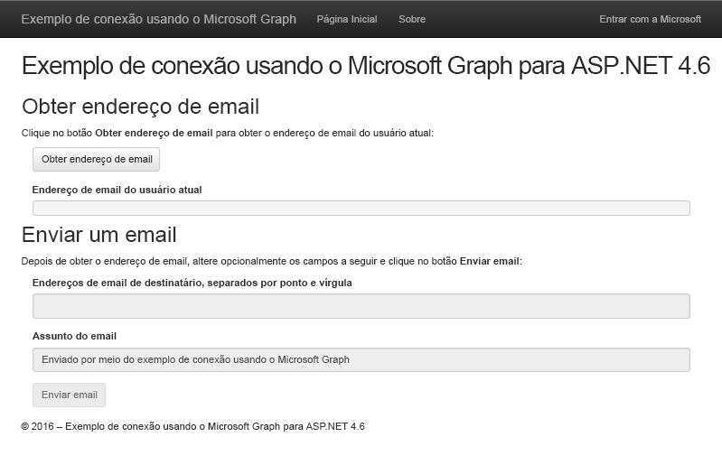

# Introdução ao Microsoft Graph em um aplicativo do ASP.NET 4.6 MVCGet started with Microsoft Graph in an ASP.NET 4.6 MVC app

Este artigo descreve as tarefas obrigatórias para obter um token de acesso do ponto de extremidade do Azure AD v2.0 e chamar o Microsoft Graph. Ele o orienta sobre como criar um [Exemplo do Microsoft Graph Connect para ASP.NET 4.6](https://github.com/microsoftgraph/aspnet-connect-sample) e explica os principais conceitos que você implementa para usar o Microsoft Graph.This article describes the tasks required to get an access token from the Azure AD v2.0 endpoint and call Microsoft Graph. It walks you through building the [Microsoft Graph Connect Sample for ASP.NET 4.6](https://github.com/microsoftgraph/aspnet-connect-sample) and explains the main concepts that you implement to use Microsoft Graph.

A imagem a seguir mostra o aplicativo que você criará.The following image shows the app you'll create. 

O [Ponto de extremidade do Azure AD v2.0](https://azure.microsoft.com/pt-BR/documentation/articles/active-directory-appmodel-v2-overview) permite que os usuários entrem com uma MSA(conta da Microsoft) ou uma conta corporativa ou de estudante. O aplicativo usa o [ASP.Net OpenID Connect OWIN middleware](https://www.nuget.org/packages/Microsoft.Owin.Security.OpenIdConnect/) e a [MSAL (Biblioteca de Autenticação da Microsoft) para .NET](https://www.nuget.org/packages/Microsoft.Identity.Client) para entrada e gerenciamento de tokens.The [Azure AD v2.0 endpoint](https://azure.microsoft.com/pt-BR/documentation/articles/active-directory-appmodel-v2-overview) lets users sign in with a Microsoft account (MSA) or a work or school account. The app uses the [ASP.Net OpenID Connect OWIN middleware](https://www.nuget.org/packages/Microsoft.Owin.Security.OpenIdConnect/) and the [Microsoft Authentication Library (MSAL) for .NET](https://www.nuget.org/packages/Microsoft.Identity.Client) for sign in and token management.

**Não está com vontade de criar um aplicativo?** Use o [Início rápido do Microsoft Graph](https://developer.microsoft.com/pt-BR/graph/quick-start) para começar a usar rapidamente. Observe também que temos uma [Versão REST deste exemplo](https://github.com/microsoftgraph/aspnet-connect-rest-sample).**Don't feel like building an app?** Use the [Microsoft Graph quick start](https://developer.microsoft.com/pt-BR/graph/quick-start) to get up and running fast. Also note that we have a [REST version of this sample](https://github.com/microsoftgraph/aspnet-connect-rest-sample).

## Pré-requisitosPrerequisites

Para começar, será necessário:To get started, you'll need: 

- Uma [conta da Microsoft](https://www.outlook.com/) ou uma [conta corporativa ou de estudante](http://dev.office.com/devprogram)A [Microsoft account](https://www.outlook.com/) or a [work or school account](http://dev.office.com/devprogram)
- Visual Studio 2015Visual Studio 2015 
- O [Exemplo do Microsoft Graph Connect para ASP.NET 4.6](https://github.com/microsoftgraph/aspnet-connect-sample). Você usará a pasta **starter-project** nos exemplos de arquivo.The [Microsoft Graph Connect Sample for ASP.NET 4.6](https://github.com/microsoftgraph/aspnet-connect-sample). You'll use the **starter-project** folder in the sample files.

## Registrar o aplicativoRegister the application

Nesta etapa, você registrará um aplicativo no Portal de Registro de Aplicativos da Microsoft. Isso gera a ID do aplicativo e a senha que você usará para configurar o aplicativo no Visual Studio.In this step, you'll register an app on the Microsoft App Registration Portal. This generates the app ID and password that you'll use to configure the app in Visual Studio.

1. Entre no [Portal de Registro de Aplicativos da Microsoft](https://apps.dev.microsoft.com/) usando sua conta pessoal ou uma conta corporativa ou de estudante.Sign into the [Microsoft App Registration Portal](https://apps.dev.microsoft.com/) using either your personal or work or school account.

2. Escolha **Adicionar um aplicativo**.Choose **Add an app**.

3. Insira um nome para o aplicativo e escolha **Criar aplicativo**.Enter a name for the app, and choose **Create application**. 
    
    A página de registro é exibida, listando as propriedades do seu aplicativo.The registration page displays, listing the properties of your app.

4. Copie a ID do aplicativo. Esse é o identificador exclusivo do aplicativo.Copy the application ID. This is the unique identifier for your app. 

5. Em **Segredos do Aplicativo**, escolha **Gerar Nova Senha**. Copie a senha da caixa de diálogo **Nova senha gerada**.Under **Application Secrets**, choose **Generate New Password**. Copy the password from the **New password generated** dialog.

    Você usará a ID do aplicativo e a senha para configurar o aplicativo.You'll use the application ID and password to configure the app. 

6. Em **Plataformas**, escolha **Adicionar plataforma** > **Web**.Under **Platforms**, choose **Add platform** > **Web**.

7. Não deixe de marcar a caixa de diálogo **Permitir Fluxo Implícito** e insira *http://localhost:55065/* como o URI de Redirecionamento.Make sure the **Allow Implicit Flow** check box is selected, and enter *http://localhost:55065/* as the Redirect URI. 

    A opção **Permitir Fluxo Implícito** habilita o fluxo híbrido do OpenID Connect. Durante a autenticação, isso permite que o aplicativo receba informações de entrada (o **id_token**) e artefatos (neste caso, um código de autorização) que o aplicativo usa para obter um token de acesso.The **Allow Implicit Flow** option enables the OpenID Connect hybrid flow. During authentication, this enables the app to receive both sign-in info (the **id_token**) and artifacts (in this case, an authorization code) that the app uses to obtain an access token.

8. Escolha **Salvar**.Choose **Save**.

### Configurar o projetoConfigure the project

1. Abra o arquivo de solução para o projeto inicial no Visual Studio.Open the solution file for the starter project in Visual Studio.

2. Abra o arquivo Web.config do projeto.Open the project's Web.config file.

3. Localize as chaves de configuração do aplicativo no elemento **appSettings**. Substitua os valores de espaço reservado ENTER_YOUR_CLIENT_ID e ENTER_YOUR_SECRET pelos valores que você acabou de copiar.Locate the app configuration keys in the **appSettings** element. Replace the ENTER_YOUR_CLIENT_ID and ENTER_YOUR_SECRET placeholder values with the values you just copied.

O URI de redirecionamento é a URL do projeto que você registrou. Os [escopos de permissão](https://developer.microsoft.com/pt-BR/graph/docs/concepts/permission_scopes) solicitados permitem que o aplicativo obtenha informações de perfil de usuário e envie um email.The redirect URI is the URL of the project that you registered. The requested [permission scopes](https://developer.microsoft.com/pt-BR/graph/docs/concepts/permission_scopes) allow the app to get user profile information and send an email.

## Chamar o Microsoft GraphCall Microsoft Graph

Nesta etapa, você se concentrará nas classes **SDKHelper**, **GraphService** e **HomeController**.In this step, you'll focus on the **SDKHelper**, **GraphService**, and **HomeController** classes. 

 - O **SDKHelper** inicializa uma instância de **GraphServiceClient** da biblioteca antes de cada chamada ao Microsoft Graph. O token de acesso é adicionado à solicitação nesse momento.**SDKHelper** intializes an instance of the **GraphServiceClient** from the library before each call to the Microsoft Graph. This is when the access token is added to the request. 
 - **GraphService** cria e envia solicitações ao Microsoft Graph usando a biblioteca e processa as respostas.**GraphService** builds and sends requests to the Microsoft Graph using the library, and processes the responses.
 - **HomeController** contém ações que iniciam as chamadas à biblioteca em resposta a eventos da interface do usuário.**HomeController** contains actions that initiate the calls to the library in response to UI events.

O projeto inicial já declara uma dependência para o pacote NuGet da Biblioteca de Cliente .NET do Microsoft Graph:  *Microsoft.Graph*.The starter project already declares a dependency for the Microsoft Graph .NET Client Library NuGet package:  *Microsoft.Graph*.

1. Clique com o botão direito do mouse na pasta **Auxiliares** e escolha **Adicionar** > **Classe**.Right-click the **Helpers** folder and choose **Add** > **Class**. 

1. Nomeie a nova classe como *SDKHelper* e escolha **Adicionar**.Name the new class *SDKHelper* and choose **Add**.

1. Substitua o conteúdo pelo código a seguir.Replace the contents with the following code.

        using System.Net.Http.Headers;
        using Microsoft.Graph;

        namespace Microsoft_Graph_SDK_ASPNET_Connect.Helpers
        {
            public class SDKHelper
            {   
                private static GraphServiceClient graphClient = null;

                // Get an authenticated Microsoft Graph Service client.
                public static GraphServiceClient GetAuthenticatedClient()
                {
                    GraphServiceClient graphClient = new GraphServiceClient(
                        new DelegateAuthenticationProvider(
                            async (requestMessage) =>
                            {
                                string accessToken = await SampleAuthProvider.Instance.GetUserAccessTokenAsync();

                                // Append the access token to the request.
                                requestMessage.Headers.Authorization = new AuthenticationHeaderValue("bearer", accessToken);
                            }));
                    return graphClient;
                }

                public static void SignOutClient()
                {
                    graphClient = null;
                }
            }
        }

  Observe a chamada para **SampleAuthProvider** para obter o token quando o cliente é inicializado.Note the call to **SampleAuthProvider** to get the token when the client is initialized.

1. Na pasta **Modelos**, abra GraphService.cs. O serviço usa a biblioteca para interagir com o Microsoft Graph.In the **Models** folder, open GraphService.cs. The service uses the library to interact with the Microsoft Graph.

1. Adicione a instrução **using** a seguir.Add the following **using** statement.

        using Microsoft.Graph;

1. Substitua *// GetMyEmailAddress* pelo método a seguir. Isso obtém o endereço de email do usuário atual.Replace *// GetMyEmailAddress* with the following method. This gets the current user's email address. 

        // Get the current user's email address from their profile.
        public async Task<string> GetMyEmailAddress(GraphServiceClient graphClient)
        {

            // Get the current user. 
            // The app only needs the user's email address, so select the mail and userPrincipalName properties.
            // If the mail property isn't defined, userPrincipalName should map to the email for all account types. 
            User me = await graphClient.Me.Request().Select("mail,userPrincipalName").GetAsync();
            return me.Mail ?? me.UserPrincipalName;
        }

  Observe o segmento **Select**, que solicita que apenas **mail** e **userPrincipalName** sejam retornados. Você pode usar **Select** e **Filter** para reduzir o tamanho da carga de dados de resposta.Note the **Select** segment, which requests only the **mail** and **userPrinicipalName** to be returned. You can use **Select** and **Filter** to reduce the size of the response data payload.

1. Substitua *// SendEmail* pelos métodos a seguir para criar e enviar o email.Replace *// SendEmail* with the following methods to build and send the email.

        // Send an email message from the current user.
        public async Task SendEmail(GraphServiceClient graphClient, Message message)
        {
            await graphClient.Me.SendMail(message, true).Request().PostAsync();
        }

        public async Task<Message> BuildEmailMessage(GraphServiceClient graphClient, string recipients, string subject)
        {

            // Get current user photo
            Stream photoStream = await GetCurrentUserPhotoStreamAsync(graphClient);

            // If the user doesn't have a photo, or if the user account is MSA, we use a default photo

            if ( photoStream == null)
            {
                photoStream = System.IO.File.OpenRead(System.Web.Hosting.HostingEnvironment.MapPath("/Content/test.jpg"));
            }

            MemoryStream photoStreamMS = new MemoryStream();
            // Copy stream to MemoryStream object so that it can be converted to byte array.
            photoStream.CopyTo(photoStreamMS);

            DriveItem photoFile = await UploadFileToOneDrive(graphClient, photoStreamMS.ToArray());

            MessageAttachmentsCollectionPage attachments = new MessageAttachmentsCollectionPage();
            attachments.Add(new FileAttachment
            {
                ODataType = "#microsoft.graph.fileAttachment",
                ContentBytes = photoStreamMS.ToArray(),
                ContentType = "image/png",
                Name = "me.png"
            });

            Permission sharingLink = await GetSharingLinkAsync(graphClient, photoFile.Id);

            // Add the sharing link to the email body.
            string bodyContent = string.Format(Resource.Graph_SendMail_Body_Content, sharingLink.Link.WebUrl);

            // Prepare the recipient list.
            string[] splitter = { ";" };
            string[] splitRecipientsString = recipients.Split(splitter, StringSplitOptions.RemoveEmptyEntries);
            List<Recipient> recipientList = new List<Recipient>();
            foreach (string recipient in splitRecipientsString)
            {
                recipientList.Add(new Recipient
                {
                    EmailAddress = new EmailAddress
                    {
                        Address = recipient.Trim()
                    }
                });
            }

            // Build the email message.
            Message email = new Message
            {
                Body = new ItemBody
                {
                    Content = bodyContent,
                    ContentType = BodyType.Html,
                },
                Subject = subject,
                ToRecipients = recipientList,
                Attachments = attachments
            };
            return email;
        }

        // Gets the stream content of the signed-in user's photo. 
        // This snippet doesn't work with consumer accounts.
        public async Task<Stream> GetCurrentUserPhotoStreamAsync(GraphServiceClient graphClient)
        {
            Stream currentUserPhotoStream = null;

            try
            {
                currentUserPhotoStream = await graphClient.Me.Photo.Content.Request().GetAsync();

            }

            // If the user account is MSA (not work or school), the service will throw an exception.
            catch (ServiceException)
            {
                return null;
            }

            return currentUserPhotoStream;

        }

        // Uploads the specified file to the user's root OneDrive directory.
        public async Task<DriveItem> UploadFileToOneDrive(GraphServiceClient graphClient, byte[] file)
        {
            DriveItem uploadedFile = null;

            try
            {
                MemoryStream fileStream = new MemoryStream(file);
                uploadedFile = await graphClient.Me.Drive.Root.ItemWithPath("me.png").Content.Request().PutAsync<DriveItem>(fileStream);

            }

            catch (ServiceException)
            {
                return null;
            }

            return uploadedFile;
        }

        public static async Task<Permission> GetSharingLinkAsync(GraphServiceClient graphClient, string Id)
        {
            Permission permission = null;

            try
            {
                permission = await graphClient.Me.Drive.Items[Id].CreateLink("view").Request().PostAsync();
            }

            catch (ServiceException)
            {
                return null;
            }

            return permission;
        }

1. Na pasta **Controllers**, abra HomeController.cs.In the **Controllers** folder, open HomeController.cs.

1. Adicione a instrução **using** a seguir.Add the following **using** statement.

        using Microsoft.Graph;
  
1. Substitua *// Controller actions* pelas ações a seguir.Replace *// Controller actions* with the following actions.

        [Authorize]
        // Get the current user's email address from their profile.
        public async Task<ActionResult> GetMyEmailAddress()
        {
            try
            {

                // Initialize the GraphServiceClient.
                GraphServiceClient graphClient = SDKHelper.GetAuthenticatedClient();

                // Get the current user's email address. 
                ViewBag.Email = await graphService.GetMyEmailAddress(graphClient);
                return View("Graph");
            }
            catch (ServiceException se)
            {
                if (se.Error.Message == Resource.Error_AuthChallengeNeeded) return new EmptyResult();
                return RedirectToAction("Index", "Error", new { message = Resource.Error_Message + Request.RawUrl + ": " + se.Error.Message });
            }
        }

        [Authorize]
        // Send mail on behalf of the current user.
        public async Task<ActionResult> SendEmail()
        {
            if (string.IsNullOrEmpty(Request.Form["email-address"]))
            {
                ViewBag.Message = Resource.Graph_SendMail_Message_GetEmailFirst;
                return View("Graph");
            }

            try
            {

                // Initialize the GraphServiceClient.
                GraphServiceClient graphClient = SDKHelper.GetAuthenticatedClient();

                // Build the email message.
                Message message = await graphService.BuildEmailMessage(graphClient, Request.Form["recipients"], Request.Form["subject"]);

                // Send the email.
                await graphService.SendEmail(graphClient, message);

                // Reset the current user's email address and the status to display when the page reloads.
                ViewBag.Email = Request.Form["email-address"];
                ViewBag.Message = Resource.Graph_SendMail_Success_Result;
                return View("Graph");
            }
            catch (ServiceException se)
            {
                if (se.Error.Code == Resource.Error_AuthChallengeNeeded) return new EmptyResult();
                return RedirectToAction("Index", "Error", new { message = Resource.Error_Message + Request.RawUrl + ": " + se.Error.Message });
            }
        }

Agora você está pronto para [executar o aplicativo](#run-the-app).Now you're ready to [run the app](#run-the-app).

## Executar o aplicativoRun the app
1. Pressione F5 para criar e executar o aplicativo.Press F5 to build and run the app. 

2. Entre com sua conta pessoal, comercial ou de estudante e conceda as permissões solicitadas.Sign in with your personal or work or school account and grant the requested permissions.

3. Escolha o botão **Obter endereço de email**. Quando a operação for concluída, o endereço de email do usuário conectado será exibido na página.Choose the **Get email address** button. When the operation completes, the email address of the signed-in user is displayed on the page.

4. Como alternativa, edite a lista de destinatários e o assunto do email e, em seguida, escolha o botão **Enviar email**. Quando o email for enviado, será exibida uma mensagem de sucesso abaixo do botão.Optionally edit the recipient list and email subject, and then choose the **Send email** button. When the mail is sent, a Success message is displayed below the button.

## Próximas etapasNext steps
- Experimente a API REST usando o [Explorador do Graph](https://developer.microsoft.com/graph/graph-explorer).Try out the REST API using the [Graph explorer](https://developer.microsoft.com/graph/graph-explorer).
- Obtenha exemplos de operações comuns em [Exemplo de trechos do Microsoft Graph para ASP.NET 4.6](https://github.com/microsoftgraph/aspnet-snippets-sample) ou explore nossos outros [Exemplos do ASP.NET](http://aka.ms/aspnetgraphsamples) no GitHub.Find examples of common operations in the [Microsoft Graph Snippets Sample for ASP.NET 4.6](https://github.com/microsoftgraph/aspnet-snippets-sample), or explore our other [ASP.NET samples](http://aka.ms/aspnetgraphsamples) on GitHub.

## Confira tambémSee also
- [Biblioteca de cliente do .NET do Microsoft GraphMicrosoft Graph .NET Client Library](https://github.com/microsoftgraph/msgraph-sdk-dotnet)
- [Cenário de autenticação de aplicativo Web para API WebWeb application to web API authentication scenario](https://azure.microsoft.com/pt-BR/documentation/articles/active-directory-authentication-scenarios/#web-application-to-web-api)
- [Integrar a Identidade da Microsoft e o Microsoft Graph em um aplicativo Web usando OpenID ConnectIntegrate Microsoft identity and the Microsoft Graph into a web application using OpenID Connect](https://azure.microsoft.com/pt-BR/documentation/samples/active-directory-dotnet-webapp-openidconnect-v2/)
- [Protocolos do Azure AD v2.0Azure AD v2.0 protocols](https://azure.microsoft.com/pt-BR/documentation/articles/active-directory-v2-protocols/)
- [Tokens do Azure AD v2.0Azure AD v2.0 tokens](https://azure.microsoft.com/pt-BR/documentation/articles/active-directory-v2-tokens/)
