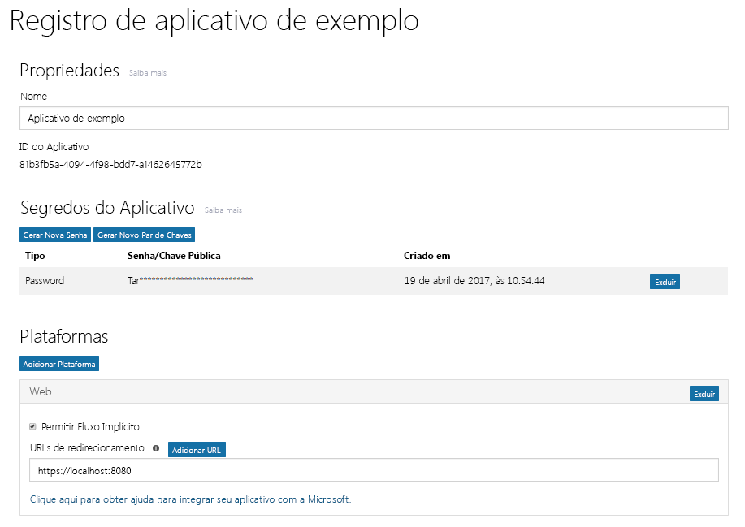

# Registrar um aplicativo no ponto de extremidade do Azure AD v2.0

Seu aplicativo deve ser registrado no Azure AD. Registrar seu aplicativo estabelece uma identificação exclusiva do aplicativo e outros valores que o aplicativo usa para autenticar com o Azure AD e obter tokens. Para o ponto de extremidade Azure AD v2.0, você registra o aplicativo no [Portal de Registro de Aplicativos da Microsoft](https://apps.dev.microsoft.com). Você pode usar uma conta da Microsoft ou uma conta corporativa ou de estudante para registrar seu aplicativo. Dependendo do tipo de aplicativo que estiver desenvolvendo, você precisará copiar uma ou mais propriedades durante o registro para usar ao configurar autenticação e a autorização para seu aplicativo. 

> **Observação:** Este artigo aborda principalmente o registro de aplicativos no ponto de extremidade do Azure AD v2.0. Para saber mais sobre como registrar seu aplicativo com o ponto de extremidade do Azure AD, veja [Considerações de ponto de extremidade do Azure AD](#azure-ad-endpoint-considerations) abaixo.
> 
> Além disso, lembre-se de que se você alguma vez registrou aplicativos no Portal do Microsoft Azure, esses aplicativos não estarão listados no Portal de Registro do Aplicativo. Gerencie esses aplicativos no Portal do Azure. 

A captura de tela a seguir mostra um registro de aplicativo Web de exemplo que foi configurado com senha e fluxo implícito. 

Para registrar seu aplicativo, siga estas etapas. Copie os valores indicados para usar ao configurar a autorização para seu aplicativo:

1. Entrar no [Portal de Registro de Aplicativos da Microsoft](https://apps.dev.microsoft.com/).
   
    Você pode entrar com uma conta da Microsoft ou uma conta corporativa ou de estudante. 

2. Escolha **Adicionar um aplicativo**.
    > Observação: Se você entrou com uma conta corporativa ou de estudante, selecione o botão **Adicionar um aplicativo** em **Aplicativos convergentes**. 

3. Insira um nome para o aplicativo e escolha **Criar aplicativo**.

    A página de registro é exibida, listando as propriedades do seu aplicativo.

4. Copie a ID do aplicativo. Esse é o identificador exclusivo do aplicativo.

    Você usará a ID do aplicativo para configurar o aplicativo.

5. Em **Plataformas**, escolha **Adicionar plataforma** e selecione a plataforma apropriada para o seu aplicativo:
    
    **Para obter aplicativos móveis ou nativos**:

    1. Escolha **Aplicativo Nativo**.

    2. Copiar o valor de **URI de redirecionamento incorporada**. Você precisará dessa informação para configurar seu aplicativo.

        Um URI de redirecionamento é um URI exclusivo fornecido para seu aplicativo para garantir que as mensagens enviadas para esse URI sejam enviadas somente para esse aplicativo. 

    **Para aplicativos Web**:

    1. Selecione **Web**.

    2. Dependendo do tipo de fluxo de autenticação que você está usando, poderá ser necessário garantir que a caixa de seleção **Permitir Fluxo Implícito** esteja selecionada. 
        
        A opção **Permitir Fluxo Implícito** habilita os fluxos híbridos e implícitos do OpenID Connect. O fluxo híbrido permite ao aplicativo receber informações de entrada (o token de id) e artefatos (neste caso, um código de autorização) que o aplicativo usa para obter um token de acesso. O fluxo híbrido é o fluxo padrão usado pelo middleware OpenID Connect do OWIN. Para aplicativos SPA (aplicativos de página única), o fluxo implícito permite ao aplicativo receber informações de entrada e o token de acesso. 

    3. Especifique uma URL de redirecionamento.
        
        A URL de redirecionamento é o local em seu aplicativo que o ponto de extremidade do Azure AD v2.0 chama quando ele processou a solicitação de autenticação.

    4. Em **Segredos do Aplicativo**, escolha **Gerar Nova Senha**. Copie o segredo do aplicativo da caixa de diálogo **Nova senha gerada**.
        > **Importante** você deve copiar o segredo de aplicativo antes de fechar a caixa de diálogo **Nova senha gerada**. Depois de fechar a caixa de diálogo, não será possível recuperar o segredo. 
            
6. Escolha **Salvar**.

A tabela a seguir mostra as propriedades que você precisa configurar e copiar para tipos diferentes de aplicativos. _Atribuído_ significa que você deve usar o valor atribuído pelo Azure AD.

| Tipo de aplicativo | Plataforma | ID do Aplicativo | Segredo do Aplicativo | URI/URL de redirecionamento | Fluxo Implícito 
| --- | --- | --- | --- | --- | --- |
| Nativos/Móveis | Nativo | Atribuído  | Não | Atribuído | Não |
| Web App | Web | Atribuído | Sim | Sim | Opcional  O middleware OpenID Connect usa o fluxo híbrido por padrão (Sim) | 
| Aplicativo de página única (SPA) | Web | Atribuído | Sim | Sim | Sim   SPAs usam o fluxo implícito do Open ID Connect |
| Serviço/Daemon | Web | Atribuído | Sim | Sim | Não |

Aplicativos que oferecem uma experiência de consentimento do administrador podem precisar de uma URL adicional de redirecionamento para o Azure AD à qual responder.

Para obter mais detalhes sobre o Portal de Registro de Aplicativos e as propriedades que você pode configurar para seu Aplicativo, veja [Referência de registro de aplicativo](https://docs.microsoft.com/pt-BR/azure/active-directory/develop/active-directory-v2-registration-portal).  

## Considerações sobre o ponto de extremidade do Azure AD

Você usa o [Portal do Azure](https://aka.ms/aadapplist) para registrar seu aplicativo no ponto de extremidade do Azure AD. Você configura as mesmas propriedades básicas como ID do Aplicativo, Segredo do Aplicativo e URI/URL de Redirecionamento, como faria no ponto de extremidade v2.0. No entanto, há algumas diferenças importantes sobre as quais você deve ter ciência: 

- Você só pode usar uma conta corporativa ou de estudante para registrar um aplicativo.
- Seu aplicativo exigirá uma ID do Aplicativo diferente para cada plataforma.
- Se o aplicativo for um aplicativo multilocatário, você deve configurá-lo explicitamente para funcionar como vários locatários no portal.
- Você deve configurar previamente todas as permissões (incluindo permissões do Microsoft Graph) que seu aplicativo precisa no portal. 

Para obter orientação sobre como usar o Portal do Azure para adicionar um aplicativo, veja [Integração de aplicativos com o Azure Active Directory: Como adicionar um aplicativo](https://docs.microsoft.com/azure/active-directory/develop/active-directory-integrating-applications#adding-an-application).
