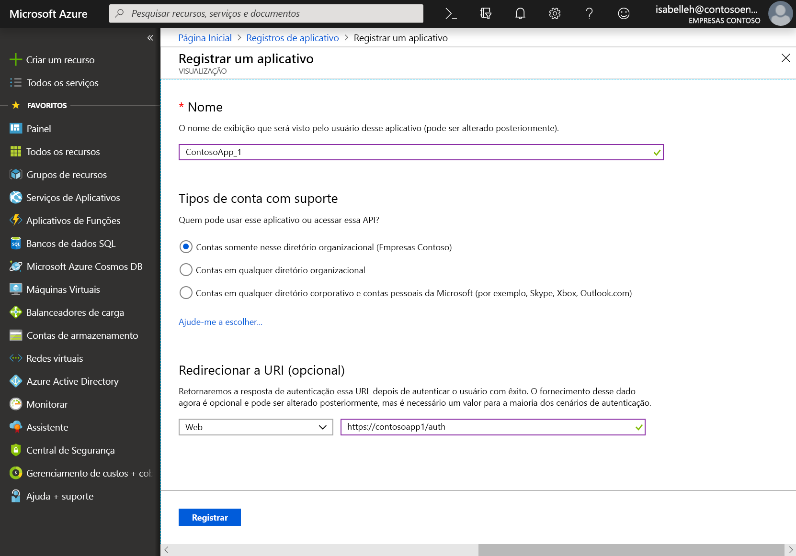
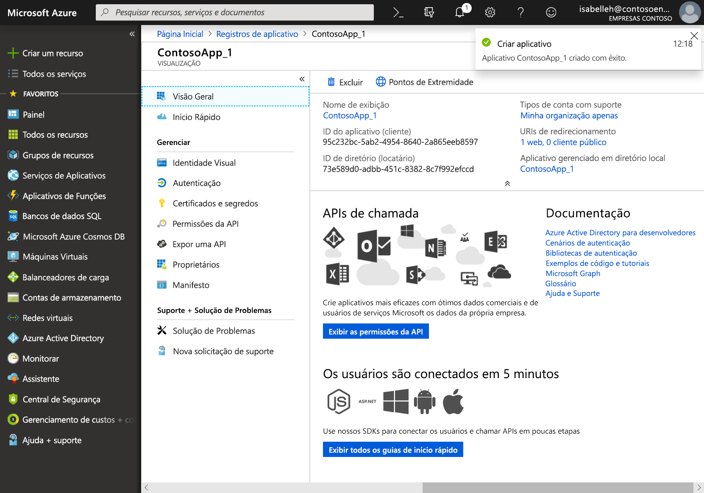

# Registrar um aplicativo com a Microsoft Identity Platform

Esta página mostra como adicionar e registrar um aplicativo usando a experiência **Registros do aplicativo** do portal do Azure para que o seu aplicativo possa ser integrado à Microsoft Identity Platform e chamar o Microsoft Graph. 

> [!VIDEO https://www.youtube-nocookie.com/embed/93j0MmRruFo]

## Registrar um novo aplicativo usando o portal do Azure

1. Entre no [portal do Azure](https://portal.azure.com) usando uma conta corporativa ou de estudante ou uma conta pessoal da Microsoft.
1. Se sua conta fornecer acesso a mais de um locatário, selecione sua conta no canto superior direito e defina sua sessão do portal para o locatário desejado do Azure AD.
1. No painel de navegação à esquerda, selecione o serviço **Azure Active Directory** e depois **Registros de aplicativo > Novo registro**.
1. Quando a página **Registrar um aplicativo** for exibida, insira as informações de registro do aplicativo:

   - **Nome**: insira um nome de aplicativo relevante que será exibido aos usuários do aplicativo.
   - **Tipos de conta com suporte**: selecione as contas às quais você gostaria que seu aplicativo desse suporte.

       | Tipos de conta com suporte | Descrição |
       |-------------------------|-------------|
       | **Contas apenas neste diretório organizacional** | Selecione esta opção se você está criando um aplicativo de linha de negócios (LOB). Essa opção não estará disponível se você não estiver registrando o aplicativo em um diretório.  Essa opção mapeia para o único locatário somente do Azure AD.  Essa é a opção padrão, a menos que você esteja registrando o aplicativo fora de um diretório. Quando o aplicativo é registrado fora de um diretório, o padrão é contas da Microsoft pessoais e de vários locatários do Azure AD. |
       | **Contas em qualquer diretório organizacional** | Selecione essa opção se você deseja direcionar para todos os clientes corporativos e educacionais.  Essa opção mapeia para vários locatários somente do Azure AD.  Se você registrou o aplicativo como único locatário somente do Azure AD, pode atualizá-lo para ser multilocatário e voltar a ser locatário único na folha **Autenticação**. |
       | **Contas em qualquer diretório organizacional e contas pessoais da Microsoft** | Selecione essa opção para direcionar ao conjunto mais amplo de clientes.  Essa opção mapeia para contas da Microsoft pessoais e multilocatário do Azure AD.  Se você registrou o aplicativo como contas da Microsoft pessoais e multilocatário do Azure AD, não poderá alterar isso na interface do usuário. Em vez disso, use o editor de manifesto do aplicativo para alterar os tipos de conta com suporte. |

   - **URI de redirecionamento (opcional)**: selecione o tipo de aplicativo que você está desenvolvendo, **Web** ou **Cliente público (dispositivos móvel e desktop)** e insira o URI de redirecionamento (ou a URL de resposta) para o aplicativo.
       - Para aplicativos Web, informe a URL base do aplicativo. Por exemplo, `http://localhost:31544` pode ser uma URL para um aplicativo Web em execução no seu computador local. Os usuários usariam essa URL para entrar em um aplicativo cliente Web.
       - Para aplicativos cliente públicos, informe o URI usado pelo Azure AD para retornar respostas de token. Insira um valor específico para o aplicativo, por exemplo, `myapp://auth`.

     Para ver exemplos específicos de aplicativos Web ou aplicativos nativos, confira os [inícios rápidos](/azure/active-directory/develop/#quickstarts).

1. Ao terminar, selecione **Registrar**.

    

O Azure AD atribui uma ID exclusiva do aplicativo (cliente) para seu aplicativo, e você é redirecionado para a página **Visão geral** do aplicativo. Para adicionar mais recursos ao aplicativo, você pode selecionar outras opções de configuração, incluindo identidade visual, certificados e segredos, permissões de API e muito mais.

## Propriedades específicas de plataformas

A tabela a seguir mostra as propriedades que você precisa configurar e copiar para tipos diferentes de aplicativos. _Atribuído_ significa que você deve usar o valor atribuído pelo Azure AD.

| Tipo de aplicativo | Plataforma | ID do aplicativo (cliente) | Segredo de Cliente | URI/URL de redirecionamento | Fluxo Implícito 
| --- | --- | --- | --- | --- | --- |
| Nativos/Móveis | Nativo | Atribuído  | Não | Atribuído | Não |
| Web App | Web | Atribuído | Sim | Sim | Opcional  O middleware OpenID Connect usa o fluxo híbrido por padrão (Sim) | 
| Aplicativo de página única (SPA) | Web | Atribuído | Sim | Sim | Sim   SPAs usam o fluxo implícito do Open ID Connect |
| Serviço/Daemon | Web | Atribuído | Sim | Sim | Não |

## Próximas etapas

- Saiba mais sobre [consentimento e permissões](/azure/active-directory/develop/v2-permissions-and-consent) ou veja a [referência de permissões](permissions-reference.md) do Microsoft Graph.
- Para habilitar recursos adicionais de configuração durante o registro de seu aplicativo, como credenciais e permissões, e habilitar a entrada para usuários de outros locatários, confira estes inícios rápidos:
  - [Configurar um aplicativo cliente para acessar APIs Web](/azure/active-directory/develop/quickstart-configure-app-access-web-apis)
  - [Configurar um aplicativo para expor APIs Web](/azure/active-directory/develop/quickstart-configure-app-expose-web-apis)
  - [Modificar as contas que têm suporte por um aplicativo](/azure/active-directory/develop/quickstart-modify-supported-accounts)
- Escolha um [início rápido](/azure/active-directory/develop/#quickstarts) para desenvolver rapidamente um aplicativo e adicionar funcionalidades como obtenção de tokens, atualização de tokens, conexão do usuário, exibição de algumas informações do usuário e muito mais.
- Saiba mais sobre os dois objetos do Azure AD que representam um aplicativo registrado e a relação entre eles: [Objetos de aplicativo e objetos de entidade de serviço](/azure/active-directory/develop/app-objects-and-service-principals).
- Saiba mais sobre as diretrizes de identidade visual que você deve usar ao desenvolver aplicativos em [Diretrizes de identidade visual para aplicativos](/azure/active-directory/develop/howto-add-branding-in-azure-ad-apps).