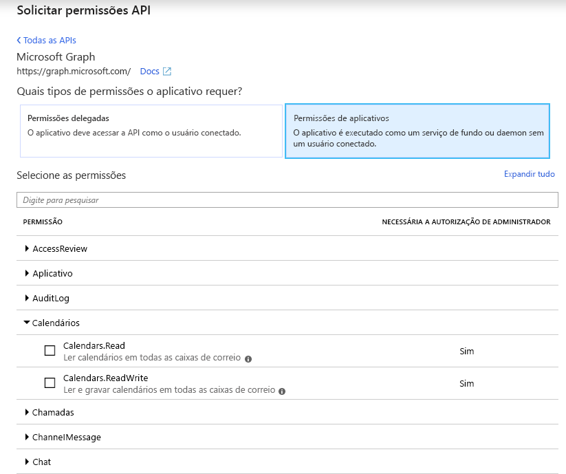
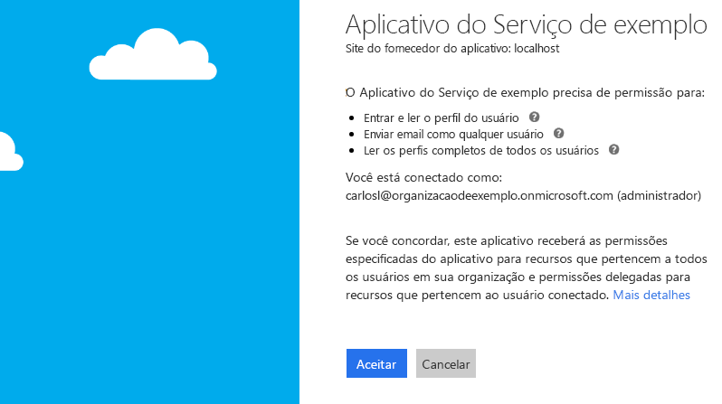

# <a name="get-access-without-a-user"></a><span data-ttu-id="44283-104">Obter acesso sem um usuário</span><span class="sxs-lookup"><span data-stu-id="44283-104">Get access without a user</span></span>

<span data-ttu-id="44283-p102">Alguns aplicativos chamam o Microsoft Graph com sua própria identidade e não em nome de um usuário. Em muitos casos, esses são os serviços em plano de fundo ou daemons que podem ser executados em um servidor sem a presença de um usuário conectado. Um exemplo de como um aplicativo pode ser um serviço de arquivamento de email que é ativado e executado durante a noite. Em alguns casos, aplicativos que tenham um usuário conectado no momento talvez precisem chamar o Microsoft Graph com sua própria identidade também. Por exemplo, um aplicativo talvez precise usar a funcionalidade que exige privilégios mais elevados em uma organização do que aqueles realizados pelo usuário conectado.</span><span class="sxs-lookup"><span data-stu-id="44283-p102">Some apps call Microsoft Graph with their own identity and not on behalf of a user. In many cases, these are background services or daemons that run on a server without the presence of a signed-in user. An example of such an app might be an email archival service that wakes up and runs overnight. In some cases, apps that have a signed-in user present may also need to call Microsoft Graph under their own identity. For example, an app may need to use functionality that requires more elevated privileges in an organization than those carried by the signed-in user.</span></span>  

<span data-ttu-id="44283-p103">Os aplicativos que chamam o Microsoft Graph com sua própria identidade usam o [fluxo de concessão de credenciais do cliente](/azure/active-directory/develop/v2-oauth2-client-creds-grant-flow) OAuth 2.0 para obter tokens de acesso do Azure AD. Este tópico descreve as etapas básicas para configurar um serviço e usa o fluxo de concessão de credenciais do cliente OAuth para obter um token de acesso.</span><span class="sxs-lookup"><span data-stu-id="44283-p103">Apps that call Microsoft Graph with their own identity use the OAuth 2.0 [client credentials grant flow](/azure/active-directory/develop/v2-oauth2-client-creds-grant-flow) to get access tokens from Azure AD. This topic describes the basic steps to configure a service and use the OAuth client credentials grant flow to get an access token.</span></span>

## <a name="authentication-and-authorization-steps"></a><span data-ttu-id="44283-112">Etapas de autenticação e autorização</span><span class="sxs-lookup"><span data-stu-id="44283-112">Authentication and authorization steps</span></span>

<span data-ttu-id="44283-113">As etapas básicas necessárias para configurar um serviço e obter um token para o ponto de extremidade da plataforma de identidade da Microsoft que seu serviço pode usar para fazer chamadas para o Microsoft Graph com sua própria identidade são:</span><span class="sxs-lookup"><span data-stu-id="44283-113">The basic steps required to configure a service and get a token from the Microsoft identity platform endpoint that your service can use to call Microsoft Graph under its own identity are:</span></span>

1. <span data-ttu-id="44283-114">Registre seu aplicativo.</span><span class="sxs-lookup"><span data-stu-id="44283-114">Register your app.</span></span>
2. <span data-ttu-id="44283-115">Configure permissões para o Microsoft Graph em seu aplicativo.</span><span class="sxs-lookup"><span data-stu-id="44283-115">Configure permissions for Microsoft Graph on your app.</span></span>
3. <span data-ttu-id="44283-116">Obtenha o consentimento do administrador.</span><span class="sxs-lookup"><span data-stu-id="44283-116">Get administrator consent.</span></span>
4. <span data-ttu-id="44283-117">Obtenha um token de acesso.</span><span class="sxs-lookup"><span data-stu-id="44283-117">Get an access token.</span></span>
5. <span data-ttu-id="44283-118">Use o token de acesso para chamar o Microsoft Graph.</span><span class="sxs-lookup"><span data-stu-id="44283-118">Use the access token to call Microsoft Graph.</span></span>

## <a name="1-register-your-app"></a><span data-ttu-id="44283-119">1. Registre seu aplicativo</span><span class="sxs-lookup"><span data-stu-id="44283-119">1. Register your app</span></span>

<span data-ttu-id="44283-p104">Para autenticar com o ponto de extremidade da plataforma de identidade da Microsoft, primeiro você deve registrar seu aplicativo no [Portal de Registro de Aplicativos do Azure](https://go.microsoft.com/fwlink/?linkid=2083908). Você pode usar uma conta da Microsoft ou uma conta corporativa ou de estudante para registrar seu aplicativo.</span><span class="sxs-lookup"><span data-stu-id="44283-p104">To authenticate with the Microsoft identity platform endpoint, you must first register your app at the [Azure app registration portal](https://go.microsoft.com/fwlink/?linkid=2083908). You can use either a Microsoft account or a work or school account to register your app.</span></span>

<span data-ttu-id="44283-122">Para um serviço que chamará o Microsoft Graph com sua própria identidade, você precisa registrar seu aplicativo na plataforma Web e copiar os seguintes valores:</span><span class="sxs-lookup"><span data-stu-id="44283-122">For a service that will call Microsoft Graph under its own identity, you need to register your app for the Web platform and copy the following values:</span></span>

- <span data-ttu-id="44283-123">A ID do Aplicativo atribuída pelo portal de registro de aplicativo do Azure.</span><span class="sxs-lookup"><span data-stu-id="44283-123">The Application ID assigned by the Azure app registration portal.</span></span>
- <span data-ttu-id="44283-124">Um Segredo do Cliente (aplicativo), que pode ser uma senha ou um par de chaves públicas/particulares (certificado).</span><span class="sxs-lookup"><span data-stu-id="44283-124">A Client (application) Secret, either a password or a public/private key pair (certificate).</span></span>
- <span data-ttu-id="44283-125">Uma URL de redirecionamento para seu serviço receber respostas do token.</span><span class="sxs-lookup"><span data-stu-id="44283-125">A Redirect URL for your service to receive token responses.</span></span>
- <span data-ttu-id="44283-126">Uma URL de redirecionamento para seu serviço receber respostas de consentimento do administrador se seu aplicativo implementar a funcionalidade para solicitar o consentimento do administrador.</span><span class="sxs-lookup"><span data-stu-id="44283-126">A Redirect URL for your service to receive admin consent responses if your app implements functionality to request administrator consent.</span></span>  

<span data-ttu-id="44283-127">Para saber como configurar um aplicativo usando o Portal de Registro de Aplicativos do Azure, confira [Registre seu aplicativo](./auth-register-app-v2.md).</span><span class="sxs-lookup"><span data-stu-id="44283-127">For steps on how to configure an app using the Azure app registration portal, see [Register your app](./auth-register-app-v2.md).</span></span>

<span data-ttu-id="44283-128">Com o fluxo de concessão de credenciais do cliente OAuth 2.0, seu aplicativo é autenticado diretamente no ponto de extremidade `/token` da plataforma de identidade da Microsoft usando a ID do Aplicativo atribuída pelo Azure AD e o Segredo do Aplicativo que você cria usando o portal.</span><span class="sxs-lookup"><span data-stu-id="44283-128">With the OAuth 2.0 client credentials grant flow, your app authenticates directly at the Microsoft identity platform `/token` endpoint using the Application ID assigned by Azure AD and the Application Secret that you create using the portal.</span></span>

## <a name="2-configure-permissions-for-microsoft-graph"></a><span data-ttu-id="44283-129">2. Configure permissões para o Microsoft Graph</span><span class="sxs-lookup"><span data-stu-id="44283-129">2. Configure permissions for Microsoft Graph</span></span>

<span data-ttu-id="44283-p105">Para aplicativos que chamam o Microsoft com sua própria identidade, o Microsoft Graph expõe permissões do aplicativo. (O Microsoft Graph também pode expor as permissões delegadas para aplicativos que chamam o Microsoft Graph em nome de um usuário.) Configure previamente as permissões do aplicativo necessárias quando registrar o aplicativo. As permissões do aplicativo sempre exigem o consentimento do administrador. Um administrador pode autorizar essas permissões usando o [Portal do Azure](https://portal.azure.com) quando o aplicativo for instalado em sua organização ou pode fornecer uma experiência de inscrição em seu aplicativo por meio da qual os administradores podem concordar com as permissões configuradas. Depois que o consentimento do administrador for registrado pelo Azure AD, seu aplicativo poderá solicitar tokens sem ter que solicitar consentimento novamente. Para obter mais informações sobre as permissões disponibilizadas pelo Microsoft Graph, confira a [Referência de permissões](./permissions-reference.md)</span><span class="sxs-lookup"><span data-stu-id="44283-p105">For apps that call Microsoft Graph under their own identity, Microsoft Graph exposes application permissions (Microsoft Graph can also expose delegated permissions for apps that call Microsoft Graph on behalf of a user). You pre-configure the application permissions your app needs when you register your app. Application permissions always require administrator consent. An administrator can either consent to these permissions using the [Azure portal](https://portal.azure.com) when your app is installed in their organization, or you can provide a sign-up experience in your app through which administrators can consent to the permissions you configured. Once administrator consent is recorded by Azure AD, your app can request tokens without having to request consent again. For more detailed information about the permissions available with Microsoft Graph, see the [Permissions reference](./permissions-reference.md)</span></span>

<span data-ttu-id="44283-136">Para configurar as permissões de aplicativo para seu aplicativo no [Portal de Registros de Aplicativos do Azure](https://go.microsoft.com/fwlink/?linkid=2083908): na página **permissões de API** do aplicativo, escolha **Adicionar uma permissão**, selecione **Microsoft Graph**, e, em seguida, escolha as permissões exigidas pelo aplicativo em **Permissões do aplicativo**.</span><span class="sxs-lookup"><span data-stu-id="44283-136">To configure application permissions for your app in the [Azure app registrations portal](https://go.microsoft.com/fwlink/?linkid=2083908): under an application's **API permissions** page, choose **Add a permission**, select **Microsoft Graph**, and then choose the permissions your app requires under **Application permissions**.</span></span>

<span data-ttu-id="44283-137">A captura de tela a seguir mostra a caixa de diálogo **Selecionar Permissões** para permissões de aplicativo do Microsoft Graph.</span><span class="sxs-lookup"><span data-stu-id="44283-137">The following screenshot shows the **Select Permissions** dialog box for Microsoft Graph application permissions.</span></span>



> <span data-ttu-id="44283-p106">**Observação**: Recomendamos que você configure o conjunto com menos privilégios de permissões necessárias para seu aplicativo. Isso proporciona uma experiência muito mais confortável para os administradores do que ter que consentir com uma longa lista de permissões.</span><span class="sxs-lookup"><span data-stu-id="44283-p106">**Note**: We recommend that you configure the least privileged set of permissions required by your app. This provides a much more comfortable experience for administrators than having to consent to a long list of permissions.</span></span>

## <a name="3-get-administrator-consent"></a><span data-ttu-id="44283-141">3. Obtenha o consentimento do administrador</span><span class="sxs-lookup"><span data-stu-id="44283-141">3. Get administrator consent</span></span>

<span data-ttu-id="44283-142">Você pode confiar em um administrador para conceder as permissões que seu aplicativo precisa no [Portal do Azure](https://portal.azure.com). No entanto, muitas vezes, a melhor opção seria fornecer uma experiência de inscrição para administradores usando o ponto de extremidade `/adminconsent` da plataforma de identidade da Microsoft.</span><span class="sxs-lookup"><span data-stu-id="44283-142">You can rely on an administrator to grant the permissions your app needs at the [Azure portal](https://portal.azure.com); however, often, a better option is to provide a sign-up experience for administrators by using the Microsoft identity platform `/adminconsent` endpoint.</span></span> 

> <span data-ttu-id="44283-143">**Importante**: Sempre que fizer uma alteração nas permissões configuradas, convém repetir o processo de Consentimento do Administrador.</span><span class="sxs-lookup"><span data-stu-id="44283-143">**Important**: Any time you make a change to the configured permissions, you must also repeat the Admin Consent process.</span></span> <span data-ttu-id="44283-144">As alterações feitas no portal de registro de aplicativos não serão refletidas até que o consentimento tiver sido reaplicado pelo administrador do locatário.</span><span class="sxs-lookup"><span data-stu-id="44283-144">Changes made in the app registration portal will not be reflected until consent has been reapplied by the tenant's administrator.</span></span>

### <a name="request"></a><span data-ttu-id="44283-145">Solicitação</span><span class="sxs-lookup"><span data-stu-id="44283-145">Request</span></span>

```
// Line breaks are for legibility only.

GET https://login.microsoftonline.com/{tenant}/adminconsent
?client_id=6731de76-14a6-49ae-97bc-6eba6914391e
&state=12345
&redirect_uri=https://localhost/myapp/permissions
```

| <span data-ttu-id="44283-146">Parâmetro</span><span class="sxs-lookup"><span data-stu-id="44283-146">Parameter</span></span>     | <span data-ttu-id="44283-147">Condição</span><span class="sxs-lookup"><span data-stu-id="44283-147">Condition</span></span>   | <span data-ttu-id="44283-148">Descrição</span><span class="sxs-lookup"><span data-stu-id="44283-148">Description</span></span> 
|:--------------|:------------|:------------
| <span data-ttu-id="44283-149">locatário</span><span class="sxs-lookup"><span data-stu-id="44283-149">tenant</span></span>        | <span data-ttu-id="44283-150">Obrigatório</span><span class="sxs-lookup"><span data-stu-id="44283-150">Required</span></span>    | <span data-ttu-id="44283-p108">O locatário do diretório do qual você deseja solicitar permissão. Pode ser no formato de nome amigável ou GUID. Se você não souber a qual locatário o usuário pertence e quiser permitir que ele entre em qualquer locatário, use `common`.</span><span class="sxs-lookup"><span data-stu-id="44283-p108">The directory tenant that you want to request permission from. This can be in GUID or friendly name format. If you don't know which tenant the user belongs to and you want to let them sign in with any tenant, use `common`.</span></span>
| <span data-ttu-id="44283-154">client_id</span><span class="sxs-lookup"><span data-stu-id="44283-154">client_id</span></span>     | <span data-ttu-id="44283-155">Obrigatório</span><span class="sxs-lookup"><span data-stu-id="44283-155">Required</span></span>    | <span data-ttu-id="44283-156">A ID de Aplicativo que o [Portal de Registro de Aplicativos do Azure](https://go.microsoft.com/fwlink/?linkid=2083908) atribuiu a seu aplicativo.</span><span class="sxs-lookup"><span data-stu-id="44283-156">The Application ID that the [Azure app registration portal](https://go.microsoft.com/fwlink/?linkid=2083908) assigned to your app.</span></span>
| <span data-ttu-id="44283-157">redirect_uri</span><span class="sxs-lookup"><span data-stu-id="44283-157">redirect_uri</span></span>  | <span data-ttu-id="44283-158">Obrigatório</span><span class="sxs-lookup"><span data-stu-id="44283-158">Required</span></span>    | <span data-ttu-id="44283-p109">O URI de redirecionamento para onde você deseja que a resposta seja enviada para que o aplicativo trate da situação. Ele deve corresponder exatamente a um dos URIs de redirecionamento registrados no portal, exceto que ele deve ser codificado por URL e pode ter segmentos de caminho adicionais.</span><span class="sxs-lookup"><span data-stu-id="44283-p109">The redirect URI where you want the response to be sent for your app to handle. It must exactly match one of the redirect URIs that you registered in the portal, except that it must be URL encoded, and it can have additional path segments.</span></span>
| <span data-ttu-id="44283-161">estado</span><span class="sxs-lookup"><span data-stu-id="44283-161">state</span></span>         | <span data-ttu-id="44283-162">Recomendado</span><span class="sxs-lookup"><span data-stu-id="44283-162">Recommended</span></span> | <span data-ttu-id="44283-p110">Um valor incluído na solicitação e que também será retornado na resposta do token. Pode ser uma cadeia de caracteres de qualquer conteúdo que você desejar. O estado é usado para codificar as informações sobre o estado do usuário no aplicativo antes da solicitação de autenticação ter ocorrido, como a página ou o modo de exibição em que ele estava.</span><span class="sxs-lookup"><span data-stu-id="44283-p110">A value that is included in the request that also is returned in the token response. It can be a string of any content that you want. The state is used to encode information about the user's state in the app before the authentication request occurred, such as the page or view they were on.</span></span>

### <a name="administrator-consent-experience"></a><span data-ttu-id="44283-166">Experiência de consentimento do administrador</span><span class="sxs-lookup"><span data-stu-id="44283-166">Administrator consent experience</span></span>

<span data-ttu-id="44283-p111">Através de solicitações ao ponto de extremidade `/adminconsent`, o Azure AD exige que apenas um administrador de locatário possa fazer logon para concluir a solicitação. O administrador será solicitado a aprovar todas as Permissões de aplicativo que você solicitar para seu aplicativo no Portal de Registro de Aplicativos.</span><span class="sxs-lookup"><span data-stu-id="44283-p111">With requests to the `/adminconsent` endpoint, Azure AD enforces that only a tenant administrator can sign in to complete the request. The administrator will be asked to approve all the application permissions that you have requested for your app in the app registration portal.</span></span>

<span data-ttu-id="44283-169">Veja a seguir um exemplo da caixa de diálogo de consentimento que o Azure AD apresenta ao administrador:</span><span class="sxs-lookup"><span data-stu-id="44283-169">The following is an example of the consent dialog that Azure AD presents to the administrator:</span></span>



### <a name="response"></a><span data-ttu-id="44283-171">Resposta</span><span class="sxs-lookup"><span data-stu-id="44283-171">Response</span></span>

<span data-ttu-id="44283-172">Se o administrador aprovar as permissões de seu aplicativo, a resposta bem-sucedida ficará assim:</span><span class="sxs-lookup"><span data-stu-id="44283-172">If the administrator approves the permissions for your application, the successful response looks like this:</span></span>

```
// Line breaks are for legibility only.

GET https://localhost/myapp/permissions
?tenant=a8990e1f-ff32-408a-9f8e-78d3b9139b95&state=12345
&admin_consent=True
```

| <span data-ttu-id="44283-173">Parâmetro</span><span class="sxs-lookup"><span data-stu-id="44283-173">Parameter</span></span>     | <span data-ttu-id="44283-174">Descrição</span><span class="sxs-lookup"><span data-stu-id="44283-174">Description</span></span>
|:--------------|:------------
| <span data-ttu-id="44283-175">locatário</span><span class="sxs-lookup"><span data-stu-id="44283-175">tenant</span></span>        | <span data-ttu-id="44283-176">O locatário do diretório que concedeu as permissões de aplicativo solicitadas, no formato GUID.</span><span class="sxs-lookup"><span data-stu-id="44283-176">The directory tenant that granted your application the permissions that it requested, in GUID format.</span></span>
| <span data-ttu-id="44283-177">estado</span><span class="sxs-lookup"><span data-stu-id="44283-177">state</span></span>         | <span data-ttu-id="44283-p112">Um valor incluído na solicitação e que também será retornado na resposta do token. Pode ser uma cadeia de caracteres de qualquer conteúdo que você desejar. O estado é usado para codificar as informações sobre o estado do usuário no aplicativo antes da solicitação de autenticação ter ocorrido, como a página ou o modo de exibição em que ele estava.</span><span class="sxs-lookup"><span data-stu-id="44283-p112">A value that is included in the request that also is returned in the token response. It can be a string of any content that you want. The state is used to encode information about the user's state in the app before the authentication request occurred, such as the page or view they were on.</span></span>
| <span data-ttu-id="44283-181">admin_consent</span><span class="sxs-lookup"><span data-stu-id="44283-181">admin_consent</span></span> | <span data-ttu-id="44283-182">Definir como **true**.</span><span class="sxs-lookup"><span data-stu-id="44283-182">Set to **true**.</span></span>


> <span data-ttu-id="44283-p113">**Experimente**: Você pode experimentar ao colar a solicitação abaixo em um navegador. Se fizer logon como um Administrador global em um locatário do Azure AD, você verá a caixa de diálogo de consentimento do administrador para o aplicativo. (Este aplicativo será diferente do aplicativo exibido na tela da caixa de diálogo do consentimento previamente mostrada.)</span><span class="sxs-lookup"><span data-stu-id="44283-p113">**Try**: You can try this for yourself by pasting the following request in a browser. If you sign in as a Global administrator for an Azure AD tenant, you will be presented with the administrator consent dialog box for the app. (This will be a different app than that in the consent dialog box screenshot shown earlier.)</span></span>
> 
> https://login.microsoftonline.com/common/adminconsent?client_id=6731de76-14a6-49ae-97bc-6eba6914391e&state=12345&redirect_uri=https://localhost/myapp/permissions 

## <a name="4-get-an-access-token"></a><span data-ttu-id="44283-186">4. Obter um token de acesso</span><span class="sxs-lookup"><span data-stu-id="44283-186">4. Get an access token</span></span>

<span data-ttu-id="44283-187">No fluxo de concessão de credenciais do cliente OAuth 2.0, use os valores do Segredo do Aplicativo e ID do Aplicativo salvos quando você registrou o aplicativo para solicitar um token de acesso diretamente no ponto de extremidade `/token` da plataforma de identidade da Microsoft.</span><span class="sxs-lookup"><span data-stu-id="44283-187">In the OAuth 2.0 client credentials grant flow, you use the Application ID and Application Secret values that you saved when you registered your app to request an access token directly from the Microsoft identity platform `/token` endpoint.</span></span>

<span data-ttu-id="44283-p114">Você especifica as permissões pré-configuradas passando `https://graph.microsoft.com/.default` como o valor para o parâmetro `scope` na solicitação de token. Confira a descrição do parâmetro `scope` na solicitação de token abaixo para obter detalhes.</span><span class="sxs-lookup"><span data-stu-id="44283-p114">You specify the pre-configured permissions by passing `https://graph.microsoft.com/.default` as the value for the `scope` parameter in the token request. See the `scope` parameter description in the token request below for details.</span></span>

### <a name="token-request"></a><span data-ttu-id="44283-190">Solicitação de token</span><span class="sxs-lookup"><span data-stu-id="44283-190">Token request</span></span>

<span data-ttu-id="44283-191">Envie uma solicitação POST ao ponto de extremidade `/token` da plataforma de identidade para adquirir um token de acesso:</span><span class="sxs-lookup"><span data-stu-id="44283-191">You send a POST request to the `/token` identity platform endpoint to acquire an access token:</span></span>

```
// Line breaks are for legibility only.

POST https://login.microsoftonline.com/{tenant}/oauth2/v2.0/token HTTP/1.1
Host: login.microsoftonline.com
Content-Type: application/x-www-form-urlencoded

client_id=535fb089-9ff3-47b6-9bfb-4f1264799865
&scope=https%3A%2F%2Fgraph.microsoft.com%2F.default
&client_secret=qWgdYAmab0YSkuL1qKv5bPX
&grant_type=client_credentials
```

| <span data-ttu-id="44283-192">Parâmetro</span><span class="sxs-lookup"><span data-stu-id="44283-192">Parameter</span></span>     | <span data-ttu-id="44283-193">Condição</span><span class="sxs-lookup"><span data-stu-id="44283-193">Condition</span></span> | <span data-ttu-id="44283-194">Descrição</span><span class="sxs-lookup"><span data-stu-id="44283-194">Description</span></span> 
|:--------------|:----------|:------------
| <span data-ttu-id="44283-195">locatário</span><span class="sxs-lookup"><span data-stu-id="44283-195">tenant</span></span>        | <span data-ttu-id="44283-196">Obrigatório</span><span class="sxs-lookup"><span data-stu-id="44283-196">Required</span></span>  | <span data-ttu-id="44283-p115">O locatário do diretório do qual você deseja solicitar permissão. Pode ser no formato de nome amigável ou GUID.</span><span class="sxs-lookup"><span data-stu-id="44283-p115">The directory tenant that you want to request permission from. This can be in GUID or friendly name format.</span></span>
| <span data-ttu-id="44283-199">client_id</span><span class="sxs-lookup"><span data-stu-id="44283-199">client_id</span></span>     | <span data-ttu-id="44283-200">Obrigatório</span><span class="sxs-lookup"><span data-stu-id="44283-200">Required</span></span>  | <span data-ttu-id="44283-201">A ID de Aplicativo que o [Portal de Registro de Aplicativos do Azure](https://go.microsoft.com/fwlink/?linkid=2083908) atribuiu quando você registrou seu aplicativo.</span><span class="sxs-lookup"><span data-stu-id="44283-201">The Application ID that the [Azure app registration portal](https://go.microsoft.com/fwlink/?linkid=2083908) assigned when you registered your app.</span></span>
| <span data-ttu-id="44283-202">scope</span><span class="sxs-lookup"><span data-stu-id="44283-202">scope</span></span>         | <span data-ttu-id="44283-203">Obrigatório</span><span class="sxs-lookup"><span data-stu-id="44283-203">Required</span></span>  | <span data-ttu-id="44283-204">O valor passado para o parâmetro `scope` nesta solicitação deve ser o identificador do recurso (URI da ID do Aplicativo) do recurso desejado, afixado com o sufixo `.default`.</span><span class="sxs-lookup"><span data-stu-id="44283-204">The value passed for the `scope` parameter in this request should be the resource identifier (Application ID URI) of the resource you want, affixed with the `.default` suffix.</span></span> <span data-ttu-id="44283-205">Para o Microsoft Graph, o valor é `https://graph.microsoft.com/.default`.</span><span class="sxs-lookup"><span data-stu-id="44283-205">For Microsoft Graph, the value is `https://graph.microsoft.com/.default`.</span></span> <span data-ttu-id="44283-206">Esse valor informa ao ponto de extremidade da plataforma de identidade da Microsoft que, de todas as permissões de aplicativo que você configurou no seu aplicativo, ele deve emitir um token para os aplicativos associados ao recurso que você quer usar.</span><span class="sxs-lookup"><span data-stu-id="44283-206">This value informs the Microsoft identity platform endpoint that of all the application permissions you have configured for your app in the app registration portal, it should issue a token for the ones associated with the resource you want to use.</span></span>
| <span data-ttu-id="44283-207">client_secret</span><span class="sxs-lookup"><span data-stu-id="44283-207">client_secret</span></span> | <span data-ttu-id="44283-208">Obrigatório</span><span class="sxs-lookup"><span data-stu-id="44283-208">Required</span></span>  | <span data-ttu-id="44283-209">O Segredo do Aplicativo gerado para seu aplicativo no portal de registro de aplicativos.</span><span class="sxs-lookup"><span data-stu-id="44283-209">The Application Secret that you generated for your app in the app registration portal.</span></span>
| <span data-ttu-id="44283-210">grant_type</span><span class="sxs-lookup"><span data-stu-id="44283-210">grant_type</span></span>    | <span data-ttu-id="44283-211">Obrigatório</span><span class="sxs-lookup"><span data-stu-id="44283-211">Required</span></span>  | <span data-ttu-id="44283-212">Deve ser `client_credentials`.</span><span class="sxs-lookup"><span data-stu-id="44283-212">Must be `client_credentials`.</span></span>

#### <a name="token-response"></a><span data-ttu-id="44283-213">Resposta do token</span><span class="sxs-lookup"><span data-stu-id="44283-213">Token response</span></span>

<span data-ttu-id="44283-214">Uma resposta bem-sucedida tem esta aparência:</span><span class="sxs-lookup"><span data-stu-id="44283-214">A successful response looks like this:</span></span>

```json
{
  "token_type": "Bearer",
  "expires_in": 3599,
  "access_token": "eyJ0eXAiOiJKV1QiLCJhbGciOiJSUzI1NiIsIng1dCI6Ik1uQ19WWmNBVGZNNXBP..."
}
```

| <span data-ttu-id="44283-215">Parâmetro</span><span class="sxs-lookup"><span data-stu-id="44283-215">Parameter</span></span>     | <span data-ttu-id="44283-216">Descrição</span><span class="sxs-lookup"><span data-stu-id="44283-216">Description</span></span>
|:--------------|:------------
| <span data-ttu-id="44283-217">access_token</span><span class="sxs-lookup"><span data-stu-id="44283-217">access_token</span></span>  | <span data-ttu-id="44283-p117">O token de acesso solicitado. Seu aplicativo pode usar esse token em chamadas para o Microsoft Graph.</span><span class="sxs-lookup"><span data-stu-id="44283-p117">The requested access token. Your app can use this token in calls to Microsoft Graph.</span></span>
| <span data-ttu-id="44283-220">token_type</span><span class="sxs-lookup"><span data-stu-id="44283-220">token_type</span></span>    | <span data-ttu-id="44283-p118">Indica o valor de tipo de token. O único tipo ao qual o Azure AD dá suporte é `bearer`.</span><span class="sxs-lookup"><span data-stu-id="44283-p118">Indicates the token type value. The only type that Azure AD supports is `bearer`.</span></span>
| <span data-ttu-id="44283-223">expires_in</span><span class="sxs-lookup"><span data-stu-id="44283-223">expires_in</span></span>    | <span data-ttu-id="44283-224">Por quanto tempo o token de acesso é válido (em segundos).</span><span class="sxs-lookup"><span data-stu-id="44283-224">How long the access token is valid (in seconds).</span></span>

## <a name="5-use-the-access-token-to-call-microsoft-graph"></a><span data-ttu-id="44283-225">5. Use o token de acesso para chamar o Microsoft Graph</span><span class="sxs-lookup"><span data-stu-id="44283-225">5. Use the access token to call Microsoft Graph</span></span>

<span data-ttu-id="44283-p119">Após obter o token de acesso, você pode usá-lo para chamar o Microsoft Graph, incluindo-o no cabeçalho `Authorization` de uma solicitação. A solicitação a seguir obtém o perfil de um usuário específico. Seu aplicativo deve ter a permissão _User.Read.All_ para chamar essa API.</span><span class="sxs-lookup"><span data-stu-id="44283-p119">After you have an access token, you can use it to call Microsoft Graph by including it in the `Authorization` header of a request. The following request gets the profile of a specific user. Your app must have the _User.Read.All_ permission to call this API.</span></span>

```
GET https://graph.microsoft.com/v1.0/users/12345678-73a6-4952-a53a-e9916737ff7f
Authorization: Bearer eyJ0eXAiO ... 0X2tnSQLEANnSPHY0gKcgw
Host: graph.microsoft.com
```
<span data-ttu-id="44283-229">Uma resposta bem-sucedida terá a seguinte aparência (alguns cabeçalhos de resposta foram removidos):</span><span class="sxs-lookup"><span data-stu-id="44283-229">A successful response will look similar to this (some response headers have been removed):</span></span>

```http
HTTP/1.1 200 OK
Content-Type: application/json;odata.metadata=minimal;odata.streaming=true;IEEE754Compatible=false;charset=utf-8
request-id: f45d08c0-6901-473a-90f5-7867287de97f
client-request-id: f45d08c0-6901-473a-90f5-7867287de97f
OData-Version: 4.0
Duration: 309.0273
Date: Wed, 26 Apr 2017 19:53:49 GMT
Content-Length: 407
```

```json
{
    "@odata.context":"https://graph.microsoft.com/v1.0/$metadata#users/$entity",
    "id":"12345678-73a6-4952-a53a-e9916737ff7f",
    "businessPhones":[
        "+1 555555555"
    ],
    "displayName":"Chris Green",
    "givenName":"Chris",
    "jobTitle":"Software Engineer",
    "mail":null,
    "mobilePhone":"+1 5555555555",
    "officeLocation":"Seattle Office",
    "preferredLanguage":null,
    "surname":"Green",
    "userPrincipalName":"ChrisG@contoso.onmicrosoft.com"
}
```

## <a name="supported-app-scenarios-and-resources"></a><span data-ttu-id="44283-230">Recursos e cenários de aplicativo com suporte</span><span class="sxs-lookup"><span data-stu-id="44283-230">Supported app scenarios and resources</span></span>

<span data-ttu-id="44283-231">Os aplicativos que chamam o Microsoft Graph com sua própria identidade se enquadram em uma dessas categorias:</span><span class="sxs-lookup"><span data-stu-id="44283-231">Apps that call Microsoft Graph under their own identity fall into one of two categories:</span></span>

- <span data-ttu-id="44283-232">[Serviços em segundo plano (daemons)](/azure/active-directory/develop/scenario-daemon-overview) que podem ser executados em um servidor sem um usuário conectado.</span><span class="sxs-lookup"><span data-stu-id="44283-232">[Background services (daemons)](/azure/active-directory/develop/scenario-daemon-overview) that run on a server without a signed-in user.</span></span>
- <span data-ttu-id="44283-233">Aplicativos que têm um usuário conectado, mas que também chamam o Microsoft Graph com sua própria identidade. Por exemplo, para usar a funcionalidade que exige privilégios mais elevados do usuário.</span><span class="sxs-lookup"><span data-stu-id="44283-233">Apps that have a signed-in user but also call Microsoft Graph with their own identity; for example, to use functionality that requires more elevated privileges than those of the user.</span></span>

<span data-ttu-id="44283-p120">Os aplicativos que chamam o Microsoft Graph com sua própria identidade usam a concessão de credenciais do cliente OAuth 2.0 para autenticar com o Azure Active Directory e obter um token. Para o ponto de extremidade da plataforma de identidade da Microsoft, você pode explorar ainda mais esse cenário com os seguintes recursos:</span><span class="sxs-lookup"><span data-stu-id="44283-p120">Apps that call Microsoft Graph with their own identity use the OAuth 2.0 client credentials grant to authenticate with Azure AD and get a token. For the Microsoft identity platform endpoint, you can explore this scenario further with the following resources:</span></span>

- <span data-ttu-id="44283-236">Para ver um tratamento mais completo do Fluxo de Concessão de Credenciais do Cliente que também inclui respostas de erro, confira o artigo [Azure Active Directory v2.0 e o fluxo de Credenciais do Cliente OAuth 2.0](/azure/active-directory/develop/v2-oauth2-client-creds-grant-flow).</span><span class="sxs-lookup"><span data-stu-id="44283-236">For a more complete treatment of the client credentials grant flow that also includes error responses, see [Azure Active Directory v2.0 and the OAuth 2.0 client credentials flow](/azure/active-directory/develop/v2-oauth2-client-creds-grant-flow).</span></span>
- <span data-ttu-id="44283-237">Para obter um exemplo que chama o Microsoft Graph a partir de um serviço, confira o [exemplo do daemon v2.0](https://github.com/Azure-Samples/active-directory-dotnet-daemon-v2) no GitHub.</span><span class="sxs-lookup"><span data-stu-id="44283-237">For a sample that calls Microsoft Graph from a service, see the [v2.0 daemon sample](https://github.com/Azure-Samples/active-directory-dotnet-daemon-v2) on GitHub.</span></span>
- <span data-ttu-id="44283-238">Para obter mais informações sobre bibliotecas de autenticação recomendadas da Microsoft e de terceiros, confira as [bibliotecas de autenticação da plataforma de identidade da Microsoft](/azure/active-directory/develop/reference-v2-libraries).</span><span class="sxs-lookup"><span data-stu-id="44283-238">For more information about recommended Microsoft and third-party authentication libraries, see [Microsoft identity platform authentication libraries](/azure/active-directory/develop/reference-v2-libraries).</span></span>

## <a name="endpoint-considerations"></a><span data-ttu-id="44283-239">Considerações sobre o ponto de extremidade</span><span class="sxs-lookup"><span data-stu-id="44283-239">Endpoint considerations</span></span>

<span data-ttu-id="44283-240">A Microsoft continua oferecendo suporte ao ponto de extremidade do Azure AD.</span><span class="sxs-lookup"><span data-stu-id="44283-240">Microsoft continues to support the Azure AD endpoint.</span></span> <span data-ttu-id="44283-241">Existem [várias diferenças](/azure/active-directory/develop/azure-ad-endpoint-comparison) entre a utilização do ponto de extremidade da plataforma de identidade da Microsoft e o ponto de extremidade do Azure AD.</span><span class="sxs-lookup"><span data-stu-id="44283-241">There are [several differences](/azure/active-directory/develop/azure-ad-endpoint-comparison) between using the Microsoft identity platform endpoint and the Azure AD endpoint.</span></span> <span data-ttu-id="44283-242">Durante o uso do ponto de extremidade do Azure AD:</span><span class="sxs-lookup"><span data-stu-id="44283-242">When using the Azure AD endpoint:</span></span>

- <span data-ttu-id="44283-243">Se o aplicativo for multilocatário, você deve configurá-lo explicitamente para funcionar como multilocatário no [portal do Azure](https://portal.azure.com).</span><span class="sxs-lookup"><span data-stu-id="44283-243">If your app is a multi-tenant app, you must explicitly configure it to be multi-tenant in the [Azure portal](https://portal.azure.com).</span></span>
- <span data-ttu-id="44283-p122">Não há um ponto de extremidade de consentimento do administrador (`/adminconsent`). Em vez disso, o aplicativo pode solicitar o consentimento do administrador durante o tempo de execução adicionando o parâmetro `prompt=admin_consent` a uma solicitação de autorização. Para obter mais informações, confira **Como acionar a estrutura do consentimento do Azure Active Directory no tempo de execução** no artigo [Integração de aplicativos com o Azure Active Directory](/azure/active-directory/develop/active-directory-integrating-applications).</span><span class="sxs-lookup"><span data-stu-id="44283-p122">There is no admin consent endpoint (`/adminconsent`). Instead, your app can request administrator consent during runtime by adding the `prompt=admin_consent` parameter to an authorization request. For more information, see **Triggering the Azure AD consent framework at runtime** in [Integrating applications with Azure Active Directory](/azure/active-directory/develop/active-directory-integrating-applications).</span></span>
- <span data-ttu-id="44283-p123">Os parâmetros nas solicitações de token e de autorização são diferentes. Por exemplo, não existe um parâmetro `scope` nas solicitações do ponto de extremidade do Azure AD. Em vez disso, o parâmetro `resource` é usado para especificar o URI do recurso (`resource=https://graph.microsoft.com`) que a autorização (para consentimento do administrador) ou um token está solicitando.</span><span class="sxs-lookup"><span data-stu-id="44283-p123">The parameters in authorization and token requests are different. For example, there is no `scope` parameter in Azure AD endpoint requests; instead, the `resource` parameter is used to specify the URI of the resource (`resource=https://graph.microsoft.com`) that authorization (for administrator consent) or a token is being requested for.</span></span>

<span data-ttu-id="44283-249">Você pode explorar esse cenário ainda mais com os seguintes recursos:</span><span class="sxs-lookup"><span data-stu-id="44283-249">You can explore this scenario further with the following resources:</span></span>

- <span data-ttu-id="44283-250">Para saber mais sobre a plataforma de identidade da Microsoft com diferentes tipos de aplicativos, confira os links de **Introdução** na [documentação da plataforma de identidade da Microsoft](/azure/active-directory/develop/active-directory-developers-guide).</span><span class="sxs-lookup"><span data-stu-id="44283-250">For information about using the Microsoft identity platform with different kinds of apps, see the **Get Started** links in the [Microsoft identity platform documentation](/azure/active-directory/develop/active-directory-developers-guide).</span></span> <span data-ttu-id="44283-251">Este guia contém links para tópicos de visão geral, guias de início rápido, tutoriais, exemplos de código e documentação de protocolo para diferentes tipos de aplicativos compatíveis com a plataforma de identidade da Microsoft.</span><span class="sxs-lookup"><span data-stu-id="44283-251">The guide contains links to overview topics, quickstarts, tutorials, code samples, and protocol documentation for different kinds of apps supported by the Microsoft identity platform.</span></span>
- <span data-ttu-id="44283-252">Para saber mais sobre a MSAL (Biblioteca de Autenticação da Microsoft) e o middleware de servidor disponíveis para uso com o ponto de extremidade da plataforma de identidade da Microsoft, confira [Bibliotecas de Autenticação da Microsoft](/azure/active-directory/develop/active-directory-authentication-libraries).</span><span class="sxs-lookup"><span data-stu-id="44283-252">For information about the Microsoft Authentication Library (MSAL) and server middleware available for use with the Microsoft identity platform endpoint, see [Microsoft Authentication Libraries](/azure/active-directory/develop/active-directory-authentication-libraries).</span></span>


## <a name="see-also"></a><span data-ttu-id="44283-253">Confira também</span><span class="sxs-lookup"><span data-stu-id="44283-253">See also</span></span>

- <span data-ttu-id="44283-254">Para ver um exemplo de um aplicativo Web hospedado no Serviço de Aplicativo do Azure chamando o Microsoft Graph como o aplicativo (usando identidades gerenciadas), consulte [Tutorial: Acessar o Microsoft Graph de um aplicativo seguro como o aplicativo](/azure/app-service/scenario-secure-app-access-microsoft-graph-as-app).</span><span class="sxs-lookup"><span data-stu-id="44283-254">For an example of a web app hosted on Azure App Service calling Microsoft Graph as the app (using managed identities), see [Tutorial: Access Microsoft Graph from a secured app as the app](/azure/app-service/scenario-secure-app-access-microsoft-graph-as-app).</span></span> <span data-ttu-id="44283-255">Este tutorial mostra como criar uma identidade gerenciada atribuída pelo sistema em um aplicativo Web, adicionar permissões de API do Microsoft Graph a uma identidade gerenciada e chamar o Microsoft Graph.</span><span class="sxs-lookup"><span data-stu-id="44283-255">This tutorial shows you how to create a system-assigned managed identity on a web app, add Microsoft Graph API permissions to a managed identity, and call Microsoft Graph.</span></span>
- <span data-ttu-id="44283-256">Para exemplos de uso da plataforma de identidade da Microsoft para garantir diferentes tipos de aplicativos, confira [Exemplos de código da plataforma de identidade da Microsoft (ponto de extremidade v2.0)](/azure/active-directory/develop/sample-v2-code).</span><span class="sxs-lookup"><span data-stu-id="44283-256">For samples using the Microsoft identity platform to secure different application types, see [Microsoft identity platform code samples (v2.0 endpoint)](/azure/active-directory/develop/sample-v2-code).</span></span>