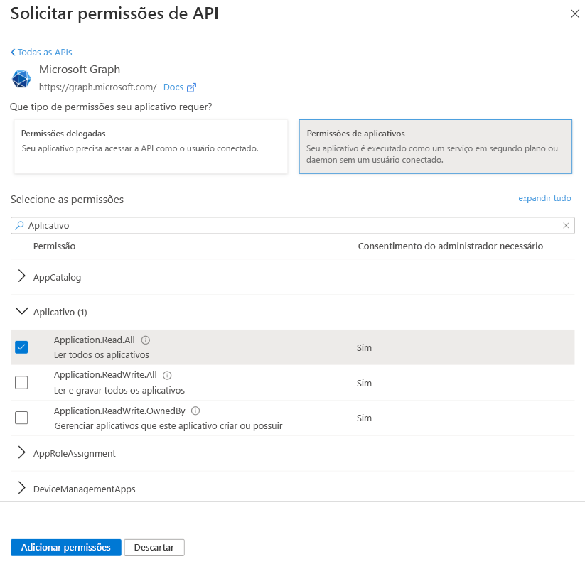

# <a name="get-access-without-a-user"></a>Obter acesso sem um usuário

Alguns aplicativos chamam o Microsoft Graph com sua própria identidade e não em nome de um usuário. Em muitos casos, esses são os serviços em plano de fundo ou daemons que podem ser executados em um servidor sem a presença de um usuário conectado. Um exemplo de como um aplicativo pode ser um serviço de arquivamento de email que é ativado e executado durante a noite. Em alguns casos, aplicativos que tenham um usuário conectado no momento talvez precisem chamar o Microsoft Graph com sua própria identidade também. Por exemplo, um aplicativo talvez precise usar a funcionalidade que exige privilégios mais elevados em uma organização do que aqueles realizados pelo usuário conectado.  

Os aplicativos que chamam o Microsoft Graph com sua própria identidade usam o [fluxo de concessão de credenciais do cliente](/azure/active-directory/develop/v2-oauth2-client-creds-grant-flow) OAuth 2.0 para obter tokens de acesso do Azure AD. Este tópico descreve as etapas básicas para configurar um serviço e usa o fluxo de concessão de credenciais do cliente OAuth para obter um token de acesso.

## <a name="authentication-and-authorization-steps"></a>Etapas de autenticação e autorização

As etapas básicas necessárias para configurar um serviço e obter um token para o ponto de extremidade da plataforma de identidade da Microsoft que seu serviço pode usar para fazer chamadas para o Microsoft Graph com sua própria identidade são:

1. Registre seu aplicativo.
2. Configure permissões para o Microsoft Graph em seu aplicativo.
3. Obtenha o consentimento do administrador.
4. Obtenha um token de acesso.
5. Use o token de acesso para chamar o Microsoft Graph.

## <a name="1-register-your-app"></a>1. Registre seu aplicativo

Para autenticar com o ponto de extremidade da plataforma de identidade da Microsoft, primeiro você deve registrar seu aplicativo no [Portal de Registro de Aplicativos do Azure](https://go.microsoft.com/fwlink/?linkid=2083908). Você pode usar uma conta da Microsoft ou uma conta corporativa ou de estudante para registrar seu aplicativo.

Para um serviço que chamará o Microsoft Graph com sua própria identidade, você precisa registrar seu aplicativo na plataforma Web e copiar os seguintes valores:

- A ID do Aplicativo atribuída pelo portal de registro de aplicativo do Azure.
- Um Segredo do Cliente (aplicativo), que pode ser uma senha ou um par de chaves públicas/particulares (certificado).
- Uma URL de redirecionamento para seu serviço receber respostas do token.
- Uma URL de redirecionamento para seu serviço receber respostas de consentimento do administrador se seu aplicativo implementar a funcionalidade para solicitar o consentimento do administrador.  

Para saber como configurar um aplicativo usando o Portal de Registro de Aplicativos do Azure, confira [Registre seu aplicativo](./auth-register-app-v2.md).

Com o fluxo de concessão de credenciais do cliente OAuth 2.0, seu aplicativo é autenticado diretamente no ponto de extremidade `/token` da plataforma de identidade da Microsoft usando a ID do Aplicativo atribuída pelo Azure AD e o Segredo do Aplicativo que você cria usando o portal.

## <a name="2-configure-permissions-for-microsoft-graph"></a>2. Configure permissões para o Microsoft Graph

Para aplicativos que chamam o Microsoft com sua própria identidade, o Microsoft Graph expõe permissões do aplicativo. (O Microsoft Graph também pode expor as permissões delegadas para aplicativos que chamam o Microsoft Graph em nome de um usuário.) Configure previamente as permissões do aplicativo necessárias quando registrar o aplicativo. As permissões do aplicativo sempre exigem o consentimento do administrador. Um administrador pode autorizar essas permissões usando o [Portal do Azure](https://portal.azure.com) quando o aplicativo for instalado em sua organização ou pode fornecer uma experiência de inscrição em seu aplicativo por meio da qual os administradores podem concordar com as permissões configuradas. Depois que o consentimento do administrador for registrado pelo Azure AD, seu aplicativo poderá solicitar tokens sem ter que solicitar consentimento novamente. Para obter mais informações sobre as permissões disponibilizadas pelo Microsoft Graph, confira a [Referência de permissões](./permissions-reference.md)

Para configurar as permissões de aplicativo para seu aplicativo no [Portal de Registros de Aplicativos do Azure](https://go.microsoft.com/fwlink/?linkid=2083908): na página **permissões de API** do aplicativo, escolha **Adicionar uma permissão**, selecione **Microsoft Graph**, e, em seguida, escolha as permissões exigidas pelo aplicativo em **Permissões do aplicativo**.

A captura de tela a seguir mostra a caixa de diálogo **Selecionar Permissões** para permissões de aplicativo do Microsoft Graph.



> **Observação**: Recomendamos que você configure o conjunto com menos privilégios de permissões necessárias para seu aplicativo. Isso proporciona uma experiência muito mais confortável para os administradores do que ter que consentir com uma longa lista de permissões.

## <a name="3-get-administrator-consent"></a>3. Obtenha o consentimento do administrador

Você pode confiar em um administrador para conceder as permissões que seu aplicativo precisa no [Portal do Azure](https://portal.azure.com). No entanto, muitas vezes, a melhor opção seria fornecer uma experiência de inscrição para administradores usando o ponto de extremidade `/adminconsent` da plataforma de identidade da Microsoft. 

> **Importante**: Sempre que fizer uma alteração nas permissões configuradas, convém repetir o processo de Consentimento do Administrador. As alterações feitas no portal de registro de aplicativos não serão refletidas até que o consentimento tiver sido reaplicado pelo administrador do locatário.

### <a name="request"></a>Solicitação

```
// Line breaks are for legibility only.

GET https://login.microsoftonline.com/{tenant}/adminconsent
?client_id=6731de76-14a6-49ae-97bc-6eba6914391e
&state=12345
&redirect_uri=https://localhost/myapp/permissions
```

| Parâmetro     | Condição   | Descrição 
|:--------------|:------------|:------------
| locatário        | Obrigatório    | O locatário do diretório do qual você deseja solicitar permissão. Pode ser no formato de nome amigável ou GUID. Se você não souber a qual locatário o usuário pertence e quiser permitir que ele entre em qualquer locatário, use `common`.
| client_id     | Obrigatório    | A ID de Aplicativo que o [Portal de Registro de Aplicativos do Azure](https://go.microsoft.com/fwlink/?linkid=2083908) atribuiu a seu aplicativo.
| redirect_uri  | Obrigatório    | O URI de redirecionamento para onde você deseja que a resposta seja enviada para que o aplicativo trate da situação. Ele deve corresponder exatamente a um dos URIs de redirecionamento registrados no portal, exceto que ele deve ser codificado por URL e pode ter segmentos de caminho adicionais.
| estado         | Recomendado | Um valor incluído na solicitação e que também será retornado na resposta do token. Pode ser uma cadeia de caracteres de qualquer conteúdo que você desejar. O estado é usado para codificar as informações sobre o estado do usuário no aplicativo antes da solicitação de autenticação ter ocorrido, como a página ou o modo de exibição em que ele estava.

### <a name="administrator-consent-experience"></a>Experiência de consentimento do administrador

Através de solicitações ao ponto de extremidade `/adminconsent`, o Azure AD exige que apenas um administrador de locatário possa fazer logon para concluir a solicitação. O administrador será solicitado a aprovar todas as Permissões de aplicativo que você solicitar para seu aplicativo no Portal de Registro de Aplicativos.

Veja a seguir um exemplo da caixa de diálogo de consentimento que o Azure AD apresenta ao administrador:


### <a name="response"></a>Resposta

Se o administrador aprovar as permissões de seu aplicativo, a resposta bem-sucedida ficará assim:

```
// Line breaks are for legibility only.

GET https://localhost/myapp/permissions
?tenant=a8990e1f-ff32-408a-9f8e-78d3b9139b95&state=12345
&admin_consent=True
```

| Parâmetro     | Descrição
|:--------------|:------------
| locatário        | O locatário do diretório que concedeu as permissões de aplicativo solicitadas, no formato GUID.
| estado         | Um valor incluído na solicitação e que também será retornado na resposta do token. Pode ser uma cadeia de caracteres de qualquer conteúdo que você desejar. O estado é usado para codificar as informações sobre o estado do usuário no aplicativo antes da solicitação de autenticação ter ocorrido, como a página ou o modo de exibição em que ele estava.
| admin_consent | Definir como **true**.


> **Experimente**: Você pode experimentar ao colar a solicitação abaixo em um navegador. Se fizer logon como um Administrador global em um locatário do Azure AD, você verá a caixa de diálogo de consentimento do administrador para o aplicativo. (Este aplicativo será diferente do aplicativo exibido na tela da caixa de diálogo do consentimento previamente mostrada.)
> 
> https://login.microsoftonline.com/common/adminconsent?client_id=6731de76-14a6-49ae-97bc-6eba6914391e&state=12345&redirect_uri=https://localhost/myapp/permissions 

## <a name="4-get-an-access-token"></a>4. Obter um token de acesso

No fluxo de concessão de credenciais do cliente OAuth 2.0, use os valores do Segredo do Aplicativo e ID do Aplicativo salvos quando você registrou o aplicativo para solicitar um token de acesso diretamente no ponto de extremidade `/token` da plataforma de identidade da Microsoft.

Você especifica as permissões pré-configuradas passando `https://graph.microsoft.com/.default` como o valor para o parâmetro `scope` na solicitação de token. Confira a descrição do parâmetro `scope` na solicitação de token abaixo para obter detalhes.

### <a name="token-request"></a>Solicitação de token

Envie uma solicitação POST ao ponto de extremidade `/token` da plataforma de identidade para adquirir um token de acesso:

```
// Line breaks are for legibility only.

POST https://login.microsoftonline.com/{tenant}/oauth2/v2.0/token HTTP/1.1
Host: login.microsoftonline.com
Content-Type: application/x-www-form-urlencoded

client_id=535fb089-9ff3-47b6-9bfb-4f1264799865
&scope=https%3A%2F%2Fgraph.microsoft.com%2F.default
&client_secret=qWgdYAmab0YSkuL1qKv5bPX
&grant_type=client_credentials
```

| Parâmetro     | Condição | Descrição 
|:--------------|:----------|:------------
| locatário        | Obrigatório  | O locatário do diretório do qual você deseja solicitar permissão. Pode ser no formato de nome amigável ou GUID.
| client_id     | Obrigatório  | A ID de Aplicativo que o [Portal de Registro de Aplicativos do Azure](https://go.microsoft.com/fwlink/?linkid=2083908) atribuiu quando você registrou seu aplicativo.
| scope         | Obrigatório  | O valor passado para o parâmetro `scope` nesta solicitação deve ser o identificador do recurso (URI da ID do Aplicativo) do recurso desejado, afixado com o sufixo `.default`. Para o Microsoft Graph, o valor é `https://graph.microsoft.com/.default`. Esse valor informa ao ponto de extremidade da plataforma de identidade da Microsoft que, de todas as permissões de aplicativo que você configurou no seu aplicativo, ele deve emitir um token para os aplicativos associados ao recurso que você quer usar.
| client_secret | Obrigatório  | O Segredo do Aplicativo que você gerou para seu aplicativo no portal de registro do aplicativo. Certifique-se de que a URL esteja codificada.
| grant_type    | Obrigatório  | Deve ser `client_credentials`.

#### <a name="token-response"></a>Resposta do token

Uma resposta bem-sucedida tem esta aparência:

```json
{
  "token_type": "Bearer",
  "expires_in": 3599,
  "access_token": "eyJ0eXAiOiJKV1QiLCJhbGciOiJSUzI1NiIsIng1dCI6Ik1uQ19WWmNBVGZNNXBP..."
}
```

| Parâmetro     | Descrição
|:--------------|:------------
| access_token  | O token de acesso solicitado. Seu aplicativo pode usar esse token em chamadas para o Microsoft Graph.
| token_type    | Indica o valor de tipo de token. O único tipo ao qual o Azure AD dá suporte é `bearer`.
| expires_in    | Por quanto tempo o token de acesso é válido (em segundos).

## <a name="5-use-the-access-token-to-call-microsoft-graph"></a>5. Use o token de acesso para chamar o Microsoft Graph

Após obter o token de acesso, você pode usá-lo para chamar o Microsoft Graph, incluindo-o no cabeçalho `Authorization` de uma solicitação. A solicitação a seguir obtém o perfil de um usuário específico. Seu aplicativo deve ter a permissão _User.Read.All_ para chamar essa API.

```
GET https://graph.microsoft.com/v1.0/users/12345678-73a6-4952-a53a-e9916737ff7f
Authorization: Bearer eyJ0eXAiO ... 0X2tnSQLEANnSPHY0gKcgw
Host: graph.microsoft.com
```
Uma resposta bem-sucedida terá a seguinte aparência (alguns cabeçalhos de resposta foram removidos):

```http
HTTP/1.1 200 OK
Content-Type: application/json;odata.metadata=minimal;odata.streaming=true;IEEE754Compatible=false;charset=utf-8
request-id: f45d08c0-6901-473a-90f5-7867287de97f
client-request-id: f45d08c0-6901-473a-90f5-7867287de97f
OData-Version: 4.0
Duration: 309.0273
Date: Wed, 26 Apr 2017 19:53:49 GMT
Content-Length: 407
```

```json
{
    "@odata.context":"https://graph.microsoft.com/v1.0/$metadata#users/$entity",
    "id":"12345678-73a6-4952-a53a-e9916737ff7f",
    "businessPhones":[
        "+1 555555555"
    ],
    "displayName":"Chris Green",
    "givenName":"Chris",
    "jobTitle":"Software Engineer",
    "mail":null,
    "mobilePhone":"+1 5555555555",
    "officeLocation":"Seattle Office",
    "preferredLanguage":null,
    "surname":"Green",
    "userPrincipalName":"ChrisG@contoso.onmicrosoft.com"
}
```

## <a name="supported-app-scenarios-and-resources"></a>Recursos e cenários de aplicativo com suporte

Os aplicativos que chamam o Microsoft Graph com sua própria identidade se enquadram em uma dessas categorias:

- [Serviços em segundo plano (daemons)](/azure/active-directory/develop/scenario-daemon-overview) que podem ser executados em um servidor sem um usuário conectado.
- Aplicativos que têm um usuário conectado, mas que também chamam o Microsoft Graph com sua própria identidade. Por exemplo, para usar a funcionalidade que exige privilégios mais elevados do usuário.

Os aplicativos que chamam o Microsoft Graph com sua própria identidade usam a concessão de credenciais do cliente OAuth 2.0 para autenticar com o Azure Active Directory e obter um token. Para o ponto de extremidade da plataforma de identidade da Microsoft, você pode explorar ainda mais esse cenário com os seguintes recursos:

- Para ver um tratamento mais completo do Fluxo de Concessão de Credenciais do Cliente que também inclui respostas de erro, confira o artigo [Azure Active Directory v2.0 e o fluxo de Credenciais do Cliente OAuth 2.0](/azure/active-directory/develop/v2-oauth2-client-creds-grant-flow).
- Para obter um exemplo que chama o Microsoft Graph a partir de um serviço, confira o [exemplo do daemon v2.0](https://github.com/Azure-Samples/active-directory-dotnet-daemon-v2) no GitHub.
- Para obter mais informações sobre bibliotecas de autenticação recomendadas da Microsoft e de terceiros, confira as [bibliotecas de autenticação da plataforma de identidade da Microsoft](/azure/active-directory/develop/reference-v2-libraries).

## <a name="endpoint-considerations"></a>Considerações sobre o ponto de extremidade

A Microsoft continua oferecendo suporte ao ponto de extremidade do Azure AD. Existem [várias diferenças](/azure/active-directory/develop/azure-ad-endpoint-comparison) entre a utilização do ponto de extremidade da plataforma de identidade da Microsoft e o ponto de extremidade do Azure AD. Durante o uso do ponto de extremidade do Azure AD:

- Se o aplicativo for multilocatário, você deve configurá-lo explicitamente para funcionar como multilocatário no [portal do Azure](https://portal.azure.com).
- Não há um ponto de extremidade de consentimento do administrador (`/adminconsent`). Em vez disso, o aplicativo pode solicitar o consentimento do administrador durante o tempo de execução adicionando o parâmetro `prompt=admin_consent` a uma solicitação de autorização. Para obter mais informações, confira **Como acionar a estrutura do consentimento do Azure Active Directory no tempo de execução** no artigo [Integração de aplicativos com o Azure Active Directory](/azure/active-directory/develop/active-directory-integrating-applications).
- Os parâmetros nas solicitações de token e de autorização são diferentes. Por exemplo, não existe um parâmetro `scope` nas solicitações do ponto de extremidade do Azure AD. Em vez disso, o parâmetro `resource` é usado para especificar o URI do recurso (`resource=https://graph.microsoft.com`) que a autorização (para consentimento do administrador) ou um token está solicitando.

Você pode explorar esse cenário ainda mais com os seguintes recursos:

- Para saber mais sobre a plataforma de identidade da Microsoft com diferentes tipos de aplicativos, confira os links de **Introdução** na [documentação da plataforma de identidade da Microsoft](/azure/active-directory/develop/active-directory-developers-guide). Este guia contém links para tópicos de visão geral, guias de início rápido, tutoriais, exemplos de código e documentação de protocolo para diferentes tipos de aplicativos compatíveis com a plataforma de identidade da Microsoft.
- Para saber mais sobre a MSAL (Biblioteca de Autenticação da Microsoft) e o middleware de servidor disponíveis para uso com o ponto de extremidade da plataforma de identidade da Microsoft, confira [Bibliotecas de Autenticação da Microsoft](/azure/active-directory/develop/active-directory-authentication-libraries).


## <a name="see-also"></a>Confira também

- Para ver um exemplo de um aplicativo Web hospedado no Serviço de Aplicativo do Azure chamando o Microsoft Graph como o aplicativo (usando identidades gerenciadas), consulte [Tutorial: Acessar o Microsoft Graph de um aplicativo seguro como o aplicativo](/azure/app-service/scenario-secure-app-access-microsoft-graph-as-app). Este tutorial mostra como criar uma identidade gerenciada atribuída pelo sistema em um aplicativo Web, adicionar permissões de API do Microsoft Graph a uma identidade gerenciada e chamar o Microsoft Graph.
- Para exemplos de uso da plataforma de identidade da Microsoft para garantir diferentes tipos de aplicativos, confira [Exemplos de código da plataforma de identidade da Microsoft (ponto de extremidade v2.0)](/azure/active-directory/develop/sample-v2-code).
