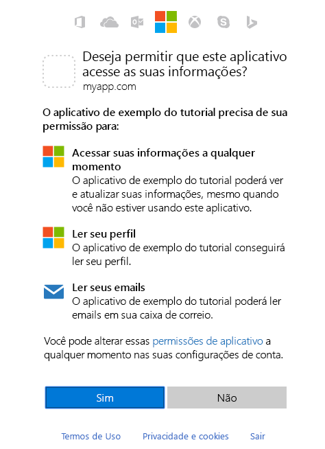

# <a name="get-access-on-behalf-of-a-user"></a>Obter acesso em nome de um usuário

Para usar o Microsoft Graph para ler e gravar recursos em nome de um usuário, seu aplicativo deve obter um token de acesso da plataforma de identidade da Microsoft e anexá-lo às solicitações que ele envia para o Microsoft Graph. O fluxo de autenticação exato que você usará para obter tokens de acesso dependerá do tipo de aplicativo que você está desenvolvendo e se você deseja usar o OpenID Connect para conectar o usuário ao aplicativo. O fluxo de concessão de código de autorização do OAuth 2.0 é um fluxo comum usado por aplicativos nativos e móveis e também por alguns aplicativos Web. Este tópico analisa um exemplo de uso desse fluxo.

## <a name="authentication-and-authorization-steps"></a>Etapas de Autenticação e Autorização

As etapas básicas necessárias para usar o fluxo de concessão de código de autorização do OAuth 2.0 para obter um token de acesso do ponto de extremidade da plataforma de identidade da Microsoft são:

1. Registre seu aplicativo com o Azure AD.
2. Obtenha autorização.
3. Obtenha um token de acesso.
4. Chame o Microsoft Graph usando o token de acesso.
5. Use um token de atualização para obter um novo token de acesso.

## <a name="1-register-your-app"></a>1. Registre seu aplicativo

Para usar o ponto de extremidade da plataforma de identidade da Microsoft, você deve registrar seu aplicativo no [Portal de Registro de Aplicativos](https://go.microsoft.com/fwlink/?linkid=2083908) do Azure. Você pode usar uma conta da Microsoft ou uma conta corporativa ou de estudante para registrar em aplicativo.

Para configurar um aplicativo para usar o fluxo de concessão do código de autorização do OAuth 2.0, salve os seguintes valores quando registrar o aplicativo:

- A ID do Aplicativo (cliente) atribuída pelo portal de registro do aplicativo.
- Um Segredo de Cliente (aplicativo), uma senha ou um par de chaves públicas/privadas (certificado). Isso não é necessário para aplicativos nativos.
- Uma URL de redirecionamento (ou URL de resposta) para seu aplicativo receber respostas do Azure AD.

Para saber como configurar um aplicativo no portal do Azure, confira [Registrar seu aplicativo](./auth-register-app-v2.md).

## <a name="2-get-authorization"></a>2. Obter autorização

A primeira etapa para obter acesso a um token para muitos fluxos do OpenID Connect e do OAuth 2.0 é redirecionar o usuário para o ponto de extremidade `/authorize` da plataforma de identidade da Microsoft. O Azure AD conectará o usuário e garantirá seu consentimento para as permissões solicitadas pelo seu aplicativo. No fluxo de concessão do código de autorização, depois de obter o consentimento, o Microsoft Azure AD retornará um authorization_code para o aplicativo que pode resgatá-lo no ponto de extremidade `/token` da plataforma de identidade da Microsoft para obter um token de acesso.

### <a name="authorization-request"></a>Solicitação de autorização

Veja a seguir um exemplo de solicitação para o ponto de extremidade `/authorize`.

Com o ponto de extremidade da plataforma de identidade da Microsoft, as permissões são solicitadas usando o parâmetro `scope`. Neste exemplo, as permissões do Microsoft Graph solicitadas são para _User.Read_ e _Mail.Read_, o que permitirá que o aplicativo leia o perfil e o email do usuário conectado. A permissão _offline\_ access_ é solicitada para que o aplicativo possa obter um token de atualização que pode ser usado para obter um novo token de acesso quando o atual expirar.

```
// Line breaks for legibility only

https://login.microsoftonline.com/{tenant}/oauth2/v2.0/authorize?
client_id=6731de76-14a6-49ae-97bc-6eba6914391e
&response_type=code
&redirect_uri=http%3A%2F%2Flocalhost%2Fmyapp%2F
&response_mode=query
&scope=offline_access%20user.read%20mail.read
&state=12345
```

| Parâmetro     | Obrigatório    | Descrição                                                                                                                                                                                                                                                                                                                                                                                                                                                                                             |
|---------------|-------------|---------------------------------------------------------------------------------------------------------------------------------------------------------------------------------------------------------------------------------------------------------------------------------------------------------------------------------------------------------------------------------------------------------------------------------------------------------------------------------------------------------|
| locatário        | obrigatório    | O valor `{tenant}` no caminho da solicitação pode ser usado para controlar quem pode entrar no aplicativo.  Os valores permitidos são `common` para contas da Microsoft e contas corporativas ou de estudante, `organizations` apenas para contas corporativas ou de estudante, `consumers` apenas para contas da Microsoft e identificadores de locatários, como a ID do locatário ou o nome do domínio.  Para obter mais detalhes, confira [Noções básicas de protocolo](/azure/active-directory/develop/active-directory-v2-protocols#endpoints). |
| client_id     | obrigatório    | A ID do Aplicativo atribuída ao seu aplicativo no [portal de registro](https://go.microsoft.com/fwlink/?linkid=2083908).                                                                                                                                                                                                                                                                                                                                                                                   |
| response_type | obrigatório    | Pode incluir `code` para o fluxo do código de autorização.                                                                                                                                                                                                                                                                                                                                                                                                                                                    |
| redirect_uri  | recomendado | A redirect_uri de seu aplicativo, onde as respostas de autenticação podem ser enviadas e recebidas pelo seu aplicativo.  Ela deve corresponder exatamente a uma das redirect_uris registradas no portal de registro de aplicativos, exceto que ela deve ser codificada por URL.  Para aplicativos nativos e móveis, você deve usar o valor padrão de `https://login.microsoftonline.com/common/oauth2/nativeclient`.                                                                                                                                       |
| escopo         | obrigatório    | Uma lista separada por espaços das permissões do Microsoft Graph que você deseja que o usuário concorde. O escopo `offline_access` indica que seu aplicativo precisa de um token de atualização para um acesso de longa duração aos recursos. Você também pode incluir escopos do OpenID.                                                                                                                                                                                                                                                                                                                                                                  |
| response_mode | recomendado | Especifica o método que deve ser usado para enviar o token resultante de volta para seu aplicativo.  Pode ser `query` ou `form_post`.                                                                                                                                                                                                                                                                                                                                                                                  |
| estado         | recomendado | Um valor incluído na solicitação que também será retornado na resposta do token.  Pode ser uma cadeia de caracteres de qualquer conteúdo desejado.  Um valor exclusivo gerado aleatoriamente é tipicamente usado para [impedir ataques de solicitação entre sites forjada](https://tools.ietf.org/html/rfc6749#section-10.12).  O estado também é usado para codificar as informações sobre o estado do usuário no aplicativo antes da solicitação de autenticação ter ocorrido, como a página ou o modo de exibição em que ele estava.                                     |

> **Importante**: O Microsoft Graph expõe dois tipos de permissões: delegada e de aplicativo. No caso de aplicativos que são executados com um usuário conectado, solicite Permissões Delegadas no parâmetro `scope`. Essas permissões delegam os privilégios do usuário conectado ao seu aplicativo, permitindo que ele atue como o usuário conectado ao fazer chamadas para o Microsoft Graph. Para obter mais informações sobre as permissões disponíveis por meio do Microsoft Graph, confira a [Referência de permissões](./permissions-reference.md).

### <a name="consent-experience"></a>Experiência de consentimento

Neste ponto, o usuário será solicitado a inserir suas credenciais para autenticar no Microsoft. O ponto de extremidade v2.0 da plataforma de identidade da Microsoft também garantirá que o usuário consinta com as permissões indicadas no parâmetro de consulta `scope`. Se o usuário não consentir com nenhuma dessas permissões e se um administrador não tiver consentido anteriormente em nome de todos os usuários na organização, ele será solicitado a concordar com as permissões necessárias.

O exemplo a seguir mostra a caixa de diálogo de consentimento apresentada para uma conta de usuário da Microsoft.



> **Experimente** Se você tiver uma conta da Microsoft ou uma conta corporativa ou de estudante do Azure, experimente clicando no link a seguir. Depois de entrar, seu navegador deverá ser redirecionado para `https://localhost/myapp/` com um `code` na barra de endereços.
>
> <a href="https://login.microsoftonline.com/common/oauth2/v2.0/authorize?client_id=6731de76-14a6-49ae-97bc-6eba6914391e&response_type=code&redirect_uri=http%3A%2F%2Flocalhost%2Fmyapp%2F&response_mode=query&scope=offline_access%20user.read%20mail.read&state=12345" target="_blank">https://login.microsoftonline.com/common/oauth2/v2.0/authorize...</a>

### <a name="authorization-response"></a>Resposta da autorização

Se o usuário concordar com as permissões que seu aplicativo solicitou, a resposta conterá o código de autorização no parâmetro `code`. Veja um exemplo de uma resposta à solicitação anterior. Como o parâmetro `response_mode` na solicitação foi definido como `query`, a resposta é retornada na cadeia de caracteres da consulta da URL de redirecionamento.

```
GET https://localhost/myapp/?
code=M0ab92efe-b6fd-df08-87dc-2c6500a7f84d
&state=12345
```

| Parâmetro | Descrição                                                                                                                                                                                                                        |
|-----------|------------------------------------------------------------------------------------------------------------------------------------------------------------------------------------------------------------------------------------|
| código      | O authorization_code que o aplicativo solicitou. O aplicativo pode usar o código de autorização para solicitar um token de acesso para o recurso de destino.  Os authorization_codes têm períodos de duração muito curtos, geralmente eles expiram após cerca de 10 minutos. |
| estado     | Se um parâmetro de estado estiver incluído na solicitação, o mesmo valor deverá aparecer na resposta. O aplicativo deve verificar se os valores de estado na solicitação e na resposta são idênticos.                                              |

## <a name="3-get-a-token"></a>3. Obtenha um token

Seu aplicativo usa a autorização `code` recebida na etapa anterior para solicitar um token de acesso enviando uma solicitação `POST` para o ponto de extremidade `/token`.

### <a name="token-request"></a>Solicitação de token

```
// Line breaks for legibility only

POST /{tenant}/oauth2/v2.0/token HTTP/1.1
Host: https://login.microsoftonline.com
Content-Type: application/x-www-form-urlencoded

client_id=6731de76-14a6-49ae-97bc-6eba6914391e
&scope=user.read%20mail.read
&code=OAAABAAAAiL9Kn2Z27UubvWFPbm0gLWQJVzCTE9UkP3pSx1aXxUjq3n8b2JRLk4OxVXr...
&redirect_uri=http%3A%2F%2Flocalhost%2Fmyapp%2F
&grant_type=authorization_code
&client_secret=JqQX2PNo9bpM0uEihUPzyrh    // NOTE: Only required for web apps
```

| Parâmetro     | Obrigatório              | Descrição                                                                                                                                                                                                                                                                                                                                                                                                                                                                                             |
|---------------|-----------------------|---------------------------------------------------------------------------------------------------------------------------------------------------------------------------------------------------------------------------------------------------------------------------------------------------------------------------------------------------------------------------------------------------------------------------------------------------------------------------------------------------------|
| locatário        | obrigatório              | O valor `{tenant}` no caminho da solicitação pode ser usado para controlar quem pode entrar no aplicativo.  Os valores permitidos são `common` para contas da Microsoft e contas corporativas ou de estudante, `organizations` apenas para contas corporativas ou de estudante, `consumers` apenas para contas da Microsoft e identificadores de locatários, como a ID do locatário ou o nome do domínio.  Para obter mais detalhes, confira [Noções básicas de protocolo](/azure/active-directory/develop/active-directory-v2-protocols#endpoints). |
| client_id     | obrigatório              | A ID do Aplicativo atribuída ao seu aplicativo no [portal de registro)](https://go.microsoft.com/fwlink/?linkid=2083908).                                                                                                                                                                                                                                                                                                                                                                                  |
| grant_type    | obrigatório              | Deve ser `authorization_code` para o fluxo de código de autorização.                                                                                                                                                                                                                                                                                                                                                                                                                                           |
| escopo         | obrigatório              | Uma lista de escopos separada por espaços.  Os escopos solicitados nesta etapa devem ser equivalentes ou ser um subconjunto dos escopos solicitados na primeira etapa (autorização).  Se os escopos especificados nesta solicitação abrangerem vários servidores de recursos, o ponto de extremidade v2.0 retornará um token para o recurso especificado no primeiro escopo.                                                                                                                                                                      |
| código          | obrigatório              | O authorization_code adquirido na primeira etapa do fluxo.                                                                                                                                                                                                                                                                                                                                                                                                                                  |
| redirect_uri  | obrigatório              | O mesmo valor do redirect_uri que foi usado para adquirir o authorization_code.                                                                                                                                                                                                                                                                                                                                                                                                                            |
| client_secret | obrigatório para aplicativos Web | O segredo do aplicativo que você criou no portal de registro de aplicativos para seu aplicativo.  Ele não deve ser usado em um aplicativo nativo já que a permissão client_secrets não pode ser confiavelmente armazenada em dispositivos.  É obrigatório para aplicativos Web e APIs da Web que têm a capacidade de armazenar a permissão client_secret em segurança no lado do servidor.                                                                                                                                                                                     |

### <a name="token-response"></a>Resposta do token

Embora o token de acesso seja opaco para o aplicativo, a resposta contém uma lista das permissões para as quais o token de acesso servirá no parâmetro `scope`.

```json
{
    "token_type": "Bearer",
    "scope": "user.read%20Fmail.read",
    "expires_in": 3600,
    "access_token": "eyJ0eXAiOiJKV1QiLCJhbGciOiJSUzI1NiIsIng1dCI6Ik5HVEZ2ZEstZnl0aEV1Q...",
    "refresh_token": "AwABAAAAvPM1KaPlrEqdFSBzjqfTGAMxZGUTdM0t4B4..."
}
```

| Parâmetro     | Descrição                                                                                                                                                                                                                                                                                                                                                                                  |
|---------------|----------------------------------------------------------------------------------------------------------------------------------------------------------------------------------------------------------------------------------------------------------------------------------------------------------------------------------------------------------------------------------------------|
| token_type    | Indica o valor de tipo de token. O único tipo a que o Azure AD dá suporte é o token de portador.                                                                                                                                                                                                                                                                                                              |
| scope         | Uma lista separada por espaços das permissões do Microsoft Graph para as quais o access_token é válido.                                                                                                                                                                                                                                                                                                |
| expires_in    | Por quanto tempo o token de acesso é válido (em segundos).                                                                                                                                                                                                                                                                                                                                             |
| access_token  | O token de acesso solicitado. Seu aplicativo pode usar esse token para chamar o Microsoft Graph.                                                                                                                                                                                                                                                                                                             |
| refresh_token | Um token de atualização OAuth 2.0. Seu aplicativo poderá usar este token para adquirir tokens de acesso adicionais depois que o token de acesso atual expirar.  Os tokens de atualização são de longa duração e podem ser usados para manter o acesso aos recursos por longos períodos de tempo.  Confira mais detalhes na [referência de token v2.0](/azure/active-directory/develop/active-directory-v2-tokens). |

## <a name="4-use-the-access-token-to-call-microsoft-graph"></a>4. Use o token de acesso para chamar o Microsoft Graph

Após obter o token de acesso, você pode usá-lo para chamar o Microsoft Graph, incluindo-o no cabeçalho `Authorization` de uma solicitação. A solicitação a seguir obtém o perfil do usuário conectado.

```
GET https://graph.microsoft.com/v1.0/me
Authorization: Bearer eyJ0eXAiO ... 0X2tnSQLEANnSPHY0gKcgw
Host: graph.microsoft.com

```

Uma resposta bem-sucedida terá a seguinte aparência (alguns cabeçalhos de resposta foram removidos).

```
HTTP/1.1 200 OK
Content-Type: application/json;odata.metadata=minimal;odata.streaming=true;IEEE754Compatible=false;charset=utf-8
request-id: f45d08c0-6901-473a-90f5-7867287de97f
client-request-id: f45d08c0-6901-473a-90f5-7867287de97f
OData-Version: 4.0
Duration: 727.0022
Date: Thu, 20 Apr 2017 05:21:18 GMT
Content-Length: 407

{
    "@odata.context":"https://graph.microsoft.com/v1.0/$metadata#users/$entity",
    "id":"12345678-73a6-4952-a53a-e9916737ff7f",
    "businessPhones":[
        "+1 555555555"
    ],
    "displayName":"Chris Green",
    "givenName":"Chris",
    "jobTitle":"Software Engineer",
    "mail":null,
    "mobilePhone":"+1 5555555555",
    "officeLocation":"Seattle Office",
    "preferredLanguage":null,
    "surname":"Green",
    "userPrincipalName":"ChrisG@contoso.onmicrosoft.com"
}
```

## <a name="5-use-the-refresh-token-to-get-a-new-access-token"></a>5. Use um token de atualização para obter um novo token de acesso

Os tokens de acesso têm curta duração e você deve atualizá-los após a expiração para continuar acessando os recursos.  Isso pode ser feito enviando outra solicitação `POST` ao ponto de extremidade `/token`, dessa vez fornecendo o `refresh_token` em vez do `code`.

### <a name="request"></a>Solicitação

```
// Line breaks for legibility only

POST /common/oauth2/v2.0/token HTTP/1.1
Host: https://login.microsoftonline.com
Content-Type: application/x-www-form-urlencoded

client_id=6731de76-14a6-49ae-97bc-6eba6914391e
&scope=user.read%20mail.read
&refresh_token=OAAABAAAAiL9Kn2Z27UubvWFPbm0gLWQJVzCTE9UkP3pSx1aXxUjq...
&redirect_uri=http%3A%2F%2Flocalhost%2Fmyapp%2F
&grant_type=refresh_token
&client_secret=JqQX2PNo9bpM0uEihUPzyrh      // NOTE: Only required for web apps
```

| Parâmetro     | Obrigatório              | Descrição                                                                                                                                                                                                                                                                                                         |
|---------------|-----------------------|---------------------------------------------------------------------------------------------------------------------------------------------------------------------------------------------------------------------------------------------------------------------------------------------------------------------|
| client_id     | obrigatório              | A ID do Aplicativo atribuída ao seu aplicativo no [portal de registro](https://go.microsoft.com/fwlink/?linkid=2083908).                                                                                                                                                                                               |
| grant_type    | obrigatório              | Deve ser `refresh_token`.                                                                                                                                                                                                                                                                                            |
| escopo         | obrigatório              | Uma lista de permissões (escopos) separada por espaços.  As permissões solicitadas devem ser equivalentes ou ser um subconjunto das permissões solicitadas na solicitação original do authorization_code.                                                                                                                               |
| refresh_token | obrigatório              | O refresh_token adquirido durante a solicitação do token.                                                                                                                                                                                                                                                       |
| redirect_uri  | obrigatório              | O mesmo valor do redirect_uri que foi usado para adquirir o authorization_code.                                                                                                                                                                                                                                        |
| client_secret | obrigatório para aplicativos Web | O segredo do aplicativo que você criou no portal de registro de aplicativos para seu aplicativo.  Ele não deve ser usado em um aplicativo nativo já que a permissão client_secrets não pode ser confiavelmente armazenada em dispositivos.  É obrigatório para aplicativos Web e APIs da Web que têm a capacidade de armazenar a permissão client_secret em segurança no lado do servidor. |

### <a name="response"></a>Resposta

Uma resposta de token bem-sucedida será semelhante ao seguinte.

```
{
    "access_token": "eyJ0eXAiOiJKV1QiLCJhbGciOiJSUzI1NiIsIng1dCI6Ik5HVEZ2ZEstZnl0aEV1Q...",
    "token_type": "Bearer",
    "expires_in": 3599,
    "scope": "user.read%20mail.read",
    "refresh_token": "AwABAAAAvPM1KaPlrEqdFSBzjqfTGAMxZGUTdM0t4B4...",
}
```
| Parâmetro     | Descrição                                                                                                                                                                        |
|---------------|------------------------------------------------------------------------------------------------------------------------------------------------------------------------------------|
| access_token  | O token de acesso solicitado. O aplicativo pode usar esse token em chamadas para o Microsoft Graph.                                                                                                |
| token_type    | Indica o valor de tipo de token. O único tipo a que o Azure AD dá suporte é o token de portador                                                                                                     |
| expires_in    | Por quanto tempo o token de acesso é válido (em segundos).                                                                                                                                   |
| escopo         | As permissões (escopos) para as quais o access_token é válido.                                                                                                                       |
| refresh_token | Um novo token de atualização OAuth 2.0. Você deve substituir o token de atualização antigo por este token de atualização recém-adquirido para garantir que seus tokens de atualização permaneçam válidos pelo maior tempo possível. |

## <a name="supported-app-scenarios-and-additional-resources"></a>Recursos adicionais e cenários de aplicativo com suporte

Você pode chamar o Microsoft Graph em nome de um usuário a partir dos seguintes tipos de aplicativos:

- [Aplicativos Nativos/Móveis](/azure/active-directory/develop/scenario-mobile-overview)
- [Aplicativos Web](/azure/active-directory/develop/scenario-web-app-call-api-overview)
- [Aplicativos de página única (SPA)](/azure/active-directory/develop/scenario-spa-overview)
- [APIs da Web de back-end](/azure/active-directory/develop/scenario-web-app-call-api-overview): por exemplo, em cenários em que um aplicativo cliente, como um aplicativo nativo, implementa funcionalidade em um back-end de API da Web. Com o ponto de extremidade da plataforma de identidade da Microsoft, o aplicativo cliente e a API da Web de back-end devem ter a mesma ID de Aplicativo.

Para saber mais sobre os cenários de aplicativo compatíveis com o ponto de extremidade da plataforma de identidade da Microsoft, consulte [Cenários de aplicativo e fluxos de autenticação](/azure/active-directory/develop/authentication-flows-app-scenarios).

> **Observação**: Chamar o Microsoft Graph a partir de uma API da Web autônoma atualmente não tem suporte do ponto de extremidade da plataforma de identidade da Microsoft. Nesse cenário, você precisa usar o ponto de extremidade do Azure AD.

Para obter mais informações sobre como obter acesso ao Microsoft Graph em nome de um usuário a partir do ponto de extremidade da plataforma de identidade da Microsoft:

- Para obter links para documentação de protocolos e artigos de introdução a diferentes tipos de aplicativos, confira a [Documentação do ponto de extremidade da plataforma de identidade da Microsoft](/azure/active-directory/develop/active-directory-appmodel-v2-overview).
- Para obter explicações detalhadas sobre os tipos de aplicativo e os fluxos de autenticação compatíveis, confira [tipos de aplicativo v2.0](/azure/active-directory/develop/v2-app-types).
- Para obter mais informações sobre o middleware de servidor e bibliotecas de autenticação recomendadas da Microsoft e de terceiros da plataforma de identidade da Microsoft, confira as [bibliotecas de autenticação do Azure Active Directory v2.0](/azure/active-directory/develop/active-directory-v2-libraries).

## <a name="endpoint-considerations"></a>Considerações sobre o ponto de extremidade

A Microsoft continua oferecendo suporte ao ponto de extremidade do Azure AD. Existem [várias diferenças](/azure/active-directory/develop/azure-ad-endpoint-comparison) entre a utilização do ponto de extremidade da plataforma de identidade da Microsoft e o ponto de extremidade do Azure AD. Durante o uso do ponto de extremidade do Azure AD:

- O aplicativo exigirá uma ID de aplicativo diferente (ID do cliente) para cada plataforma.
- Se o aplicativo for um aplicativo multilocatário, você deve configurá-lo explicitamente para funcionar como multilocatário no [portal do Azure](https://portal.azure.com).
- Todas as permissões de que seu aplicativo precisa devem ser configuradas pelo desenvolvedor. O ponto de extremidade do Microsoft Azure Active Directory não oferece suporte ao consentimento dinâmico (incremental).
- O ponto de extremidade do Azure AD usa um parâmetro `resource` em solicitações de autorização e de token para especificar o recurso, como o Microsoft Graph, para o qual ele deseja permissões. O ponto de extremidade não é compatível com o parâmetro `scope`.
- O ponto de extremidade do Azure AD não expõe um ponto de extremidade específico para o consentimento do administrador. Em vez disso, os aplicativos usam o parâmetro `prompt=admin_consent` na solicitação de autorização para obter o consentimento do administrador para uma organização. Para obter mais informações, confira **Como acionar a estrutura do consentimento do Azure AD no tempo de execução** no artigo [Integração de aplicativos com o Azure Active Directory](/azure/active-directory/develop/active-directory-integrating-applications).

Para obter mais informações sobre como obter acesso ao Microsoft Graph em nome de um usuário a partir do ponto de extremidade do Azure AD:

- Para saber mais sobre o ponto de extremidade da plataforma de identidade da Microsoft com diferentes tipos de aplicativos, confira os links de **Introdução** na [documentação de desenvolvedor da plataforma de identidade da Microsoft](/azure/active-directory/develop/active-directory-developers-guide). A documentação contém links para tópicos de visão geral, guias de início rápido, tutoriais, exemplos de código e documentação de protocolo para diferentes tipos de aplicativos compatíveis com o ponto de extremidade da plataforma de identidade da Microsoft.
- Para saber mais sobre a MSAL (Biblioteca de Autenticação da Microsoft) e o middleware de servidor disponíveis para uso com o ponto de extremidade da plataforma de identidade da Microsoft, confira [Bibliotecas de Autenticação da Microsoft](/azure/active-directory/develop/msal-overview).

## <a name="see-also"></a>Confira também

- Para obter um exemplo de um aplicativo Web hospedado no Serviço de Aplicativo do Azure chamando o Microsoft Graph como o usuário, confira [Tutorial: acesse o Microsoft Graph de um aplicativo seguro como o usuário](/azure/app-service/scenario-secure-app-access-microsoft-graph-as-user). Aprenda como conceder permissões delegadas a um aplicativo da web, configurar o serviço de aplicativo para obter um token de acesso e chamar o Microsoft Graph de um aplicativo da web para um usuário conectado.
- Para exemplos de uso da plataforma de identidade da Microsoft para garantir diferentes tipos de aplicativos, confira [Exemplos de código da plataforma de identidade da Microsoft (ponto de extremidade v2.0)](/azure/active-directory/develop/sample-v2-code).