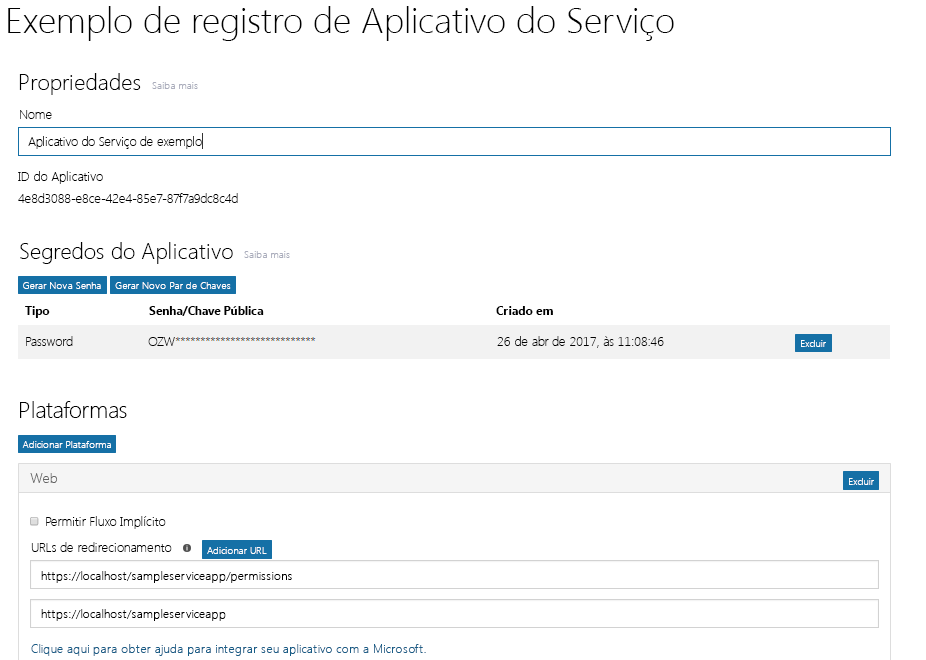
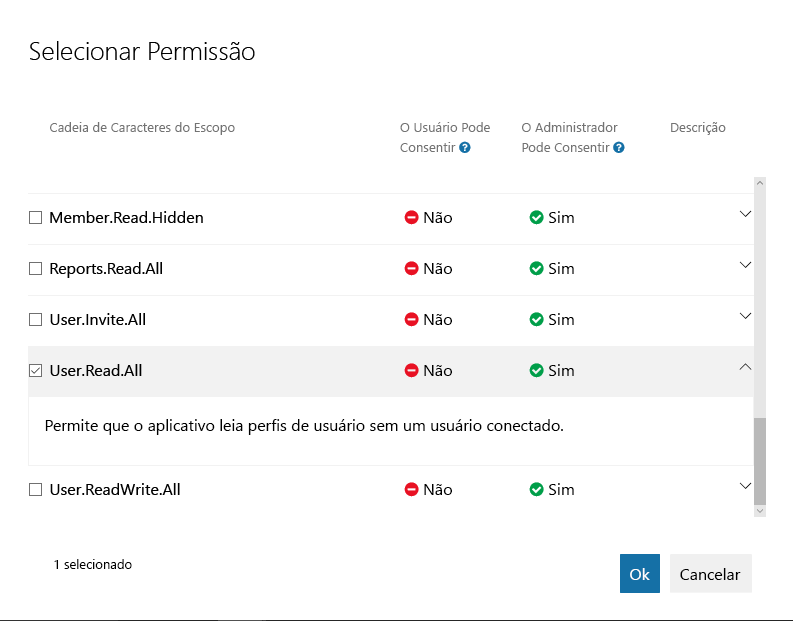

<a id="get-access-without-a-user" class="xliff"></a>

# Obter acesso sem um usuário
Alguns aplicativos são executados em um servidor sem um usuário presente. Esses tipos de aplicativos são normalmente chamados de serviços em segundo plano ou daemons. Um exemplo de como um aplicativo pode ser um serviço de arquivamento de email que é ativado e executado durante a noite. Os serviços em segundo plano normalmente usam o Fluxo de Concessão de Credenciais do Cliente OAuth 2.0 para obter tokens de acesso do Microsoft Azure AD. Neste tópico, vamos orientá-lo pelas etapas básicas para configurar um serviço em segundo plano e usar o Fluxo de Concessão de Credenciais do Cliente OAuth a fim de obter um token de acesso do Microsoft Azure AD para chamar o Microsoft Graph. 

<a id="authentication-and-authorization-steps" class="xliff"></a>

## Etapas de autenticação e autorização
As etapas básicas necessárias para autenticar um serviço em segundo plano e obter um token para o ponto de extremidade do Azure AD v2.0 para fazer chamadas para o Microsoft Graph são:

1. Registre seu aplicativo.
2. Configure permissões para o Microsoft Graph.
3. Obtenha o consentimento do administrador.
4. Obtenha um token de acesso.
5. Use o token de acesso para chamar o Microsoft Graph.

<a id="1-register-your-app" class="xliff"></a>

## 1. Registre seu aplicativo
Para autenticar com o ponto de extremidade do Azure v2.0, primeiro você deve registrar seu aplicativo no [Portal de Registro de Aplicativos da Microsoft](https://apps.dev.microsoft.com/). Você pode usar uma conta da Microsoft ou uma conta corporativa ou de estudante para registrar seu aplicativo 

A captura de tela a seguir mostra um registro do aplicativo Web que foi configurado para um serviço em segundo plano. 

Para um serviço em segundo plano, você precisa registrar seu aplicativo na plataforma da Web e copiar os seguintes valores:

- A ID do Aplicativo atribuída pelo portal de registro do aplicativo.
- Um Segredo do Aplicativo, que pode ser uma senha ou um par de chaves públicas/particulares (certificado).
- Uma URL de redirecionamento para seu serviço receber respostas do token do Azure AD.
- Uma URL de redirecionamento para seu serviço receber respostas de consentimento do administrador se seu aplicativo implementar a funcionalidade para solicitar o consentimento do administrador.  

Para obter etapas sobre como configurar um aplicativo usando o Portal de Registro de Aplicativos da Microsoft, confira [Registre seu aplicativo](./auth_register_app_v2.md).

Com o Fluxo de Concessão de Credenciais do Cliente OAuth 2.0, o aplicativo se autentica diretamente no ponto de extremidade `/token` do Microsoft Azure AD v2.0 usando a ID do Aplicativo atribuída pelo Microsoft Azure AD e o Segredo do Aplicativo que você cria usando o portal. 

<a id="2-configure-permissions-for-microsoft-graph" class="xliff"></a>

## 2. Configure permissões para o Microsoft Graph
No caso de aplicativos que são executados sem um usuário, o Microsoft Graph expõe Permissões de aplicativo. O Microsoft Graph também expõe as Permissões Delegadas para aplicativos que são executados em nome de um usuário. Configure previamente as Permissões de aplicativo necessárias quando registrar o aplicativo. As Permissões de aplicativo sempre exigem o consentimento do administrador. Um administrador pode autorizar essas permissões usando o [Portal do Azure](https://portal.azure.com) quando o aplicativo for instalado em sua organização ou pode fornecer uma experiência de inscrição em seu aplicativo por meio da qual os administradores podem concordar com as permissões configuradas. Depois que o consentimento do administrador for registrado pelo Azure AD, seu aplicativo poderá solicitar tokens sem ter que solicitar consentimento novamente. Para obter mais informações sobre as permissões disponibilizadas pelo Microsoft Graph, confira a [Referência de permissões](./permissions_reference.md)

Para configurar as Permissões de aplicativo para seu aplicativo no [Portal de Registro de Aplicativos da Microsoft](https://apps.dev.microsoft.com/), em **Microsoft Graph**, escolha **Adicionar** ao lado de **Permissões de aplicativo** e, em seguida, escolha as permissões exigidas pelo aplicativo na caixa de diálogo **Selecionar Permissões**.

A captura de tela a seguir mostra a caixa de diálogo **Selecionar Permissões** para Permissões de aplicativo do Microsoft Graph. 



> **Importante**: Recomendamos configurar o conjunto com menos privilégios de permissões necessárias para seu aplicativo. Isso proporciona uma experiência muito mais confortável para os administradores do que ter que consentir com uma longa lista de permissões.
>

<a id="3-get-administrator-consent" class="xliff"></a>

## 3. Obtenha o consentimento do administrador
Você pode confiar em um administrador para conceder as permissões que seu aplicativo precisa no [Portal do Azure](https://portal.azure.com). Entretanto, muitas vezes, a melhor opção seria fornecer uma experiência de inscrição para administradores usando o ponto de extremidade `/adminconsent` do Azure AD v2.0. 

<a id="request" class="xliff"></a>

### Solicitação
```
// Line breaks are for legibility only.

GET https://login.microsoftonline.com/{tenant}/adminconsent?
client_id=6731de76-14a6-49ae-97bc-6eba6914391e
&state=12345
&redirect_uri=http://localhost/myapp/permissions
```

| Parâmetro | Condição | Descrição |
| --- | --- | --- |
| locatário |Obrigatório |O locatário do diretório do qual você deseja solicitar permissão. Pode ser no formato de nome amigável ou GUID. Se você não souber a qual locatário o usuário pertence e quiser permitir que ele entre em qualquer locatário, use `common`. |
| client_id |Obrigatório |ID de Aplicativo que o [Portal de Registro de Aplicativos](https://apps.dev.microsoft.com/) atribuiu a seu aplicativo. |
| redirect_uri |Obrigatório |O URI de redirecionamento para onde você deseja que a resposta seja enviada para que o aplicativo trate da situação. Ele deve corresponder exatamente a um dos URIs de redirecionamento registrados no portal, exceto que ele deve ser codificado por URL e pode ter segmentos de caminho adicionais. |
| state |Recomendado |Um valor incluído na solicitação e que também será retornado na resposta do token. Pode ser uma cadeia de caracteres de qualquer conteúdo que você desejar. O estado é usado para codificar as informações sobre o estado do usuário no aplicativo antes da solicitação de autenticação ter ocorrido, como a página ou o modo de exibição em que ele estava. |

<a id="consent-experience" class="xliff"></a>

### Experiência de consentimento
O Azure AD exige que apenas um administrador de locatário possa fazer logon para concluir a solicitação. O administrador será solicitado a aprovar todas as Permissões de aplicativo que você solicitar para seu aplicativo no Portal de Registro de Aplicativos. Veja a seguir um exemplo da caixa de diálogo de consentimento que o Azure AD apresenta ao administrador:


<a id="response" class="xliff"></a>

### Resposta
Se o administrador aprovar as permissões de seu aplicativo, a resposta bem-sucedida ficará assim:

```
GET http://localhost/myapp/permissions?tenant=a8990e1f-ff32-408a-9f8e-78d3b9139b95&state=state=12345&admin_consent=True
```

| Parâmetro | Descrição |
| --- | --- |
| locatário |O locatário do diretório que concedeu as permissões de aplicativo solicitadas, no formato GUID. |
| state |Um valor incluído na solicitação e que também será retornado na resposta do token. Pode ser uma cadeia de caracteres de qualquer conteúdo que você desejar. O estado é usado para codificar as informações sobre o estado do usuário no aplicativo antes da solicitação de autenticação ter ocorrido, como a página ou o modo de exibição em que ele estava. |
| admin_consent |Definir como **true**. |


> **Experimente** Você pode experimentar ao colar a solicitação abaixo em um navegador. Se fizer logon como um Administrador global em um locatário do Azure AD, você verá a caixa de diálogo de consentimento do administrador para o aplicativo. (Este aplicativo será diferente do aplicativo exibido na tela de diálogo de consentimento mostrada acima.)
> 

```
https://login.microsoftonline.com/common/adminconsent?client_id=6731de76-14a6-49ae-97bc-6eba6914391e&state=12345&redirect_uri=http://localhost/myapp/permissions
```

<a id="4-get-an-access-token" class="xliff"></a>

## 4. Obter um token de acesso
No Fluxo de Concessão de Credenciais do Cliente OAuth 2.0, use os valores da ID do Aplicativo e o Segredo do aplicativo salvos quando você registrou o aplicativo para solicitar um token de acesso diretamente no ponto de extremidade `/token` do Microsoft Azure AD v2.0.

Você especifica as permissões pré-configuradas passando `https://graph.microsoft.com/.default` como o valor para o parâmetro `scope` na solicitação de token. Confira a descrição do parâmetro `scope` na solicitação de token abaixo para obter detalhes.

<a id="token-request" class="xliff"></a>

### Solicitação de token
Envie uma solicitação POST ao ponto de extremidade `/token` do v2.0 para adquirir um token de acesso:

```
POST /{tenant}/oauth2/v2.0/token HTTP/1.1
Host: login.microsoftonline.com
Content-Type: application/x-www-form-urlencoded

client_id=535fb089-9ff3-47b6-9bfb-4f1264799865&scope=https%3A%2F%2Fgraph.microsoft.com%2F.default&client_secret=qWgdYAmab0YSkuL1qKv5bPX&grant_type=client_credentials
```

| Parâmetro | Condição | Descrição |
| --- | --- | --- |
| locatário |Obrigatório |O locatário do diretório do qual você deseja solicitar permissão. Pode ser no formato de nome amigável ou GUID. |
| client_id |Obrigatório |A ID de Aplicativo que o [Portal de Registro de Aplicativos da Microsoft](https://apps.dev.microsoft.com) atribuiu quando você registrou seu aplicativo. |
| escopo |Obrigatório |O valor passado para o parâmetro `scope` nesta solicitação deve ser o identificador do recurso (URI da ID do Aplicativo) do recurso desejado, afixado com o sufixo `.default`. Para o Microsoft Graph, o valor é `https://graph.microsoft.com/.default`. Esse valor informa ao ponto de extremidade do Microsoft Azure ADv2.0 que, de todas as Permissões de aplicativo que você configurou para seu aplicativo, ele deve emitir um token para os aplicativos associados ao recurso que você deseja usar. |
| client_secret |Obrigatório |O Segredo do Aplicativo gerado para seu aplicativo no portal de registro de aplicativos. |
| grant_type |Obrigatório |Deve ser `client_credentials`. |

<a id="token-response" class="xliff"></a>

#### Resposta do token
Uma resposta bem-sucedida tem esta aparência:

```
{
  "token_type": "Bearer",
  "expires_in": 3599,
  "access_token": "eyJ0eXAiOiJKV1QiLCJhbGciOiJSUzI1NiIsIng1dCI6Ik1uQ19WWmNBVGZNNXBP..."
}
```

| Parâmetro | Descrição |
| --- | --- |
| access_token |O token de acesso solicitado. Seu aplicativo pode usar esse token em chamadas para o Microsoft Graph. |
| token_type |Indica o valor de tipo de token. O único tipo ao qual o Azure AD dá suporte é `bearer`. |
| expires_in |Por quanto tempo o token de acesso é válido (em segundos). |

<a id="5-use-the-access-token-to-call-microsoft-graph" class="xliff"></a>

## 5. Use o token de acesso para chamar o Microsoft Graph

Após obter o token de acesso, você pode usá-lo para chamar o Microsoft Graph, incluindo-o no cabeçalho `Authorization` de uma solicitação. A solicitação a seguir obtém o perfil de um usuário específico. Seu aplicativo deve ter a permissão _User.Read.All_ para chamar essa API.

```
GET https://graph.microsoft.com/v1.0/user/12345678-73a6-4952-a53a-e9916737ff7f 
Authorization: Bearer eyJ0eXAiO ... 0X2tnSQLEANnSPHY0gKcgw
Host: graph.microsoft.com

```
Uma resposta bem-sucedida terá a seguinte aparência (alguns cabeçalhos de resposta foram removidos):

```
HTTP/1.1 200 OK
Content-Type: application/json;odata.metadata=minimal;odata.streaming=true;IEEE754Compatible=false;charset=utf-8
request-id: f45d08c0-6901-473a-90f5-7867287de97f
client-request-id: f45d08c0-6901-473a-90f5-7867287de97f
OData-Version: 4.0
Duration: 309.0273
Date: Wed, 26 Apr 2017 19:53:49 GMT
Content-Length: 407

{
    "@odata.context":"https://graph.microsoft.com/v1.0/$metadata#users/$entity",
    "id":"12345678-73a6-4952-a53a-e9916737ff7f",
    "businessPhones":[
        "+1 555555555"
    ],
    "displayName":"Chris Green",
    "givenName":"Chris",
    "jobTitle":"Software Engineer",
    "mail":null,
    "mobilePhone":"+1 5555555555",
    "officeLocation":"Seattle Office",
    "preferredLanguage":null,
    "surname":"Green",
    "userPrincipalName":"ChrisG@contoso.onmicrosoft.com"
}
```

<a id="supported-app-scenarios-and-resources" class="xliff"></a>

## Recursos e cenários de aplicativo com suporte
Os serviços em segundo plano são executados em um servidor sem a presença de um usuário conectado e usam a Concessão de Credenciais do Cliente OAuth 2.0 para se autenticar no Microsoft Azure AD e obter um token. Para o ponto de extremidade do v2.0, você pode explorar esse cenário ainda mais com os seguintes recursos:

- Para ver um tratamento mais completo do Fluxo de Concessão de Credenciais do Cliente que também inclui respostas de erro, confira o artigo [Azure Active Directory v2.0 e o fluxo de Credenciais do Cliente OAuth 2.0](https://docs.microsoft.com/azure/active-directory/develop/active-directory-v2-protocols-oauth-client-creds). 
- Para obter um exemplo que chama o Microsoft Graph a partir de um serviço, confira o [exemplo do daemon v2.0](https://github.com/Azure-Samples/active-directory-dotnet-daemon-v2) no GitHub.
- Para obter mais informações sobre bibliotecas de autenticação recomendadas da Microsoft e de terceiros do Azure AD v2.0, confira as [bibliotecas de autenticação do Azure Active Directory v2.0](https://docs.microsoft.com/azure/active-directory/develop/active-directory-v2-libraries).

<a id="azure-ad-endpoint-considerations" class="xliff"></a>

## Considerações sobre o ponto de extremidade do Azure AD
Se você estiver usando o ponto de extremidade do Azure AD, existem algumas diferenças na maneira de configurar seu aplicativo e a maneira de conectá-lo ao Azure AD:

- Você usa o [Portal do Azure](https://portal.azure.com) para configurar seu aplicativo. Para obter mais informações sobre como configurar aplicativos com o Portal do Azure, confira [Integração de aplicativos com o Azure Active Directory: Como adicionar um aplicativo](https://docs.microsoft.com/azure/active-directory/develop/active-directory-integrating-applications#adding-an-application)
- Se o aplicativo for um aplicativo multilocatário, você deve configurá-lo explicitamente para funcionar como vários locatários no [Portal do Azure](https://portal.azure.com).
- Não há um ponto de extremidade de consentimento do administrador (`/adminconsent`), em vez disso, o aplicativo pode solicitar o consentimento do administrador durante o tempo de execução adicionando o parâmetro `prompt=admin_consent` a uma solicitação de autorização. Para obter mais informações, confira **Como acionar a estrutura do consentimento do Azure AD no tempo de execução** no artigo [Integração de aplicativos com o Azure Active Directory](https://docs.microsoft.com/azure/active-directory/develop/active-directory-integrating-applications).
- Os parâmetros nas solicitações de token e de autorização são diferentes. Por exemplo, não existe um parâmetro `scope` nas solicitações do ponto de extremidade do Azure AD. Em vez disso, o parâmetro `resource` é usado para especificar o URI do recurso (`resource=https://graph.microsoft.com`) que a autorização (para consentimento do administrador) ou um token está solicitando.

Para o ponto de extremidade do Azure AD, você pode explorar esse cenário ainda mais com os seguintes recursos:

- Para obter links rápidos para uma visão geral, exemplos e um tratamento detalhado do fluxo de Concessão de Credenciais do Cliente, confira **Serviço a serviço**, na **seção de Introdução** da página [Azure Active Directory para desenvolvedores](https://docs.microsoft.com/azure/active-directory/develop/active-directory-developers-guide).
- Para o ponto de extremidade do AD do Azure, você pode usar a Biblioteca de Autenticação do Azure Active Directory (ADAL) para obter tokens do Azure AD. A ADAL está disponível para várias plataformas, incluindo .NET, iOS, Android, JavaScript, Java e Node.js. Para obter mais informações sobre a ADAL e outras bibliotecas de autenticação da Microsoft para o ponto de extremidade do Azure AD, confira as [Bibliotecas de Autenticação do Azure Active Directory](https://docs.microsoft.com/azure/active-directory/develop/active-directory-authentication-libraries). 

 