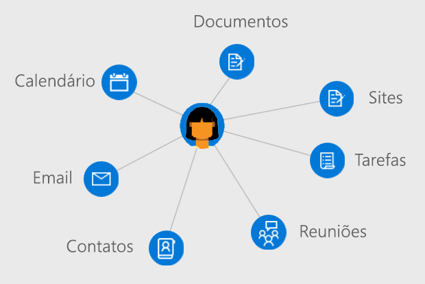

# Visão geral de usuários do Microsoft GraphOverview of users in Microsoft Graph

Os usuários são a representação de uma conta de usuário corporativa ou de estudante do Azure Active Directory (Azure AD) ou uma conta da Microsoft no Microsoft Graph.Users are the representation of an Azure Active Directory (Azure AD) work or school user account or a Microsoft account in Microsoft Graph. O recurso **usuário** no Microsoft Graph é um hub do qual você pode acessar as relações e os recursos que são relevantes para seus usuários.The **user** resource in Microsoft Graph is a hub from which you can access the relationships and resources that are relevant to your users.

## Desenvolva aplicativos centrados no usuárioDevelop user-centric applications

Você pode usar o Microsoft Graph para acessar relações, documentos, contatos e preferências contextualmente relevantes para o usuário conectado.You can use Microsoft Graph to access the relationships, documents, contacts, and preferences that are contextually relevant to the signed-in user. O recurso **usuário** oferece uma forma simples de acessar e manipular recursos do usuário sem precisar realizar chamadas adicionais, consultar informações de autenticação específicas e emitir consultas diretamente em outros recursos do Microsoft Graph.The **user** resource provides straightforward way for you to access and manipulate user resources without having to perform additional calls, look up specific authentication information, and directly issue queries against other Microsoft Graph resources.

Para acessar as informações e os dados de um usuário, será necessário [obter acesso em nome dele](auth-v2-user.md).To access a user's information and data, you'll need to [get access on their behalf](auth-v2-user.md). Autenticar seu aplicativo com o [consentimento do administrador](permissions-reference.md) permite que você trabalhe e atualize uma gama maior de entidades associadas a um usuário.Authenticating your application with [admin consent](permissions-reference.md) enables you to work with and update a wider range of entities associated with a user.

### Gerenciar sua organizaçãoManage your organization

Crie novos usuários em sua organização ou atualize os recursos e relações de usuários existentes.Create new users in your organization or update the resources and relationships for existing users. Você pode usar o Microsoft Graph para executar as seguintes tarefas de gerenciamento de usuários:You can use Microsoft Graph to perform the following user management tasks: 

- Criar ou excluir usuários em sua organização do Azure AD.Create or delete users in your Azure AD organization.
- Listar as associações de grupos de um usuário e determinar se um usuário é membro de um grupo.List a user's group memberships and determine whether a user is a member of a group.
- Listar os usuários subordinados a outro usuário e atribuir gerentes a um usuário.List the users who report to a user and assign managers to a user.
- Carregar ou recuperar uma foto do usuário.Upload or retrieve a photo for the user.

### Trabalhar com calendários e tarefasWork with calendars and tasks

Você pode exibir, consultar e atualizar grupos de calendários e calendários de usuários associados a um usuário, incluindo:You can view, query, and update user calendar and calendar groups associated with a user, including:

- Listar e criar eventos em um calendário de usuários.List and create events on a users calendar.
- Exibir tarefas atribuídas a um usuário.View tasks assigned to a user.
- Encontrar horários livres para reuniões para um conjunto de usuários.Find free meeting times for a set of users.
- Obter uma lista de lembretes definidos no calendário de um usuário.Get a list of reminders set on a user's calendar.

### Administrar o email e gerenciar contatosAdminister mail and handle contacts

Você pode definir as configurações de email do usuário e as listas de contatos, e enviar emails em nome de um usuário, incluindo:You can configure user mail settings and contact lists and send mail on a user's behalf, including:

- Listar mensagens de email e enviar novos emails.List mail messages and send new mail.
- Criar e listar contatos do usuário e organizar contatos em pastas.Create and list user contacts and organize contacts in folders.
- Recuperar e atualizar as configurações e as pastas de caixa de correio.Retrieve and update mailbox folders and settings.

### Aprimorar seu aplicativo com informações sobre o usuárioEnrich your app with user insights

Maximizar a relevância no aplicativo promovendo documentos e contatos mais populares ou usados recentemente associados a um usuário.Maximize relevance in your application by promoting recently used or trending documents and contacts associated with a user. Você pode usar o Microsoft Graph para:You can use Microsoft Graph to:

- Retornar documentos visualizados e modificados recentemente por um usuário.Return documents recently viewed and modified by a user.
- Retornar documentos e sites mais populares relacionados à atividade do usuário.Return documents and sites trending around a user's activity.
- Listar documentos compartilhados com um usuário por email ou pelo OneDrive for Business.List documents shared with a user through email or OneDrive for Business.

## Referência da APIAPI reference
Está procurando a referência de API para esse serviço?Looking for the API reference for this service?

- [API de Usuários no Microsoft Graph v1.0Users API in Microsoft Graph v1.0](/graph/api/resources/users?view=graph-rest-1.0)
- [API de Usuários no Microsoft Graph betaUsers API in Microsoft Graph beta](/graph/api/resources/users?view=graph-rest-beta)

## Próximas etapasNext steps

- Saiba mais sobre como [trabalhar com usuários](/graph/api/resources/users?view=graph-rest-1.0).Learn more about how to [work with users](/graph/api/resources/users?view=graph-rest-1.0).
- Explore seus próprios dados no recurso **usuário** no [Graph Explorer](https://developer.microsoft.com/graph/graph-explorer).Explore your own data from the **user** resource in the [Graph Explorer](https://developer.microsoft.com/graph/graph-explorer).
- Autentique com o Microsoft Graph [em nome de um usuário](auth-v2-user.md) ou [como um daemon ou serviço autorizado por um administrador](auth-v2-service.md).Authenticate with Microsoft Graph [on behalf of a user](auth-v2-user.md) or [as a daemon or service by consent of an administrator](auth-v2-service.md).
- Configure o controle de acesso e políticas para usuários com a [API do Azure AD](/graph/api/resources/azure-ad-overview?view=graph-rest-1.0).Set access control and policies for users with the [Azure AD API](/graph/api/resources/azure-ad-overview?view=graph-rest-1.0).
- Analise as [permissões](permissions-reference.md) que serão necessárias para o aplicativo acessar dados do usuário.Review the [permissions](permissions-reference.md) your app will need to access user data. 
<!-- This isn't really a next step; let's remove to keep the list of links concise.>
- Stay up to date with Microsoft Graph [changelog](changelog.md).
-->
