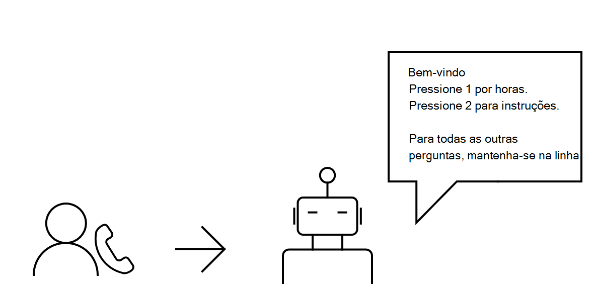
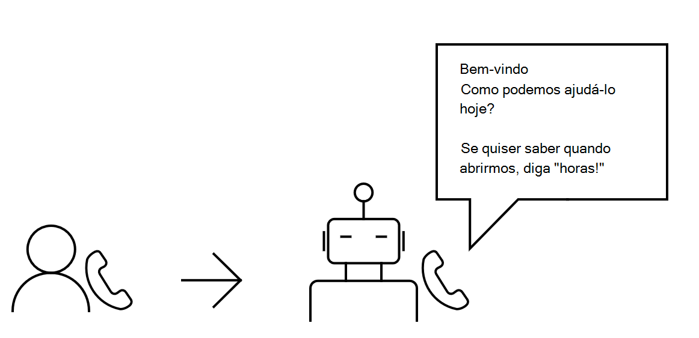

# Visão geral da API de comunicações na nuvem
As APIs de comunicações na nuvem na Microsoft Graph adicionar uma nova dimensão à forma como seus aplicativos e serviços interagem com os usuários por meio de vários recursos relacionados a comunicações, como chamada e reuniões online. Agilizar sua empresa, agilizando a forma como você responde às necessidades de seus clientes e como seus funcionários colaboram uns com os outros.

## Por que se integrar com as APIs de comunicações na nuvem?

Descubra os benefícios de usar APIs de comunicações na nuvem para criar aplicativos de serviço ([bots](https://microsoftgraph.github.io/microsoft-graph-comms-samples/docs/articles/calls/register-calling-bot.html?q=create%20bot)).

### Manipular chamadas de entrada

Pode ser avassalador às vezes quando os funcionários recebem muitas chamadas comerciais e não é possível, ou produtivo, atender a todas elas. Um bot pode servir como um assistente de front-desk e manipular essas chamadas rejeitando o que parece ser chamadas de spam e redirecionando (encaminhando) chamadas específicas para um número diferente.

Você pode usar as APIs de comunicações na nuvem para:

- Fazer com que um [usuário chame um bot](/graph/api/application-post-calls?view=graph-rest-1.0) por meio de VoIP.
- Fazer com que um bot [redirecione a chamada de](/graph/api/call-redirect?view=graph-rest-1.0) entrada para o agente apropriado, se necessário.
- Tenha uma resposta [de bot](/graph/api/call-answer?view=graph-rest-1.0) ou [rejeite](/graph/api/call-reject?view=graph-rest-1.0) a chamada.

### Simplificar a experiência de atendimento ao cliente
Se você possui um serviço de suporte técnico grande ou uma pequena frente de armazenamento, pode ser difícil lidar com várias solicitações de clientes, especialmente se você não tiver qualquer contexto do problema que eles estão tentando resolver antecipadamente. Manipular chamadas de entrada de clientes por meio de um sistema **IVR (Resposta** Interativa de Voz), onde um bot interagirá inicialmente com eles.

Quando um cliente é solicitado a uma resposta do bot, o cliente pode pressionar uma chave em seu teclado que corresponde à sua seleção. Em seguida, o bot pode coletar o DTMF (multifrequência de tom de discagem) do cliente.

Você pode usar as APIs de comunicações na nuvem para criar um bot que:

- [Atende a uma chamada](/graph/api/call-answer?view=graph-rest-1.0) de um cliente.
- [Reproduz um prompt para](/graph/api/call-playprompt?view=graph-rest-1.0) informar e solicitar uma seleção a um cliente.
- [Assina um tom para](/graph/api/call-subscribetotone?view=graph-rest-1.0) coletar o DTMF de um cliente.
- [Transfere um cliente](/graph/api/call-transfer?view=graph-rest-1.0) para um agente.
- [Termina uma chamada](/graph/api/call-delete?view=graph-rest-1.0) com um cliente.

Para criar uma interação mais inteligente entre seus clientes e seu bot, quando um cliente for solicitado a obter uma resposta, ele poderá falar diretamente sobre o que precisa de ajuda.

A integração com um serviço de processamento de linguagem natural significa que a fala do cliente pode ser analisada por seu sentimento. Em seguida, o bot pode responder à necessidade do cliente de acordo.

>**Observação:** Você pode não registrar ou persistir conteúdo de mídia de chamadas ou reuniões acessadas pelo aplicativo ou dados derivados desse conteúdo de mídia. Certifique-se de estar em conformidade com as leis e regulamentos de sua área em relação à proteção de dados e à confidencialidade das comunicações. Confira os [Termos de Uso](/legal/microsoft-apis/terms-of-use) e converse com sua assessoria jurídica para saber mais.

Você pode usar as APIs de comunicações na nuvem para criar um bot que:

- [Atende a uma chamada](/graph/api/call-answer?view=graph-rest-1.0) de um cliente.
- [Reproduz um prompt para](/graph/api/call-playprompt?view=graph-rest-1.0) informar e solicitar que o cliente fale.
- [Registra um curto clipe de áudio](/graph/api/call-record?view=graph-rest-1.0) de um cliente falando.
- [Reproduz um prompt](/graph/api/call-playprompt?view=graph-rest-1.0) com a resposta apropriada ao cliente, depois que sua fala é analisada.

### Colaborar por meio de chamadas de grupo
Permitir que os usuários se envolvam com colegas de trabalho ou clientes criando uma chamada de grupo para que todos possam contribuir para a conversa.

Você pode usar as APIs de comunicações na nuvem para criar um bot que:

- [Cria uma chamada de grupo](/graph/api/application-post-calls?view=graph-rest-1.0#example-3-create-a-group-call-with-service-hosted-media) com vários participantes.
- [Convida outro bot ou usuário para](/graph/api/participant-invite?view=graph-rest-1.0) uma chamada de grupo existente.
- [Insinte uma chamada de grupo existente](/graph/api/application-post-calls?view=graph-rest-1.0#example-5-join-scheduled-meeting-with-service-hosted-media) como um bot.
- [Lista os participantes](/graph/api/call-list-participants?view=graph-rest-1.0) da chamada de grupo.
- [Silencia outro participante](/graph/api/participant-mute?view=graph-rest-1.0).

### Enviar lembretes de forma confiável
Para permitir que os usuários enviem aos clientes um lembrete para um compromisso ou um lembrete para um prazo de pagamento que está se aproximando, você pode fazer com que um bot chame o cliente automaticamente. <!--If the customer misses the call, it will leave a voicemail with the automated message. (Add this back once bot to PSTN calling works)-->

Você pode usar as APIs de comunicações na nuvem para criar um bot que:

- [Chama um cliente](/graph/api/application-post-calls?view=graph-rest-1.0) no Teams.
- [Reproduz um prompt gravado](/graph/api/call-playprompt?view=graph-rest-1.0) para servir como um lembrete.
- [Termina a chamada](/graph/api/call-delete?view=graph-rest-1.0).

### Configurar reuniões online
Seja agendando uma reunião entre um médico e um paciente ou entre um usuário e seus relatórios diretos, você pode criar soluções que gerem reuniões em que os usuários possam confiar. Para maior flexibilidade, os usuários podem chamar outros usuários e convidá-los para a reunião enquanto ela está em andamento.

Você pode usar as APIs de comunicações na nuvem para:

- Fazer com que um [usuário crie uma reunião online.](/graph/api/application-post-onlinemeetings?view=graph-rest-1.0)
- Fazer com que um [usuário recupere os detalhes](/graph/api/onlinemeeting-get?view=graph-rest-1.0) de uma reunião online.
- Fazer com que um bot ou um usuário [participe de uma reunião online.](/graph/api/application-post-calls?view=graph-rest-1.0#example-5-join-scheduled-meeting-with-service-hosted-media)

## Referência da API
Está procurando a referência de API para esse serviço?

- [APIs de Comunicações na Nuvem no Microsoft Graph (v1.0)](/graph/api/resources/communications-api-overview?view=graph-rest-1.0)
- [APIs de Comunicações na Nuvem no Microsoft Graph (beta)](/graph/api/resources/communications-api-overview?view=graph-rest-beta)

## Próximas etapas

- Use bots para [começar](cloud-communications-get-started.md).
- Saiba mais sobre [chamadas,](cloud-communications-calls.md) [mídia](cloud-communications-media.md)e [reuniões online.](cloud-communications-online-meetings.md)
- Exibir os limites de uso [da](throttling.md#cloud-communication-service-limits)API.
- Saiba como gerenciar [números de telefone](cloud-communications-phone-number.md) para seus bots.

## Confira também

- [Permissões delegadas e de aplicativo](/azure/active-directory/develop/v1-permissions-and-consent)
- [Permissões de chamadas](./permissions-reference.md#calls-permissions)
- [Permissões de reunião online](./permissions-reference.md#online-meetings-permissions)
- [Exemplos de comunicações na nuvem](https://github.com/microsoftgraph/microsoft-graph-comms-samples)
