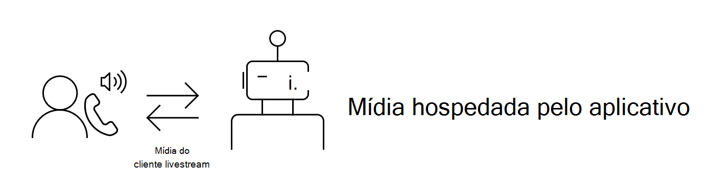

# Visão geral da mídia

As APIs de comunicações na nuvem na Microsoft Graph adicionar uma nova dimensão à forma como seus aplicativos e serviços interagem com os usuários por meio de vários recursos relacionados a comunicações, como chamada e reuniões online. Você pode permitir que seus bots enviem e recebam conteúdo relacionado a áudio e vídeo. Ao usar a mídia, você pode criar uma experiência mais interativa entre seus bots e usuários.

Este artigo ajudará você a descobrir qual opção de hospedagem de mídia é ideal para você com base em suas necessidades.

## Mídia hospedada pelo serviço (hospedagem remota)
Se você quiser que o bot reproduza um prompt personalizado quando um cliente disca o número da sua empresa ou para detectar tons de telefone, gravar clipes de voz curtos ou executar qualquer um dos vários cenários de[IVR](/graph/api/resources/calls-api-ivr-overview)(Resposta Interativa de Voz), considere usar as [APIs](/graph/api/resources/communications-api-overview)de mídia hospedadas pelo serviço.

**Se suas necessidades de mídia são mais simples, explore essa opção primeiro**. Como o processamento de mídia pesada é descarregado remotamente, essa é uma solução de peso mais leve que permite que você crie seu bot de uma maneira mais flexível.

For an example that shows you how to create a bot that uses service-hosted media, see the [Remote media calling bot samples](https://github.com/microsoftgraph/microsoft-graph-comms-samples/tree/master/Samples/V1.0Samples/RemoteMediaSamples).

## Mídia hospedada por aplicativo (hospedagem local)
Se você quiser que seu bot acesse um fluxo ao vivo de áudio e vídeo de seus clientes para usar para gravação, transcrição, tradução ou análise de sentimentos por meio de um serviço de processamento de linguagem natural, considere hospedar sua mídia localmente.

>**Observação:** Você  não pode usar a API do Media Access para gravar ou persistir conteúdo de mídia de chamadas ou reuniões que seu aplicativo acessa ou dados derivados desse conteúdo de mídia ("registro" ou "gravação"), sem chamar primeiro a [API updateRecordingStatus](/graph/api/call-updaterecordingstatus) para indicar que a gravação começou e receber uma resposta de sucesso dessa API. Se o aplicativo começar a gravar qualquer reunião/chamada, ele deverá encerrar a gravação antes de chamar a API updateRecordingStatus para indicar que a gravação terminou. Certifique-se de estar em conformidade com as leis e regulamentos de sua área em relação à proteção de dados e à confidencialidade das comunicações. Confira os [Termos de Uso](/legal/microsoft-apis/terms-of-use) e converse com sua assessoria jurídica para saber mais.

**Se você quiser mais controle sobre sua mídia, escolha esta opção**. Você terá acesso direto a fluxos de mídia e poderá usar o compartilhamento de tela baseado em vídeo. Você poderá criar cenários IVR mais sofisticados habilitados para fala. Esta é uma solução de peso mais pesada que oferece mais flexibilidade na forma como você deseja programar sua mídia.

Consulte também os [requisitos e considerações](/microsoftteams/platform/concepts/calls-and-meetings/requirements-considerations-application-hosted-media-bots) para bots de mídia hospedados pelo aplicativo.

Para um exemplo que mostra como criar um bot que usa mídia hospedada por aplicativo, consulte os [exemplos de mídia local](https://github.com/microsoftgraph/microsoft-graph-comms-samples/tree/master/Samples/V1.0Samples/LocalMediaSamples).

## Confira também

- [Permissões de chamadas](./permissions-reference.md#calls-permissions)
