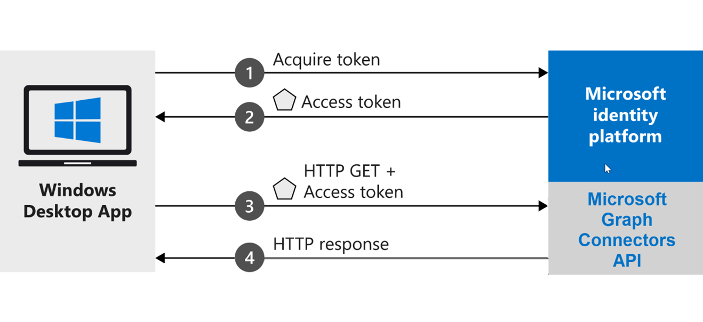

<!-- markdownlint-disable MD002 MD025 MD041 -->
<!--- # Introduction --->

Os conectores Graph Microsoft permitem que você adicione seus próprios dados ao Microsoft Graph e que ele acione várias Microsoft 365 experiências.

Este aplicativo .NET Core mostra como usar a API de conectores do Microsoft Graph para criar um conector de cliente e usá-lo para Pesquisa da Microsoft. Este tutorial usa um exemplo de inventário de partes de dispositivos de dados para a organização De reparo de dispositivos contoso.

## <a name="how-does-the-sample-work"></a>Como funciona o exemplo?

O exemplo cria um Windows da área de trabalho que adquire um token do plataforma de identidade da Microsoft e o usa para enviar solicitações para a API de conectores Graph Microsoft. A API de conectores enviará sua resposta depois que o acesso for validado.



## <a name="prerequisites"></a>Pré-requisitos

* Instale [Visual Studio 2019](https://visualstudio.microsoft.com/) com [o .NET Core 3.1 SDK](https://www.microsoft.com/net/download/core) em seu computador de desenvolvimento.
* Certifique-se de que você tenha uma [conta pessoal da Microsoft](https://signup.live.com/) ou uma conta de trabalho ou de estudante.
* Instale as [Ferramentas Principais da Estrutura de Entidades](/ef/core/miscellaneous/cli/dotnet) como uma ferramenta global usando o seguinte comando:

    ```dotnetcli
    dotnet tool install --global dotnet-ef
    ```

* Instale uma ferramenta para atualizar um banco de dados SQLite. Por exemplo, o [Navegador DB para SQLite](https://sqlitebrowser.org/).
* Baixe o **arquivoApplianceParts.csv** do [repo de exemplo do conector de pesquisa](https://github.com/microsoftgraph/msgraph-search-connector-sample/blob/master/PartsInventoryConnector/ApplianceParts.csv).

> [!TIP]
> A melhor maneira de baixar arquivos GitHub é ir para o nível superior do projeto. No botão de download **de código** verde à direita, escolha **Baixar ZIP**. O arquivo ZIP conterá o conteúdo do repositório.
