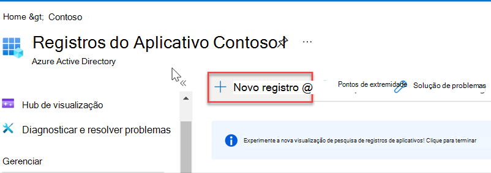
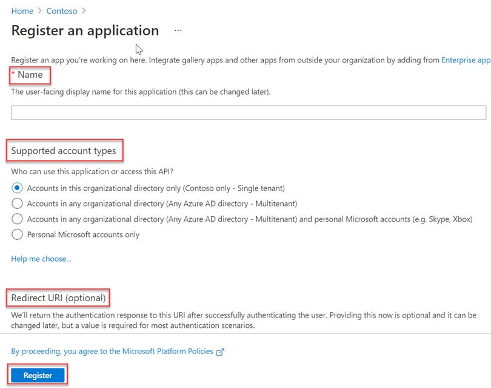
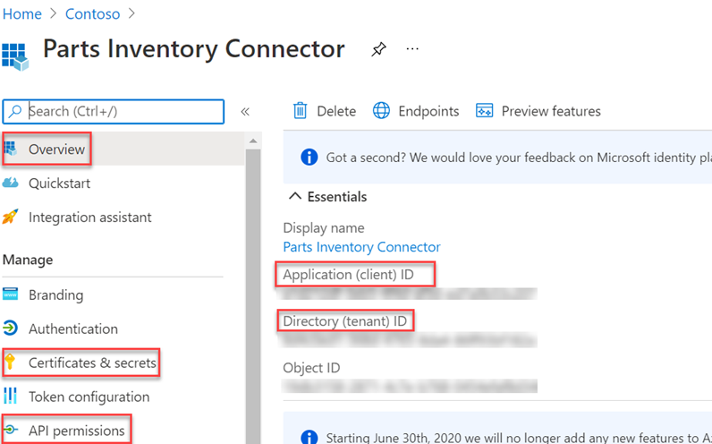
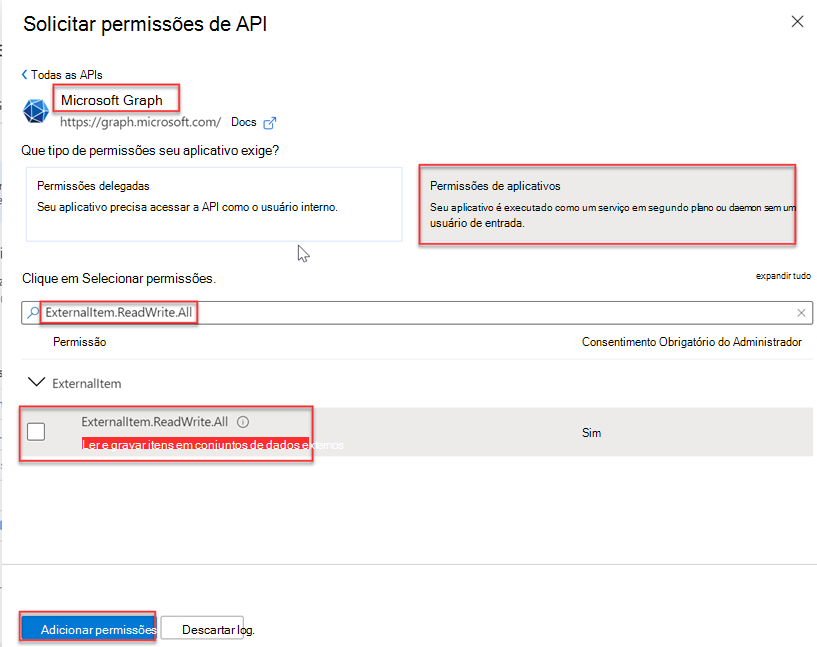
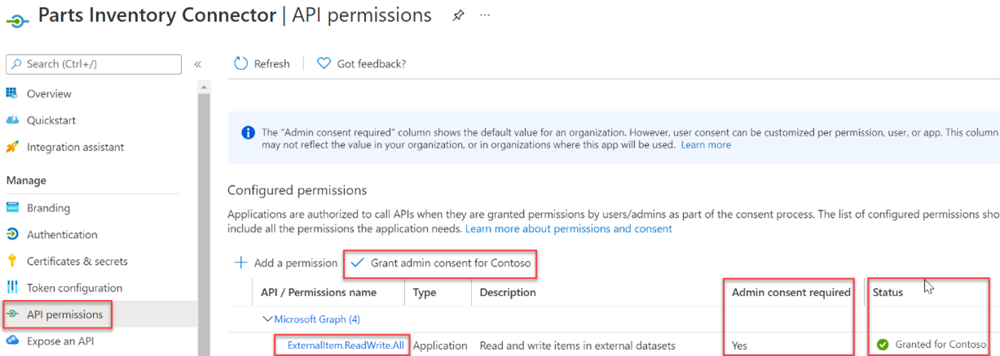
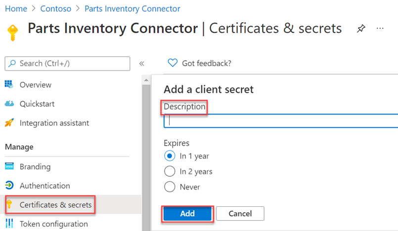

<!-- markdownlint-disable MD002 MD041 -->

Depois de todos os pré-requisitos, você poderá registrar um aplicativo no centro de administração do Azure AD. O registro é necessário para autenticar o aplicativo e usá-lo para fazer chamadas para a API de conectores Graph Microsoft.

1. Vá para o [Azure Active Directory de administração](https://aad.portal.azure.com/) e entre com uma conta de administrador.
2. No painel esquerdo, **selecione Azure Active Directory e**, em **Gerenciar**, selecione **Registros de aplicativo.**
3. Selecione **Novo registro**.

    

4. Preencha o **formulário Registrar um** aplicativo com os seguintes valores e selecione **Registrar**.

    a. **Nome**: Conector de Inventário de Partes

    b. **Tipos de conta com suporte**: Contas neste diretório organizacional somente (Microsoft - Locatário único)

    c. **URI de redirecionamento**: deixar em branco

    

5. Na página Visão geral do Conector de Inventário de Partes, copie os valores de **ID de Aplicativo (cliente) e ID de Diretório (locatário**). Você precisará dos dois na seção a seguir.

    

6. Selecione **Permissões de API** em **Gerenciar**.
7. Selecione **Adicionar uma permissão** e selecione **Microsoft Graph**.
8. Selecione **Permissões de aplicativo e** selecione **a permissão ExternalItem.ReadWrite.All** . Selecione **Adicionar permissões**.

    

9. Selecione **Conceder consentimento de administrador para {TENANT}e** selecione **Sim** quando solicitado.

    

10. Selecione **Certificados segredos &amp; em** **Gerenciar** , em seguida, selecione **Novo segredo do cliente**.
11. Insira uma descrição e escolha um tempo de expiração para o segredo e selecione **Adicionar**.

    

12. Copie e salve o novo segredo, você precisará dele na seção a seguir.
