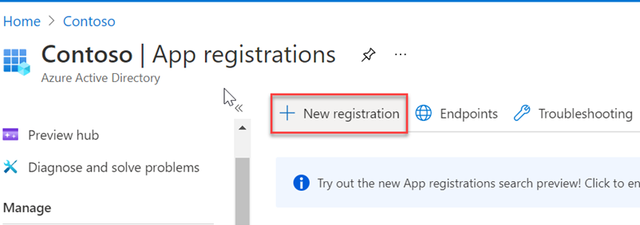
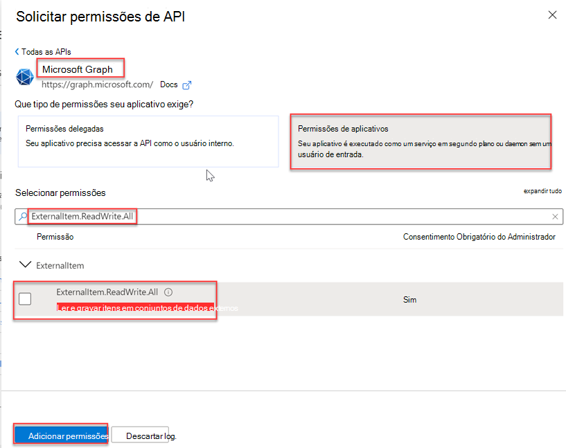

<!-- markdownlint-disable MD002 MD041 -->

Depois de todos os pré-requisitos, você poderá registrar um aplicativo no centro de administração do Azure AD.After all the prerequisites are in place, you will be able to register an application in the Azure AD admin center. O registro é necessário para autenticar o aplicativo e usá-lo para fazer chamadas para a API de conectores Graph Microsoft.The registration is necessary in order to authenticate the application and use it to make calls to the Microsoft Graph connectors API.

1. Vá para o Azure Active Directory [de administração e](https://aad.portal.azure.com/) entre com uma conta de administrador.Go to the [Azure Active Directory admin center](https://aad.portal.azure.com/) and sign in with an administrator account.
2. No painel esquerdo, selecione **Azure Active Directory**, e em **Gerenciar**, selecione Registros **de aplicativo.**On the left pane, select **Azure Active Directory**, and under **Manage**, select **App registrations**.
3. Selecione **Novo registro**.Select **New registration**.

    

4. Conclua **o formulário Registrar um** aplicativo com os seguintes valores e selecione **Registrar**.Complete the **Register an application** form with the following values, then select **Register**.

    a.a. **Nome**: Conector de Inventário de Partes**Name**: Parts Inventory Connector

    b.b. **Tipos de conta com suporte:** Contas somente neste diretório organizacional (somente microsoft - locatário único)**Supported account types**: Accounts in this organizational directory only (Microsoft only - Single tenant)

    c.c. **URI de redirecionamento**: deixar em branco**Redirect URI**: Leave blank

    

5. Na página Visão geral do Conector de Inventário de Partes, copie os valores de ID de Aplicativo (cliente) e ID de Diretório **(locatário).**On the Parts Inventory Connector overview page, copy the values of **Application (client) ID and Directory (tenant) ID**. Você precisará dos dois na seção a seguir.You will need both in the following section.

    

6. Selecione **Permissões de API em** **Gerenciar**.Select **API Permissions** under **Manage**.
7. Selecione **Adicionar uma permissão** e selecione Microsoft **Graph**.Select **Add a permission**, then select **Microsoft Graph**.
8. Selecione **Permissões de aplicativo** e selecione a permissão **ExternalItem.ReadWrite.All.**Select **Application permissions**, then select the **ExternalItem.ReadWrite.All** permission. Selecione **Adicionar permissões**.Select **Add permissions**.

    

9. Selecione **Conceder consentimento de administrador para {TENANT}e** selecione **Sim** quando solicitado.Select **Grant admin consent for {TENANT},** then select **Yes** when prompted.

    

10. Selecione **Certificados &amp; segredos em** **Gerenciar** , em seguida, selecione Novo segredo **do cliente**.Select **Certificates &amp; secrets** under **Manage** , then select **New client secret**.
11. Insira uma descrição e escolha um tempo de expiração para o segredo e selecione **Adicionar**.Enter a description and choose an expiration time for the secret, then select **Add**.

    

12. Copie e salve o novo segredo, você precisará dele na seção a seguir.Copy and save the new secret, you will need it in the following section.
