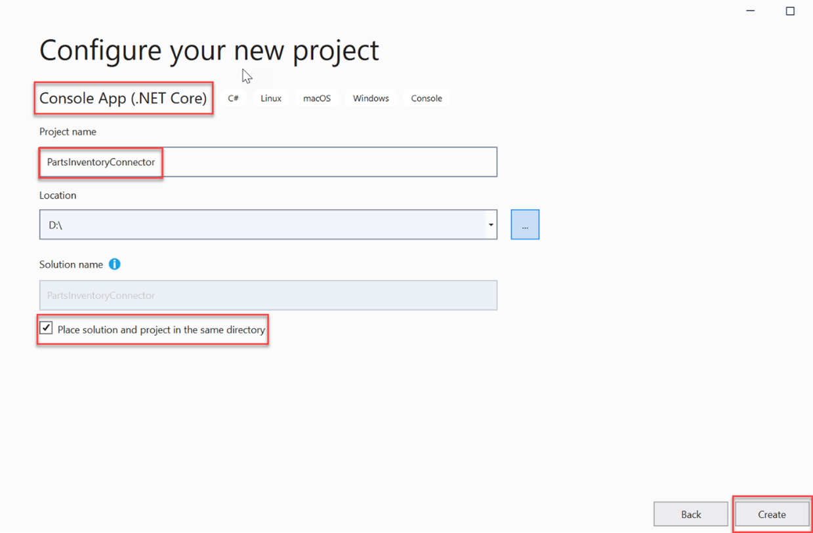
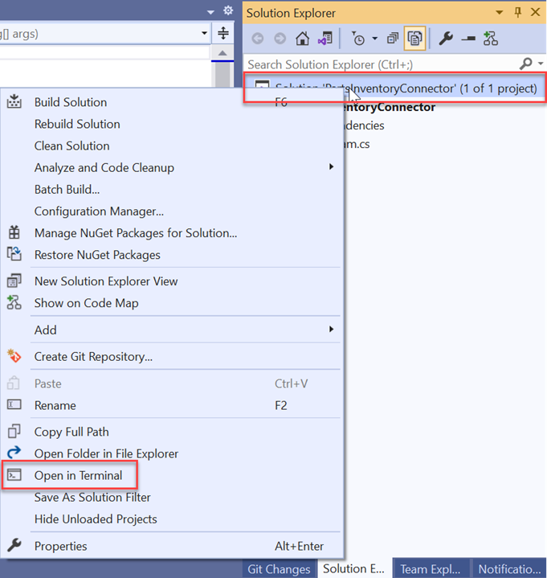

<!-- markdownlint-disable MD002 MD025 MD041 -->

<span data-ttu-id="356e1-101">Nesta etapa, você criará um aplicativo de console .NET Core.</span><span class="sxs-lookup"><span data-stu-id="356e1-101">In this step, you'll create a .NET Core console app.</span></span> <span data-ttu-id="356e1-102">Depois disso, você criará uma nova conexão, registrará o esquema e sincronizará os itens.</span><span class="sxs-lookup"><span data-stu-id="356e1-102">After that you will create a new connection, register the schema, and sync the items.</span></span>

## <a name="create-a-net-core-console-app"></a><span data-ttu-id="356e1-103">Criar um aplicativo de console .NET Core </span><span class="sxs-lookup"><span data-stu-id="356e1-103">Create a .NET Core console app</span></span>

1. <span data-ttu-id="356e1-104">Iniciar Visual Studio 2019 e ir para **Arquivo**  >    >  **Novo Project**.</span><span class="sxs-lookup"><span data-stu-id="356e1-104">Launch Visual Studio 2019 and go to **File** > **New** > **Project**.</span></span>
2. <span data-ttu-id="356e1-105">Selecione o **modelo aplicativo de console (.NET Core)** e selecione **Next**.</span><span class="sxs-lookup"><span data-stu-id="356e1-105">Select the **Console App (.NET Core)** template, and select **Next**.</span></span>
3. <span data-ttu-id="356e1-106">Insira o Project : "PartsInventoryConnector", selecione **a** caixa de seleção para "**Colocar** solução  e projeto no mesmo diretório ", e selecione Criar conforme mostrado na próxima imagem.</span><span class="sxs-lookup"><span data-stu-id="356e1-106">Enter the **Project name**: "PartsInventoryConnector", and select the checkbox for "**Place solution and project in the same directory**", and select **Create** as shown in the next image.</span></span>



> [!IMPORTANT]
> <span data-ttu-id="356e1-108">Antes de mover para a próxima etapa, copie o arquivo ApplianceParts.csv para a pasta raiz do projeto.</span><span class="sxs-lookup"><span data-stu-id="356e1-108">Before moving to the next step, copy the ApplianceParts.csv file to the root folder of the project.</span></span>

## <a name="add-nuget-packages"></a><span data-ttu-id="356e1-109">Adicionar pacotes NuGet</span><span class="sxs-lookup"><span data-stu-id="356e1-109">Add NuGet packages</span></span>

<span data-ttu-id="356e1-110">Para adicionar NuGet pacotes, primeiro clique com o botão direito do **mouse Project Solução** e selecione Abrir no **Terminal**.</span><span class="sxs-lookup"><span data-stu-id="356e1-110">To add NuGet packages, first right-click **Project Solution** and select **Open in Terminal**.</span></span>



<span data-ttu-id="356e1-112">Em seguida, execute os seguintes comandos CLI no prompt de comando do desenvolvedor.</span><span class="sxs-lookup"><span data-stu-id="356e1-112">Next, run the following CLI commands in the developer command prompt.</span></span>

```dotnetcli
dotnet add package CsvHelper --version 12.1.2
dotnet add package Microsoft.EntityFrameworkCore.Design --version 3.1.3
dotnet add package Microsoft.EntityFrameworkCore.Sqlite --version 3.1.3
dotnet add package Microsoft.Extensions.Configuration.UserSecrets --version 3.1.3
dotnet add package Microsoft.Graph.Beta --version 0.17.0-preview
dotnet add package Microsoft.Identity.Client --version 4.13.0
```

> [!TIP]
> <span data-ttu-id="356e1-113">Se o `add package` comando falhar, verifique a Fonte **do Pacote** do seu projeto:</span><span class="sxs-lookup"><span data-stu-id="356e1-113">If the `add package` command fails, check the **Package Source** of your project:</span></span>
> 1. <span data-ttu-id="356e1-114">Selecione o projeto no Explorador de Soluções.</span><span class="sxs-lookup"><span data-stu-id="356e1-114">Select the project in the Solution Explorer.</span></span>
> 2. <span data-ttu-id="356e1-115">Vá para Ferramentas > Nuget Gerenciador de Pacotes > Gerenciador de Pacotes Configurações.</span><span class="sxs-lookup"><span data-stu-id="356e1-115">Go to Tools > Nuget Package Manager > Package Manager Settings.</span></span>
> 3. <span data-ttu-id="356e1-116">Verifique as Fontes de Pacote e verifique se nuget.&#65279;org está instalado como fonte de pacote.</span><span class="sxs-lookup"><span data-stu-id="356e1-116">Check the Package Sources, and make sure nuget.&#65279;org is installed as package source.</span></span>
>     * <span data-ttu-id="356e1-117">Nome: nuget.&#65279;org</span><span class="sxs-lookup"><span data-stu-id="356e1-117">Name: nuget.&#65279;org</span></span>
>     *  <span data-ttu-id="356e1-118">Fonte: https&#65279;://api.nuget.org/v3/index.json</span><span class="sxs-lookup"><span data-stu-id="356e1-118">Source: https&#65279;://api.nuget.org/v3/index.json</span></span>

<!---Used "&#65279;" to prevent auto-generated links --->

## <a name="add-azure-ad-authentication"></a><span data-ttu-id="356e1-119">Adicionar autenticação do Azure AD</span><span class="sxs-lookup"><span data-stu-id="356e1-119">Add Azure AD authentication</span></span>

<span data-ttu-id="356e1-120">Essa autenticação é necessária para obter o token de acesso OAuth necessário para chamar a API de conectores.</span><span class="sxs-lookup"><span data-stu-id="356e1-120">This authentication is required to get the necessary OAuth access token to call the connectors API.</span></span>

1. <span data-ttu-id="356e1-121">Crie um novo diretório chamado **Authentication** no diretório **PartsInventoryConnector.**</span><span class="sxs-lookup"><span data-stu-id="356e1-121">Create a new directory named **Authentication** in the **PartsInventoryConnector** directory.</span></span>
2. <span data-ttu-id="356e1-122">Crie um novo arquivo no diretório **authentication** chamado ClientCredentialAuthProvider.cs e coloque o seguinte código nesse arquivo:</span><span class="sxs-lookup"><span data-stu-id="356e1-122">Create a new file in the **Authentication** directory named ClientCredentialAuthProvider.cs and place the following code in that file:</span></span>

```c
// Copyright (c) Microsoft Corporation. All rights reserved.
// Licensed under the MIT license.
using Microsoft.Graph;
using Microsoft.Identity.Client;
using System;
using System.Net.Http;
using System.Net.Http.Headers;
using System.Threading.Tasks;

namespace PartsInventoryConnector.Authentication
{
    public class ClientCredentialAuthProvider : IAuthenticationProvider
    {
        private IConfidentialClientApplication _msalClient;
        private int _maxRetries = 3;

        public ClientCredentialAuthProvider(string appId, string tenantId, string secret)
        {
            _msalClient = ConfidentialClientApplicationBuilder
                .Create(appId)
                .WithTenantId(tenantId)
                .WithClientSecret(secret)
                .Build();
        }

        public async Task AuthenticateRequestAsync(HttpRequestMessage request)
        {
            int retryCount = 0;

            do
            {
                try
                {
                    var result = await _msalClient
                        .AcquireTokenForClient(new[] { "https://graph.microsoft.com/.default" })
                        .ExecuteAsync();

                    if (!string.IsNullOrEmpty(result.AccessToken))
                    {
                        request.Headers.Authorization =
                            new AuthenticationHeaderValue("bearer", result.AccessToken);
                        break;
                    }
                }
                catch (MsalServiceException serviceException)
                {
                    if (serviceException.ErrorCode == "temporarily_unavailable")
                    {
                        await Task.Delay(10000);
                    }
                    else
                    {
                        throw serviceException;
                    }
                }
                catch (Exception exception)
                {
                    throw exception;
                }

                retryCount++;
            } while (retryCount < _maxRetries);
        }
    }
}
```

## <a name="add-user-experience"></a><span data-ttu-id="356e1-123">Adicionar experiência do usuário</span><span class="sxs-lookup"><span data-stu-id="356e1-123">Add user experience</span></span>

1. <span data-ttu-id="356e1-124">Crie um novo diretório no diretório **PartsInventoryConnector** chamado **Console**.</span><span class="sxs-lookup"><span data-stu-id="356e1-124">Create a new directory in the **PartsInventoryConnector** directory named **Console**.</span></span>
2. <span data-ttu-id="356e1-125">Crie um novo arquivo no **diretório console** chamado MenuChoice.cs e coloque o seguinte código nesse arquivo:</span><span class="sxs-lookup"><span data-stu-id="356e1-125">Create a new file in the **Console** directory named MenuChoice.cs and place the following code in that file:</span></span>

```c
// Copyright (c) Microsoft Corporation. All rights reserved.
// Licensed under the MIT license.

namespace PartsInventoryConnector.Console
{
    public enum MenuChoice
    {
        Invalid = 0,
        CreateConnection,
        RegisterSchema,
        PushAllItems,
        Exit
    }
}
```

## <a name="set-up-data-model"></a><span data-ttu-id="356e1-126">Configurar o modelo de dados</span><span class="sxs-lookup"><span data-stu-id="356e1-126">Set up data model</span></span>

1. <span data-ttu-id="356e1-127">Crie um novo diretório no diretório **PartsInventoryConnector** chamado **Models**.</span><span class="sxs-lookup"><span data-stu-id="356e1-127">Create a new directory in the **PartsInventoryConnector** directory named **Models**.</span></span>
2. <span data-ttu-id="356e1-128">Crie um novo arquivo no diretório **Modelos** chamado AppliancePart.cs e coloque o seguinte código nesse arquivo:</span><span class="sxs-lookup"><span data-stu-id="356e1-128">Create a new file in the **Models** directory named AppliancePart.cs, and place the following code in that file:</span></span>


```c
// Copyright (c) Microsoft Corporation. All rights reserved.
// Licensed under the MIT license.
using Microsoft.Graph;
using Newtonsoft.Json;
using System.Collections.Generic;
using System.ComponentModel.DataAnnotations;

namespace PartsInventoryConnector.Models
{
    public class AppliancePart
    {
        [Key]
        public int PartNumber { get; set; }
        public string Name { get; set; }
        public string Description { get; set; }
        public double Price { get; set; }
        public int Inventory { get; set; }
        [JsonProperty("appliances@odata.type")]
        private const string AppliancesODataType = "Collection(String)";
        public List<string> Appliances { get; set; }

        public Properties AsExternalItemProperties()
        {
            var properties = new Properties
            {
                AdditionalData = new Dictionary<string, object>
                {
                    { "partNumber", PartNumber },
                    { "name", Name },
                    { "description", Description },
                    { "price", Price },
                    { "inventory", Inventory },
                    { "appliances@odata.type", "Collection(String)" },
                    { "appliances", Appliances }
                }
            };

            return properties;
        }
    }
}
```


3. <span data-ttu-id="356e1-129">Crie um novo arquivo no diretório **Modelos** chamado ApplianceDbContext.cs e coloque o seguinte código nesse arquivo:</span><span class="sxs-lookup"><span data-stu-id="356e1-129">Create a new file in the **Models** directory named ApplianceDbContext.cs, and place the following code in that file:</span></span>

```c
using Microsoft.Data.Sqlite;
using Microsoft.EntityFrameworkCore;
using Microsoft.EntityFrameworkCore.ChangeTracking;
using Newtonsoft.Json;
using System;
using System.Collections.Generic;
using System.Linq;

namespace PartsInventoryConnector.Models
{
    public class ApplianceDbContext : DbContext
    {
        public DbSet<AppliancePart> Parts { get; set; }

        protected override void OnConfiguring(DbContextOptionsBuilder options)
        {
            options.UseSqlite("Data Source=parts.db");
        }

        protected override void OnModelCreating(ModelBuilder modelBuilder)
        {
            // EF Core can't store lists, so add a converter for the Appliances
            // property to serialize as a JSON string on save to DB
            modelBuilder.Entity<AppliancePart>()
                .Property(ap => ap.Appliances)
                .HasConversion(
                    v => JsonConvert.SerializeObject(v),
                    v => JsonConvert.DeserializeObject<List<string>>(v)
                );

            // Add LastUpdated and IsDeleted shadow properties
            modelBuilder.Entity<AppliancePart>()
                .Property<DateTime>("LastUpdated")
                .HasDefaultValueSql("datetime()")
                .ValueGeneratedOnAddOrUpdate();
            modelBuilder.Entity<AppliancePart>()
                .Property<bool>("IsDeleted")
                .IsRequired()
                .HasDefaultValue(false);

            // Exclude any soft-deleted items (IsDeleted = 1) from
            // the default query sets
            modelBuilder.Entity<AppliancePart>()
                .HasQueryFilter(a => !EF.Property<bool>(a, "IsDeleted"));
        }

        public override int SaveChanges()
        {
            // Prevent deletes of data, instead mark the item as deleted
            // by setting IsDeleted = true.
            foreach(var entry in ChangeTracker.Entries()
              .Where(e => e.State == EntityState.Deleted))
            {
                if (entry.Entity.GetType() == typeof(AppliancePart))
                {
                    SoftDelete(entry);
                }

            }

            return base.SaveChanges();
        }

        private void SoftDelete(EntityEntry entry)
        {
            var partNumber = new SqliteParameter("@partNumber",
                entry.OriginalValues["PartNumber"]);

            Database.ExecuteSqlRaw(
                "UPDATE Parts SET IsDeleted = 1 WHERE PartNumber = @partNumber",
                partNumber);

            entry.State = EntityState.Detached;
        }
    }
}
```

4. <span data-ttu-id="356e1-130">Crie um novo diretório chamado **Data** no diretório **PartsInventoryConnector.**</span><span class="sxs-lookup"><span data-stu-id="356e1-130">Create a new directory named **Data** in the **PartsInventoryConnector** directory.</span></span>
5. <span data-ttu-id="356e1-131">Crie um novo arquivo no **diretório De** dados chamado CsvDataLoader.cs e coloque o seguinte código nesse arquivo:</span><span class="sxs-lookup"><span data-stu-id="356e1-131">Create a new file in the **Data** directory named CsvDataLoader.cs and place the following code in that file:</span></span>

```c
using CsvHelper;
using CsvHelper.Configuration;
using CsvHelper.TypeConversion;
using PartsInventoryConnector.Models;
using System.Collections.Generic;
using System.IO;
using System.Linq;

namespace PartsInventoryConnector.Data
{
    public static class CsvDataLoader
    {
        public static List<AppliancePart> LoadPartsFromCsv(string filePath)
        {
            using (var reader = new StreamReader(filePath))
            using (var csv = new CsvReader(reader))
            {
                csv.Configuration.RegisterClassMap<AppliancePartMap>();
                return new List<AppliancePart>(csv.GetRecords<AppliancePart>());
            }
        }
    }

    public class ApplianceListConverter : DefaultTypeConverter
    {
        public override object ConvertFromString(string text, IReaderRow row, MemberMapData memberMapData)
        {
            var appliances = text.Split(';');
            return new List<string>(appliances);
        }
    }

    public class AppliancePartMap : ClassMap<AppliancePart>
    {
        public AppliancePartMap()
        {
            Map(m => m.PartNumber);
            Map(m => m.Name);
            Map(m => m.Description);
            Map(m => m.Price);
            Map(m => m.Inventory);
            Map(m => m.Appliances).TypeConverter<ApplianceListConverter>();
        }
    }
}
```

## <a name="write-the-microsoft-graph-helper-service"></a><span data-ttu-id="356e1-132">Gravar o serviço auxiliar Graph Microsoft</span><span class="sxs-lookup"><span data-stu-id="356e1-132">Write the Microsoft Graph helper service</span></span>

1. <span data-ttu-id="356e1-133">Crie um novo diretório chamado **MicrosoftGraph** no **diretório PartsInventoryConnector.**</span><span class="sxs-lookup"><span data-stu-id="356e1-133">Create a new directory named **MicrosoftGraph** in the **PartsInventoryConnector** directory.</span></span>
2. <span data-ttu-id="356e1-134">Crie um novo arquivo no **diretório do MicrosoftGraph** chamado CustomSerializer.cs e coloque o seguinte código nesse arquivo:</span><span class="sxs-lookup"><span data-stu-id="356e1-134">Create a new file in the **MicrosoftGraph** directory named CustomSerializer.cs and place the following code in that file:</span></span>

```c
using Microsoft.Graph;
using Newtonsoft.Json;
using Newtonsoft.Json.Converters;
using Newtonsoft.Json.Serialization;
using System;
using System.IO;

namespace PartsInventoryConnector.MicrosoftGraph
{
    // The Microsoft Graph SDK serializes enumerations in camelCase.
    // The Microsoft Graph service currently requires the PropertyType enum
    // to be PascalCase. This will override the Microsoft Graph serialization
    // If the Microsoft Graph service changes to accept camelCase this will no
    // longer be necessary.
    class CustomContractResolver : DefaultContractResolver
    {
        protected override JsonConverter ResolveContractConverter(Type objectType)
        {
            if (typeof(PropertyType).IsAssignableFrom(objectType))
            {
                // This default converter uses PascalCase
                return new StringEnumConverter();
            }
            return base.ResolveContractConverter(objectType);
        }
    }

    // In order to hook up the custom contract resolver for
    // PropertyType, we need to implement a custom serializer to
    // pass to the MicrosoftGraphServiceClient.
    public class CustomSerializer : ISerializer
    {

        private Serializer _microsoftGraphSerializer;
        private JsonSerializerSettings _jsonSerializerSettings;

        public CustomSerializer()
        {
            _microsoftGraphSerializer = new Serializer();

            _jsonSerializerSettings = new JsonSerializerSettings
            {
                ContractResolver = new CustomContractResolver()
            };
        }

        // For deserialize, just pass through to the default
        // Microsoft Graph SDK serializer
        public T DeserializeObject<T>(Stream stream)
        {
            return _microsoftGraphSerializer.DeserializeObject<T>(stream);
        }

        // For deserialize, just pass through to the default
        // Microsoft Graph SDK serializer
        public T DeserializeObject<T>(string inputString)
        {
            return _microsoftGraphSerializer.DeserializeObject<T>(inputString);
        }

        public string SerializeObject(object serializeableObject)
        {
            // If a Schema object is being serialized, do the conversion
            // ourselves
            if (serializeableObject is Schema)
            {
                var foo = JsonConvert.SerializeObject(serializeableObject, _jsonSerializerSettings);
                return foo;
            }

            // Otherwise, just pass through to the default Microsoft Graph SDK serializer
            return _microsoftGraphSerializer.SerializeObject(serializeableObject);
        }
    }
}
```

3. <span data-ttu-id="356e1-135">Crie um novo arquivo no **diretório microsoft Graph** chamado MicrosoftGraphHelper.cs e coloque o código abaixo nesse arquivo.</span><span class="sxs-lookup"><span data-stu-id="356e1-135">Create a new file in the **Microsoft Graph** directory named MicrosoftGraphHelper.cs and place the code below in that file.</span></span>

    <span data-ttu-id="356e1-136">O código a seguir contém métodos que usam o **MicrosoftGraphServiceClient** para criar e enviar chamadas para o serviço microsoft Graph e processar a resposta.</span><span class="sxs-lookup"><span data-stu-id="356e1-136">The following code contains methods that use the **MicrosoftGraphServiceClient** to build and send calls to the Microsoft Graph service and process the response.</span></span>

```c
// Copyright (c) Microsoft Corporation. All rights reserved.
// Licensed under the MIT license.
using Microsoft.Graph;
using Newtonsoft.Json;
using System.Net.Http;
using System.Threading.Tasks;

namespace PartsInventoryConnector.MicrosoftGraph
{
    public class MicrosoftGraphHelper
    {
        private class MicrosoftGraphServiceClient _microsoftGraphClient;

        public MicrosoftGraphHelper(IAuthenticationProvider authProvider)
        {
            // Configure a default HttpProvider with our
            // custom serializer to handle the PropertyType serialization
            var serializer = new CustomSerializer();
            var httpProvider = new HttpProvider(serializer);

            // Initialize the Microsoft Graph client
            _microsoftGraphClient = new MicrosoftGraphServiceClient(authProvider, httpProvider);
        }
    }
}
```

## <a name="initialize-the-microsoft-graph-helper-service"></a><span data-ttu-id="356e1-137">Inicializar o serviço auxiliar Graph Microsoft</span><span class="sxs-lookup"><span data-stu-id="356e1-137">Initialize the Microsoft Graph helper service</span></span>

<span data-ttu-id="356e1-138">Abra Program.cs e substitua todo o conteúdo pelo seguinte código:</span><span class="sxs-lookup"><span data-stu-id="356e1-138">Open Program.cs and replace the entire content with the following code:</span></span>

```c
using Microsoft.EntityFrameworkCore;
using Microsoft.Extensions.Configuration;
using Microsoft.Graph;
using PartsInventoryConnector.Authentication;
using PartsInventoryConnector.Console;
using PartsInventoryConnector.Data;
using PartsInventoryConnector.MicrosoftGraph;
using PartsInventoryConnector.Models;
using System;
using System.Collections.Generic;
using System.Linq;
using System.Threading.Tasks;

namespace PartsInventoryConnector
{
    class Program
    {
        private static MicrosoftGraphHelper _microsoftGraphHelper;

        private static ExternalConnection _currentConnection;

        private static string _tenantId;

        static async Task Main(string[] args)
        {
            try
            {
                // Load configuration from appsettings.json
                var appConfig = LoadAppSettings();
                if (appConfig == null)
                {
                    return;
                }

                // Save tenant ID for setting ACL on items
                _tenantId = appConfig["tenantId"];

                // Initialize the auth provider
                var authProvider = new ClientCredentialAuthProvider(
                    appConfig["appId"],
                    appConfig["tenantId"],
                    appConfig["appSecret"]
                );

                // Check if the database is empty
                using (var db = new ApplianceDbContext())
                {
                    if (db.Parts.IgnoreQueryFilters().Count() <= 0)
                    {
                        ImportCsvToDatabase(db, "ApplianceParts.csv");
                    }
                }

                _microsoftGraphHelper = new MicrosoftGraphHelper(authProvider);

                do
                {
                    var userChoice = DoMenuPrompt();

                    switch (userChoice)
                    {
                        case MenuChoice.CreateConnection:
                            await CreateConnectionAsync();
                            break;
                        case MenuChoice.RegisterSchema:
                            await RegisterSchemaAsync();
                            break;
                        case MenuChoice.PushAllItems:
                            await UpdateItemsFromDatabase();
                            break;
                        case MenuChoice.Exit:
                            // Exit the program
                            return;
                        case MenuChoice.Invalid:
                        default:
                            break;
                    }

                } while (true);
            }
            catch (Exception ex)
            {
                System.Console.WriteLine(ex.Message);
            }
        }

        private static void ImportCsvToDatabase(ApplianceDbContext db, string partsFilePath)
        {
            var parts = CsvDataLoader.LoadPartsFromCsv(partsFilePath);
            db.AddRange(parts);
            db.SaveChanges();
        }

        private static MenuChoice DoMenuPrompt()
        {
            System.Console.WriteLine($"Current connection: {(_currentConnection == null ? "NONE" : _currentConnection.Name)}");
            System.Console.WriteLine("Please choose one of the following options:");

            System.Console.WriteLine($"{Convert.ToInt32(MenuChoice.CreateConnection)}. Create a connection");
            System.Console.WriteLine($"{Convert.ToInt32(MenuChoice.RegisterSchema)}. Register schema for current connection");
            System.Console.WriteLine($"{Convert.ToInt32(MenuChoice.PushAllItems)}. Push ALL items to current connection");
            System.Console.WriteLine($"{Convert.ToInt32(MenuChoice.Exit)}. Exit");

            try
            {
                var choice = int.Parse(System.Console.ReadLine());
                return (MenuChoice)choice;
            }
            catch (FormatException)
            {
                return MenuChoice.Invalid;
            }
        }
        private static string PromptForInput(string prompt, bool valueRequired)
        {
            string response = null;

            do
            {
                System.Console.WriteLine($"{prompt}:");
                response = System.Console.ReadLine();
                if (valueRequired && string.IsNullOrEmpty(response))
                {
                    System.Console.WriteLine("You must provide a value");
                }
            } while (valueRequired && string.IsNullOrEmpty(response));

            return response;
        }

        private static IConfigurationRoot LoadAppSettings()
        {
            var appConfig = new ConfigurationBuilder()
                .AddUserSecrets<Program>()
                .Build();

            // Check for required settings
            if (string.IsNullOrEmpty(appConfig["appId"]) ||
                string.IsNullOrEmpty(appConfig["appSecret"]) ||
                string.IsNullOrEmpty(appConfig["tenantId"]))
            {
                return null;
            }

            return appConfig;
        }
    }
}
```

## <a name="create-the-connection"></a><span data-ttu-id="356e1-139">Criar a conexão</span><span class="sxs-lookup"><span data-stu-id="356e1-139">Create the connection</span></span>

1. <span data-ttu-id="356e1-140">Em **MicrosoftGraph**, abra o arquivo MicrosoftGraphHelper.cs e adicione o código a seguir após o **método construtor.**</span><span class="sxs-lookup"><span data-stu-id="356e1-140">Under **MicrosoftGraph**, open the MicrosoftGraphHelper.cs file and add the following code after the **constructor** method.</span></span>

```c
#region Connections

        public async Task<ExternalConnection> CreateConnectionAsync(string id, string name, string description)
        {
            var newConnection = new ExternalConnection
            {
                // Need to set to null, service returns 400
                // if @odata.type property is sent
                ODataType = null,
                Id = id,
                Name = name,
                Description = description
            };

            return await _microsoftGraphClient.External.Connections.Request().AddAsync(newConnection);
        }

#endregion
```

2. <span data-ttu-id="356e1-141">Abra o arquivo Program.cs e adicione o seguinte código após o **método Main:**</span><span class="sxs-lookup"><span data-stu-id="356e1-141">Open the Program.cs file and add the following code after the **Main** method:</span></span>


```c
private static async Task CreateConnectionAsync()
        {
            var connectionId = PromptForInput("Enter a unique ID for the new connection", true);
            var connectionName = PromptForInput("Enter a name for the new connection", true);
            var connectionDescription = PromptForInput("Enter a description for the new connection", false);

            try
            {
                // Create the connection
                _currentConnection = await _microsoftGraphHelper.CreateConnectionAsync(connectionId, connectionName, connectionDescription);
          System.Console.WriteLine("New connection created");
                System.Console.WriteLine(Newtonsoft.Json.JsonConvert.SerializeObject(_currentConnection, Newtonsoft.Json.Formatting.Indented));
            }
            catch (ServiceException serviceException)
            {
                System.Console.WriteLine(serviceException.Message);
                return;
            }
      }
```

## <a name="register-schema"></a><span data-ttu-id="356e1-142">Registrar esquema</span><span class="sxs-lookup"><span data-stu-id="356e1-142">Register schema</span></span>

1. <span data-ttu-id="356e1-143">Em **MicrosoftGraph**, abra o arquivo MicrosoftGraphHelper.cs e adicione o código a seguir após o **método construtor.**</span><span class="sxs-lookup"><span data-stu-id="356e1-143">Under **MicrosoftGraph**, open the MicrosoftGraphHelper.cs file and add the following code after the **constructor** method.</span></span>

```c
#region Schema

        public async Task RegisterSchemaAsync(string connectionId, Schema schema)
        {
            // Need access to the HTTP response here since we are doing an
            // async request. The new schema object isn't returned, we need
            // the Location header from the response
            var asyncNewSchemaRequest = _microsoftGraphClient.External.Connections[connectionId].Schema
                .Request()
                .Header("Prefer", "respond-async")
                .GetHttpRequestMessage();

            asyncNewSchemaRequest.Method = HttpMethod.Post;
            asyncNewSchemaRequest.Content = _microsoftGraphClient.HttpProvider.Serializer.SerializeAsJsonContent(schema);

            var response = await _microsoftGraphClient.HttpProvider.SendAsync(asyncNewSchemaRequest);

            if (response.IsSuccessStatusCode)
            {
                // Get the operation ID from the Location header
                var operationId = ExtractOperationId(response.Headers.Location);
                await CheckSchemaStatusAsync(connectionId, operationId);
            }
            else
            {
                throw new ServiceException(
                    new Error
                    {
                        Code = response.StatusCode.ToString(),
                        Message = "Registering schema failed"
                    }
                );
            }
        }

        private string ExtractOperationId(System.Uri uri)
        {
            int numSegments = uri.Segments.Length;
            return uri.Segments[numSegments - 1];
        }

        public async Task CheckSchemaStatusAsync(string connectionId, string operationId)
        {
            do
            {
                var operation = await _microsoftGraphClient.External.Connections[connectionId]
                    .Operations[operationId]
                    .Request()
                    .GetAsync();

                if (operation.Status == ConnectionOperationStatus.Completed)
                {
                    return;
                }
                else if (operation.Status == ConnectionOperationStatus.Failed)
                {
                    throw new ServiceException(
                        new Error
                        {
                            Code = operation.Error.ErrorCode,
                            Message = operation.Error.Message
                        }
                    );
                }

                await Task.Delay(3000);
            } while (true);
        }

#endregion
```

2. <span data-ttu-id="356e1-144">Abra o arquivo Program.cs e adicione o seguinte código após o **método Main.**</span><span class="sxs-lookup"><span data-stu-id="356e1-144">Open the Program.cs file and add the following code after the **Main** method.</span></span>

```c
private static async Task RegisterSchemaAsync()
        {
            if (_currentConnection == null)
            {
                System.Console.WriteLine("No connection selected. Please create a new connection or select an existing connection.");
                return;
            }

            System.Console.WriteLine("Registering schema, this may take a moment...");

            try
            {
                // Register the schema
                var schema = new Schema
                {
                    // Need to set to null, service returns 400
                    // if @odata.type property is sent
                    ODataType = null,
                    BaseType = "microsoft.graph.externalItem",
                    Properties = new List<Property>
                    {
                        new Property { Name = "partNumber", Type = PropertyType.Int64, IsQueryable = true, IsSearchable = false, IsRetrievable = true },
                        new Property { Name = "name", Type = PropertyType.String, IsQueryable = true, IsSearchable = true, IsRetrievable = true },
                        new Property { Name = "description", Type = PropertyType.String, IsQueryable = false, IsSearchable = true, IsRetrievable = true },
                        new Property { Name = "price", Type = PropertyType.Double, IsQueryable = true, IsSearchable = false, IsRetrievable = true },
                        new Property { Name = "inventory", Type = PropertyType.Int64, IsQueryable = true, IsSearchable = false, IsRetrievable = true },
                        new Property { Name = "appliances", Type = PropertyType.StringCollection, IsQueryable = true, IsSearchable = true, IsRetrievable = true }
                    }
                };

                await _microsoftGraphHelper.RegisterSchemaAsync(_currentConnection.Id, schema);
                System.Console.WriteLine("Schema registered");
            }
            catch (ServiceException serviceException)
            {
                System.Console.WriteLine($"{serviceException.StatusCode} error registering schema:");
                System.Console.WriteLine(serviceException.Message);
                return;
            }
        }
```

## <a name="sync-items"></a><span data-ttu-id="356e1-145">Itens de sincronização</span><span class="sxs-lookup"><span data-stu-id="356e1-145">Sync items</span></span>

1. <span data-ttu-id="356e1-146">Em **Microsoft Graph**, abra o arquivo MicrosoftGraphHelper.cs e adicione o seguinte código após o método **Constructor.**</span><span class="sxs-lookup"><span data-stu-id="356e1-146">Under **Microsoft Graph**, open the MicrosoftGraphHelper.cs file and add the following code after the **Constructor** method.</span></span>

```c
#region PushData   

        public async Task AddOrUpdateItem(string connectionId, ExternalItem item)
        {
            // The SDK's auto-generated request builder uses POST here,
            // which isn't correct. For now, get the HTTP request and change it
            // to PUT manually.
            var putItemRequest = _microsoftGraphClient.External.Connections[connectionId]
                .Items[item.Id].Request().GetHttpRequestMessage();

            putItemRequest.Method = HttpMethod.Put;
            putItemRequest.Content = _microsoftGraphClient.HttpProvider.Serializer.SerializeAsJsonContent(item);

            var response = await _microsoftGraphClient.HttpProvider.SendAsync(putItemRequest);
            if (!response.IsSuccessStatusCode)
            {
                throw new ServiceException(
                    new Error
                    {
                        Code = response.StatusCode.ToString(),
                        Message = "Error indexing item."
                    }
                );
            }
        }

        #endregion
```

2. <span data-ttu-id="356e1-147">Abra o arquivo Program.cs e adicione o seguinte código após o **método Main.**</span><span class="sxs-lookup"><span data-stu-id="356e1-147">Open the Program.cs file and add the following code after the **Main** method.</span></span>

```c
private static async Task UpdateItemsFromDatabase()
        {
            if (_currentConnection == null)
            {
                System.Console.WriteLine("No connection selected. Please create a new connection or select an existing connection.");
                return;
            }

            List<AppliancePart> partsToUpload = null;

            using (var db = new ApplianceDbContext())
            {
                partsToUpload = db.Parts
                    .ToList();
            }

            System.Console.WriteLine($"Processing {partsToUpload.Count()} add/updates");

            foreach (var part in partsToUpload)
            {
                var newItem = new ExternalItem
                {
                    Id = part.PartNumber.ToString(),
                    Content = new ExternalItemContent
                    {
                        // Need to set to null, service returns 400
                        // if @odata.type property is sent
                        ODataType = null,
                        Type = ExternalItemContentType.Text,
                        Value = part.Description
                    },
                    Acl = new List<Acl>
                    {
                        new Acl {
                            AccessType = AccessType.Grant,
                            Type = AclType.Everyone,
                            Value = _tenantId,
                            IdentitySource = "Azure Active Directory"
                        }
                    },
                    Properties = part.AsExternalItemProperties()
                };

                try
                {
                    System.Console.Write($"Uploading part number {part.PartNumber}...");
                    await _microsoftGraphHelper.AddOrUpdateItem(_currentConnection.Id, newItem);
                    System.Console.WriteLine("DONE");
                }
                catch (ServiceException serviceException)
                {
                    System.Console.WriteLine("FAILED");
                    System.Console.WriteLine($"{serviceException.StatusCode} error adding or updating part {part.PartNumber}");
                    System.Console.WriteLine(serviceException.Message);
                }
            }
        }
```
