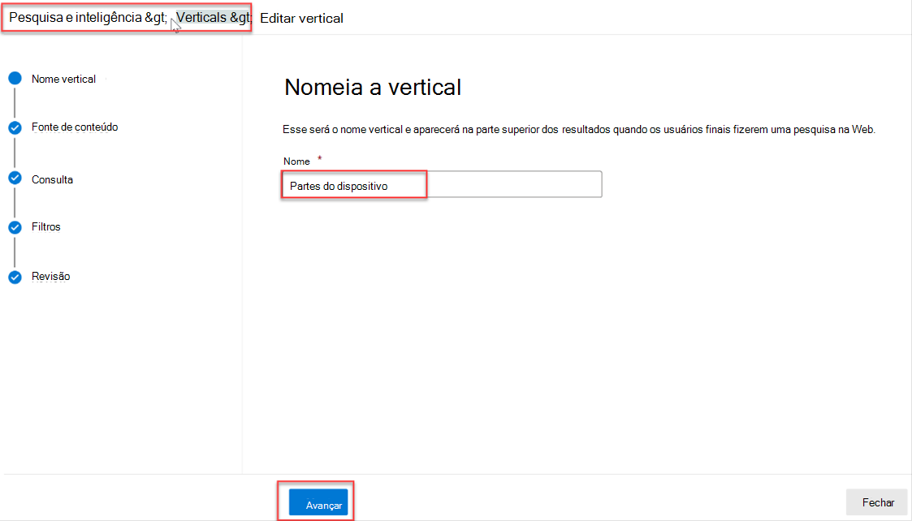
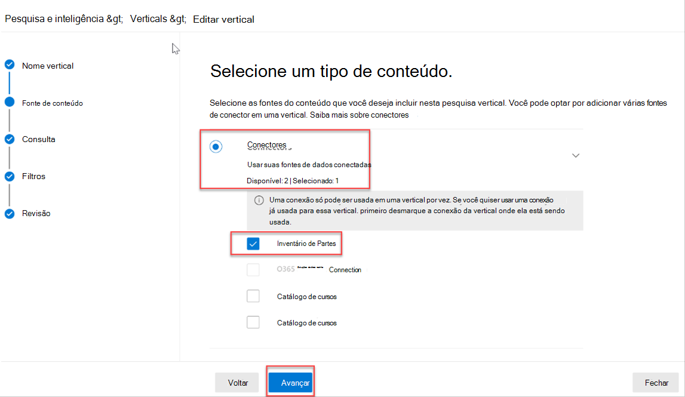
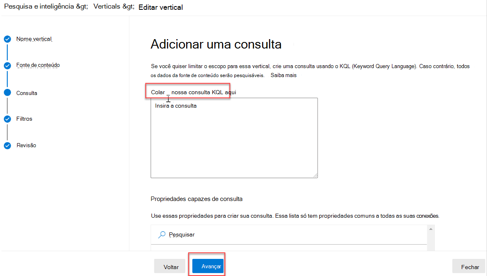
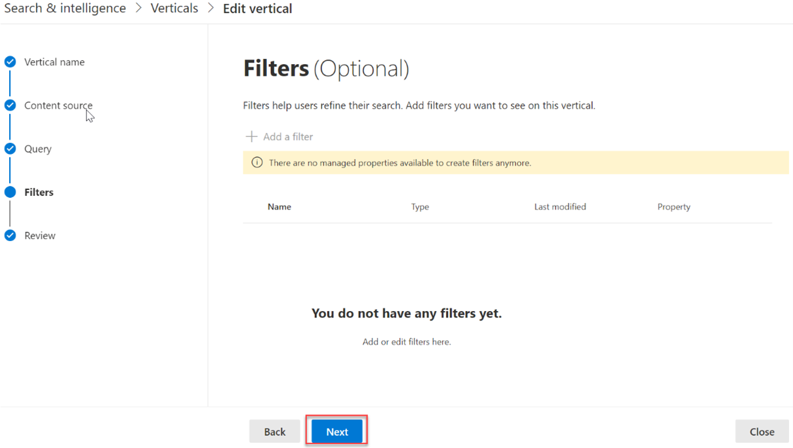
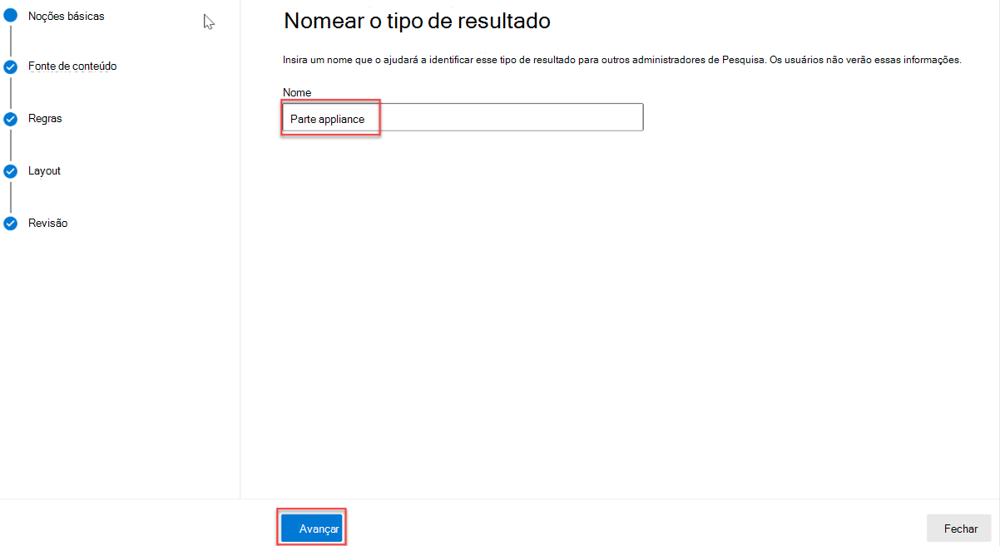
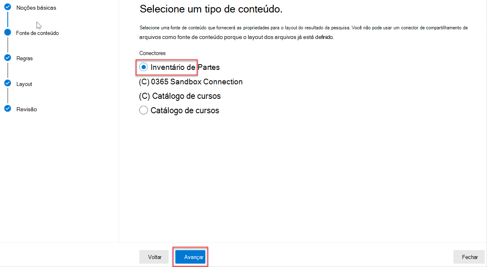
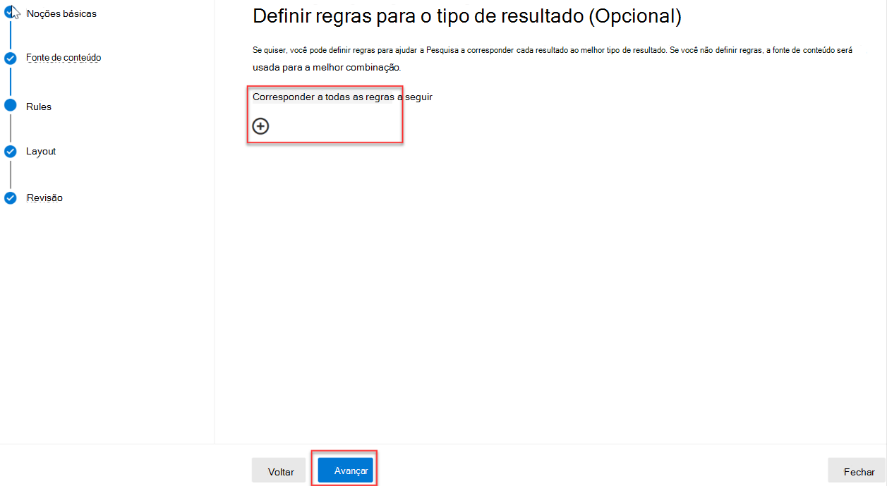
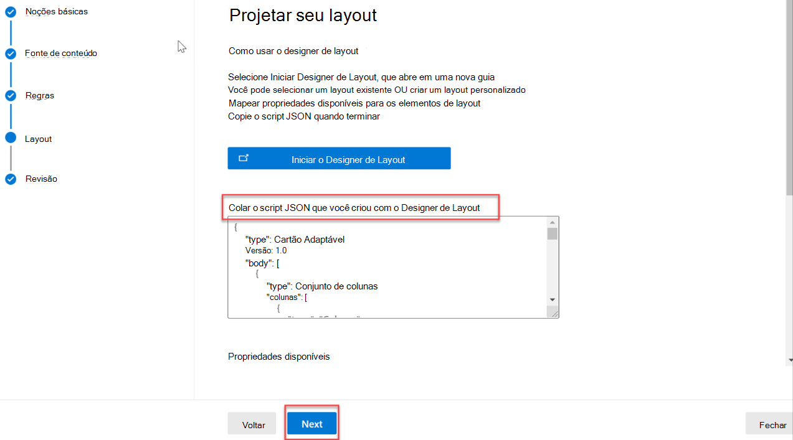

<!-- markdownlint-disable MD002 MD025 MD041 -->

Crie tipos de resultados e verticais de pesquisa para personalizar os resultados da pesquisa no Microsoft SharePoint, Microsoft Office e Pesquisa da Microsoft no Bing, para facilitar que os usuários encontrem as informações que eles têm permissão para ver.

## Criar uma vertical

Para criar e habilitar uma pesquisa vertical no nível da organização, entre no centro de Administração Microsoft 365 [usando](https://admin.microsoft.com/) a função de administrador global e faça o seguinte:

1. Vá para **Configurações**  >  **Search & de** inteligência  >  **Personalizações.**
2. Vá para **Vertical** e clique no **botão Adicionar.**
3. Forneça os seguintes detalhes:
  * **Nomeia o vertical:** Partes do dispositivo.

   

  * **Fonte de** conteúdo : o conector criado com o aplicativo. (Inventário de Partes)

   

  * **Adicionar uma consulta**: Deixar em branco.

   

  * **Filtros**: Deixar em branco.

   

## Criar um tipo de resultado

Para criar um tipo de resultado:

1. Vá para **Configurações**  >  **Search & de** inteligência  >  **Personalizações.**
2. Vá até a **guia tipo de** resultado e clique no botão **Adicionar.**
3. Forneça os seguintes detalhes:

  * **Nome**: Parte do Dispositivo

   

  * **Fonte de** conteúdo : o conector criado no aplicativo.

   

  * **Regras**: Nenhum

   

  * Colar o conteúdoresult-type.js[ na](https://github.com/microsoftgraph/msgraph-search-connector-sample/blob/master/result-type.json) caixa de texto do designer de layout.

   
