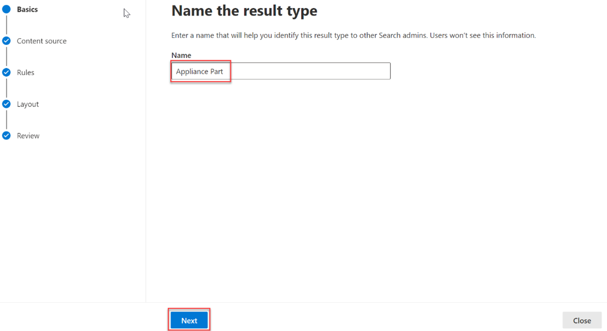

<!-- markdownlint-disable MD002 MD025 MD041 -->

Crie tipos de resultados e verticais de pesquisa para personalizar os resultados da pesquisa no Microsoft SharePoint, Microsoft Office e Pesquisa da Microsoft no Bing, para facilitar a busca das informações que eles têm permissão para ver.Create search verticals and result types to customize the search results in Microsoft SharePoint, Microsoft Office, and Microsoft Search in Bing, to make it easier for users to find the information that they have permission to see.

## Criar uma verticalCreate a vertical

Para criar e habilitar uma pesquisa vertical no nível da organização, entre no centro de administração do Microsoft 365 usando [a](https://admin.microsoft.com/) função de administrador global e faça o seguinte:To create and enable a search vertical at the organization level, sign in to the [Microsoft 365 Admin center](https://admin.microsoft.com/) using the global administrator role, and do the following:

1. Vá para **Configurações**  >  **Search & de** inteligência  >  **Personalizações.**Go to **Settings** > **Search & intelligence** > **Customizations**.
2. Vá para **Vertical** e clique no **botão Adicionar.**Go to **Vertical** and click the **Add** button.
3. Forneça os seguintes detalhes:Provide the following details:
  * **Nomeia o vertical:** Partes do dispositivo.**Name the vertical:** Appliance Parts.

   

  * **Fonte de** conteúdo : o conector criado com o aplicativo.**Content source**: The connector created with the app. (Inventário de Partes)(Parts Inventory)

   

  * **Adicionar uma consulta**: Deixar em branco.**Add a query**: Leave blank.

   

  * **Filtros**: Deixar em branco.**Filters**: Leave blank.

   

## Criar um tipo de resultadoCreate a result type

Para criar um tipo de resultado:To create a result type:

1. Vá para **Configurações**  >  **Search & de** inteligência  >  **Personalizações.**Go to **Settings** > **Search & intelligence** > **Customizations**.
2. Vá até a **guia tipo de** resultado e clique no botão **Adicionar.**Go to the **result type** tab and click the **Add** button.
3. Forneça os seguintes detalhes:Provide the following details:

  * **Nome**: Parte do Dispositivo**Name**: Appliance Part

   

  * **Fonte de** conteúdo : o conector criado no aplicativo.**Content source**: The connector created in the app.

   

  * **Regras**: Nenhum**Rules**: None

   

  * Colar o conteúdoresult-type.js[ na](https://github.com/microsoftgraph/msgraph-search-connector-sample/blob/master/result-type.json) caixa de texto do designer de layout.Paste contents of [result-type.json](https://github.com/microsoftgraph/msgraph-search-connector-sample/blob/master/result-type.json) into the layout designer textbox.

   
