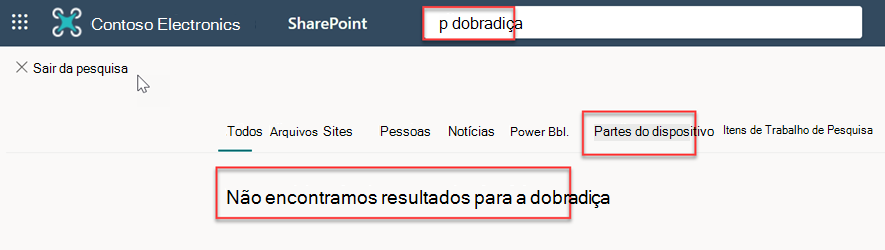
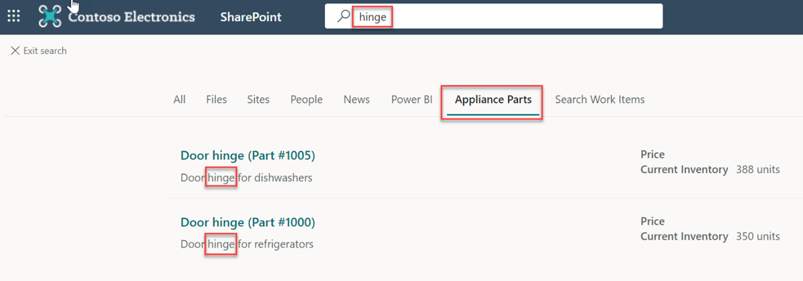

<!-- markdownlint-disable MD002 MD025 MD041 -->

Nesta etapa, você procurará por partes no SharePoint.

1. Vá para o site de SharePoint raiz para seu locatário.
2. Usando a caixa de pesquisa na parte superior da página, pesquise a **dobradiça**.

  

3. Quando a pesquisa for concluída com 0 resultados, selecione a guia **Partes do** Dispositivo.
4. Os resultados do conector serão exibidos.

  
