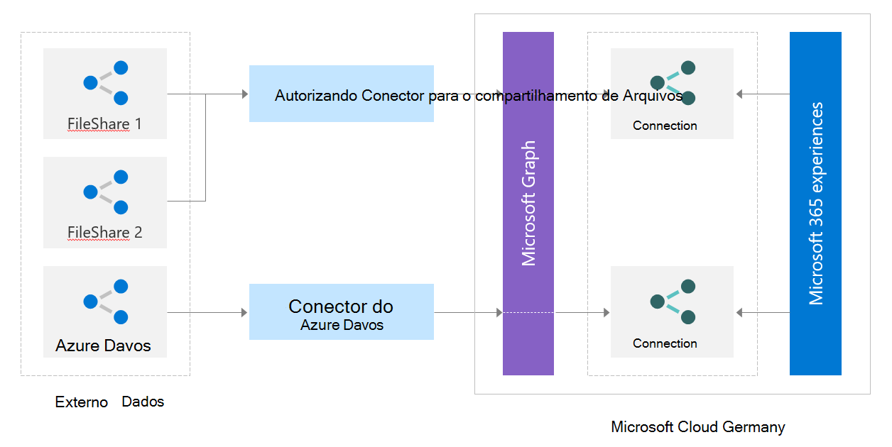

# Trabalhando com a API de conectores

Os conectores do Microsoft Graph oferecem uma maneira simples de trazer dados externos para o Microsoft Graph e aprimorar as experiências inteligentes do Microsoft 365. Você pode criar um conector personalizado para integração com serviços que não estão disponíveis como conectores desenvolvidos pela Microsoft. Para criar conectores personalizados, use as APIs REST do conector do Microsoft Graph.

Você pode usar a API de conectores do Microsoft Graph para:

1. Criar e gerenciar conexões de dados externos.
2. Definir e registrar o esquema dos tipos de dados externos.
3. Ingerir itens de dados externos no Microsoft Graph.
4. Sincronizar grupos externos.

Para obter mais detalhes sobre essas APIs, confira a documentação sugerida a seguir.

## API de conexões

Uma conexão é um contêiner lógico dos dados externos que você pode gerenciar como uma única unidade.
Para saber mais sobre como criar, atualizar e excluir conexões no Microsoft Graph, visite a seção [Gerenciar conexão](connecting-external-content-manage-connections.md).

## API de esquema

O [esquema](/graph/api/resources/schema?view=graph-rest-beta&amp;preserve-view=true) de conexão determina como seu conteúdo será usado em várias experiências do Microsoft 365. O esquema é uma lista simples de todas as propriedades que você planeja adicionar à conexão junto com seus atributos, rótulos e aliases. Você deve registrar o esquema antes de ingerir itens no Microsoft Graph.

Para saber mais sobre como registrar o esquema da conexão do Microsoft Graph e suas propriedades, visite a seção [Gerenciar esquema](connecting-external-content-manage-schema.md).

## Ingerir itens de dados externos

Os conectores do Microsoft Graph oferecem uma maneira simples de trazer dados externos para o Microsoft Graph. Os itens adicionados por seu aplicativo ao serviço Pesquisa da Microsoft são representados pelo recurso [externalItem](/graph/api/resources/externalitem?view=graph-rest-beta&preserve-view=true) no Microsoft Graph.

Para saber mais sobre como criar, atualizar e excluir itens adicionados por seu aplicativo por meio de conectores do Microsoft Graph, visite a seção [Gerenciar itens](connecting-external-content-manage-items.md).

## API de grupos externos

Os itens no serviço externo podem ter acesso concedido ou negado por meio da ACL para diferentes tipos de grupos que não são do Azure Active Directory. Por exemplo, os itens do Salesforce podem ter perfis e conjuntos de permissões. Os itens do ServiceNow podem ter grupos locais. Ao ingerir esses itens no Microsoft Graph, você precisará respeitar essas ACLs.

Você pode usar a API de grupos externos para definir permissões sobre itens externos ingeridos no Microsoft Graph. Um [externalGroup](/graph/api/externalgroup-post-members?view=graph-rest-beta&amp;preserve-view=true) representa uma construção semelhante a um grupo ou um grupo que não faz parte do Azure Active Directory (como unidades de negócios, equipes e assim por diante) e determina as permissões no conteúdo em sua fonte de dados externa.
