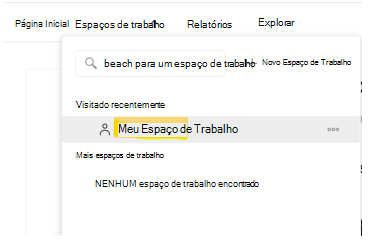
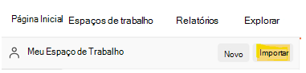
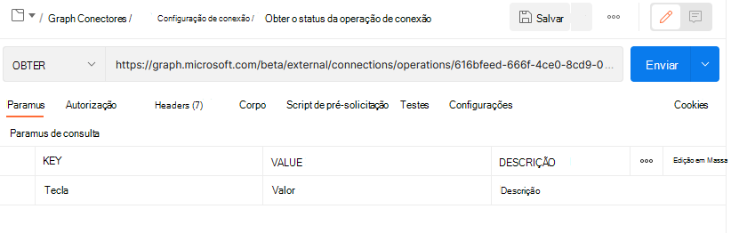
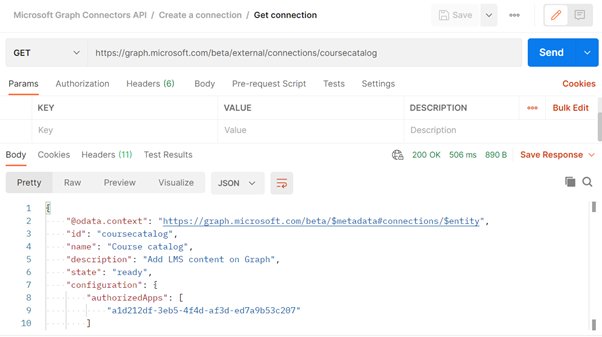

# <a name="use-postman-with-the-microsoft-graph-connectors-api"></a>Usar o Postman com a API de conectores do Microsoft Graph

Este tópico descreve como você pode usar as APIs do conector do Microsoft Graph com o Postman.

## <a name="prerequisites"></a>Pré-requisitos

* Uma conta Microsoft ou uma conta corporativa ou de estudante.
* Acesso a um locatário de desenvolvedor do Microsoft 365. Se você não tiver um, poderá se inscrever no [Programa para Desenvolvedores do Microsoft 365] para obter uma assinatura de desenvolvedor gratuita.

## <a name="step-1---import-the-microsoft-graph-postman-collection"></a>Etapa 1- Importar a coleção Postman do Microsoft Graph

Para usar a coleção Postman, você precisa importá-la para seu espaço de trabalho Postman. Faça isso a partir de um navegador da web.

1. Acesse [Postman](https://identity.getpostman.com/signup) e inscreva-se. Se você já tiver uma conta do Postman, poderá [Entrar](https://identity.getpostman.com/login).

2. Depois de entrar, vá para **Meu espaço de trabalho**.



3. Após acessar **Meu espaço de trabalho**, selecione o botão **Importar**.



4. Na caixa de diálogo que se abre, selecione a guia **Link** e insira a seguinte URL na caixa de texto:  `https://www.postman.com/collections/61bfc772fe030514b062`.


5. Selecione **Continuar**.
6. Selecione **Importar**.


Agora você deverá ver a coleção da API de conectores do Microsoft Graph dentro do Postman.


> [!NOTE]
> A API do conector do Microsoft Graph foi adicionada recentemente à [coleção Postman do Microsoft Graph](https://www.postman.com/microsoftgraph/workspace/microsoft-graph/overview).
Este documento será editado em breve para usar essa coleção.

## <a name="step-2---download-the-postman-agent-optional---postman-web-browser-only"></a>Etapa 2 - Baixar o agente Postman (Opcional - somente navegador da Web do Postman)

Para usar esta coleção Postman em seu navegador, baixe o [Agente de área de trabalho do Postman](https://www.postman.com/downloads). Não é possível usar o Postman para a Web sem isso devido às restrições de CORS do navegador.
"O número máximo de recursos de [conexão](/graph/api-reference/resources/externalconnection?view=graph-rest-beta&preserve-view=true) por locatário do Microsoft 365."

> [!NOTE]
> Você não precisará do agente se estiver usando o aplicativo Postman para Windows. Se você abrir o Postman para Windows, verá essa coleção em seu espaço de trabalho.

## <a name="step-3---create-an-azure-ad-application"></a>Etapa 3 - Criar um aplicativo do Azure AD

Para usar essa coleção no próprio locatário de desenvolvedor, crie um aplicativo do Azure AD e conceda a ele as permissões apropriadas para as solicitações que deseja chamar.

1. Acesse o [portal.azure.com](https://portal.azure.com/) e **Entre** com sua conta de administrador de locatários de desenvolvedor.
2. Em Serviços do Azure, selecione o **Azure Active Directory**.
3. No menu à esquerda, selecione **Registros de aplicativo**.
4. No menu horizontal, selecione **Novo registro**.
5. Defina o nome do aplicativo como "Inventário de peças".
6. Defina a URI de redirecionamento comohttps://oauth.pstmn.io/v1/browser-callback.
7. Selecione **Registrar**.
8. No menu à esquerda, selecione **Permissões da API**.
9. No menu horizontal, selecione **Adicionar uma permissão** > **Microsoft Graph** > **Permissões delegadas**.
10. Comece a digitar `ExternalItem.ReadWrite.All` e marque `ExternalItem.ReadWrite.All`.
11. Selecione **Permissões de aplicativo**, digite "Usuário" e verifique as **Permissões de aplicativo**.
12. Expanda as **Opções de usuário** e marque **`ExternalItem.ReadWrite.All`**.
13. Selecione **Adicionar permissões**.
14. No menu horizontal, selecione **Conceder consentimento de administrador** e, em seguida, selecione **Sim**.
15. No menu à esquerda, selecione **Visão geral**. A partir daqui, você poderá obter a ID de aplicativo (cliente) e a ID de diretório (locatário). Você precisará delas na etapa 4.
16. No menu à esquerda, selecione **Certificados e segredos**.
17. Selecione **Novo segredo do cliente**, insira uma descrição e selecione **Adicionar**. Copie o valor do novo segredo do cliente. Você precisará dele na etapa 4.

O aplicativo do Azure AD agora tem permissões para fazer solicitações em nome de um usuário para chamar `ExternalItem.ReadWrite.All` e como aplicativo do `ExternalItem.ReadWrite.All`.

## <a name="step-4--configure-authentication"></a>Etapa 4 - Configurar autenticação

Configure as variáveis no Postman. Essa informação é usada pra gerar o token de acesso.

1. Selecione a guia **API de conectores do Microsoft Graph** e vá para a seção **Variáveis**.


2. Na seção Variáveis, forneça as informações necessárias usando as informações da etapa 3.

- Defina o **Valor atual** da **ID\_do cliente** para o valor da ID do aplicativo (cliente) da etapa 3.15.
- Defina o **Valor atual** do **segredo\_do cliente** para o valor do Segredo do cliente da etapa 3.17.
- Defina o **Valor atual** do **locatário** como o valor da ID de diretório (locatário) da etapa 3.15.
- Defina o **Valor atual** do **nome de usuário** como `admin@xxxxxxx.onmicrosoft.com`
- Defina o **Valor atual** da **senha** como a senha do administrador do locatário.


3. Selecione **Salvar** / **Atualizar**.

## <a name="step-5---get-an-authentication-token"></a>Etapa 5 - Obter um token de autenticação

Como esta é a primeira vez que você está executando uma solicitação como um fluxo de autenticação de aplicativo, é necessário obter um token de acesso. Obtenha o token de acesso do aplicativo fazendo a seguinte solicitação POST:


O exemplo a seguir mostra como obter um token de acesso com um segredo compartilhado:
```html
POST /{{tenant}}/oauth2/v2.0/token HTTP/1.1 //Line breaks for clarity
Host: login.microsoftonline.com
Content-Type: application/x-www-form-urlencoded

client_id={{client_id}} 
&scope=https%3A%2F%2Fgraph.microsoft.com%2F.default 
&client_secret={{client_secret}} 
&grant_type=client_credentials 
```
O exemplo a seguir mostra uma resposta bem-sucedida:
```html
{ 
    "token_type": "Bearer", 
    "expires_in": 3599, 
    "ext_expires_in": 3599, 
    "access_token": "eyJ0eXAiOiJKV1QiLCJu… " 
} 
```

Observe que você está usando o [fluxo de credencial do cliente](/azure/active-directory/develop/v2-oauth2-client-creds-grant-flow) aqui. Certifique-se de obter um token de acesso do aplicativo e não um token de acesso do usuário.

## <a name="step-6--create-a-new-connection"></a>Etapa 6 - Criar uma nova conexão

Uma [conexão](/concepts/connecting-external-content-manage-connections.md) é um contêiner lógico de dados externos que você pode gerenciar como uma única unidade. Escolha um nome, id e descrição da conexão. Obtenha os detalhes necessários do administrador para se conectar à fonte de dados e forneça um mecanismo para autorizar a fonte de conteúdo ao configurar a conexão. Você pode usar as APIs e o [SDK do Microsoft Graph](/graph/sdks/sdks-overview) para programar a configuração do conector. Se deseja armazenar credenciais, você pode usar o Azure Key Vault.

```http
POST /external/connections
```

A seguir está um exemplo da solicitação.

```http
POST https://graph.microsoft.com/beta/external/connections 
Content-type: application/json 

{ 
  "id": "contosotasks", 
  "name": "Contoso Tasks", 
  "description": "Connection to index Contoso task management system" 
} 
```

A seguir está um exemplo da resposta.

```http
HTTP/1.1 201 Created 
Content-type: application/json 
 
{ 
    "@odata.context": "https://graph.microsoft.com/beta/$metadata#connections/$entity", 
    "id": "contosotasks", 
    "name": "Contoso Tasks", 
    "description": "Connection to index Contoso task management system", 
    "state": null, 
    "configuration": { 
        "authorizedApps": [ 
            "a47b35b7-6271-4e6d-9e27-2450a8b9c6b6" 
        ] 
    } 
} 
```

Veja a seguir uma captura de tela da seção **Criar conexão**.

 

## <a name="step-7---register-connection-schema"></a>Etapa 7 - Registrar esquema de conexão

O esquema de conexão determina como o seu conteúdo será usado em várias experiências do Microsoft Graph. O esquema é uma lista simples de todas as propriedades que você planeja adicionar à conexão, juntamente com seus atributos, rótulos e aliases. Você deve registrá-lo antes de adicionar itens na conexão.

```http
POST /external/connections/{id}/schema 
```

A seguir está um exemplo da solicitação.

```http
POST https://graph.microsoft.com/beta/external/connections/contosotasks/schema 
Content-type: application/json 
Prefer: respond-async 

{ 
  "baseType": "microsoft.graph.externalItem", 
  "properties": [ 
    { 
"name": "title", 
      "type": "String", 
      "isSearchable": "true", 
"isQueryable": "true", 
      "isRetrievable": "true", 
      "labels": [ 
        "title" 
      ] 
    }, 
    { 
"aliases": "creator", 
      "name": "createdBy", 
      "type": "String", 
      "isSearchable": "true", 
"isQueryable": "true", 
      "isRetrievable": "false", 
"isRefinable": "false", 
      "labels": [ 
        "createdBy" 
      ] 
    }, 
    { 
"aliases": "editedDate", 
      "name": "lastEditedDate", 
      "type": "DateTime", 
      "isSearchable": "false", 
"isQueryable": "true", 
      "isRetrievable": "true", 
"isRefinable": "true", 
      "labels": [ 
   "lastModifiedDateTime" 
] 
    } 
  ] 
} 
```

A seguir está um exemplo da resposta.

```http
HTTP/1.1 202 Accepted 
Location: https://graph.microsoft.com/beta/external/connections/contosotasks/operations/616bfeed-666f-4ce0-8cd9-058939010bfc 
```

> [!NOTE]
> Registrar o esquema de conexão é uma operação assíncrona, portanto, não ingerir itens na conexão até que o esquema de conexão esteja no estado Concluído. Para verificar o status do esquema de conexão, execute a seguinte solicitação:
> ```http
> GET /external/connections/contosotasks/operations/616bfeed-666f-4ce0-8cd9-058939010bfc 
> ```

Este é outro exemplo de solicitação.
```http
Request 
GET https://graph.microsoft.com/beta/external/connections/operations/616bfeed-666f-4ce0-8cd9-058939010bfc 
```

E, em seguida, o respectivo exemplo de resposta.

```http
HTTP/1.1 200 OK 
Content-type: application/json 

{
    @odata.context":"https://graph.microsoft.com/beta/$metadata#external/connections('coursecatalog')/operations/$entity", 
    "id": "aa9186d2-893c-4361-ca51-431d88fa45d8", 
    "name": "Contoso Tasks", 
    "status": "inprogress", 
    "error": null  
}
```

Veja a seguir uma captura de tela da seção **Obter status da operação**.



Depois que o status da operação do esquema de conexão muda de **InProgress** para **Concluído**, você poderá ingerir itens para a conexão.

A captura de tela a seguir mostra o status como "concluído".

 

A captura de tela a seguir mostra o estado como "rascunho".

 

Depois que o estado da conexão muda de **rascunho** para **pronto**, conforme mostrado na próxima captura de tela, você poderá ingerir itens na conexão atual.



## <a name="step-8---add-external-group-member-optional"></a>Etapa 8 - Adicionar membro de grupo externo (opcional)

Se o serviço externo usa ACLs que não sejam do Azure AD, sincronize essas permissões.  

Grupos externos (juntamente com usuários e grupos do Azure Active Directory) são usados ​​para definir permissões no `externalItems` adicionadas a uma conexão do Microsoft Graph. Para obter detalhes, confira [externalGroups](/graph/api/resources/externalgroup?view=graph-rest-beta).

Este é um exemplo de uma solicitação.

```http
POST https://graph.microsoft.com/beta/external/connections/contosotasks/groups/31bea3d537902000/members 
Content-Type: application/json 
 
{ 
  "@odata.type": "#microsoft.graph.externalGroupMember", 
  "id": "1431b9c38ee647f6a", 
  "type": "group", 
  "identitySource": "external" 
} 
```

A seguir veremos um exemplo da resposta.

```http
HTTP/1.1 201 Created 
Content-Type: application/json 

{ 
  "@odata.type": "#microsoft.graph.externalGroupMember", 
  "id": "14m1b9c38qe647f6a", 
  "type": "group", 
  "identitySource": "external" 
} 
```

A captura de tela a seguir mostra a seção **Criar grupo externo**.


## <a name="step-9---ingest-items"></a>Etapa 9 - Ingerir itens

Depois de criar uma conexão, você poderá adicionar seu conteúdo. Cada item da fonte de dados deve ser representado como um `externalItem` no Microsoft Graph com uma ID de item exclusiva. Essa ID é usada para criar, atualizar ou excluir o item do Microsoft Graph. Você pode usar a chave primária da fonte de dados como a `itemId` ou derivá-la de um ou mais campos. Um `externalItem` possui três componentes principais: lista de controle de acesso, propriedades e conteúdo.

Se você tiver arquivos binários, deverá analisá-los para obter os metadados e uma versão em texto do conteúdo. Se você tiver conteúdo não textual, como um arquivo PDF ou BMP, deverá usar o reconhecimento de caracteres do objeto para converter o conteúdo em texto.  

Você é responsável por converter suas permissões de fonte para conceder ou negar. Negar tem maior precedência sobre a concessão.

A seguir está um exemplo de solicitação.

```http
PUT https://graph.microsoft.com/beta/connections/contosohr/items/TSP228082938 
Content-type: application/json 

{ 
  "@odata.type": "microsoft.graph.externalItem", 
  "acl": [ 
    { 
      "type": "user", 
      "value": "e811976d-83df-4cbd-8b9b-5215b18aa874", 
      "accessType": "grant", 
      "identitySource": "azureActiveDirectory" 
    }, 
    { 
      "type": "group", 
      "value": "14m1b9c38qe647f6a", 
      "accessType": "deny", 
      "identitySource": "external" 
    } 
  ], 
  "properties": { 
    "ticketID": "1158", 
    "priority": 1, 
    "title": "Filter design", 
  }, 
  "content": { 
    "value": "Build filtering capability by...", 
    "type": "text" 
  } 
} 
```

A seguir está um exemplo de uma resposta bem-sucedida.

```http
HTTP/1.1 200 OK
```

## <a name="error-handling"></a>Tratamento de erro

Para obter detalhes sobre como resolver erros, confira [Erros de autorização do Microsoft Graph](/graph/resolve-auth-errors).
