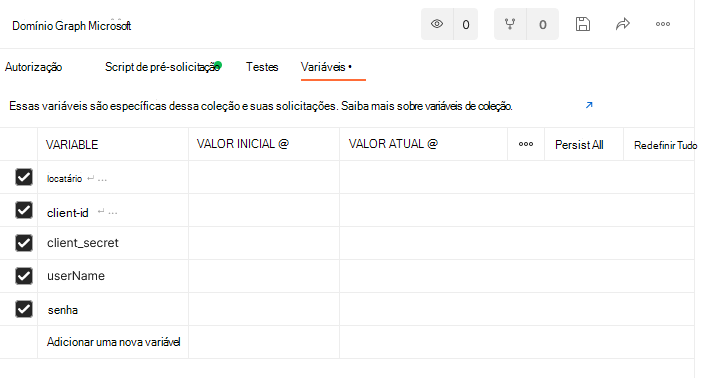

# <a name="use-postman-with-the-microsoft-graph-connectors-api"></a><span data-ttu-id="54816-103">Usar o Postman com a API de conectores do Microsoft Graph</span><span class="sxs-lookup"><span data-stu-id="54816-103">Use Postman with the Microsoft Graph connectors API</span></span>

<span data-ttu-id="54816-104">Este tópico descreve como você pode usar as APIs do conector do Microsoft Graph com o Postman.</span><span class="sxs-lookup"><span data-stu-id="54816-104">This topic describes how you can use the Microsoft Graph connector APIs with Postman.</span></span>

## <a name="prerequisites"></a><span data-ttu-id="54816-105">Pré-requisitos</span><span class="sxs-lookup"><span data-stu-id="54816-105">Prerequisites</span></span>

* <span data-ttu-id="54816-106">Uma conta Microsoft ou uma conta corporativa ou de estudante.</span><span class="sxs-lookup"><span data-stu-id="54816-106">Either a Microsoft account or work or school account.</span></span>
* <span data-ttu-id="54816-107">Acesso a um locatário de desenvolvedor do Microsoft 365.</span><span class="sxs-lookup"><span data-stu-id="54816-107">Access to a Microsoft 365 developer tenant.</span></span> <span data-ttu-id="54816-108">Caso ainda não tenha uma, inscreva-se no [Programa para desenvolvedores do Microsoft 365] para obter uma assinatura de desenvolvedor gratuita.</span><span class="sxs-lookup"><span data-stu-id="54816-108">If you don't have one, you can sign up for the [Microsoft 365 Developer Program] to get a free developer subscription.</span></span>

## <a name="step-1---import-the-microsoft-graph-postman-collection"></a><span data-ttu-id="54816-109">Etapa 1- Importar a coleção Postman do Microsoft Graph</span><span class="sxs-lookup"><span data-stu-id="54816-109">Step 1 - Import the Microsoft Graph Postman collection</span></span>

<span data-ttu-id="54816-110">Para usar a coleção Postman, você precisa importá-la para o seu espaço de trabalho do Postman.</span><span class="sxs-lookup"><span data-stu-id="54816-110">To use the Postman collection, you need to import it into your Postman workspace.</span></span> <span data-ttu-id="54816-111">Faça isso em um navegador da Web.</span><span class="sxs-lookup"><span data-stu-id="54816-111">Do this from a web browser.</span></span>

1. <span data-ttu-id="54816-112">Acesse [Postman](https://identity.getpostman.com/signup) e inscreva-se.</span><span class="sxs-lookup"><span data-stu-id="54816-112">Go to [Postman](https://identity.getpostman.com/signup) and sign up.</span></span> <span data-ttu-id="54816-113">Se você já tiver uma conta do Postman, poderá [Entrar](https://identity.getpostman.com/login).</span><span class="sxs-lookup"><span data-stu-id="54816-113">If you already have a Postman account, you can [sign in](https://identity.getpostman.com/login).</span></span>

2. <span data-ttu-id="54816-114">Depois de entrar, vá para **Meu espaço de trabalho**.</span><span class="sxs-lookup"><span data-stu-id="54816-114">After you sign in, go to **My workspace**.</span></span>


3. <span data-ttu-id="54816-116">Após acessar **Meu espaço de trabalho**, selecione o botão **Importar**.</span><span class="sxs-lookup"><span data-stu-id="54816-116">After you go into **My workspace**, select the **Import** button.</span></span>


4. <span data-ttu-id="54816-118">Na caixa de diálogo que se abre, selecione a guia **Link** e insira a seguinte URL na caixa de texto:  `https://www.postman.com/collections/61bfc772fe030514b062`.</span><span class="sxs-lookup"><span data-stu-id="54816-118">In the dialog that opens, select **Link** tab and enter the following URL - in the textbox:  `https://www.postman.com/collections/61bfc772fe030514b062`.</span></span>


5. <span data-ttu-id="54816-120">Selecione **Continuar**.</span><span class="sxs-lookup"><span data-stu-id="54816-120">Select **Continue**.</span></span>
6. <span data-ttu-id="54816-121">Selecione **Importar**.</span><span class="sxs-lookup"><span data-stu-id="54816-121">Select **Import**.</span></span>


<span data-ttu-id="54816-123">Agora você deverá ver a coleção da API de conectores do Microsoft Graph dentro do Postman.</span><span class="sxs-lookup"><span data-stu-id="54816-123">You should now see the Microsoft Graph connectors API collection inside Postman.</span></span>


> [!NOTE]
> <span data-ttu-id="54816-125">A API do conector do Microsoft Graph foi adicionada recentemente à [coleção Postman do Microsoft Graph](https://www.postman.com/microsoftgraph/workspace/microsoft-graph/overview).</span><span class="sxs-lookup"><span data-stu-id="54816-125">The Microsoft Graph connector API was recently added into the [Microsoft Graph postman collection](https://www.postman.com/microsoftgraph/workspace/microsoft-graph/overview).</span></span>
<span data-ttu-id="54816-126">Este documento será editado em breve para usar essa coleção.</span><span class="sxs-lookup"><span data-stu-id="54816-126">This document will be edited soon to use that collection instead.</span></span>

## <a name="step-2---download-the-postman-agent-optional---postman-web-browser-only"></a><span data-ttu-id="54816-127">Etapa 2 - Baixar o agente Postman (Opcional - somente navegador da Web do Postman)</span><span class="sxs-lookup"><span data-stu-id="54816-127">Step 2 - Download the Postman Agent (Optional - Postman Web browser only)</span></span>

<span data-ttu-id="54816-128">Para usar esta coleção Postman em seu navegador, baixe o [Agente de área de trabalho do Postman](https://www.postman.com/downloads).</span><span class="sxs-lookup"><span data-stu-id="54816-128">To use this Postman collection in your web browser, download the [Postman Desktop Agent](https://www.postman.com/downloads).</span></span> <span data-ttu-id="54816-129">Não é possível usar o Postman para a Web sem isso devido às restrições de CORS do navegador.</span><span class="sxs-lookup"><span data-stu-id="54816-129">You can't use Postman for the web without this due to CORS restrictions in the web browser.</span></span>
<span data-ttu-id="54816-130">"O número máximo de recursos de [conexão](/graph/api-reference/resources/externalconnection?view=graph-rest-beta&preserve-view=true) por locatário do Microsoft 365."</span><span class="sxs-lookup"><span data-stu-id="54816-130">"The maximum number of [connection](/graph/api-reference/resources/externalconnection?view=graph-rest-beta&preserve-view=true) resources per Microsoft 365 tenant."</span></span>

> [!NOTE]
> <span data-ttu-id="54816-131">Você não precisará do agente se estiver usando o aplicativo Postman para Windows.</span><span class="sxs-lookup"><span data-stu-id="54816-131">You don't need the agent if you're using the Postman for Windows app.</span></span> <span data-ttu-id="54816-132">Se você abrir o Postman para Windows, verá essa coleção em seu espaço de trabalho.</span><span class="sxs-lookup"><span data-stu-id="54816-132">If you open Postman for Windows, you will see this collection in your workspace.</span></span>

## <a name="step-3---create-an-azure-ad-application"></a><span data-ttu-id="54816-133">Etapa 3 - Criar um aplicativo do Azure AD</span><span class="sxs-lookup"><span data-stu-id="54816-133">Step 3 - Create an Azure AD application</span></span>

<span data-ttu-id="54816-134">Para usar essa coleção no próprio locatário de desenvolvedor, crie um aplicativo do Azure AD e conceda a ele as permissões apropriadas para as solicitações que deseja chamar.</span><span class="sxs-lookup"><span data-stu-id="54816-134">To use this collection in your own developer tenant, create an Azure AD application and give it the appropriate permissions for the requests you want to call.</span></span>

1. <span data-ttu-id="54816-135">Acesse o [portal.azure.com](https://portal.azure.com/) e **Entre** com sua conta de administrador de locatários de desenvolvedor.</span><span class="sxs-lookup"><span data-stu-id="54816-135">Go to [portal.azure.com](https://portal.azure.com/) and **Sign in** with your developer tenant administrator account.</span></span>
2. <span data-ttu-id="54816-136">Em Serviços do Azure, selecione o **Azure Active Directory**.</span><span class="sxs-lookup"><span data-stu-id="54816-136">Under Azure Services, select **Azure Active Directory**.</span></span>
3. <span data-ttu-id="54816-137">No menu à esquerda, selecione **Registros de aplicativo**.</span><span class="sxs-lookup"><span data-stu-id="54816-137">On the left menu, select **App registrations**.</span></span>
4. <span data-ttu-id="54816-138">No menu horizontal, selecione **Novo registro**.</span><span class="sxs-lookup"><span data-stu-id="54816-138">On the horizontal menu, select **New registration**.</span></span>
5. <span data-ttu-id="54816-139">Defina o nome do aplicativo como "Inventário de peças".</span><span class="sxs-lookup"><span data-stu-id="54816-139">Set the Application name to "Parts Inventory".</span></span>
6. <span data-ttu-id="54816-140">Defina a URI de redirecionamento comohttps://oauth.pstmn.io/v1/browser-callback.</span><span class="sxs-lookup"><span data-stu-id="54816-140">Set the Redirect URI to https://oauth.pstmn.io/v1/browser-callback.</span></span>
7. <span data-ttu-id="54816-141">Selecione **Registrar**.</span><span class="sxs-lookup"><span data-stu-id="54816-141">Select **Register**.</span></span>
8. <span data-ttu-id="54816-142">No menu à esquerda, selecione **Permissões da API**.</span><span class="sxs-lookup"><span data-stu-id="54816-142">On the left menu, select **API Permissions**.</span></span>
9. <span data-ttu-id="54816-143">No menu horizontal, selecione **Adicionar uma permissão** > **Microsoft Graph** > **Permissões delegadas**.</span><span class="sxs-lookup"><span data-stu-id="54816-143">In the horizontal menu, select **Add a permission** > **Microsoft Graph** > **Delegated Permissions**.</span></span>
10. <span data-ttu-id="54816-144">Comece a digitar `ExternalItem.ReadWrite.All` e marque `ExternalItem.ReadWrite.All`.</span><span class="sxs-lookup"><span data-stu-id="54816-144">Start typing `ExternalItem.ReadWrite.All` and check `ExternalItem.ReadWrite.All`.</span></span>
11. <span data-ttu-id="54816-145">Selecione **Permissões de aplicativo**, digite "Usuário" e verifique as **Permissões de aplicativo**.</span><span class="sxs-lookup"><span data-stu-id="54816-145">Select **Application permissions**, type "User"., and check **Application Permissions**.</span></span>
12. <span data-ttu-id="54816-146">Expanda as **Opções de usuário** e marque **`ExternalItem.ReadWrite.All`**.</span><span class="sxs-lookup"><span data-stu-id="54816-146">Expand the **User options** and check **`ExternalItem.ReadWrite.All`**.</span></span>
13. <span data-ttu-id="54816-147">Selecione **Adicionar permissões**.</span><span class="sxs-lookup"><span data-stu-id="54816-147">Select **Add permissions**.</span></span>
14. <span data-ttu-id="54816-148">No menu horizontal, selecione **Conceder consentimento de administrador** e, em seguida, selecione **Sim**.</span><span class="sxs-lookup"><span data-stu-id="54816-148">In the horizontal menu, select **Grant admin consent for**, and select **Yes**.</span></span>
15. <span data-ttu-id="54816-149">No menu à esquerda, selecione **Visão geral**.</span><span class="sxs-lookup"><span data-stu-id="54816-149">In the left menu, select **Overview**.</span></span> <span data-ttu-id="54816-150">A partir daqui, você poderá obter a ID de aplicativo (cliente) e a ID de diretório (locatário).</span><span class="sxs-lookup"><span data-stu-id="54816-150">From here, you can get the Application (client) ID and Directory (tenant) ID.</span></span> <span data-ttu-id="54816-151">Você precisará delas na etapa 4.</span><span class="sxs-lookup"><span data-stu-id="54816-151">You will need these in step 4.</span></span>
16. <span data-ttu-id="54816-152">No menu à esquerda, selecione **Certificados e segredos**.</span><span class="sxs-lookup"><span data-stu-id="54816-152">In the left menu, select **Certificates and secrets**.</span></span>
17. <span data-ttu-id="54816-153">Selecione **Novo segredo do cliente**, insira uma descrição e selecione **Adicionar**.</span><span class="sxs-lookup"><span data-stu-id="54816-153">Select **New client secret**, enter a description, and select **Add**.</span></span> <span data-ttu-id="54816-154">Copie o valor do novo segredo do cliente. Você precisará dele na etapa 4.</span><span class="sxs-lookup"><span data-stu-id="54816-154">Copy the new client secret value, you will need this in step 4.</span></span>

<span data-ttu-id="54816-155">O aplicativo do Azure AD agora tem permissões para fazer solicitações em nome de um usuário para chamar `ExternalItem.ReadWrite.All` e como aplicativo do `ExternalItem.ReadWrite.All`.</span><span class="sxs-lookup"><span data-stu-id="54816-155">The Azure AD application now has permissions to make requests on behalf of a user to call `ExternalItem.ReadWrite.All`, and as an application for `ExternalItem.ReadWrite.All`.</span></span>

## <a name="step-4--configure-authentication"></a><span data-ttu-id="54816-156">Etapa 4 - Configurar autenticação</span><span class="sxs-lookup"><span data-stu-id="54816-156">Step 4 – Configure authentication</span></span>

<span data-ttu-id="54816-157">Configure as variáveis no Postman.</span><span class="sxs-lookup"><span data-stu-id="54816-157">Set up the variables in Postman.</span></span> <span data-ttu-id="54816-158">Essa informação é usada pra gerar o token de acesso.</span><span class="sxs-lookup"><span data-stu-id="54816-158">This information is used to generate the access token.</span></span>

1. <span data-ttu-id="54816-159">Selecione a guia **API de conectores do Microsoft Graph** e vá para a seção **Variáveis**.</span><span class="sxs-lookup"><span data-stu-id="54816-159">Select the **Microsoft Graph connectors API** tab and go to the **Variables** section.</span></span>


2. <span data-ttu-id="54816-161">Na seção Variáveis, forneça as informações necessárias usando as informações da etapa 3.</span><span class="sxs-lookup"><span data-stu-id="54816-161">In the Variables section, provide the required information using the information from step 3.</span></span>

- <span data-ttu-id="54816-162">Defina o **Valor atual** da **ID\_do cliente** para o valor da ID do aplicativo (cliente) da etapa 3.15.</span><span class="sxs-lookup"><span data-stu-id="54816-162">Set the  **Current value**  of **client\_id** to the Application (client) ID value from step 3.15.</span></span>
- <span data-ttu-id="54816-163">Defina o **Valor atual** do **segredo\_do cliente** para o valor do Segredo do cliente da etapa 3.17.</span><span class="sxs-lookup"><span data-stu-id="54816-163">Set the  **Current value** of **client\_secret** to the Client Secret value from step 3.17.</span></span>
- <span data-ttu-id="54816-164">Defina o **Valor atual** do **locatário** como o valor da ID de diretório (locatário) da etapa 3.15.</span><span class="sxs-lookup"><span data-stu-id="54816-164">Set the  **Current value**  of **tenant** to the Directory (tenant) ID value from step 3.15.</span></span>
- <span data-ttu-id="54816-165">Defina o **Valor atual** do **nome de usuário** como `admin@xxxxxxx.onmicrosoft.com`</span><span class="sxs-lookup"><span data-stu-id="54816-165">Set the  **Current value**  of **username** to `admin@xxxxxxx.onmicrosoft.com`</span></span>
- <span data-ttu-id="54816-166">Defina o **Valor atual** da **senha** como a senha do administrador do locatário.</span><span class="sxs-lookup"><span data-stu-id="54816-166">Set the  **Current value**  of **password** to tenant admin password.</span></span>



3. <span data-ttu-id="54816-168">Selecione **Salvar** / **Atualizar**.</span><span class="sxs-lookup"><span data-stu-id="54816-168">Select  **Save** / **Update**.</span></span>

## <a name="step-5---get-an-authentication-token"></a><span data-ttu-id="54816-169">Etapa 5 - Obter um token de autenticação</span><span class="sxs-lookup"><span data-stu-id="54816-169">Step 5 - Get an authentication token</span></span>

<span data-ttu-id="54816-170">Como esta é a primeira vez que você está executando uma solicitação como um fluxo de autenticação de aplicativo, é necessário obter um token de acesso.</span><span class="sxs-lookup"><span data-stu-id="54816-170">You need to get an access token because this is the first time you are running a request as an application authentication flow.</span></span> <span data-ttu-id="54816-171">Obtenha o token de acesso do aplicativo fazendo a seguinte solicitação POST:</span><span class="sxs-lookup"><span data-stu-id="54816-171">Get the app access token by making the following POST request:</span></span>


<span data-ttu-id="54816-173">O exemplo a seguir mostra como obter um token de acesso com um segredo compartilhado:</span><span class="sxs-lookup"><span data-stu-id="54816-173">The following example shows how to get an access token with a shared secret:</span></span>
```html
POST /{{tenant}}/oauth2/v2.0/token HTTP/1.1 //Line breaks for clarity
Host: login.microsoftonline.com
Content-Type: application/x-www-form-urlencoded

client_id={{client_id}} 
&scope=https%3A%2F%2Fgraph.microsoft.com%2F.default 
&client_secret={{client_secret}} 
&grant_type=client_credentials 
```
<span data-ttu-id="54816-174">O exemplo a seguir mostra uma resposta bem-sucedida:</span><span class="sxs-lookup"><span data-stu-id="54816-174">The following example shows a successful response:</span></span>
```html
{ 
    "token_type": "Bearer", 
    "expires_in": 3599, 
    "ext_expires_in": 3599, 
    "access_token": "eyJ0eXAiOiJKV1QiLCJu… " 
} 
```

<span data-ttu-id="54816-175">Observe que você está usando o [fluxo de credencial do cliente](/azure/active-directory/develop/v2-oauth2-client-creds-grant-flow) aqui.</span><span class="sxs-lookup"><span data-stu-id="54816-175">Note that you are using the [client credential flow](/azure/active-directory/develop/v2-oauth2-client-creds-grant-flow) here.</span></span> <span data-ttu-id="54816-176">Certifique-se de obter um token de acesso do aplicativo e não um token de acesso do usuário.</span><span class="sxs-lookup"><span data-stu-id="54816-176">Be sure to get an app access token and not a user access token.</span></span>

## <a name="step-6--create-a-new-connection"></a><span data-ttu-id="54816-177">Etapa 6 - Criar uma nova conexão</span><span class="sxs-lookup"><span data-stu-id="54816-177">Step 6 – Create a new connection</span></span>

<span data-ttu-id="54816-178">Uma [conexão](/concepts/connecting-external-content-manage-connections.md) é um contêiner lógico de dados externos que você pode gerenciar como uma única unidade.</span><span class="sxs-lookup"><span data-stu-id="54816-178">A [connection](/concepts/connecting-external-content-manage-connections.md) is a logical container for your external data that you can manage as a single unit.</span></span> <span data-ttu-id="54816-179">Escolha um nome, id e descrição da conexão.</span><span class="sxs-lookup"><span data-stu-id="54816-179">Choose a connection name, id, and description.</span></span> <span data-ttu-id="54816-180">Obtenha os detalhes necessários do administrador para se conectar à fonte de dados e forneça um mecanismo para autorizar a fonte de conteúdo ao configurar a conexão.</span><span class="sxs-lookup"><span data-stu-id="54816-180">Get the necessary details from the admin to connect to the data source and provide a mechanism to authorize against the content source when setting up the connection.</span></span> <span data-ttu-id="54816-181">Você pode usar as APIs e o [SDK do Microsoft Graph](/graph/sdks/sdks-overview) para programar a configuração do conector.</span><span class="sxs-lookup"><span data-stu-id="54816-181">You can use the [Microsoft Graph SDK](/graph/sdks/sdks-overview) and APIs to program your connector setup.</span></span> <span data-ttu-id="54816-182">Se deseja armazenar credenciais, você pode usar o Azure Key Vault.</span><span class="sxs-lookup"><span data-stu-id="54816-182">If you want to store credentials, you can use Azure Key Vault.</span></span>

```http
POST /external/connections
```

<span data-ttu-id="54816-183">A seguir está um exemplo da solicitação.</span><span class="sxs-lookup"><span data-stu-id="54816-183">The following is an example of the request.</span></span>

```http
POST https://graph.microsoft.com/beta/external/connections 
Content-type: application/json 

{ 
  "id": "contosotasks", 
  "name": "Contoso Tasks", 
  "description": "Connection to index Contoso task management system" 
} 
```

<span data-ttu-id="54816-184">A seguir está um exemplo da resposta.</span><span class="sxs-lookup"><span data-stu-id="54816-184">The following is an example of the response.</span></span>

```http
HTTP/1.1 201 Created 
Content-type: application/json 
 
{ 
    "@odata.context": "https://graph.microsoft.com/beta/$metadata#connections/$entity", 
    "id": "contosotasks", 
    "name": "Contoso Tasks", 
    "description": "Connection to index Contoso task management system", 
    "state": null, 
    "configuration": { 
        "authorizedApps": [ 
            "a47b35b7-6271-4e6d-9e27-2450a8b9c6b6" 
        ] 
    } 
} 
```

<span data-ttu-id="54816-185">Veja a seguir uma captura de tela da seção **Criar conexão**.</span><span class="sxs-lookup"><span data-stu-id="54816-185">The following is a screenshot of the **Create connection** section.</span></span>

 

## <a name="step-7---register-connection-schema"></a><span data-ttu-id="54816-187">Etapa 7 - Registrar esquema de conexão</span><span class="sxs-lookup"><span data-stu-id="54816-187">Step 7 - Register connection schema</span></span>

<span data-ttu-id="54816-188">O esquema de conexão determina como o seu conteúdo será usado em várias experiências do Microsoft Graph.</span><span class="sxs-lookup"><span data-stu-id="54816-188">The connection schema determines how your content will be used in various Microsoft Graph experiences.</span></span> <span data-ttu-id="54816-189">O esquema é uma lista simples de todas as propriedades que você planeja adicionar à conexão, juntamente com seus atributos, rótulos e aliases.</span><span class="sxs-lookup"><span data-stu-id="54816-189">Schema is a flat list of all the properties that you plan to add to the connection along with their attributes, labels, and aliases.</span></span> <span data-ttu-id="54816-190">Você deve registrá-lo antes de adicionar itens na conexão.</span><span class="sxs-lookup"><span data-stu-id="54816-190">You must register the schema before adding items into the connection.</span></span>

```http
POST /external/connections/{id}/schema 
```

<span data-ttu-id="54816-191">A seguir está um exemplo da solicitação.</span><span class="sxs-lookup"><span data-stu-id="54816-191">The following is an example of the request.</span></span>

```http
POST https://graph.microsoft.com/beta/external/connections/contosotasks/schema 
Content-type: application/json 
Prefer: respond-async 

{ 
  "baseType": "microsoft.graph.externalItem", 
  "properties": [ 
    { 
"name": "title", 
      "type": "String", 
      "isSearchable": "true", 
"isQueryable": "true", 
      "isRetrievable": "true", 
      "labels": [ 
        "title" 
      ] 
    }, 
    { 
"aliases": "creator", 
      "name": "createdBy", 
      "type": "String", 
      "isSearchable": "true", 
"isQueryable": "true", 
      "isRetrievable": "false", 
"isRefinable": "false", 
      "labels": [ 
        "createdBy" 
      ] 
    }, 
    { 
"aliases": "editedDate", 
      "name": "lastEditedDate", 
      "type": "DateTime", 
      "isSearchable": "false", 
"isQueryable": "true", 
      "isRetrievable": "true", 
"isRefinable": "true", 
      "labels": [ 
   "lastModifiedDateTime" 
] 
    } 
  ] 
} 
```

<span data-ttu-id="54816-192">A seguir está um exemplo da resposta.</span><span class="sxs-lookup"><span data-stu-id="54816-192">The following is an example of the response.</span></span>

```http
HTTP/1.1 202 Accepted 
Location: https://graph.microsoft.com/beta/external/connections/contosotasks/operations/616bfeed-666f-4ce0-8cd9-058939010bfc 
```

> [!NOTE]
> <span data-ttu-id="54816-193">Registrar o esquema de conexão é uma operação assíncrona, portanto, não ingira itens na conexão até que o esquema de conexão esteja no estado Concluído.</span><span class="sxs-lookup"><span data-stu-id="54816-193">Registering connection schema is an asynchronous operation, so do not ingest items into the connection until the connection schema is in the Completed state.</span></span> <span data-ttu-id="54816-194">Para verificar o status do esquema de conexão, execute a seguinte solicitação:</span><span class="sxs-lookup"><span data-stu-id="54816-194">To check connection schema status, execute the following request:</span></span>
> ```http
> GET /external/connections/contosotasks/operations/616bfeed-666f-4ce0-8cd9-058939010bfc 
> ```

<span data-ttu-id="54816-195">Este é outro exemplo de solicitação.</span><span class="sxs-lookup"><span data-stu-id="54816-195">The following is another example of request.</span></span>
```http
Request 
GET https://graph.microsoft.com/beta/external/connections/operations/616bfeed-666f-4ce0-8cd9-058939010bfc 
```

<span data-ttu-id="54816-196">E, em seguida, o respectivo exemplo de resposta.</span><span class="sxs-lookup"><span data-stu-id="54816-196">And next the respective example of response.</span></span>

```http
HTTP/1.1 200 OK 
Content-type: application/json 

{
    @odata.context":"https://graph.microsoft.com/beta/$metadata#external/connections('coursecatalog')/operations/$entity", 
    "id": "aa9186d2-893c-4361-ca51-431d88fa45d8", 
    "name": "Contoso Tasks", 
    "status": "inprogress", 
    "error": null  
}
```

<span data-ttu-id="54816-197">Veja a seguir uma captura de tela da seção **Obter status da operação**.</span><span class="sxs-lookup"><span data-stu-id="54816-197">The following is a screenshot of the **Get operation status** section.</span></span>


<span data-ttu-id="54816-199">Depois que o status da operação do esquema de conexão muda de **InProgress** para **Concluído**, você poderá ingerir itens para a conexão.</span><span class="sxs-lookup"><span data-stu-id="54816-199">After the connection schema operation status changes from **InProgress** to **Completed,** you can ingest items for the connection.</span></span>

<span data-ttu-id="54816-200">A captura de tela a seguir mostra o status como "concluído".</span><span class="sxs-lookup"><span data-stu-id="54816-200">The following screenshot shows the status as "completed".</span></span>

 

<span data-ttu-id="54816-202">A captura de tela a seguir mostra o estado como "rascunho".</span><span class="sxs-lookup"><span data-stu-id="54816-202">The following screenshot shows the state as "draft".</span></span>

 

<span data-ttu-id="54816-204">Depois que o estado da conexão muda de **rascunho** para **pronto**, conforme mostrado na próxima captura de tela, você poderá ingerir itens na conexão atual.</span><span class="sxs-lookup"><span data-stu-id="54816-204">After the connection state changes from **draft** to **ready**, as showed in the next screenshot, you can ingest items into current connection.</span></span>


## <a name="step-8---add-external-group-member-optional"></a><span data-ttu-id="54816-206">Etapa 8 - Adicionar membro de grupo externo (opcional)</span><span class="sxs-lookup"><span data-stu-id="54816-206">Step 8 - Add external group member (optional)</span></span>

<span data-ttu-id="54816-207">Se o serviço externo usa ACLs que não sejam do Azure AD, sincronize essas permissões.</span><span class="sxs-lookup"><span data-stu-id="54816-207">If your external service uses non-Azure AD ACLs, sync those permissions.</span></span>  

<span data-ttu-id="54816-208">Grupos externos (juntamente com usuários e grupos do Azure Active Directory) são usados ​​para definir permissões no `externalItems` adicionadas a uma conexão do Microsoft Graph.</span><span class="sxs-lookup"><span data-stu-id="54816-208">External groups (along with Azure Active Directory users and groups) are used to set permissions on `externalItems` added to a Microsoft Graph connection.</span></span> <span data-ttu-id="54816-209">Para obter detalhes, confira [externalGroups](/graph/api/resources/externalgroup?view=graph-rest-beta).</span><span class="sxs-lookup"><span data-stu-id="54816-209">For details see [externalGroups](/graph/api/resources/externalgroup?view=graph-rest-beta).</span></span>

<span data-ttu-id="54816-210">Este é um exemplo de uma solicitação.</span><span class="sxs-lookup"><span data-stu-id="54816-210">This is an example of a request.</span></span>

```http
POST https://graph.microsoft.com/beta/external/connections/contosotasks/groups/31bea3d537902000/members 
Content-Type: application/json 
 
{ 
  "@odata.type": "#microsoft.graph.externalGroupMember", 
  "id": "1431b9c38ee647f6a", 
  "type": "group", 
  "identitySource": "external" 
} 
```

<span data-ttu-id="54816-211">A seguir veremos um exemplo da resposta.</span><span class="sxs-lookup"><span data-stu-id="54816-211">And next is an example of the response.</span></span>

```http
HTTP/1.1 201 Created 
Content-Type: application/json 

{ 
  "@odata.type": "#microsoft.graph.externalGroupMember", 
  "id": "14m1b9c38qe647f6a", 
  "type": "group", 
  "identitySource": "external" 
} 
```

<span data-ttu-id="54816-212">A captura de tela a seguir mostra a seção **Criar grupo externo**.</span><span class="sxs-lookup"><span data-stu-id="54816-212">The following screenshot shows the **Create external group** section.</span></span>


## <a name="step-9---ingest-items"></a><span data-ttu-id="54816-214">Etapa 9 - Ingerir itens</span><span class="sxs-lookup"><span data-stu-id="54816-214">Step 9 - Ingest Items</span></span>

<span data-ttu-id="54816-215">Depois de criar uma conexão, você poderá adicionar seu conteúdo.</span><span class="sxs-lookup"><span data-stu-id="54816-215">After you created a connection, you can add your content.</span></span> <span data-ttu-id="54816-216">Cada item da fonte de dados deve ser representado como um `externalItem` no Microsoft Graph com uma ID de item exclusiva. Essa ID é usada para criar, atualizar ou excluir o item do Microsoft Graph.</span><span class="sxs-lookup"><span data-stu-id="54816-216">Each item from your data source must be represented as an `externalItem` in Microsoft Graph with a unique item id. This ID is used to create, update or delete the item from Microsoft Graph.</span></span> <span data-ttu-id="54816-217">Você pode usar a chave primária da fonte de dados como a `itemId` ou derivá-la de um ou mais campos.</span><span class="sxs-lookup"><span data-stu-id="54816-217">You can use the primary key from your data source as the `itemId` or derive it from one or more fields.</span></span> <span data-ttu-id="54816-218">Um `externalItem` possui três componentes principais: lista de controle de acesso, propriedades e conteúdo.</span><span class="sxs-lookup"><span data-stu-id="54816-218">An `externalItem` has three key components: access control list, properties, and content.</span></span>

<span data-ttu-id="54816-219">Se você tiver arquivos binários, deverá analisá-los para obter os metadados e uma versão em texto do conteúdo.</span><span class="sxs-lookup"><span data-stu-id="54816-219">If you have binary files, you must parse to get the metadata and a text version of the content.</span></span> <span data-ttu-id="54816-220">Se você tiver conteúdo não textual, como um arquivo PDF ou BMP, deverá usar o reconhecimento de caracteres do objeto para converter o conteúdo em texto.</span><span class="sxs-lookup"><span data-stu-id="54816-220">If you have non-text content such as a PDF or BMP file, you must use object character recognition to convert content to text.</span></span>  

<span data-ttu-id="54816-221">Você é responsável por converter suas permissões de fonte para conceder ou negar.</span><span class="sxs-lookup"><span data-stu-id="54816-221">You are responsible for converting your source permissions to grant or deny.</span></span> <span data-ttu-id="54816-222">Negar tem maior precedência sobre a concessão.</span><span class="sxs-lookup"><span data-stu-id="54816-222">Deny takes higher precedence over grant.</span></span>

<span data-ttu-id="54816-223">A seguir está um exemplo de solicitação.</span><span class="sxs-lookup"><span data-stu-id="54816-223">The following is an example of request.</span></span>

```http
PUT https://graph.microsoft.com/beta/connections/contosohr/items/TSP228082938 
Content-type: application/json 

{ 
  "@odata.type": "microsoft.graph.externalItem", 
  "acl": [ 
    { 
      "type": "user", 
      "value": "e811976d-83df-4cbd-8b9b-5215b18aa874", 
      "accessType": "grant", 
      "identitySource": "azureActiveDirectory" 
    }, 
    { 
      "type": "group", 
      "value": "14m1b9c38qe647f6a", 
      "accessType": "deny", 
      "identitySource": "external" 
    } 
  ], 
  "properties": { 
    "ticketID": "1158", 
    "priority": 1, 
    "title": "Filter design", 
  }, 
  "content": { 
    "value": "Build filtering capability by...", 
    "type": "text" 
  } 
} 
```

<span data-ttu-id="54816-224">A seguir está um exemplo de uma resposta bem-sucedida.</span><span class="sxs-lookup"><span data-stu-id="54816-224">The following is an example of a successful response.</span></span>

```http
HTTP/1.1 200 OK
```

## <a name="error-handling"></a><span data-ttu-id="54816-225">Tratamento de erro</span><span class="sxs-lookup"><span data-stu-id="54816-225">Error handling</span></span>

<span data-ttu-id="54816-226">Para obter detalhes sobre como resolver erros, confira [Erros de autorização do Microsoft Graph](/graph/resolve-auth-errors).</span><span class="sxs-lookup"><span data-stu-id="54816-226">For details about how to resolve errors, see [Microsoft Graph authorization errors](/graph/resolve-auth-errors).</span></span>
