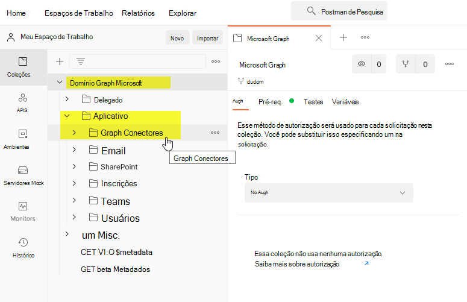

# <a name="use-postman-with-the-microsoft-graph-connectors-api"></a>Usar o Postman com a API de conectores do Microsoft Graph

Postman é uma plataforma de API para compilar e usar APIs. O Postman simplifica cada etapa do ciclo de vida da API e simplifica a colaboração para que você possa criar APIs melhores com mais rapidez.

Este artigo descreve como você pode usar a API do conector do Microsoft Graph com o Postman.

## <a name="prerequisites"></a>Pré-requisitos

* Uma conta Microsoft ou uma conta corporativa ou de estudante.
* Acesso a um locatário de desenvolvedor do Microsoft 365. Se você não tiver um, poderá se inscrever no [Programa para Desenvolvedores do Microsoft 365](https://developer.microsoft.com/en-us/microsoft-365/dev-program) para obter uma assinatura de desenvolvedor gratuita.

## <a name="step-1-fork-the-microsoft-graph-postman-collection"></a>Etapa 1: bifurcar a coleção Microsoft Graph Postman

Para usar a coleção Postman, você precisa bifurcá-la para seu espaço de trabalho Postman. Faça isso a partir de um navegador da web.

1. Acesse [Postman](https://identity.getpostman.com/signup) e inscreva-se. Se você já tiver uma conta do Postman, poderá [Entrar](https://identity.getpostman.com/login).

2. Depois de entrar, acesse a seguinte URL: `https://www.postman.com/microsoftgraph/workspace/microsoft-graph/collection/455214-085f7047-1bec-4570-9ed0-3a7253be148` e selecione a coleção do Microsoft Graph.

3. Selecione os três pontos à direita e, em seguida, selecione **Criar uma bifurcação**.

   

4. Na caixa de diálogo aberta, insira um rótulo para identificar sua bifurcação. No menu suspenso **Workspace**, selecione **My Workspace** e, em seguida, selecione **Coleção de Bifurcação**.

   

3. Acesse **Workspaces** > **My Workspace** para ver a bifurcação que você criou. Você pode encontrar a pasta de conectores do Microsoft Graph em **Application**.

   

## <a name="step-2-download-the-postman-agent-optional---postman-web-browser-only"></a>Etapa 2: baixe o Agente Postman (opcional - Somente navegador da Web Postman)

Para usar esta coleção Postman em seu navegador, baixe o [Agente de área de trabalho do Postman](https://www.postman.com/downloads). 

Você não pode usar o Postman para a Web sem isso devido a restrições CORS no navegador da Web: "O número máximo de recursos de [conexão](/graph/api/resources/externalconnectors-externalconnection) por locatário do Microsoft 365".

Você não precisará do agente se estiver usando o aplicativo Postman para Windows. Se você abrir o Postman para Windows, verá essa coleção em seu espaço de trabalho.

## <a name="step-3-create-an-azure-ad-application"></a>Etapa 3: criar um aplicativo do Azure Active Directory

Para usar essa coleção em seu próprio locatário de desenvolvedor, crie um aplicativo do Azure Active Directory (Azure AD) e dê a ele as permissões apropriadas para as solicitações que você deseja chamar.

1. Vá até o [portal.azure.com](https://portal.azure.com/) e entre com sua conta de administrador de locatários de desenvolvedor.
2. Em **Serviços do Azure**, selecione **Azure Active Directory**.
3. No menu à esquerda, selecione **Registros de aplicativo**.
4. No menu horizontal, selecione **Novo registro**.
5. Defina o **Nome do aplicativo** como `Parts Inventory`.
6. Defina a **URI de redirecionamento** como`https://oauth.pstmn.io/v1/browser-callback`.
7. Selecione **Registrar**.
8. No menu à esquerda, selecione **Permissões da API**.
9. No menu horizontal, selecione **Adicionar uma permissão** > **Microsoft Graph** > **Permissões Delegadas**.
10. Comece a digitar `ExternalItem.ReadWrite.All` e selecione `ExternalItem.ReadWrite.All`.
11. Selecione **Permissões do aplicativo**, digite `ExternalItem`, e então selecione **Permissões do Aplicativo**.
12. Expanda as opções **ExternalItem**, e então selecione `ExternalItem.ReadWrite.All`.
13. Selecione **Adicionar permissões**.
14. No menu horizontal, selecione **Conceder consentimento de administrador** para e, em seguida, selecione **Sim**.
15. No menu à esquerda, selecione **Visão geral**. A partir daqui, você pode obter o **ID do aplicativo (cliente)** e o **ID do diretório (locatário)**. Você precisará deles na etapa 4.
16. No menu à esquerda, selecione **Certificados e segredos**.
17. Selecione **Novo** segredo do cliente, insira uma descrição e selecione **Adicionar**. Copie o novo valor do segredo do cliente; você precisará disso na etapa 4.

O aplicativo agora tem duas permissões configuradas. `ExternalItem.ReadWrite.All` é adicionado como uma permissão delegada, que é uma permissão que requer um usuário conectado. O aplicativo pode fazer leitura/gravação de itens externos em nome do usuário. `ExternalItem.ReadWrite.All` é adicionado como uma permissão de aplicativo, que é uma permissão que não requer um usuário conectado. O aplicativo pode fazer leitura/gravação de itens externos em seu próprio nome.

## <a name="step-4-configure-authentication"></a>Etapa 4: Configurar autenticação

Nesta etapa, você configura as variáveis de ambiente no Postman que você usa para recuperar um token de acesso.

1. Selecione a **Microsoft Graph** e vá para a seção **Variáveis**.

   

2. Na seção **Variáveis**, forneça as informações necessárias usando as informações da etapa 3:

   - Defina o valor atual do **locatário** para o valor de ID do diretório (locatário) da etapa 3.15.
   - Defina o valor atual de **client\_id** para o valor de ID do aplicativo (cliente) da etapa 3.15.
   - Defina o valor atual **cliente\_segredo** o valor do segredo do cliente da etapa 3.17.
   - Defina o valor atual de **userName** como `admin@xxxxxxx.onmicrosoft.com`.
   - Defina o valor atual de **senha** senha de administrador do locatário.

   

3. Selecione **Salvar** / **Atualizar**.

## <a name="step-5-get-an-authentication-token"></a>Etapa 5: obter um token de autenticação

Como esta é a primeira vez que você está executando uma solicitação como um fluxo de autenticação de aplicativo, é necessário obter um token de acesso. Obtenha o token de acesso do aplicativo fazendo a seguinte solicitação POST:


O exemplo a seguir mostra como obter um token de acesso com um segredo compartilhado:
```html
POST /{{tenant}}/oauth2/v2.0/token HTTP/1.1 //Line breaks for clarity
Host: login.microsoftonline.com
Content-Type: application/x-www-form-urlencoded

client_id={{client_id}} 
&scope=https%3A%2F%2Fgraph.microsoft.com%2F.default 
&client_secret={{client_secret}} 
&grant_type=client_credentials 
```

O exemplo a seguir mostra uma resposta bem-sucedida:
```html
{ 
    "token_type": "Bearer", 
    "expires_in": 3599, 
    "ext_expires_in": 3599, 
    "access_token": "eyJ0eXAiOiJKV1QiLCJu… " 
} 
```

> [!NOTE]
> Você está usando o fluxo [de credenciais do cliente](/azure/active-directory/develop/v2-oauth2-client-creds-grant-flow) aqui. Certifique-se de obter um token de acesso do aplicativo e não um token de acesso do usuário.

## <a name="step-6-create-a-new-connection"></a>Etapa 6: criar uma nova conexão

Uma [conexão](/graph/connecting-external-content-manage-connections) é um contêiner lógico de dados externos que você pode gerenciar como uma única unidade. Escolha um nome de conexão, uma descrição e uma ID. Obtenha os detalhes necessários do administrador para se conectar à fonte de dados e forneça um mecanismo para autorizar a fonte de conteúdo ao configurar a conexão. Você pode usar as APIs e o [SDK do Microsoft Graph](/graph/sdks/sdks-overview) para programar a configuração do conector. Se deseja armazenar credenciais, você pode usar o Azure Key Vault.

```http
POST /external/connections
```

A seguir está um exemplo da solicitação.

```http
POST https://graph.microsoft.com/beta/external/connections 
Content-type: application/json 

{ 
  "id": "contosotasks", 
  "name": "Contoso Tasks", 
  "description": "Connection to index Contoso task management system" 
} 
```

A seguir está um exemplo da resposta.

```http
HTTP/1.1 201 Created 
Content-type: application/json 
 
{ 
    "@odata.context": "https://graph.microsoft.com/beta/$metadata#connections/$entity", 
    "id": "contosotasks", 
    "name": "Contoso Tasks", 
    "description": "Connection to index Contoso task management system", 
    "state": null, 
    "configuration": { 
        "authorizedApps": [ 
            "a47b35b7-6271-4e6d-9e27-2450a8b9c6b6" 
        ] 
    } 
} 
```

Veja a seguir uma captura de tela da seção **Criar conexão**.

 

## <a name="step-7-register-connection-schema"></a>Etapa 7: registrar esquema de conexão

O esquema de conexão determina como seu conteúdo é usado em várias experiências do Microsoft Graph. O esquema é uma lista simples de todas as propriedades que você planeja adicionar à conexão junto com seus atributos, rótulos e aliases. Você deve registrá-lo antes de adicionar itens na conexão.

```http
POST /external/connections/{id}/schema 
```

A seguir está um exemplo da solicitação.

```http
POST https://graph.microsoft.com/beta/external/connections/contosotasks/schema 
Content-type: application/json 
Prefer: respond-async 

{ 
  "baseType": "microsoft.graph.externalItem", 
  "properties": [ 
    { 
"name": "title", 
      "type": "String", 
      "isSearchable": "true", 
"isQueryable": "true", 
      "isRetrievable": "true", 
      "labels": [ 
        "title" 
      ] 
    }, 
    { 
"aliases": "creator", 
      "name": "createdBy", 
      "type": "String", 
      "isSearchable": "true", 
"isQueryable": "true", 
      "isRetrievable": "false", 
"isRefinable": "false", 
      "labels": [ 
        "createdBy" 
      ] 
    }, 
    { 
"aliases": "editedDate", 
      "name": "lastEditedDate", 
      "type": "DateTime", 
      "isSearchable": "false", 
"isQueryable": "true", 
      "isRetrievable": "true", 
"isRefinable": "true", 
      "labels": [ 
   "lastModifiedDateTime" 
] 
    } 
  ] 
} 
```

A seguir está um exemplo da resposta.

```http
HTTP/1.1 202 Accepted 
Location: https://graph.microsoft.com/beta/external/connections/contosotasks/operations/616bfeed-666f-4ce0-8cd9-058939010bfc 
```

> [!NOTE]
> Registrar o esquema de conexão é uma operação assíncrona, portanto, não ingerir itens na conexão até que o esquema de conexão esteja no estado Concluído. Para verificar o status do esquema de conexão, execute a seguinte solicitação:
> ```http
> GET /external/connections/contosotasks/operations/616bfeed-666f-4ce0-8cd9-058939010bfc 
> ```

A seguir está outro exemplo da solicitação.
```http
Request 
GET https://graph.microsoft.com/beta/external/connections/operations/616bfeed-666f-4ce0-8cd9-058939010bfc 
```

A seguir está outro exemplo da resposta.

```http
HTTP/1.1 200 OK 
Content-type: application/json 

{
    @odata.context":"https://graph.microsoft.com/beta/$metadata#external/connections('coursecatalog')/operations/$entity", 
    "id": "aa9186d2-893c-4361-ca51-431d88fa45d8", 
    "name": "Contoso Tasks", 
    "status": "inprogress", 
    "error": null  
}
```

Veja a seguir uma captura de tela da seção **Obter status da operação de conexão**.


Depois que o status da operação do esquema de conexão muda de **InProgress** para **Concluído**, você poderá ingerir itens para a conexão.

Depois que o estado da conexão mudar de **rascunho** para **pronto**, você poderá inserir itens na conexão atual.

## <a name="step-8-add-external-group-member-optional"></a>Etapa 8: adicionar membro do grupo externo (opcional)

Se seu serviço externo usa listas de controle de acesso não-Azure AD, sincronize essas permissões.  

Grupos externos (junto com usuários e grupos do Azure Active Directory) são usados para definir permissões em `externalItems` adicionados a uma conexão do Microsoft Graph. Para obter detalhes, consulte [externalGroup](/graph/api/resources/externalconnectors-externalgroup).

Este é um exemplo de uma solicitação.

```http
POST https://graph.microsoft.com/beta/external/connections/contosotasks/groups/31bea3d537902000/members 
Content-Type: application/json 
 
{ 
  "@odata.type": "#microsoft.graph.externalGroupMember", 
  "id": "1431b9c38ee647f6a", 
  "type": "group", 
  "identitySource": "external" 
} 
```

Este é um exemplo da resposta.

```http
HTTP/1.1 201 Created 
Content-Type: application/json 

{ 
  "@odata.type": "#microsoft.graph.externalGroupMember", 
  "id": "14m1b9c38qe647f6a", 
  "type": "group", 
  "identitySource": "external" 
} 
```

## <a name="step-9-ingest-items"></a>Etapa 9: Ingerir Itens

Depois de criar uma conexão, você pode adicionar seu conteúdo. Cada item da fonte de dados deve ser representado como um `externalItem` no Microsoft Graph com uma ID de item exclusiva. Essa ID é usada para criar, atualizar ou excluir o item do Microsoft Graph. Você pode usar a chave primária da fonte de dados como a `itemId` ou derivá-la de um ou mais campos. Um `externalItem` possui três componentes principais: lista de controle de acesso, propriedades e conteúdo.

Se você tiver arquivos binários, deverá analisá-los para obter os metadados e uma versão em texto do conteúdo. Se você tiver conteúdo não textual, como um arquivo PDF ou BMP, deverá usar o reconhecimento de caracteres do objeto para converter o conteúdo em texto.  

Você é responsável por converter suas permissões de fonte para `grant` ou `deny`. `Deny` tem maior precedência sobre `grant`.

Veja a seguir um exemplo de uma solicitação.

```http
PUT https://graph.microsoft.com/beta/external/connections/contosohr/items/TSP228082938 
Content-type: application/json 

{ 
  "@odata.type": "microsoft.graph.externalItem", 
  "acl": [ 
    { 
      "type": "user", 
      "value": "e811976d-83df-4cbd-8b9b-5215b18aa874", 
      "accessType": "grant", 
      "identitySource": "azureActiveDirectory" 
    }, 
    { 
      "type": "group", 
      "value": "14m1b9c38qe647f6a", 
      "accessType": "deny", 
      "identitySource": "external" 
    } 
  ], 
  "properties": { 
    "ticketID": "1158", 
    "priority": 1, 
    "title": "Filter design", 
  }, 
  "content": { 
    "value": "Build filtering capability by...", 
    "type": "text" 
  } 
} 
```

A seguir está um exemplo de uma resposta bem-sucedida.

```http
HTTP/1.1 200 OK
```

## <a name="error-handling"></a>Tratamento de erro

Para obter detalhes sobre como resolver erros, consulte [Resolver erros de autorização do Microsoft Graph](/graph/resolve-auth-errors).

## <a name="see-also"></a>Confira também

- [Use o Postman com a API do Microsoft Graph](use-postman.md)
