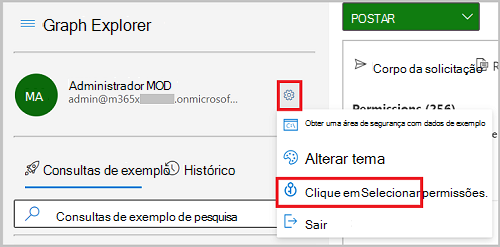
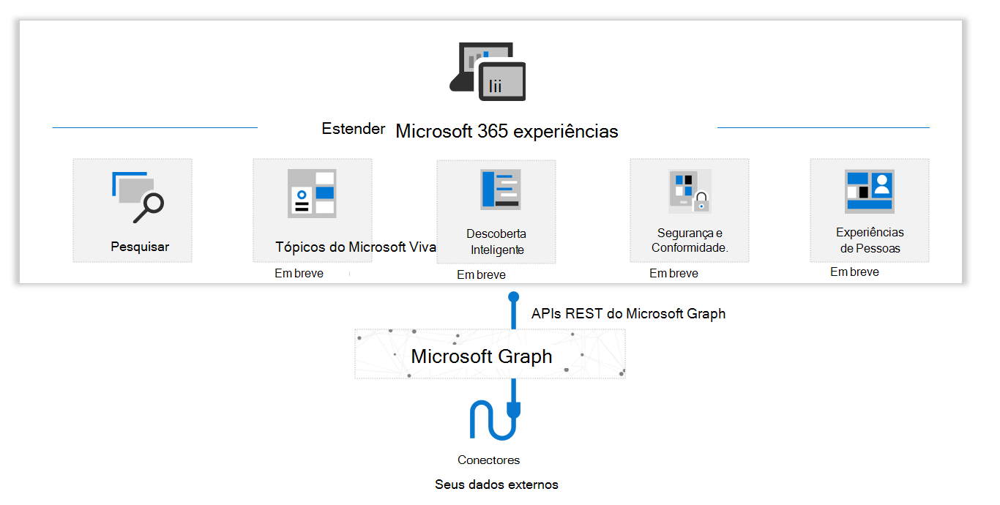

# Visão geral dos conectores do Microsoft GraphMicrosoft Graph connectors overview

O[Microsoft 365](https://www.microsoft.com/microsoft-365) é uma solução completa e inteligente que capacita usuários e organizações com experiências inovadoras de produtividade e abordagens enriquecedoras para aumentar a eficiência e gerar o crescimento dos negócios.[Microsoft 365](https://www.microsoft.com/microsoft-365) is a complete, intelligent solution that empowers users and organizations with innovative productivity experiences and rich insights to increase efficiency and drive business growth. O Microsoft Graph é o núcleo de dados que permite essas experiências inteligentes, e a API do Microsoft Graph fornece acesso a esses dados e inteligência.Microsoft Graph is the data fabric that powers these intelligent experiences, and the Microsoft Graph API provides access to this data and intelligence.

Embora a maioria dos profissionais de informação gaste grande parte do seu tempo de trabalho em aplicativos de produtividade, como o [Microsoft 365](https://www.microsoft.com/microsoft-365), eles também precisam de uma maneira de integrar esse ambiente com os aplicativos corporativos e outros softwares e serviços de nuvem SaaS locais utilizados.Although most information workers spend much of their work time within productivity applications such as [Microsoft 365](https://www.microsoft.com/microsoft-365), they also need a way to integrate that environment with the enterprise applications and other on-premises and SaaS cloud software and services they use. Por exemplo, aplicativos de ERP (planejamento de recursos empresariais), CRM (gerenciamento de recursos do cliente), aplicativos de intranet, wikis, blogs e sites de redes sociais.For example, enterprise resource planning (ERP) applications, customer resource management (CRM) applications, intranet applications, wikis, blogs, and social networking sites.

Os conectores do Microsoft Graph oferecem uma maneira simples e intuitiva de trazer conteúdo de serviços externos para o Microsoft Graph, habilitando dados externos para experiências inteligentes do Microsoft 365 como a Pesquisa da Microsoft (atualmente GA) e muitos outros em breve como Viva Topics.Microsoft Graph connectors offer a simple and intuitive way to bring content from external services into Microsoft Graph, enabling external data to power Microsoft 365 intelligent experiences like Microsoft Search (currently GA) and many more coming soon like Viva Topics.

Hoje, com os conectores do Microsoft Graph, os dados obtidos de sua organização podem aparecer nos resultados da Pesquisa da Microsoft.Today, with Microsoft Graph connectors, the data you bring in from your organization can appear in Microsoft Search results. Esse recurso expande os tipos de fontes de conteúdo que podem ser pesquisadas nos aplicativos de produtividade do Microsoft 365 e no ecossistema da Microsoft mais amplo.This feature expands the types of content sources that are searchable in your Microsoft 365 productivity apps and the broader Microsoft ecosystem. Em breve, os conectores terão muitas outras experiências inteligentes do Microsoft 365.Soon, connectors will power many other Microsoft 365 intelligent experiences.
O diagrama a seguir fornece uma visão geral de alto nível dos conectores do Microsoft Graph.The following diagram provides a high-level overview of Microsoft Graph connectors.

<!---Insert image reference here --->
<!---        --->

## Criar seu próprio conector personalizadoBuild your own custom connector

Os mais de 100 conectores atualmente disponíveis na Microsoft e nos parceiros permitem que você se conecte aos serviços Microsoft e não-Microsoft populares.The 100+ connectors currently available from Microsoft and partners enable you to connect to popular Microsoft and non-Microsoft services. Exemplos de conectores existentes incluem os serviços do Azure, Box, ServiceNow, SalesForce, serviços do Google, MediaWiki e muito mais.Examples of existing connectors include Azure services, Box, ServiceNow, SalesForce, Google services, MediaWiki, and more.

Para saber mais sobre os conectores existentes do Microsoft Graph, visite a [galeria de conectores do Microsoft Graph](/microsoftsearch/connectors-gallery).To learn more about the existing Microsoft Graph connectors, visit the [Microsoft Graph connectors gallery](/microsoftsearch/connectors-gallery).

Embora esses conectores ajudem a se conectar aos serviços populares, talvez você queira integrar com serviços que não estão disponíveis na [galeria de conectores](/microsoftsearch/connectors-gallery) existente.While these connectors help connect to popular services, you may want to integrate with services that aren't available in the existing [connectors gallery](/microsoftsearch/connectors-gallery). Você pode usar a API de conectores do Microsoft Graph para criar conectores personalizados para trazer seus dados externos para experiências do Microsoft 365, incluindo a Pesquisa da Microsoft, Viva Topics e muito mais (em breve), dentro de sua organização.You can use the Microsoft Graph connectors API to build custom connectors to bring your external data into Microsoft 365 experiences, including Microsoft Search, Viva Topics and more (coming soon), within your organization.

## Começar a trabalhar com conectores Graph personalizados:Get started with custom Graph connectors:
* [Trabalhando com a API de conectoresWorking with the connectors API](connecting-external-content-connectors-api-overview.md)
* [Use o Postman com a API de conectores do Microsoft GraphUse Postman with the Microsoft Graph connectors API](connecting-external-content-connectors-api-postman.md)
<!---**(Articles coming next)**
* [Build your first custom connector with Microsoft Graph]()
--->

