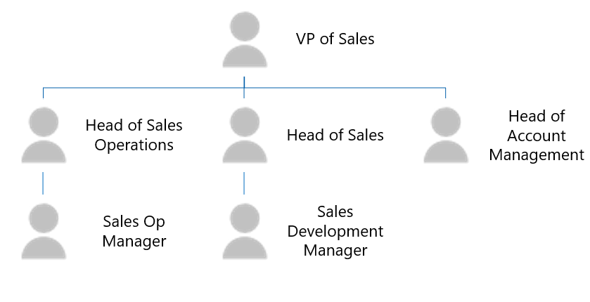

# <a name="use-external-groups-to-manage-permissions-to-microsoft-graph-connector-data-sources"></a>Usar grupos externos para gerenciar permissões para o Microsoft Graph de dados do conector

[Grupos externos](/graph/api/resources/externalgroup?view=graph-rest-beta&preserve-view=true) permitem gerenciar [](/graph/api/resources/externalitem?view=graph-rest-beta&preserve-view=true) permissões para exibir itens externos em uma conexão do Microsoft Graph e se conectar a fontes de dados fora dos grupos Azure Active Directory (Azure AD).

Para fontes de dados que dependem de usuários e grupos do Azure AD, você configura permissões em itens externos associando uma [](/graph/api/externalconnection-put-items?view=graph-rest-beta&preserve-view=true) lista de controle de acesso (ACL) a um usuário do Azure AD e uma ID de grupo, ao criar ou atualizar os itens externos.

No entanto, para fontes de dados que usam grupos que não são do Azure AD ou construções como grupos, como Perfis de Salesforce, Unidades de Negócios Dinâmicas, grupos SharePoint, grupos locais serviceNow ou grupos locais confluência, recomendamos que você use grupos *externos*.

## <a name="common-external-group-scenarios"></a>Cenários comuns de grupo externo

A seguir estão exemplos comuns de grupo não específicos do aplicativo do Azure AD.

O Microsoft Dynamics 365 permite que os clientes estruturam suas CRMs com unidades de negócios e equipes.As informações de associação para essas unidades de negócios e equipes não são armazenadas no Azure AD.

A imagem a seguir mostra a estrutura das unidades de negócios e equipes.

<!---Using html to adjust the size of the image --->
<br><p align="center"></p>

Salesforce usa perfis, funções e conjuntos de permissões para autorização. Elas são específicas do Salesforce e as informações de associação não estão disponíveis no Azure AD.

A imagem a seguir mostra a estrutura das informações de associação no Salesforce.

<!---Using html to adjust the size of the image --->
<br><p align="center"></p>

## <a name="using-external-groups-in-your-connection"></a>Usando grupos externos em sua conexão

Para usar grupos externos em suas conexões:

1. Para cada grupo que não seja do Azure AD, crie um grupo externo no Microsoft Graph usando a [API de grupos.](/en-us/graph/api/resources/group?view=graph-rest-beta&preserve-view=true)
2. Use o grupo externo ao definir a ACL para seus itens externos, conforme necessário.  
3. Mantenha a associação dos grupos externos atualizada e em sincronia.

### <a name="create-external-groups"></a>Criar grupos externos

Grupos externos pertencem a uma conexão. Para criar grupos externos em suas conexões:
* Use a API de grupos no Microsoft Graph, conforme mostrado no exemplo a seguir.

    > [!NOTE]
    > [DisplayName](/graph/api/resources/externalgroup?view=graph-rest-beta&preserve-view=true) e **descrição** são campos opcionais.

    ```http
    POST /connections/{connectionId}/groups 

    {  
      "id": "contosoEscalations",  
      "displayName": "Contoso Escalations",  
      "description": "Tier-1 escalations within Contoso"
    }  
    ```

* Forneça um identificador ou um nome no [campo ID.](/graph/api/resources/externalgroup?view=graph-rest-beta&preserve-view=true) Use esse valor para chamar o grupo externo em solicitações subsequentes.

    > [!NOTE]
    > O campo ID permite que você use conjuntos de caracteres base64 de URL e nome de arquivo seguro, e ele tem um limite de 128 caracteres.

Um grupo externo pode conter um ou mais dos seguintes:
* Um usuário do Azure AD.
* Um grupo do Azure AD.
* Outro grupo externo, incluindo grupos externos aninhados.

Depois de criar o grupo, você pode adicionar membros ao grupo, conforme mostrado nos exemplos a seguir.

```http
POST https://graph.microsoft.com/beta/connections/{connectionId}/groups/{groupId}/members

{ 
  "id": "contosoSupport", 
  "type": "group", 
  "identitySource": "external" 
}
```
```http
POST https://graph.microsoft.com/beta/connections/{connectionId}/groups/{groupId}/members 

{ 
  "id": "25f143de-be82-4afb-8a57-e032b9315752", 
  "type": "user", 
  "identitySource": "azureActiveDirectory" 
}
```
```http
POST https://graph.microsoft.com/beta/connections/{connectionId}/groups/{groupId}/members 

{ 
  "id": "99a3b3d6-71ee-4d21-b08b-4b6f22e3ae4b", 
  "type": "group", 
  "identitySource": "azureActiveDirectory" 
}
```

### <a name="use-external-groups-in-acl"></a>Usar grupos externos no ACL

Você pode usar grupos externos ao definir ACLs para itens [externos,](connecting-external-content-manage-items.md#access-control-list) conforme mostrado no exemplo a seguir. Além de usuários e grupos do Azure AD, um item externo pode ter grupos externos em suas entradas de controle de acesso.

```http
PUT https://graph.microsoft.com/beta/external/connections/{id}/items/{id}  

Content-type: application/json  
{  
  "@odata.type": "microsoft.graph.externalItem",  
  "acl": [  
    {  
      "type": "group",  
      "value": "contosEscalations",  
      "accessType": "grant",  
      "identitySource": "External"  
    },  
    {  
      "type": "user",  
      "value": "87e9089a-08d5-4d9e-9524-b7bd6be580d5",  
      "accessType": "grant",  
      "identitySource": "azureActiveDirectory"  
    },  
    {  
      "type": "group",  
      "value": "96fbeb4f-f71c-4405-9f0b-1d6988eda2d2",  
      "accessType": "deny",  
      "identitySource": "azureActiveDirectory"  
    }  
  ],  
  "properties": {  
    "title": "Error in the payment gateway",  
    "priority": 1,  
    "assignee": "john@contoso.com"  
  },  
  "content": {  
    "value": "<h1>Error in payment gateway</h1><p>Error details...</p>",  
    "type": "html"  
  }  
}  
```

> [!NOTE]
> Você pode usar grupos externos em ACLs mesmo antes que os grupos sejam criados.

### <a name="keep-external-group-memberships-in-sync"></a>Manter associações de grupo externos em sincronia

Mantenha a associação do seu grupo externo atualizada no Microsoft Graph. Quando as associações mudarem em seu grupo personalizado, certifique-se de que a alteração seja refletida no grupo externo em um momento que funcione para suas necessidades.

### <a name="manage-external-groups-and-membership"></a>Gerenciar grupos externos e associação

Você pode usar a API de grupos para gerenciar seus grupos externos e associações de grupo. Para obter detalhes, [consulte externalGroup](/graph/api/resources/externalgroup?view=graph-rest-beta&preserve-view=true) e [externalGroupMember](/graph/api/resources/externalgroupmember?view=graph-rest-beta&preserve-view=true).

## <a name="see-also"></a>Confira também
Para saber mais sobre a API de conectores Graph Microsoft, consulte [Working with the connectors API](connecting-external-content-connectors-api-overview.md).
