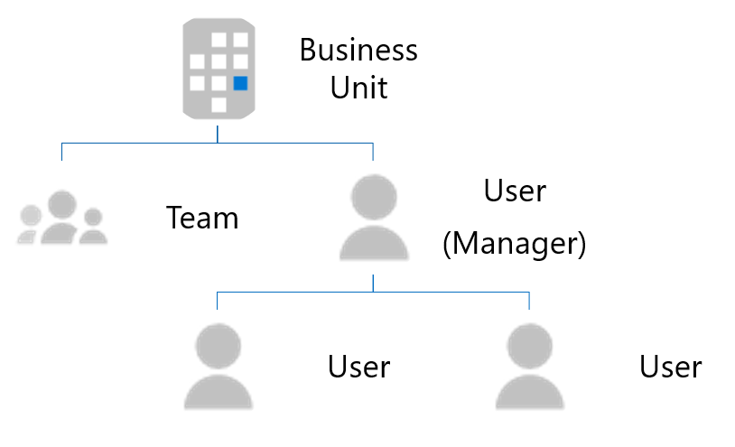

# <a name="use-external-groups-to-manage-permissions-to-microsoft-graph-connectors-data-sources"></a>Usar grupos externos para gerenciar permissões para fontes de dados do Microsoft Graph conectores

[Os grupos externos](/graph/api/resources/externalconnectors-externalgroup?view=graph-rest-1.0&preserve-view=true) permitem que você gerencie permissões para exibir itens externos em uma conexão do Microsoft Graph e conectar-se a fontes de dados fora Azure Active Directory (Azure AD).[](/graph/api/resources/externalconnectors-externalitem?view=graph-rest-1.0&preserve-view=true)

Para fontes de dados que dependem de usuários e grupos do Azure AD, defina permissões em itens externos associando uma ACL (lista de controle de acesso) a um usuário do Azure AD e uma ID de grupo [](/graph/api/externalconnectors-externalconnection-put-items?view=graph-rest-beta&preserve-view=true&tabs=http&viewFallbackFrom=graph-rest-1.0) ao criar ou atualizar os itens externos.

No entanto, para fontes de dados que usam grupos não Azure AD ou constructos semelhantes a grupos, como Perfis do Salesforce, Unidades de Negócios do Dynamics, grupos de SharePoint, grupos locais do ServiceNow ou grupos locais do Confluence, recomendamos que *você use grupos* externos.

## <a name="common-external-group-scenarios"></a>Cenários comuns de grupo externo

A seguir estão exemplos comuns de grupo Azure AD específicos do aplicativo.

O Microsoft Dynamics 365 permite aos clientes estruturar seus CRMs com unidades de negócios e equipes.As informações de associação para essas unidades de negócios e equipes não são armazenadas Azure AD.

A imagem a seguir mostra a estrutura das unidades de negócios e das equipes.

<!---Using html to adjust the size of the image --->
<br><p align="center"></p>

O Salesforce usa perfis, funções e conjuntos de permissões para autorização. Elas são específicas do Salesforce e as informações de associação não estão disponíveis no Azure AD.

A imagem a seguir mostra a estrutura das informações de associação no Salesforce.

<!---Using html to adjust the size of the image --->
<br><p align="center"></p>

## <a name="using-external-groups-in-your-connection"></a>Usando grupos externos em sua conexão

Para usar grupos externos em sua conexão, siga estas etapas:

1. Para cada grupo não Azure AD, use a API de grupos para criar um grupo externo no Microsoft Graph.
2. Use o grupo externo ao definir a ACL para seus itens externos, conforme necessário.
3. Mantenha a associação dos grupos externos atualizada e em sincronia.

### <a name="create-an-external-group"></a>Criar um grupo externo

Grupos externos pertencem a uma conexão. Para criar grupos externos em suas conexões, siga estas etapas:

1. Use a [API de](/graph/api/resources/group?view=graph-rest-1.0&preserve-view=true) grupos no Microsoft Graph, conforme mostrado no exemplo a seguir.

    > [!NOTE]
    > [DisplayName e](/graph/api/resources/externalconnectors-externalgroup?view=graph-rest-1.0&preserve-view=true#properties) **descrição são** campos opcionais.

    ```http
    POST /external/connections/{connectionId}/groups

    { 
      "id": "contosoEscalations", 
      "displayName": "Contoso Escalations", 
      "description": "Tier-1 escalations within Contoso"
    } 
    ```

2. Forneça um identificador ou um nome no campo ID. Use esse valor para chamar o grupo externo em solicitações subsequentes.

    > [!NOTE]
    > O campo ID permite que você use conjuntos de caracteres Base64 de URL e de nome de arquivo seguro. Ele tem um limite de 128 caracteres.

    Um grupo externo pode conter um ou mais dos seguintes:
    * Um Azure AD usuário.
    * Um Azure AD grupo.
    * Outro grupo externo, incluindo grupos externos aninhados.

3. Depois de criar o grupo, você pode adicionar membros ao grupo, conforme mostrado nos exemplos a seguir.
    
    ```http
    POST https://graph.microsoft.com/beta/external/connections/{connectionId}/groups/{groupId}/members
    
    {
      "id": "contosoSupport",
      "type": "group",
      "identitySource": "external"
    }
    ```
    ```http
    POST https://graph.microsoft.com/beta/external/connections/{connectionId}/groups/{groupId}/members
    
    {
      "id": "25f143de-be82-4afb-8a57-e032b9315752",
      "type": "user",
      "identitySource": "azureActiveDirectory"
    }
    ```
    ```http
    POST https://graph.microsoft.com/beta/external/connections/{connectionId}/groups/{groupId}/members
    
    {
      "id": "99a3b3d6-71ee-4d21-b08b-4b6f22e3ae4b",
      "type": "group",
      "identitySource": "azureActiveDirectory"
    }
    ```

### <a name="use-external-groups-in-the-acl"></a>Usar grupos externos na ACL

Você pode usar grupos externos ao definir [ACLs para itens externos](connecting-external-content-manage-items.md#access-control-list) , conforme mostrado no exemplo a seguir. Além de Azure AD usuários e grupos, um item externo pode ter grupos externos em suas entradas de controle de acesso.

```http
PUT https://graph.microsoft.com/beta/external/connections/{id}/items/{id} 

Content-type: application/json 
{ 
  "@odata.type": "microsoft.graph.externalItem", 
  "acl": [ 
    { 
      "type": "group", 
      "value": "contosEscalations", 
      "accessType": "grant", 
      "identitySource": "External" 
    }, 
    { 
      "type": "user", 
      "value": "87e9089a-08d5-4d9e-9524-b7bd6be580d5", 
      "accessType": "grant", 
      "identitySource": "azureActiveDirectory" 
    }, 
    { 
      "type": "group", 
      "value": "96fbeb4f-f71c-4405-9f0b-1d6988eda2d2", 
      "accessType": "deny", 
      "identitySource": "azureActiveDirectory" 
    } 
  ], 
  "properties": { 
    "title": "Error in the payment gateway", 
    "priority": 1, 
    "assignee": "john@contoso.com" 
  }, 
  "content": { 
    "value": "<h1>Error in payment gateway</h1><p>Error details...</p>", 
    "type": "html" 
  } 
} 
```

> [!NOTE]
> Você pode usar grupos externos em ACLs mesmo antes de os grupos serem criados.

### <a name="keep-external-group-memberships-in-sync"></a>Manter associações de grupo externo em sincronia

Mantenha a associação de seu grupo externo atualizada no Microsoft Graph. Quando as associações mudarem em seu grupo personalizado, verifique se a alteração é refletida no grupo externo em um momento que funcione de acordo com suas necessidades.

### <a name="manage-external-groups-and-membership"></a>Gerenciar grupos externos e associação

Você pode usar a API de grupos para gerenciar seus grupos externos e associação de grupo. Para obter detalhes, [consulte externalGroup](/graph/api/resources/externalconnectors-externalgroup?view=graph-rest-1.0&preserve-view=true) e [externalGroupMember](/graph/api/resources/externalconnectors-externalgroupmember?view=graph-rest-beta&preserve-view=true&viewFallbackFrom=graph-rest-1.0).

## <a name="next-steps"></a>Próximos passos

- [Saiba mais sobre os limites da API Graph conectores do Microsoft Graph](connecting-external-content-api-limits.md)
- [Trabalhar com a API de conectores do Microsoft Graph ](connecting-external-content-connectors-api-overview.md)
- [Use o Postman com a API de conectores do Microsoft Graph](connecting-external-content-connectors-api-postman.md)
