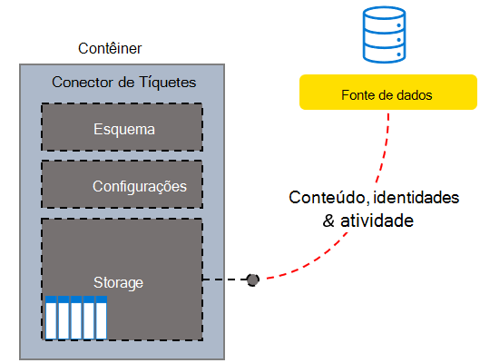
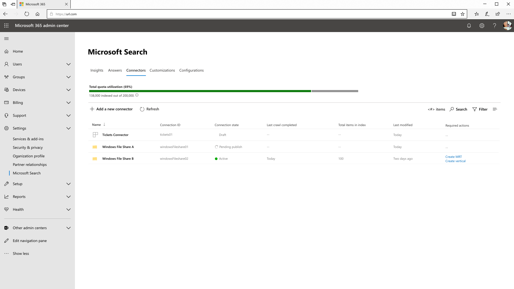

<!---<author of this doc: rsamai>--->

# Criar, atualizar e excluir conexões no Microsoft Graph

As conexões de serviços externos com o serviço da Pesquisa da Microsoft são representadas pelo recurso [externalConnection](/graph/api/resources/externalconnection?view=graph-rest-beta&preserve-view=true) no Microsoft Graph.

A plataforma de conectores do Microsoft Graph oferece uma maneira simples de adicionar seus dados externos ao Microsoft Graph. Uma conexão é um contêiner lógico de dados externos que um administrador pode gerenciar como uma única unidade.

Depois de criar uma conexão, você pode adicionar seu conteúdo de qualquer fonte de dados externa, como uma fonte de conteúdo local ou um serviço SaaS externo. Só é possível exibir e gerenciar as conexões que você criou ou que foram explicitamente [autorizadas](/graph/api/external-post-connections?view=graph-rest-beta&preserve-view=true) para gerenciamento. Um administrador de pesquisa pode exibir e gerenciar todas as conexões no locatário no Centro de Administração Moderna.

<!-- markdownlint-disable MD036 -->

*Exemplo de um sistema helpdesk personalizado da estrutura de conector de tíquetes*

*Modo de exibição de administrador das conexões, incluindo o conector de tíquetes personalizado*

<!-- markdownlint-enable MD036 -->

Você pode modelar uma conexão assim que desejar, mas criar uma conexão para cada instância do seu conector é o modelo mais comum. Por exemplo, todas as vezes que você [configurar o conector de compartilhamento de arquivos do Microsoft Windows](/microsoftsearch/configure-connector), uma nova conexão será criada. Você também pode criar uma única conexão para adicionar todos os itens da fonte de dados. Por exemplo, criar uma única conexão para adicionar todos os tíquetes e incidentes por várias equipes do seu sistema de assistência técnica.

## Estados e operações

A conexão pode existir em um dos seguintes estados.

| Estado             | Descrição                                                                                                                                               |
|-------------------|-----------------------------------------------------------------------------------------------------------------------------------------------------------|
| **Rascunho**         | Uma conexão vazia está provisionada. A fonte de dados, esquema ou quaisquer configurações ainda não foram configuradas.                                                |
| **Pronto**         | A conexão é fornecida com o esquema registrado e está pronta para inclusão.                                                                          |
| **Obsoleto**      | Isso ocorre quando um recurso dependente, como uma API, foi preterido. A exclusão da conexão é a única operação válida.                           |
| **LimitExceeded** | Se você alcançar o limite máximo de uma única conexão ou cota de nível de locatário em todas as conexões, não será possível adicionar mais itens até sair do estado. |

A tabela a seguir especifica quais operações estão disponíveis em cada Estado.

| Operação         | Rascunho              | Pronto              | Obsoleto           | LimitExceeded      |
|-------------------|--------------------|--------------------|--------------------|--------------------|
| Criar conexão | :x:                | :heavy_check_mark: | :x:                | :heavy_check_mark: |
| Ler conexão   | :heavy_check_mark: | :heavy_check_mark: | :heavy_check_mark: | :heavy_check_mark: |
| Atualizar conexão | :heavy_check_mark: | :heavy_check_mark: | :x:                | :heavy_check_mark: |
| Excluir conexão | :heavy_check_mark: | :heavy_check_mark: | :heavy_check_mark: | :heavy_check_mark: |
| Criar esquema     | :heavy_check_mark: | :x:                | :x:                | :x:                |
| Ler esquema       | :x:                | :heavy_check_mark: | :heavy_check_mark: | :heavy_check_mark: |
| Atualizar esquema     | :x:                | :x:                | :x:                | :x:                |
| Excluir esquema     | :x:                | :x:                | :x:                | :x:                |
| Criar item       | :x:                | :heavy_check_mark: | :x:                | :x:                |
| Ler item         | :x:                | :heavy_check_mark: | :heavy_check_mark: | :heavy_check_mark: |
| Atualizar item       | :x:                | :heavy_check_mark: | :x:                | :heavy_check_mark: |
| Excluir item       | :x:                | :heavy_check_mark: | :x:                | :heavy_check_mark: |

Uma conexão permite que seu aplicativo [defina um esquema](/graph/api/externalconnection-post-schema?view=graph-rest-beta&preserve-view=true) para os itens que serão indexados e forneça um ponto de extremidade para o seu serviço adicionar, atualizar ou excluir itens do índice. [Criar uma conexão](#create-a-connection) é a primeira etapa para um aplicativo para adicionar itens ao índice de pesquisa.

## Criar uma conexão

Antes que um aplicativo possa adicionar itens ao índice de pesquisa, ele deve criar e configurar uma conexão usando as etapas a seguir:

- [Criar uma conexão](/graph/api/external-post-connections?view=graph-rest-beta&preserve-view=true) com ID exclusiva, nome de exibição e descrição.
- [Registre um esquema](/graph/api/externalconnection-post-schema?view=graph-rest-beta&preserve-view=true) para definir os campos que serão incluídos no índice.

> [!NOTE]
> Para obter informações sobre como atualizar o esquema de uma conexão existente, consulte [Recursos da atualização do esquema](/graph/connecting-external-content-manage-schema#schema-update-capabilities).

## Atualizar uma conexão

Você pode alterar o nome de exibição ou a descrição de uma conexão existente [atualizando a conexão](/graph/api/externalconnection-update?view=graph-rest-beta&preserve-view=true).

## Excluir uma conexão

Você pode [excluir uma conexão](/graph/api/externalconnection-delete?view=graph-rest-beta&preserve-view=true) e remover todos os itens que foram indexados por meio da conexão.

## Próximas etapas

- [Registrar o esquema de conexão](/graph/connecting-external-content-manage-schema.md)
- [Revisar a referência da API do conectores do Graph](/graph/api/resources/indexing-api-overview?view=graph-rest-beta&preserve-view=true)
- [Visão geral dos conectores do Microsoft Graph](/microsoftsearch/connectors-overview)
- Baixe o [exemplo de conector de pesquisa](https://github.com/microsoftgraph/msgraph-search-connector-sample) no GitHub
