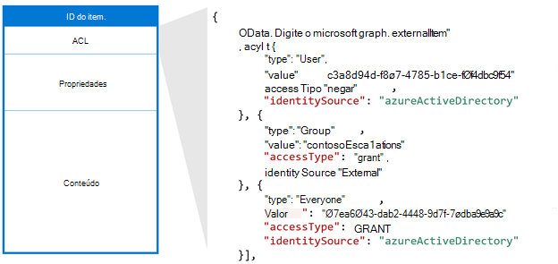
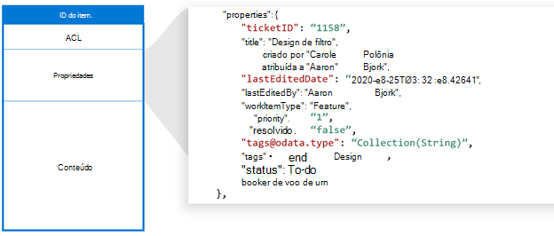
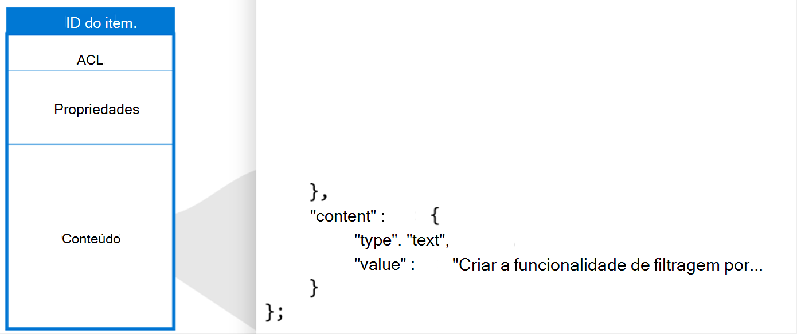
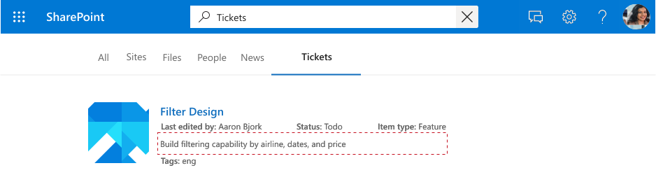

<!---<author of this doc: rsamai>--->

# <a name="create-update-and-delete-items-added-by-your-application-via-microsoft-graph-connectors"></a>Criar, atualizar e excluir itens adicionados por seu aplicativo via conectores do Microsoft Graph

Os conectores do Microsoft Graph oferecem uma maneira intuitiva de trazer dados externos para o Microsoft Graph. Os itens adicionados por seu aplicativo ao serviço Pesquisa da Microsoft são representados pelo recurso [externalItem](/graph/api/resources/externalconnectors-externalitem?view=graph-rest-1.0&preserve-view=true) no Microsoft Graph.

Depois de [criar uma conexão](/graph/api/externalconnectors-external-post-connections?view=graph-rest-1.0&preserve-view=true&tabs=http), você pode adicionar seu conteúdo. Cada item da fonte de dados deve ser representado como um externalItem no Microsoft Graph com uma ID de item exclusiva. Essa ID é usada para criar, atualizar ou excluir o item do Microsoft Graph. Você pode usar a chave primária de sua fonte de dados como a ID do item ou derivá-la de um ou mais campos. 

## <a name="key-components"></a>Componentes principais

Um externalItem possui três componentes principais: lista de controle de acesso, propriedades e conteúdo.

### <a name="access-control-list"></a>Lista de controle de acesso

A lista de controle de acesso (ACL) é usada para especificar se as funções fornecidas têm acesso concedido ou negado para exibir itens nas experiências da Microsoft. A ACL é uma matriz de entradas de controle de acesso, cada uma representando um usuário ou grupo do Azure Active Directory (Azure AD). Um terceiro tipo de entrada de controle de acesso `Everyone` representa todos os usuários no locatário.



*Um exemplo de lista de controle de acesso*.

O valor **accessType** `deny` tem precedência sobre `grant`. Por exemplo, no item mostrado anteriormente, enquanto `Everyone` é concedido acesso e um usuário específico é negado, a permissão efetiva para esse usuário é `deny`.

Se sua fonte de dados tiver grupos do AD não Azure (como equipes em seu sistema de suporte técnico) usados para definir permissões para o item, você poderá criar grupos externos no Microsoft Graph usando as APIs de sincronização de grupo para replicar as permissões `allow` ou `deny`. Evite expandir a associação de seus grupos externos diretamente nas ACLs de itens individuais, pois cada associação de grupo pode levar a um alto volume de atualizações de itens.

Os grupos externos podem consistir em outro grupo externo, usuários do Azure Active Directory e grupos do Azure Active Directory. Se você tiver usuários que não são do Azure Active Directory, deverá convertê-los para usuários do Azure Active Directory em sua ACL.

### <a name="properties"></a>Propriedades

O componente propriedades é usado para adicionar metadados de itens que são úteis nas experiências do Microsoft Graph. Você deve [registrar o esquema](connecting-external-content-manage-schema.md) para a conexão antes de adicionar itens a ele e converter os **tipos de dados** em [tipos de dados com suporte](/graph/api/resources/externalconnectors-property?view=graph-rest-1.0&preserve-view=true).



*Um componente de propriedade de exemplo.*

### <a name="content"></a>Conteúdo

O componente de conteúdo é usado para adicionar a maior parte do item que deve ser indexado em texto completo. Os exemplos incluem uma descrição de tíquete, texto analisado de um corpo de arquivo ou um corpo de página wiki.

O conteúdo é um dos principais campos que influenciam na [relevância](connecting-external-content-manage-schema.md#relevance) nas experiências da Microsoft. Os tipos de conteúdo `text` e `html` são suportados. Se sua fonte de dados tiver outros tipos de conteúdo, como arquivos binários, vídeos ou imagens, você poderá analisá-los em texto antes de adicioná-los ao Microsoft Graph. Por exemplo, você pode usar o reconhecimento óptico de caracteres para extrair texto pesquisável de imagens.



*Um componente de conteúdo de exemplo*.

O conteúdo não pode ser adicionado diretamente a um modelo de resultado de pesquisa, mas você pode usar um trecho de resultado gerado, que é uma prévia gerada dinamicamente das seções relevantes dentro do conteúdo.



*Um modelo de resultado de pesquisa*.

Quando o conteúdo da fonte de dados é alterado, você deve sincronizá-lo com seus itens de conexão. Você pode atualizar o item inteiro ou atualizar um ou mais dos seus componentes. Depois que seu conteúdo for adicionado ao Microsoft Graph, você poderá pesquisá-lo por meio da experiência do Microsoft Search depois de configurar [verticais de pesquisa](/en-us/microsoftsearch/manage-verticals) e [tipos de resultado](/en-us/microsoftsearch/manage-result-types) ou usando a [Pesquisa do Microsoft Graph API](/graph/api/resources/search-api-overview?view=graph-rest-1.0&preserve-view=true).

## <a name="add-an-item"></a>Adicionar um item

Para adicionar um item ao índice, você [cria um externalItem](/graph/api/externalconnectors-externalconnection-put-items?view=graph-rest-beta&preserve-view=true&tabs=http&viewFallbackFrom=graph-rest-1.0). Ao criar um item, você atribui um identificador exclusivo na URL.

Por exemplo, seu aplicativo pode indexar tíquetes de suporte técnico usando o número do tíquete. Se um ticket tiver o número do tíquete`SR00145`, a solicitação poderá ter a seguinte aparência:

```http
PUT /external/connections/contosohelpdesk/items/SR00145
Content-Type: application/json

{
  "title": "WiFi outage in Conference Room A",
  "status": "New",
  "assignee": "meganb@contoso.com"
}
```

> [!NOTE]
> Antes que os itens indexados possam ser encontrados na interface do usuário do Microsoft Search, um administrador deve [personalizar a página de resultados da pesquisa](/en-us/microsoftsearch/configure-connector#next-steps-customize-the-search-results-page) para a conexão correspondente.

## <a name="update-an-item"></a>Atualizar um item

Quando um item é atualizado no serviço externo (o tíquete de assistência técnica é reatribuído ou uma descrição do produto é atualizada), você pode atualizar sua entrada no índice [atualizando o externalItem](/graph/api/externalconnectors-externalitem-update?view=graph-rest-1.0&preserve-view=true&tabs=http), usando o identificador exclusivo atribuído ao item quando você o criou.

```http
PATCH /external/connections/contosohelpdesk/items/SR00145
Content-Type: application/json

{
  "assignee": "alexw@contoso.com"
}
```

## <a name="delete-an-item"></a>Excluir um item

Para remover itens do índice, [exclua o externalItem](/graph/api/externalconnectors-externalitem-delete?view=graph-rest-1.0&preserve-view=true&tabs=http), usando o identificador exclusivo atribuído ao item quando você o criou.

```http
DELETE /external/connections/contosohelpdesk/items/SR00145
```

## <a name="next-steps"></a>Próximos passos

- [Usar grupos externos para gerenciar permissões](connecting-external-content-external-groups.md)
- [Consulta usando a API de Pesquisa da Microsoft](search-concept-overview.md#why-use-the-microsoft-search-api)
- [Revisar a referência da API do conectores do Microsoft Graph](/graph/api/resources/indexing-api-overview?view=graph-rest-1.0&preserve-view=true)
- [Pesquisar tipos personalizados (externalItem)](search-concept-custom-types.md)
- [Baixar o conector de pesquisa de exemplo do GitHub](https://github.com/microsoftgraph/msgraph-search-connector-sample)