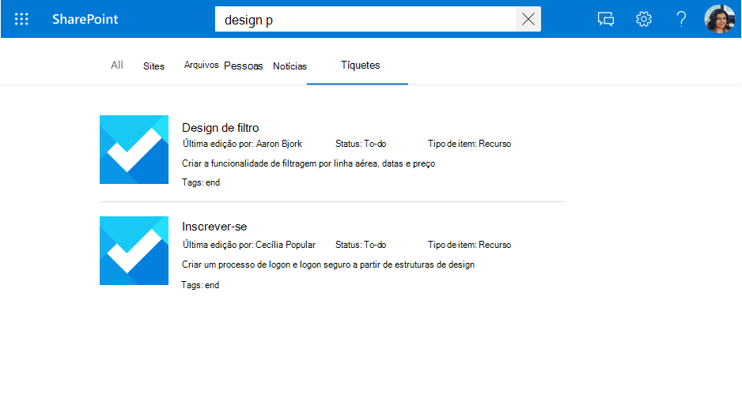

<!---<author of this doc: rsamai>--->

# Registrar e atualizar o esquema para a Microsoft Graph conexão

O [esquema](/graph/api/resources/externalconnectors-schema?view=graph-rest-1.0&preserve-view=true) de conexão determina como seu conteúdo é usado em várias experiências do Microsoft Graph. O esquema é uma lista simples de todas as propriedades que você planeja adicionar à conexão junto com seus atributos, rótulos e aliases. Você deve registrá-lo antes de adicionar itens na conexão.

## Exemplo de esquema

A tabela a seguir representa um exemplo de um esquema possível para um conector do sistema de tíquete de trabalho.

| Propriedade       | Tipo             | Pesquisável         | Consultável          | Recuperável        | Refinável          | Rótulos               | Aliases    |
|----------------|------------------|--------------------|--------------------|--------------------|--------------------|----------------------|------------|
| ticketId       | Cadeia de caracteres           |                    |                    |                    |                    |                      | ID         |
| title          | Cadeia de caracteres           | :heavy_check_mark: | :heavy_check_mark: | :heavy_check_mark: |                    | Título                |            |
| createdBy      | Cadeia de caracteres           | :heavy_check_mark: | :heavy_check_mark: |                    |                    | createdBy            | criador    |
| assignedTo     | Cadeia de caracteres           | :heavy_check_mark: | :heavy_check_mark: |                    |                    |                      |            |
| lastEditedDate | DateTime         |                    | :heavy_check_mark: | :heavy_check_mark: | :heavy_check_mark: | lastModifiedDateTime | editedDate |
| lastEditedBy   | Cadeia de caracteres           | :heavy_check_mark: | :heavy_check_mark: | :heavy_check_mark: |                    | lastModifiedBy       | editado     |
| workItemType   | Cadeia de caracteres           |                    | :heavy_check_mark: | :heavy_check_mark: |                    |                      | ticketType |
| prioridade       | Int64            | :heavy_check_mark: |                    |                    |                    |                      |            |
| categorias           | StringCollection |                    | :heavy_check_mark: | :heavy_check_mark: | :heavy_check_mark: |                      |            |
| status         | Cadeia de caracteres           |                    | :heavy_check_mark: | :heavy_check_mark: |                    |                      |            |
| url            | Cadeia de caracteres           |                    |                    |                    |                    | url                  |            |
| resolvido       | Booliano          |                    | :heavy_check_mark: | :heavy_check_mark: |                    |                      |            |

## Atributos da propriedade

### Pesquisável

Se uma propriedade puder ser pesquisada, seu valor será adicionado ao índice de texto completo. Quando um usuário realiza uma pesquisa, retornamos resultados se houver uma ocorrência de pesquisa em um dos campos pesquisáveis ou seu [conteúdo](connecting-external-content-manage-items.md#content).

<!-- markdownlint-disable MD036 -->
.

*Uma pesquisa por "design" exibindo resultados de ocorrências contra a propriedade (`title`) e conteúdo.*

### Consultável

Se uma propriedade é consultável, você pode consultá-la usando a linguagem de consulta de conhecimento (KQL). KQL consiste em uma ou mais palavras-chave de texto livre (palavras ou frases) ou restrições de propriedade. O nome da propriedade deve ser incluído na consulta, sendo especificado diretamente na consulta ou incluído de maneira programática. Você pode usar a correspondência de prefixo com o operador de caractere curinga(*).

> [!NOTE]
> Não há suporte para correspondência de sufixo.

*Uma pesquisa por "search ba \*" exibindo resultados que correspondem a esse prefixo.*

*Uma pesquisa por "tags:design" reduz os resultados para itens com "design" na propriedade `tags`.*

### Recuperável

Se uma propriedade for recuperável, seu valor poderá ser retornado nos resultados da pesquisa. As propriedades que você deseja adicionar ao modelo de exibição ou que são retornadas da consulta e sejam relevantes para os resultados da pesquisa devem ser recuperáveis. Marcar propriedades grandes ou demais como recuperáveis aumenta a latência da pesquisa. Seja seletivo e escolha propriedades relevantes.

*Um conjunto de propriedades recuperáveis (`title` e `lastEditedBy`) renderizadas como resultado.*

### Refinável

Se uma propriedade for refinável, um administrador poderá configurá-la como um filtro personalizado na página de resultados da Pesquisa da Microsoft. Uma propriedade `refinable` não pode ser `searchable`.

*Refinar resultados por `tags`, uma propriedade refináveis.*

## Rótulos semânticos

Um rótulo semântico é uma marca conhecida publicada pela Microsoft que você pode adicionar em relação a uma propriedade em seu esquema. Adicionar um rótulo semântico ajuda vários produtos da Microsoft a entender a propriedade e fornecer uma experiência melhor.

Os rótulos semânticos fornecem uma abordagem independente de domínio para atribuir propriedades de diferentes domínios de conteúdo a um conjunto de classes conhecidas. Eles localizam aplicativos em muitas experiências de conteúdo diferentes e fornecem suporte automatizado para tarefas como:

* Integração de dados em experiências heterogêneas
* Criando grafos de conhecimento comuns (por exemplo, Tópicos do Viva)
* Modelos padrão para experiências do usuário

Você pode atribuir rótulos semânticos às propriedades de origem **atribuir rótulos de** página. Os rótulos fornecem significado semântico e permitem que você integre seus dados de conector às experiências do Microsoft 365.  

| Rótulo                 | Descrição                                                                               |
|---------------------- |------------------------------------------------------------------------------------------ |
| title                 | O título do item que você deseja mostrar na pesquisa e em outras experiências.                |
| url                   | A URL de destino do item na fonte de dados.                                            |
| createdBy             | O nome da pessoa que criou o item na fonte de dados.                           |
| lastModifiedBy        | O nome da pessoa que editou mais recentemente o item na fonte de dados.              |
| autores               | Os nomes de todas as pessoas que participaram/colaboraram no item na fonte de dados. |
| createdDateTime       | A data e hora em que o item foi criado na fonte de dados.                           |
| lastModifiedDateTime  | A data e hora em que o item foi modificado pela última vez na fonte de dados.                     |
| fileName              | No caso de um arquivo, o nome do arquivo na fonte de dados.                               |
| FileExtension         | No caso de um arquivo, a extensão do arquivo na fonte de dados.                          |
| iconUrl               | A URL de um ícone.                                                                       |
| containerName         | O nome do contêiner.                                                                |
| containerUrl          | A URL do contêiner.                                                                 |

Por exemplo, a propriedade de conexão **lastEditedBy** tem o mesmo significado que o rótulo da Microsoft *lastModifiedBy*.

Adicione quantas etiquetas você puder, mas certifique-se de que elas sejam mapeadas precisamente para as propriedades. Não adicione um rótulo a uma propriedade se não fizer sentido. Mapeamentos incorretos degradam a experiência.

> [!IMPORTANT]
> Todas as propriedades que você mapeia para rótulos devem ser recuperáveis.

O rótulo **título** é o rótulo mais importante. Certifique-se de atribuir uma propriedade a esse rótulo para permitir que sua conexão participe da experiência do cluster de resultados. O mapeamento incorreto de rótulos prejudica a experiência de pesquisa. Não há problema em alguns rótulos não terem uma propriedade atribuída a eles.

### Relevância

Aplicando o máximo possível de etiquetas mapeadas com precisão, você também pode melhorar a descoberta do seu conteúdo por meio da pesquisa. É altamente recomendável definir o maior número possível dos seguintes rótulos, listados por impacto potencial na descoberta em ordem decrescente:

- Título
- lastModifiedDateTime
- lastModifiedBy
- url
- fileName
- FileExtension

Para descoberta (cenários de pesquisa), observe o seguinte:

- Certifique-se de que os mapeamentos estão corretos.
- Ao usar uma propriedade como um rótulo que contém conteúdo grande, você pode aumentar a latência da pesquisa e ter que esperar mais tempo para que a pesquisa retorne os resultados.
- Especialmente no cenário em que você configura uma vertical personalizada que permite a pesquisa em mais de uma conexão, os resultados da pesquisa se beneficiam muito ao indicar o maior número possível de rótulos.

### Tipos de resultado padrão

Os rótulos também afetam como os tipos de resultados padrão são gerados. Adicionar no mínimo os rótulos de título e conteúdo garante que um tipo de resultado seja criado para sua conexão.

*Um tipo de resultado padrão com `title` e um trecho de resultado.*

Seu tipo de resultado padrão oferece uma experiência melhor ao definir esses rótulos, quando aplicáveis, listados em ordem crescente:

- Título
- url
- lastModifiedBy
- lastModifiedDateTime
- fileName
- FileExtension

Por fim, ao atribuir rótulos, certifique-se do seguinte:

- As propriedades que você seleciona para funcionar como rótulos devem ser marcadas como recuperáveis.
- As propriedades e seus rótulos atribuídos devem ter o mesmo tipo de dados.
- Você pode mapear exatamente um rótulo para exatamente uma propriedade.

## Aliases

Os aliases são nomes amigáveis para as propriedades que você atribuir. Eles são usados em consultas e seleções em filtros de propriedades refináveis.

## Recursos de atualização de esquema

Esta seção inclui informações sobre os recursos de atualização da API do [esquema](/graph/api/resources/externalconnectors-schema?view=graph-rest-1.0&preserve-view=true).

> [!NOTE]
> Recomendamos que você reinsira os itens após uma atualização para trazê-los para o esquema mais recente. Sem reingestão, o comportamento dos itens será inconsistente.

### Adicionar uma propriedade

Você pode adicionar uma propriedade ao seu esquema; isso não requer reingestão, mas recomendamos.

Ao adicionar uma propriedade, você pode incluir todos os atributos de pesquisa necessários.

### Adicionar/remover um recurso de pesquisa

Você pode adicionar atributos de pesquisa específicos a uma propriedade, mas lembre-se de que não é possível adicionar um atributo de pesquisa de refinador como uma alteração de esquema. Além disso, não é possível usar atributos refináveis como recursos pesquisáveis.

Adicionar um recurso de pesquisa requer reingestão.

### Adicionar/remover um alias

Você pode adicionar ou remover aliases e usá-los para suas consultas de pesquisa.

Considere que você não pode remover o alias original de uma propriedade refinável que foi criada automaticamente pelo sistema.

### Adicionar/remover um rótulo semântico

Adicionar um rótulo semântico pode afetar experiências como Relevância e Tópicos do Viva.

## Próximas etapas

- [Adicionar itens à conexão](connecting-external-content-manage-items.md)
- [Revisar a referência da API do conectores do Microsoft Graph](/graph/api/resources/indexing-api-overview?view=graph-rest-1.0&preserve-view=true)
- [Pesquisar tipos personalizados (externalItem)](search-concept-custom-types.md)
- [Criar seu primeiro conector Microsoft Graph personalizado](/graph/connecting-external-content-build-quickstart)

