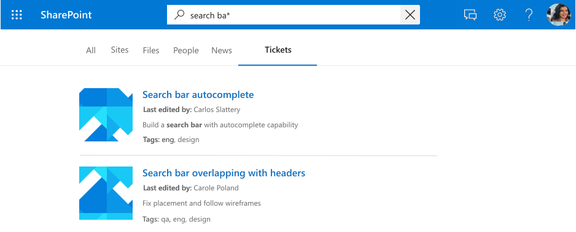

<!---<author of this doc: rsamai>--->

# Registrar o esquema da conexão do Microsoft Graph

O [esquema](/graph/api/resources/schema?view=graph-rest-beta&preserve-view=true) de conexão determina como o seu conteúdo será usado em várias experiências do Microsoft Graph. O esquema é uma lista simples de todas as propriedades que você planeja adicionar à conexão, juntamente com seus atributos, rótulos e aliases. Você deve registrá-lo antes de adicionar itens na conexão.

## Exemplo de esquema

A tabela a seguir representa um exemplo de um esquema possível para um conector do sistema de tíquete de trabalho.

| Propriedade       | Tipo             | Pesquisável         | Consultável          | Recuperável        | Refinável          | Rótulos               | Aliases    |
|----------------|------------------|--------------------|--------------------|--------------------|--------------------|----------------------|------------|
| ticketId       | Cadeia de caracteres           |                    |                    |                    |                    |                      | ID         |
| title          | Cadeia de caracteres           | :heavy_check_mark: | :heavy_check_mark: | :heavy_check_mark: |                    | Título                |            |
| createdBy      | Cadeia de caracteres           | :heavy_check_mark: | :heavy_check_mark: |                    |                    | createdBy            | criador    |
| assignedTo     | Cadeia de caracteres           | :heavy_check_mark: | :heavy_check_mark: |                    |                    |                      |            |
| lastEditedDate | DateTime         |                    | :heavy_check_mark: | :heavy_check_mark: | :heavy_check_mark: | lastModifiedDateTime | editedDate |
| lastEditedBy   | Cadeia de caracteres           | :heavy_check_mark: | :heavy_check_mark: | :heavy_check_mark: |                    | lastModifiedBy       | editado     |
| workItemType   | Cadeia de caracteres           |                    | :heavy_check_mark: | :heavy_check_mark: |                    |                      | ticketType |
| prioridade       | Int64            | :heavy_check_mark: |                    |                    |                    |                      |            |
| categorias           | StringCollection |                    | :heavy_check_mark: | :heavy_check_mark: | :heavy_check_mark: |                      |            |
| status         | Cadeia de caracteres           |                    | :heavy_check_mark: | :heavy_check_mark: |                    |                      |            |
| url            | Cadeia de caracteres           |                    |                    |                    |                    | url                  |            |
| resolvido       | Booliano          |                    | :heavy_check_mark: | :heavy_check_mark: |                    |                      |            |

## Atributos da propriedade

### Pesquisável

Se uma propriedade puder ser pesquisada, seu valor será adicionado ao índice de texto completo. Quando um usuário realiza uma pesquisa, retornamos resultados se houver uma ocorrência de pesquisa em um dos campos pesquisáveis ou seu [conteúdo](connecting-external-content-manage-items.md#content).

<!-- markdownlint-disable MD036 -->

*Uma pesquisa por "design" exibindo resultados de acertos contra conteúdo e propriedades (`title`, `tags`) e conteúdo*

### Consultável

Se uma propriedade é consultável, você pode consultá-la usando a linguagem de consulta de conhecimento (KQL). A KQL consiste em uma ou mais palavras-chave de texto livre (palavras ou frases) ou restrições de propriedade. O nome da propriedade deve ser incluído na consulta, sendo especificado diretamente na consulta ou incluído de maneira programática. Você pode usar a correspondência de prefixo com o operador de caractere curinga(*).

> [!NOTE]
> Não há suporte para correspondência de sufixo.

*Uma pesquisa por "search ba"* exibindo os resultados que correspondem a esse prefixo*

*Uma pesquisa por "tags:design" fazendo o escopo dos resultados em itens com "design" na propriedade categorias*

### Recuperável

Se uma propriedade for recuperável, seu valor poderá ser retornado nos resultados da pesquisa. As propriedades que você deseja adicionar ao modelo de exibição ou que são retornadas da consulta e sejam relevantes para os resultados da pesquisa devem ser recuperáveis. Marcar propriedades grandes, como `editHistory`, ou muitas propriedades como recuperáveis, aumentará a latência da pesquisa. Seja seletivo e escolha propriedades relevantes.

*Um conjunto de propriedades recuperáveis (`title`, `lastEditedBy` etc.) processadas como resultado*

### Refinável

Se uma propriedade for refinável, um administrador poderá configurá-la como um filtro personalizado na página de resultados da Pesquisa da Microsoft.

*Refinar resultados por `tags`, uma propriedade refinável*

## Rótulos

Um rótulo é uma categoria conhecida publicada pela Microsoft que você pode adicionar a uma propriedade no seu esquema. Adicionar um rótulo ajuda vários produtos da Microsoft a entender a propriedade e a oferecer uma melhor experiência.

| Rótulo                 | Descrição                                                                          |
|---------------------- |------------------------------------------------------------------------------------- |
| title                 | O título do item que você deseja mostrar na pesquisa e outras experiências              |
| url                   | A URL de destino do item na fonte de dados                                        |
| createdBy             | O nome da pessoa que criou o item na fonte de dados                           |
| lastModifiedBy        | O nome da pessoa que editou o item mais recentemente na fonte de dados              |
| autores               | Nome de todas as pessoas que participaram/trabalharam no item na fonte de dados  |
| createdDateTime       | Data e hora em que o item foi criado na fonte de dados                             |
| lastModifiedDateTime  | Data e hora em que o item foi modificado pela última vez na fonte de dados                            |
| fileName              | No caso de um arquivo, o nome do arquivo na fonte de dados                           |
| FileExtension         | No caso de um arquivo, o nome da extensão do arquivo na fonte de dados                      |

Por exemplo, a propriedade de conexão *lastEditedBy* tem o mesmo significado que o rótulo da Microsoft *lastModifiedBy*.

Adicione quantas etiquetas você puder, mas certifique-se de que elas sejam mapeadas precisamente para as propriedades. Não adicione um rótulo a uma propriedade se não fizer sentido. Os mapeamentos incorretos deterioram a experiência.

> [!IMPORTANT]
> Todas as propriedades que você mapeia para rótulos devem ser recuperáveis.

### Relevância

Aplicando o máximo possível de etiquetas mapeadas com precisão, você também pode melhorar a descoberta do seu conteúdo por meio da pesquisa. É altamente recomendável definir o maior número possível de etiquetas abaixo, listadas por um possível impacto na descoberta em ordem decrescente:

- Título
- lastModifiedDateTime
- lastModifiedBy
- url
- filename
- FileExtension

Para descoberta, ou seja, cenários de pesquisa, observe:

- Certifique-se de que os mapeamentos estão corretos.
- Ao usar uma propriedade como um rótulo que contenha um conteúdo grande, você pode aumentar a latência da pesquisa e esperar mais tempo para a pesquisa retornar os resultados.
- Especialmente no cenário em que você configura uma vertical personalizada que permita a pesquisa em mais de uma conexão, os resultados da pesquisa se beneficiam com o maior número possível de etiquetas.

### Tipos de resultado padrão

Os rótulos também afetam como os tipos de resultados padrão são gerados. Adicionar no mínimo os rótulos de título e conteúdo garante que um tipo de resultado seja criado para sua conexão.

*Um tipo de resultado padrão com `title` e um trecho de resultado*

O tipo de resultado padrão fornecerá uma experiência melhor quando você definir esses rótulos, quando aplicável, listados por ordem crescente:

- Título
- url
- lastModifiedBy
- lastModifiedDateTime
- fileName
- FileExtension

Por fim, ao atribuir rótulos, certifique-se do seguinte:

- As propriedades que você seleciona para funcionar como rótulos devem ser marcadas como recuperáveis.
- As propriedades e seus rótulos atribuídos devem ter o mesmo tipo de dados.
- Você pode mapear exatamente um rótulo para exatamente uma propriedade.

## Aliases

Os aliases são nomes amigáveis para as propriedades que você atribuir. Elas serão usadas em consultas e nas seleções em filtros de propriedade refináveis.

## Próximas etapas

- [Adicionar itens à conexão](./connecting-external-content-manage-items.md)
- [Revisar a referência da API do conectores do Microsoft Graph](/graph/api/resources/indexing-api-overview?view=graph-rest-beta&preserve-view=true)
- [Pesquisar tipos personalizados (externalItem)](search-concept-custom-types.md)
- Baixe o [exemplo de conector de pesquisa](https://github.com/microsoftgraph/msgraph-search-connector-sample) no GitHub