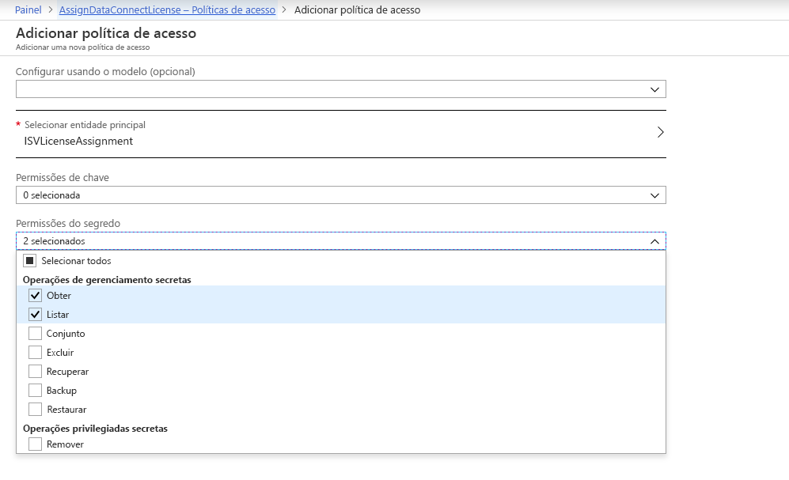
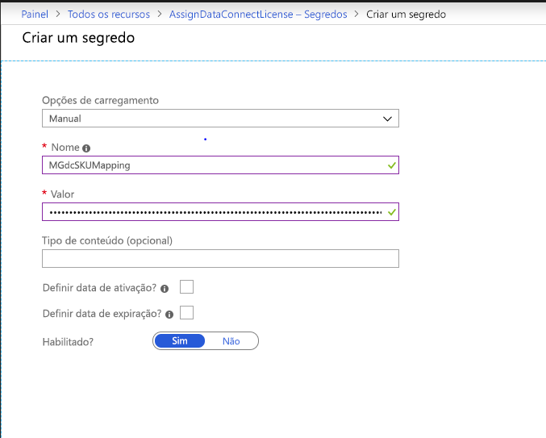

# <a name="microsoft-graph-data-connect-policies-and-licensing"></a><span data-ttu-id="c56e9-103">Políticas e licença do Microsoft Graph Data Connect</span><span class="sxs-lookup"><span data-stu-id="c56e9-103">Microsoft Graph data connect policies and licensing</span></span>

<span data-ttu-id="c56e9-104">Microsoft Graph Data Connect utiliza [aplicativos gerenciados do Azure](https://docs.microsoft.com/pt-BR/azure/managed-applications/overview) para que você possa criar e implantar soluções em seu ambiente do cliente do Azure.</span><span class="sxs-lookup"><span data-stu-id="c56e9-104">Microsoft Graph data connect uses [Azure managed applications](https://docs.microsoft.com/pt-BR/azure/managed-applications/overview) to allow you to create and deploy your solutions in your customer's Azure environment.</span></span> <span data-ttu-id="c56e9-105">Aplicativos gerenciados permitem a você dar suporte a determinadas políticas do Azure, fornecendo aos clientes maior confiança e conforto ao usar seus aplicativos.</span><span class="sxs-lookup"><span data-stu-id="c56e9-105">Managed applications allow you to support certain Azure policies, giving customers greater confidence and comfortability when using your applications.</span></span> <span data-ttu-id="c56e9-106">Além disso, você deve comprar e aplicar licenças da Microsoft, sua organização ou organizações que instalam seus aplicativos, para permitir que o aplicativo acesse os dados através do Data Connect.</span><span class="sxs-lookup"><span data-stu-id="c56e9-106">Additionally, you must purchase and apply licenses from Microsoft your organization or the organizations that install your applications, in order to allow the application to access data through data connect.</span></span>

## <a name="policies"></a><span data-ttu-id="c56e9-107">Políticas</span><span class="sxs-lookup"><span data-stu-id="c56e9-107">Policies</span></span>

<span data-ttu-id="c56e9-108">As seguintes políticas do Azure são compatíveis com um desenvolvedor de aplicativo gerenciando do Azure usando dados do Office 365:</span><span class="sxs-lookup"><span data-stu-id="c56e9-108">The following Azure policies are supported for an Azure managed application built using Office 365 data:</span></span>

- [<span data-ttu-id="c56e9-109">Política de Criptografia Necessária do ADLS Gen1</span><span class="sxs-lookup"><span data-stu-id="c56e9-109">ADLS Gen1 Encryption Required Policy</span></span>](https://docs.microsoft.com/pt-BR/azure/azure-policy/scripts/enforce-datalakestore-encryption)

<span data-ttu-id="c56e9-110">Ao selecionar qualquer uma das políticas durante a publicação do Azure Marketplace, o status de conformidade da política será marcado e aplicado a todas as instalações do seu aplicativo.</span><span class="sxs-lookup"><span data-stu-id="c56e9-110">When you select any of the policies during Azure marketplace publishing, the policy compliance status will be checked and enforced for all installations of your application.</span></span> <span data-ttu-id="c56e9-111">Todas as políticas selecionadas compatíveis serão exibidas para os aprovadores de dados como parte da solicitação de dados.</span><span class="sxs-lookup"><span data-stu-id="c56e9-111">All selected policies that are compliant will be shown to the data approvers as part of the data request.</span></span> <span data-ttu-id="c56e9-112">Qualquer violação de conformidade da política causaria falha no pipeline e interrupção da extração de dados.</span><span class="sxs-lookup"><span data-stu-id="c56e9-112">Any policy compliance violation would cause the pipeline run to fail and stop the data extraction.</span></span>

<span data-ttu-id="c56e9-113">Se deseja solicitar suporte para outras políticas, informe em [UserVoice](https://microsoftgraph.uservoice.com/forums/920506-microsoft-graph-feature-requests?category_id=359581).</span><span class="sxs-lookup"><span data-stu-id="c56e9-113">If you would like to request support for additional policies , let us know on [UserVoice](https://microsoftgraph.uservoice.com/forums/920506-microsoft-graph-feature-requests?category_id=359581).</span></span>

## <a name="licensing"></a><span data-ttu-id="c56e9-114">Licenças</span><span class="sxs-lookup"><span data-stu-id="c56e9-114">Licensing</span></span>

<span data-ttu-id="c56e9-115">Acesso ao conjunto de ferramentas do Microsoft Graph Data Connect disponível por meio do Workplace Analytics, que é licenciado por cada usuário, mensalmente.</span><span class="sxs-lookup"><span data-stu-id="c56e9-115">Access to the Microsoft Graph data connect toolset is available through Workplace Analytics, which is licensed on a per-user, per-month basis.</span></span>  <span data-ttu-id="c56e9-116">Organizações com o Workplace Analytics podem estender suas informações de dados do Office 365 ao conceder e controlar o acesso aos seus dados em escala para aplicativos desenvolvidos internamente ou por fornecedores independentes de software (ISVs).</span><span class="sxs-lookup"><span data-stu-id="c56e9-116">Organizations with Workplace Analytics can extend their insights from Office 365 data by granting and governing access to their data at scale to applications developed in-house or by independent software vendors (ISVs).</span></span> <span data-ttu-id="c56e9-117">Para saber mais, inclusive sobre como comprar, visite a [página de produto do Workplace Analytics](https://products.office.com/pt-BR/business/workplace-analytics).</span><span class="sxs-lookup"><span data-stu-id="c56e9-117">To learn more, including how to purchase, visit the [Workplace Analytics product page](https://products.office.com/pt-BR/business/workplace-analytics).</span></span>

<span data-ttu-id="c56e9-118">Se você for um ISV, também fornecemos uma opção para desenvolver aplicativos para os clientes que não compraram o Workplace Analytics.</span><span class="sxs-lookup"><span data-stu-id="c56e9-118">If you’re an ISV, we also provide an option for you to build applications for customers who have not purchased Workplace Analytics.</span></span> <span data-ttu-id="c56e9-119">Para fazer isso, você deve comprar licenças suficientes para associá-las com todos os usuários que o aplicativo acessará por meio do Microsoft Graph Data Connect, para cada cliente que compra o aplicativo.</span><span class="sxs-lookup"><span data-stu-id="c56e9-119">To do so, you must purchase enough licenses to associate them with all the users your application will access through Microsoft Graph data connect, for each customer who purchases your application.</span></span> <span data-ttu-id="c56e9-120">Você pode usar essa opção com licenças do Workplace Analytics.</span><span class="sxs-lookup"><span data-stu-id="c56e9-120">You can use this option along with Workplace Analytics licenses.</span></span> <span data-ttu-id="c56e9-121">Você precisará executar etapas para associar as instâncias da licença do Microsoft Graph Data Connect com cada uma de suas instalações do cliente.</span><span class="sxs-lookup"><span data-stu-id="c56e9-121">You’ll need to take steps to associate instances of the Microsoft Graph data connect license with each of their customer installations.</span></span>

### <a name="isvs-using-the-microsoft-graph-data-connect-license"></a><span data-ttu-id="c56e9-122">ISVs usando licença do Microsoft Graph Data Connect</span><span class="sxs-lookup"><span data-stu-id="c56e9-122">ISVs using the Microsoft Graph data connect license</span></span>
<span data-ttu-id="c56e9-123">Se você for um ISV usando licença do Data Connect, você deve usar [Azure Key Vault](https://azure.microsoft.com/pt-BR/services/key-vault/) para armazenar e processar a atribuição de licença.</span><span class="sxs-lookup"><span data-stu-id="c56e9-123">If you're an ISV using the data connect license, you must utilized [Azure Key Vault](https://azure.microsoft.com/pt-BR/services/key-vault/) to store and process the license assignment.</span></span> <span data-ttu-id="c56e9-124">Será preciso [criar um Key Vault](https://docs.microsoft.com/pt-BR/azure/key-vault/quick-create-portal).</span><span class="sxs-lookup"><span data-stu-id="c56e9-124">You will need to [create a Key Vault](https://docs.microsoft.com/pt-BR/azure/key-vault/quick-create-portal).</span></span> <span data-ttu-id="c56e9-125">Durante a criação, anote o valor URI do Key Vault.</span><span class="sxs-lookup"><span data-stu-id="c56e9-125">During creation, note the Key Vault URI value.</span></span> <span data-ttu-id="c56e9-126">Ele será usado na definição de aplicativo para fazer referência ao Key Vault.</span><span class="sxs-lookup"><span data-stu-id="c56e9-126">It will be used in the application definition to reference the Key Vault.</span></span> <span data-ttu-id="c56e9-127">Após criar o Key Vault, certifique-se de que o SPN usado no Serviço Vinculado à Fonte do modelo ARM do aplicativo tenha acesso a ele.</span><span class="sxs-lookup"><span data-stu-id="c56e9-127">After you create the Key Vault, ensure that the SPN used in the Source Linked Service of the application's ARM template has access to it.</span></span> <span data-ttu-id="c56e9-128">Para fazer isso, acesse o painel **políticas de acesso** da instância do Key Vault, crie uma política de acesso para o aplicativo referenciada pelo SPN, e atribua permissões ao aplicativo em **Obter** e **Lista**.</span><span class="sxs-lookup"><span data-stu-id="c56e9-128">To do so, go to the **Access Policies** pane of the Key Vault instance, create an access policy for the application referenced by the SPN, and assign **Get** and **List** permissions to the application.</span></span> 



<span data-ttu-id="c56e9-130">A atribuição das licenças do Microsoft Graph Data Connect para as organizações é fornecido como um segredo no Key Vault.</span><span class="sxs-lookup"><span data-stu-id="c56e9-130">The assignment of Microsoft Graph data connect licenses to organizations is provided as a secret in the Key Vault.</span></span> <span data-ttu-id="c56e9-131">Para fazer isso:</span><span class="sxs-lookup"><span data-stu-id="c56e9-131">To do so:</span></span>
1. <span data-ttu-id="c56e9-132">No Key Vault, clique em **Gerar/Importar**, e crie um segredo manual.</span><span class="sxs-lookup"><span data-stu-id="c56e9-132">Go to the Key Vault and under **Generate/Import**, create a manual secret.</span></span> <span data-ttu-id="c56e9-133">O nome do segredo deve ser **MGdcSKUMapping** e o valor do segredo deve conter a ID de locatário e o número de licenças alocado para esse locatário, no formato a seguir.</span><span class="sxs-lookup"><span data-stu-id="c56e9-133">The name of the secret must be **MGdcSKUMapping** and the value of the secret must contain the ID of the tenant and the number of licenses allocated to that tenant, in the following format.</span></span>

`{"tenantId1" : 20, "tenantId2" : 35, "tenantId3" : 12}`

2. <span data-ttu-id="c56e9-134">Após configurar o valor, verifique se está habilitado e selecione **Criar** para iniciar a implantação.</span><span class="sxs-lookup"><span data-stu-id="c56e9-134">After setting the value, make sure that it is enabled and select **Create** to begin the deployment.</span></span> 



3. <span data-ttu-id="c56e9-136">Você também precisa atualizar o modelo ARM do aplicativo para fazer referência ao Key Vault que você criou.</span><span class="sxs-lookup"><span data-stu-id="c56e9-136">You also need to update the application's ARM template to reference the Key Vault that you created.</span></span> <span data-ttu-id="c56e9-137">Para fazer isso, preencha as propriedades do **LicenseKeyVaultUri**, que devem ser preenchidas com o valor **KeyVaultUri** que você anotou durante a criação.</span><span class="sxs-lookup"><span data-stu-id="c56e9-137">To do so, populated the **LicenseKeyVaultUri** property, which must be populated with the **KeyVaultUri** value you noted during creation.</span></span> <span data-ttu-id="c56e9-138">Essa propriedade é fornecida no Serviço Vinculado à Fonte do modelo ARM do aplicativo, conforme mostrado.</span><span class="sxs-lookup"><span data-stu-id="c56e9-138">This property is provided in the Source Linked Service of the application's ARM template, as shown.</span></span> 

```
"properties": {
        "type": "Office365",
            "description": "Source O365 linked service",
            "typeProperties": {
                   "office365tenantId": "[subscription().tenantId]",
        "PrivacyPolicyUri": "http://www.wkw.com/privacy",
        "TermsOfUseUri": "http://www.wkw.com/tos",
        "servicePrincipalId": "[variables('sourceLinkedServicePrincipalId')]",
        "servicePrincipalKey": {
                           "type": "SecureString",
                "value": "[variables('sourceLinkedServicePrincipalKey')]"
        },
        "servicePrincipalTenantId": "[variables('sourceLinkedServicePrincipalTenantId')]",
        "LicenseKeyVaultUri": "<KeyVaultUri>",
            }
    }
```

<span data-ttu-id="c56e9-139">Data Connect fará referência ao segredo do Key Vault antes de executar cada pipeline.</span><span class="sxs-lookup"><span data-stu-id="c56e9-139">Data connect will reference the secret in the Key Vault before each pipeline run.</span></span> <span data-ttu-id="c56e9-140">O pipeline irá falhar se não houver licenças suficientes atribuídas à organização para fornecer dados para cada usuário ou se o Key Vault estiver inacessível.</span><span class="sxs-lookup"><span data-stu-id="c56e9-140">It will fail the pipeline if there aren't enough licenses assigned to the organization to provide data for each user, or if the Key Vault is inaccessible.</span></span> 

## <a name="next-steps"></a><span data-ttu-id="c56e9-141">Próximos passos</span><span class="sxs-lookup"><span data-stu-id="c56e9-141">Next Steps</span></span>
<span data-ttu-id="c56e9-142">Se deseja solicitar suporte para outras políticas, informe em [UserVoice](https://microsoftgraph.uservoice.com/forums/920506-microsoft-graph-feature-requests?category_id=359581).</span><span class="sxs-lookup"><span data-stu-id="c56e9-142">If you would like to request support for additional policies, let us know on [UserVoice](https://microsoftgraph.uservoice.com/forums/920506-microsoft-graph-feature-requests?category_id=359581).</span></span> <span data-ttu-id="c56e9-143">Para saber mais sobre Workplace Analytics, inclusive sobre como comprar, visite a [página de produto do Workplace Analytics](https://products.office.com/pt-BR/business/workplace-analytics).</span><span class="sxs-lookup"><span data-stu-id="c56e9-143">To learn more about Workplace Analytics, including how to purchase, visit the [Workplace Analytics product page](https://products.office.com/pt-BR/business/workplace-analytics).</span></span>
