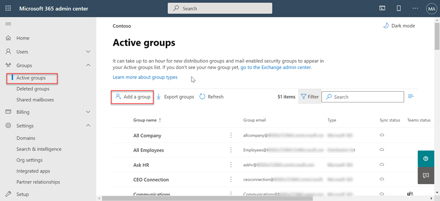

<!-- markdownlint-disable MD002 MD041 -->

Antes de usar o Microsoft Graph Data Connect pela primeira vez, você precisa configurar seu locatário do Microsoft 365. Isso envolve a adição do serviço e a configuração de um grupo de segurança com permissões para aprovar solicitações de extração de dados.

## Conceder aos usuários do Azure AD a função de administrador global

Nesta etapa, você garantirá que dois usuários no locatário do Microsoft 365 tenham a **função de** administrador global habilitada.

- [Função de administrador global integrado](/azure/active-directory/roles/permissions-reference#global-administrator).
- [Elevar o acesso para obter a função administrador global](/azure/role-based-access-control/elevate-access-global-admin).

## Configurar o grupo aprovador de solicitação de consentimento do Microsoft Graph Data Connect

Nesta etapa, você configurará seu locatário do Microsoft 365 para habilitar o uso do Microsoft Graph Data Connect.

1. Abra um navegador e vá para o Portal de Administração do [Microsoft 365.](https://admin.microsoft.com/)

1. Na navegação da barra lateral, selecione **Grupos ativos**.
  
    

1. Selecione o **botão Adicionar um grupo.**

1. Use o seguinte para criar o novo grupo de segurança habilitado para **email** e selecione o **botão Adicionar.**
   - **Tipo**: segurança habilitada para email

    

   - **Nome**: Aprovadores de Solicitação de Consentimento

    

   - **Prefixo de Email**: consentrequestapprovers

    

1. **Pode levar até uma hora até** o grupo recém-criado aparecer na lista. Quando o grupo tiver sido criado, selecione-o.

1. Vá para a **opção Grupos ativos** novamente e procure o grupo que você acabou de criar.

1. Selecione o grupo e, na guia **Membros,** selecione **Exibir tudo e gerenciar membros**.

1. Adicione os dois usuários que você habilitaram a **função de** administrador global a esse novo grupo.

## Habilitar o Microsoft Graph Data Connect no locatário do Microsoft 365

Nesta etapa, você habilita o serviço Microsoft Graph Data Connect em seu locatário do Microsoft 365.

1. Enquanto você ainda estiver inscreveu no Portal de Administração do Microsoft 365, selecione o item de menu **Configurações > Org.**

1. Selecione o **serviço Microsoft Graph Data Connect.**

    

1. Selecione a caixa de seleção que diz ativar ou desativar o **Microsoft Graph Data Connect para que toda a** sua organização habilita a Conexão de Dados.

    

1. Insira **Aprovadores de** Solicitação de Consentimento (ou o  nome do grupo criado anteriormente) no grupo de usuários para tomar decisões de aprovação e selecione **Salvar**.
