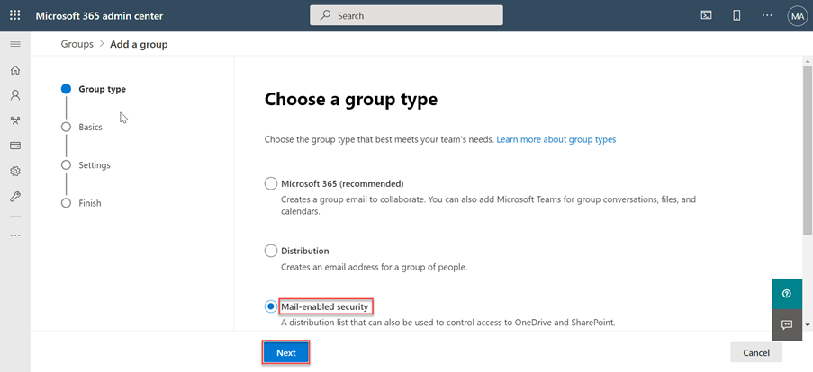
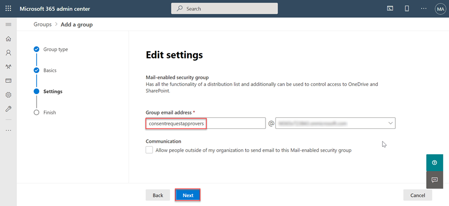

<!-- markdownlint-disable MD002 MD041 -->

Antes de usar o Microsoft Graph dados Conexão pela primeira vez, você precisa configurar seu Microsoft 365 locatário. Isso envolve a adição do serviço e a configuração de um grupo de segurança com permissões para aprovar solicitações de extração de dados.

## Conceder aos usuários do Azure AD a função de administrador global

Nesta etapa, você garantirá que dois usuários em seu Microsoft 365 locatário tenham a **função de** administrador global habilitada.

- [Função de administrador global integrado](/azure/active-directory/roles/permissions-reference#global-administrator).
- [Elevar o acesso para obter a função administrador global](/azure/role-based-access-control/elevate-access-global-admin).

## Configurar o grupo Graph aprovador de solicitação de consentimento Conexão Dados do Microsoft Conexão

Nesta etapa, você configurará seu locatário Microsoft 365 para habilitar o uso do Microsoft Graph Data Conexão.

1. Abra um navegador e vá para seu [Microsoft 365 Admin Portal](https://admin.microsoft.com/).

1. Na navegação da barra lateral, selecione **Grupos ativos**.
  
    

1. Selecione o **botão Adicionar um grupo.**

1. Use o seguinte para criar o novo grupo de segurança habilitado para **email** e selecione o **botão Adicionar.**
   - **Tipo**: segurança habilitada para email

    

   - **Nome**: Aprovadores de Solicitação de Consentimento

    

   - **Prefixo de Email**: consentrequestapprovers

    

1. **Pode levar até uma hora até** o grupo recém-criado aparecer na lista. Quando o grupo tiver sido criado, selecione-o.

1. Vá para a **opção Grupos ativos** novamente e procure o grupo que você acabou de criar.

1. Selecione o grupo e, na guia **Membros,** selecione **Exibir tudo e gerenciar membros**.

1. Adicione os dois usuários que você habilitaram a **função de** administrador global a esse novo grupo.

## Habilitar o microsoft Graph dados Conexão seu locatário Microsoft 365 usuário

Nesta etapa, você habilita o serviço microsoft Graph data Conexão no seu locatário Microsoft 365 usuário.

1. Enquanto você ainda estiver Microsoft 365 Portal de Administração, selecione o item de menu configurações Configurações > **Org.**

1. Selecione o **serviço microsoft Graph dados Conexão** dados.

    

1. Selecione a caixa de seleção que diz ativar ou desativar o **Microsoft Graph dados** Conexão toda a sua organização para habilitar dados Conexão.

    

1. Insira **Aprovadores de** Solicitação de Consentimento (ou o  nome do grupo criado anteriormente) no grupo de usuários para tomar decisões de aprovação e selecione **Salvar**.
