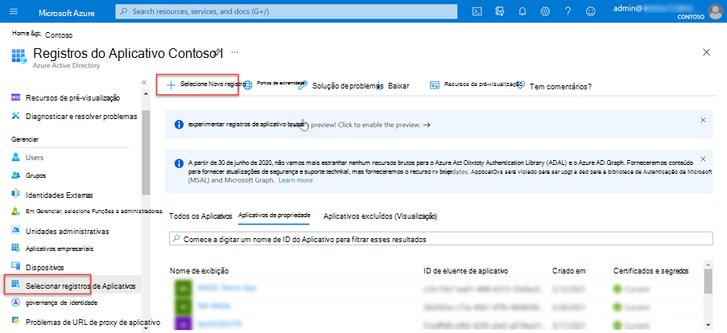
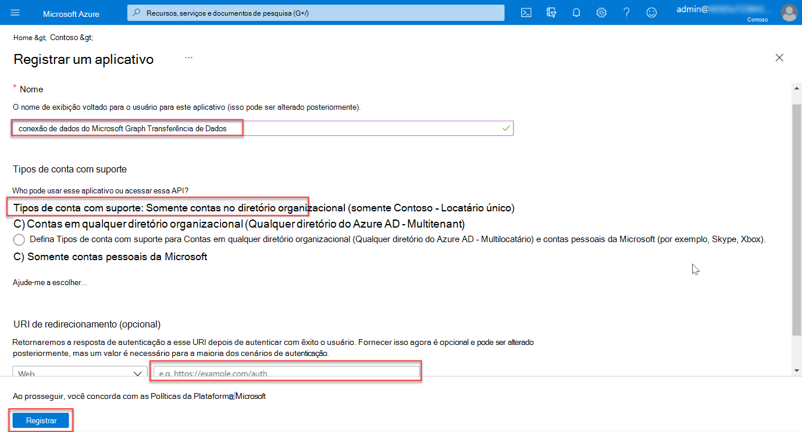
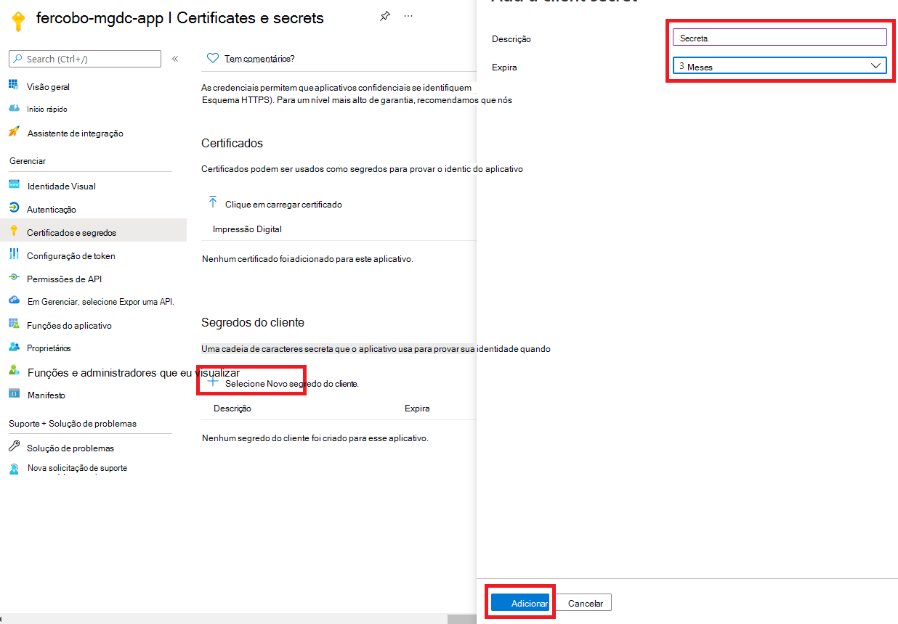
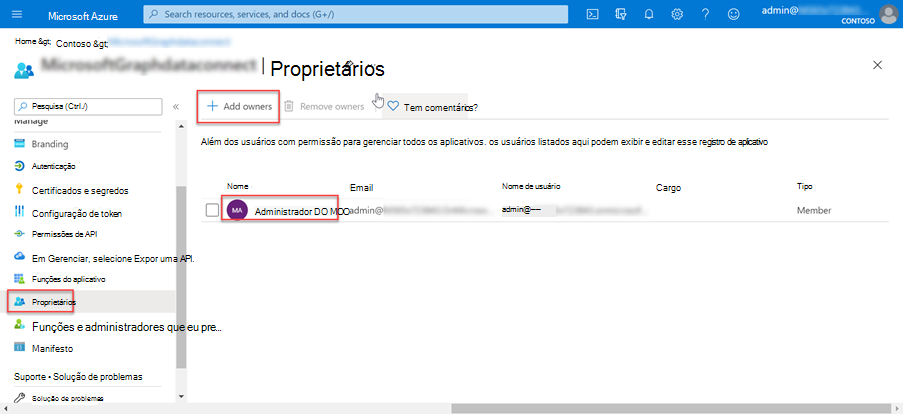

<!-- markdownlint-disable MD002 MD041 -->

Neste exercício, você criará, executará e aprovará um pipeline da Fábrica de Dados do Azure para extrair dados do Microsoft 365 para um Blob do Azure Armazenamento para processamento adicional.

## Criar um registro Microsoft Azure Active Directory aplicativo

A primeira etapa é criar um aplicativo do Azure AD que será usado como entidade de segurança para executar o processo de extração de dados.

1. Abra um navegador e vá para o [Portal do Azure.](https://portal.azure.com/)

1. Entre usando uma conta com direitos **de administrador global** para seu Azure e Microsoft 365 locatários.

1. Na navegação da barra lateral, selecione **Azure Active Directory** (Azure AD).

1. Na página Visão geral do Azure AD, selecione **Registros de** aplicativo na seção **Gerenciar** do menu.

1. Selecione o **botão Novo registro.**

    

1. Use os seguintes valores para criar um novo aplicativo do Azure AD e selecione **Registrar**.

   - **Nome**: Microsoft Graph Dados Conexão Transferência de Dados
   - **Tipos de conta com suporte**: Somente contas neste diretório organizacional.
   - **URI de redirecionamento**: deixe os valores padrão.

    

1. Localize **a ID do Aplicativo (cliente)** e copie-a como você precisará mais adiante neste tutorial. Isso será chamado de ID da entidade de serviço.

1. Localize **a ID de Diretório (locatário)** e copie-a como você precisará mais adiante neste tutorial. Isso será chamado de ID do locatário.

1. Na navegação na barra lateral, selecione **Certificados e segredos em** **Gerenciar**.

1. Selecione o **botão Novo segredo do cliente.** Definir *Descrição* como qualquer nome, definir **Expira como** qualquer valor no menu suspenso e escolha **Adicionar**.

    

    - Depois que o segredo do cliente for criado, salve o **Valor** em algum lugar seguro, pois ele não estará mais disponível posteriormente e você precisará criar um novo.
    - Isso será referenciado como a chave principal do serviço.

1. Na navegação da barra lateral do aplicativo, selecione **Proprietários**.

1. Verifique se sua conta está listada como proprietária do aplicativo. Se ele não estiver listado como proprietário, adicione-o.

    
