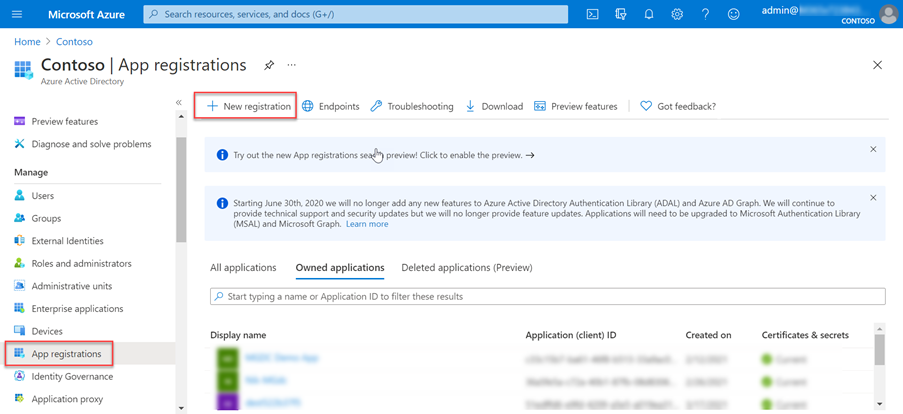

<!-- markdownlint-disable MD002 MD041 -->

Neste exercício, você criará, executará e aprovará um pipeline da Fábrica de Dados do Azure para extrair dados do Microsoft 365 para um Blob do Azure Armazenamento para processamento adicional.In this exercise you will create, run, and approve an Azure Data Factory pipeline to extract data from Microsoft 365 to an Azure Storage Blob for additional processing.

## Criar um registro Microsoft Azure Active Directory aplicativoCreate a Microsoft Azure Active Directory application registration

A primeira etapa é criar um aplicativo do Azure AD que será usado como entidade de segurança para executar o processo de extração de dados.The first step is to create an Azure AD application that will be used as the security principal to run the data extraction process.

1. Abra um navegador e vá para o [Portal do Azure.](https://portal.azure.com/)Open a browser and go to your [Azure Portal](https://portal.azure.com/).

1. Entre usando uma conta com direitos **de administrador global** para seu Azure e Microsoft 365 locatários.Sign in using an account with **Global administrator** rights to your Azure and Microsoft 365 tenants.

1. Na navegação da barra lateral, selecione **Azure Active Directory** (Azure AD).On the sidebar navigation, select **Azure Active Directory** (Azure AD).

1. Na página Visão geral do Azure AD, selecione **Registros de** aplicativo na seção **Gerenciar** do menu.On the Azure AD Overview page, select **App registrations** from the **Manage** section of the menu.

1. Selecione o **botão Novo registro.**Select the **New registration** button.

    

1. Use os seguintes valores para criar um novo aplicativo do Azure AD e selecione **Registrar**.Use the following values to create a new Azure AD application and select **Register**.

   - **Nome**: Microsoft Graph Dados Conexão Transferência de Dados**Name**: Microsoft Graph Data Connect Data Transfer
   - **Tipos de conta com suporte**: Somente contas neste diretório organizacional.**Supported account types**: Accounts in this organizational directory only.
   - **URI de redirecionamento**: deixe os valores padrão.**Redirect URI**: Leave the default values.

    

1. Localize **a ID do Aplicativo (cliente)** e copie-a como você precisará mais adiante neste tutorial.Locate the **Application (client) ID** and copy it as you will need it later in this tutorial. Isso será chamado de ID da entidade de serviço.This will be referred to as the service principal ID.

1. Localize **a ID de Diretório (locatário)** e copie-a como você precisará mais adiante neste tutorial.Locate the **Directory (tenant) ID** and copy it as you will need it later in this tutorial. Isso será chamado de ID do locatário.This will be referred to as the tenant ID.

1. Na navegação na barra lateral, selecione **Certificados e segredos em** **Gerenciar**.On the sidebar navigation, select **Certificates and secrets** under **Manage**.

1. Selecione o **botão Novo segredo do cliente.**Select the **New client secret button**. Definir *Descrição* como qualquer nome, definir **Expira como** qualquer valor no menu suspenso e escolha **Adicionar**.Set *Description* to any name, set **Expires** to any value in the dropdown and choose **Add**.

    

    - Depois que o segredo do cliente for criado, salve o **Valor** em algum lugar seguro, pois ele não estará mais disponível posteriormente e você precisará criar um novo.After the client secret is created, make sure you save the **Value** somewhere safe, as it will no longer be available later, and you will need to create a new one.
    - Isso será referenciado como a chave principal do serviço.This will be referenced as the service principal key.

1. Na navegação da barra lateral do aplicativo, selecione **Proprietários**.On the sidebar navigation for the application, select **Owners**.

1. Verifique se sua conta está listada como proprietária do aplicativo.Verify that your account is listed as an owner for the application. Se ele não estiver listado como proprietário, adicione-o.If it isn't listed as an owner, add it.

    
