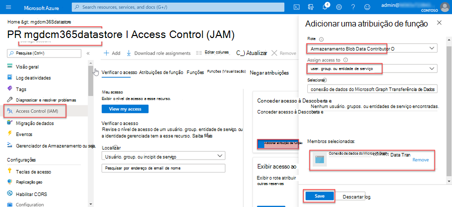
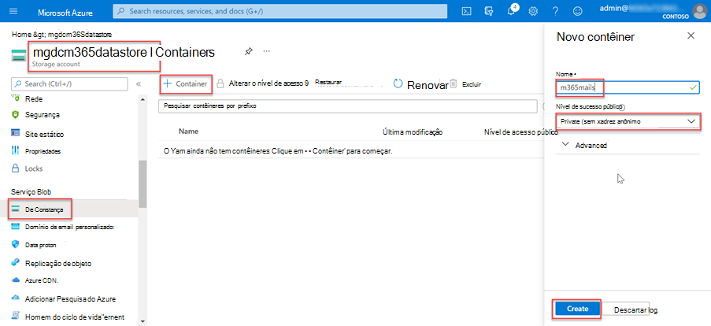

<!-- markdownlint-disable MD002 MD041 -->

Nesta etapa, você criará uma conta do Azure Armazenamento onde Conexão de dados do Microsoft Graph armazenará os dados extraídos do Microsoft 365 para processamento posterior.

1. Abra um navegador e vá para o [Portal do Azure.](https://portal.azure.com/)

1. Entre usando uma conta com direitos **de administrador global** para seu Azure e Microsoft 365 locatários.

1. Na navegação da barra lateral, selecione **Criar um recurso**.

1. Encontre o **Armazenamento tipo** de recurso Conta e use os seguintes valores para cria-lo e selecione Revisar **+ criar**.

    - **Assinatura**: selecione sua assinatura do Azure
    - **Grupo de recursos**: GraphDataConnect (ou selecione um grupo de recursos existente)
    - **Armazenamento da conta**: mgdcm365datastore
    - **Região**: escolha uma região do Azure na mesma região que sua Microsoft 365 região
    - **Desempenho**: Standard
    - **Redundância**: Armazenamento geo-redundante (GRS)
    - **Guia Avançado**:
      - **Camada de acesso**: Hot

1. Revise se as configurações corresponderão às mostradas na etapa anterior e selecione **Criar**.

1. Depois que a conta Armazenamento do Azure tiver sido criada, conceda ao aplicativo do Azure AD criado anteriormente o acesso adequado a ela.

    1. Selecione a **conta do Azure Armazenamento**.
    2. No menu barra lateral, selecione **Controle de acesso (IAM)**.
    3. Selecione o **botão Adicionar** no bloco Adicionar **uma atribuição de** função.
    4. Use os seguintes valores para encontrar o aplicativo selecionado anteriormente para conceder Armazenamento função de Colaborador de Dados de **Blob** e, em seguida, **selecione Salvar**.

        - **Função**: Armazenamento blob data contributor
        - **Atribuir acesso a**: Usuário, grupo ou entidade de serviço
        - **Selecione**: Conexão de dados do Microsoft Graph transferência de dados (o nome do aplicativo do Azure AD criado anteriormente)

        

1. Crie um novo contêiner na **conta mgdcm365datastore** Azure Armazenamento.

    1. Selecione a **conta mgdcm365datastore** do Azure Armazenamento.
    2. No menu barra lateral, selecione **Contêineres** na seção Serviço **blob.**
    3. Selecione o **botão +Contêiner** na parte superior da página e use os seguintes valores e selecione **Criar**.

        - **Nome**: m365mails
        - **Nível de acesso público**: Privado (sem acesso anônimo)

        
