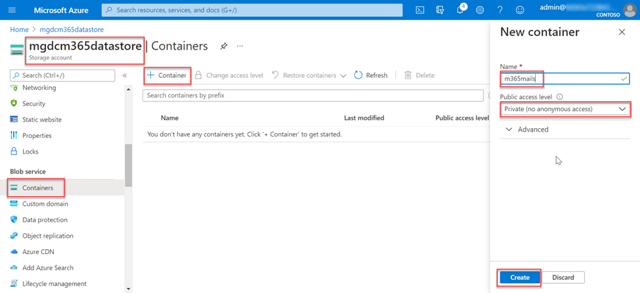

<!-- markdownlint-disable MD002 MD041 -->

Nesta etapa, você criará uma conta do Azure Armazenamento onde conexão de dados do Microsoft Graph armazenará os dados extraídos do Microsoft 365 para processamento posterior.In this step you will create an Azure Storage account where Microsoft Graph data connect will store the data extracted from Microsoft 365 for further processing.

1. Abra um navegador e vá para o [Portal do Azure.](https://portal.azure.com/)Open a browser and go to your [Azure Portal](https://portal.azure.com/).

1. Entre usando uma conta com direitos **de administrador global** para seu Azure e Microsoft 365 locatários.Sign in using an account with **Global administrator** rights to your Azure and Microsoft 365 tenants.

1. Na navegação da barra lateral, selecione **Criar um recurso**.On the sidebar navigation, select **Create a resource**.

1. Encontre o **Armazenamento tipo** de recurso Conta e use os seguintes valores para cria-lo e selecione Revisar **+ criar**.Find the **Storage Account** resource type and use the following values to create it, then select **Review + create**.

    - **Assinatura**: selecione sua assinatura do Azure**Subscription**: select your Azure subscription
    - **Grupo de recursos**: GraphDataConnect (ou selecione um grupo de recursos existente)**Resource group**: GraphDataConnect (or select an existing resource group)
    - **Armazenamento da conta**: mgdcm365datastore**Storage account name**: mgdcm365datastore
    - **Região**: escolha uma região do Azure na mesma região que sua Microsoft 365 região**Region**: pick an Azure region in the same region as your Microsoft 365 region
    - **Desempenho**: Standard**Performance**: Standard
    - **Redundância**: Armazenamento geo-redundante (GRS)**Redundancy**: Geo-redundant storage (GRS)
    - **Guia Avançado**:**Advanced tab**:
      - **Camada de acesso**: Hot**Access tier**: Hot

1. Revise se as configurações corresponderão às mostradas na etapa anterior e selecione **Criar**.Review that the settings match those shown in the previous step and select **Create**.

1. Depois que a conta Armazenamento do Azure tiver sido criada, conceda ao aplicativo do Azure AD criado anteriormente o acesso adequado a ela.After the Azure Storage account has been created, grant the Azure AD application previously created the proper access to it.

    1. Selecione a **conta do Azure Armazenamento**.Select the **Azure Storage account**.
    2. No menu barra lateral, selecione **Controle de acesso (IAM)**.On the sidebar menu, select **Access control (IAM)**.
    3. Selecione o **botão Adicionar** no bloco Adicionar **uma atribuição de** função.Select the **Add** button in the **Add a role assignment** block.
    4. Use os seguintes valores para encontrar o aplicativo selecionado anteriormente para conceder Armazenamento função de Colaborador de Dados de **Blob** e, em seguida, **selecione Salvar**.Use the following values to find the application you previously selected to grant it the **Storage Blob Data Contributor** role, then select **Save**.

        - **Função**: Armazenamento blob data contributor**Role**: Storage Blob Data Contributor
        - **Atribuir acesso a**: Usuário, grupo ou entidade de serviço**Assign access to**: User, group or service principal
        - **Selecione**: conexão de dados do Microsoft Graph transferência de dados (o nome do aplicativo do Azure AD criado anteriormente)**Select**: Microsoft Graph data connect Data Transfer (the name of the Azure AD application you created previously)

        

1. Crie um novo contêiner na **conta mgdcm365datastore** Azure Armazenamento.Create a new container in the **mgdcm365datastore** Azure Storage account.

    1. Selecione a **conta mgdcm365datastore** do Azure Armazenamento.Select the **mgdcm365datastore** Azure Storage account.
    2. No menu barra lateral, selecione **Contêineres** na seção Serviço **blob.**On the sidebar menu, select **Containers** under the **Blob** service section.
    3. Selecione o **botão +Contêiner** na parte superior da página e use os seguintes valores e selecione **Criar**.Select the **+Container** button at the top of the page and use the following values and then select **Create**.

        - **Nome**: m365mails**Name**: m365mails
        - **Nível de acesso público**: Privado (sem acesso anônimo)**Public access level**: Private (no anonymous access)

        
