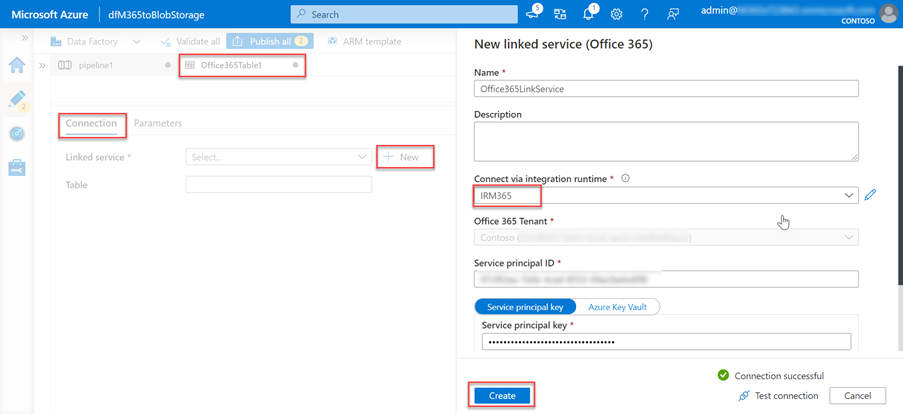

<!-- markdownlint-disable MD002 MD041 -->

A próxima etapa é usar a Fábrica de Dados do Azure para criar um pipeline para extrair os dados do Microsoft 365 para a conta Armazenamento do Azure usando Conexão de dados do Microsoft Graph.

## Criar um pipeline do Azure Data Factory

1. Abra um navegador e vá para o [Portal do Azure.](https://portal.azure.com/)

1. Entre usando uma conta com direitos **de administrador global** para seu Azure e Microsoft 365 locatários.

1. Na navegação da barra lateral, selecione **Criar um recurso**.

1. Encontre o **tipo de recurso Fábrica** de Dados e use os seguintes valores para cria-lo e selecione **Criar**.

    1. **Assinatura**: selecione sua assinatura do Azure
    2. **Grupo de recursos**: GraphDataConnect
    3. **Região**: escolha uma região do Azure na mesma região que sua Microsoft 365 região
    4. **Nome**: dfM365toBlobStorage
    5. **Versão**: V2

        

    6. Na guia **Configuração do Git,** configure o Git ou selecione a opção _Configurar o Git posteriormente._

1. Depois que o recurso da Fábrica de Dados do Azure for criado, selecione o bloqueio Autor e **Monitor** para iniciar o editor de tela inteira do Azure Data Factory.

    

1. Alternar da **visão geral** para a **experiência Gerenciar** selecionando-a na navegação à esquerda.

1. Por padrão, a Fábrica de Dados do Azure usará um tempo de execução de integração que está resolvendo automaticamente a região. Como o data Conexão requer que sua origem, destino e tempo de execução de integração existam na mesma região Microsoft 365, recomendamos que você crie um novo tempo de execução de integração com uma região fixa.

    1. Selecione **Tempos de execução de**  >  **integração Novo**.
    2. Selecione **Azure, Auto-hospedado e** selecione **Continuar**.
    3. Selecione **Azure** para ambiente de rede e selecione **Continuar**.

        

    4. Use os detalhes a seguir para concluir o formulário na tela final e selecione **Criar**.

        - **Nome**: nome do tempo de execução de integração
        - **Descrição**: insira uma descrição
        - **Região**: selecione a região que corresponde ao seu Microsoft 365 região
        - **Configuração de rede virtual (visualização)**: Desabilitada

1. Alternar da **experiência Gerenciar** para **o Autor** selecionando-a na navegação à esquerda.
1. Crie um novo pipeline selecionando o **ícone de a** mais e, em seguida, **pipeline**.

    

    - Arraste a **atividade Copiar Dados** da seção Mover e **Transformar** para a superfície de design.

        

    - Selecione a atividade no designer.
    - Selecione a **guia Geral** e dê a ela um nome e uma descrição.

      - **Nome**: CopyFromM365toBlobStorage
      - **Descrição**: Uma descrição que você deseja.

    - No painel editor de atividades abaixo do designer, selecione a guia **Origem** e selecione **Novo**.
    - Localize o **Office 365** de dados, selecione-o e selecione o **botão Continuar.**

        

    - O designer atualizará a guia **Fonte** com as configurações Microsoft 365 conector.
    - Selecione a **opção Abrir** ao lado do campo **Conjuntos de** dados de origem.
    - Nas configurações da tabela, selecione a guia **Conexão** e, em seguida, o **botão Novo.**
    - Na caixa de diálogo exibida, insira a ID de Aplicativo e a   **ID** secreta do aplicativo Azure AD criadas anteriormente nos campos de chave principal do serviço e da chave principal do serviço, respectivamente, e selecione **Criar**. 
    - Selecione o tempo de execução de integração criado anteriormente no Conexão por meio do menu suspenso **tempo de execução de** integração.

        

    - Após criar a Microsoft 365, para o campo **Tabela,** selecione **BasicDataSet_v0. Message_v0**.
    - Alternar do **Office365Table para o** **Pipeline > Source**. Use os seguintes valores para o **filtro Date.**

      - **Nome da coluna**: CreatedDateTime
      - **Hora de início (UTC)**: selecione uma data antes da data atual
      - **Hora de término (UTC)**: selecione a data atual
      - Selecione **Importar esquema** na seção _Colunas de_ saída.

    - Selecione a **atividade Copiar dados** na guia pipeline e selecione a guia **Pia.**

      - Selecione o **botão Novo,** selecione **Azure Blob Armazenamento** e selecione o **botão Continuar.**
      - Selecione **Binário como** o formato dos dados e selecione o botão **Continuar.**
      - Dê ao grupo de dados o nome **M365JsonFile** e crie um novo serviço vinculado se ele ainda não existir.

    - Na tabela, selecione a guia **Conexão** e selecione **Novo**.
    - De definir os seguintes valores na caixa de diálogo e selecione **Concluir**.

        - **Método de autenticação**: Entidade de serviço
        - **Assinatura do Azure**: Selecionar todos
        - **Armazenamento da conta**: mgdcm365datastore
          - Essa é a conta de armazenamento criada anteriormente neste exercício.
        - **Locatário**: insira a ID do locatário do Azure
        - **ID da entidade de** serviço : insira a ID do aplicativo do Azure AD que você criou anteriormente
        - **Chave de entidade de** serviço : insira a chave de hashed do aplicativo do Azure AD que você criou anteriormente

    - Ao lado do campo **Caminho do arquivo,** selecione **Procurar**.
    - Selecione o nome do contêiner de armazenamento criado anteriormente.

      

1. Com o pipeline criado, selecione o botão **Validar Tudo** na parte superior do designer.

1. Depois de validar (e corrigir quaisquer problemas encontrados), selecione o botão **Publicar Tudo** na parte superior do designer.

## Executar o Pipeline da Fábrica de Dados do Azure

Com o pipeline criado, agora é hora de ser executado.

> [!NOTE]
> Pode levar vários minutos para que a solicitação de consentimento apareça e não é incomum para todo o processo (iniciar, solicitar consentimento e após aprovar o consentimento concluindo a operação do pipeline) para levar mais de 40 minutos.

1. No designer da Fábrica de Dados do Azure, com o pipeline aberto, selecione **Adicionar gatilho > Gatilho Agora**.

    

1. Depois de iniciar o trabalho, no menu da barra lateral, selecione **Monitorar** para exibir trabalhos em execução atuais.

1. Na barra de navegação do lado esquerdo, localize a guia **Pipeline runs** e selecione-a. Selecione o pipeline na coluna **Nome do pipeline** para exibir o activity **runs**. Esse pipeline mostrará como _Em andamento_.

    

1. Depois que você está no **exibição Atividade é executado,** vá para a seção _Atividades_ executados, que está localizada no lado inferior da página.

1. Passe o mouse sobre **o nome de atividade** e selecione a opção de alternâncias. Isso irá trazer a guia **Detalhes.**

    

1. Na tela **Detalhes,** procure o status da atividade de pipeline como realçada na imagem a seguir. Nesse caso, você pode ver que ele está em um estado **de RequestingConsent**.

    

1. Neste ponto, a atividade é pausada internamente até que alguém aprove manualmente a solicitação de consentimento por meio do Centro de administração do Microsoft 365 ou por meio do PowerShell.
