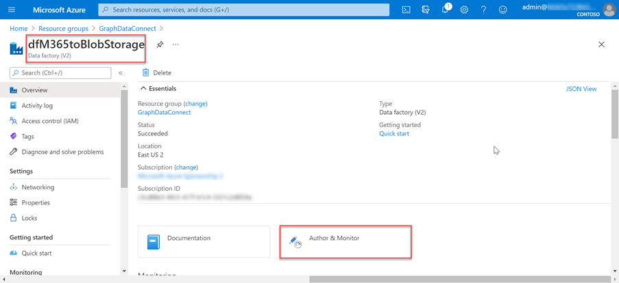
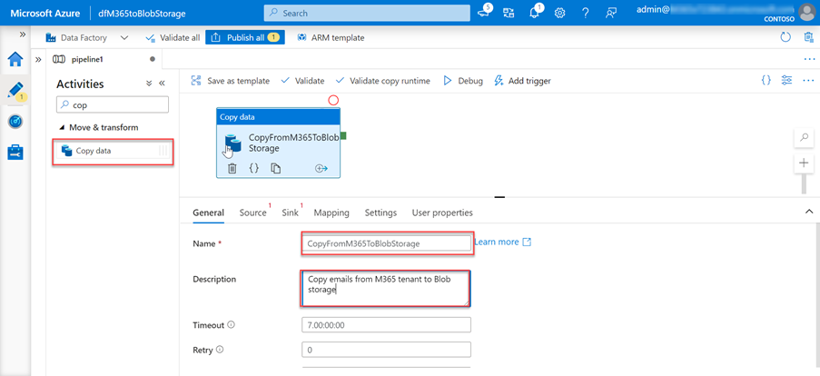
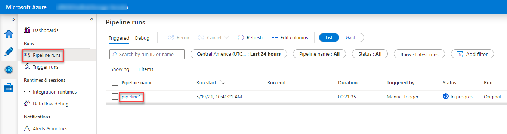

<!-- markdownlint-disable MD002 MD041 -->

A próxima etapa é usar a Fábrica de Dados do Azure para criar um pipeline para extrair os dados do Microsoft 365 para a conta Armazenamento do Azure usando conexão de dados do Microsoft Graph.The next step is to use the Azure Data Factory to create a pipeline to extract the data from Microsoft 365 to the Azure Storage account using Microsoft Graph data connect.

## Criar um pipeline do Azure Data FactoryCreate an Azure Data Factory pipeline

1. Abra um navegador e vá para o [Portal do Azure.](https://portal.azure.com/)Open a browser and go to your [Azure Portal](https://portal.azure.com/).

1. Entre usando uma conta com direitos **de administrador global** para seu Azure e Microsoft 365 locatários.Sign in using an account with **Global administrator** rights to your Azure and Microsoft 365 tenants.

1. Na navegação da barra lateral, selecione **Criar um recurso**.On the sidebar navigation, select **Create a resource**.

1. Encontre o **tipo de recurso Fábrica** de Dados e use os seguintes valores para cria-lo e selecione **Criar**.Find the **Data Factory** resource type and use the following values to create it, then select **Create**.

    1. **Assinatura**: selecione sua assinatura do Azure**Subscription**: select your Azure subscription
    2. **Grupo de recursos**: GraphDataConnect**Resource group**: GraphDataConnect
    3. **Região**: escolha uma região do Azure na mesma região que sua Microsoft 365 região**Region**: pick an Azure region in the same region as your Microsoft 365 region
    4. **Nome**: dfM365toBlobStorage**Name**: dfM365toBlobStorage
    5. **Versão**: V2**Version**: V2

        

    6. Na guia **Configuração do Git,** configure o Git ou selecione a opção _Configurar o Git posteriormente._In the **Git configuration** tab, make sure you either configure Git or select the option _Configure Git later_.

1. Depois que o recurso da Fábrica de Dados do Azure for criado, selecione o bloqueio Autor e **Monitor** para iniciar o editor de tela inteira do Azure Data Factory.After the Azure Data Factory resource is created, select the **Author and Monitor** tile to launch the Azure Data Factory full screen editor.

    

1. Alternar da **visão geral** para a **experiência Gerenciar** selecionando-a na navegação à esquerda.Switch from the **Overview** to the **Manage** experience by selecting it from the left-hand navigation.

1. Por padrão, a Fábrica de Dados do Azure usará um tempo de execução de integração que está resolvendo automaticamente a região.By default, the Azure Data Factory will use an integration runtime that is auto-resolving the region. Como o data Conexão requer que sua origem, destino e tempo de execução de integração existam na mesma região Microsoft 365, recomendamos que você crie um novo tempo de execução de integração com uma região fixa.Because Data Connect requires that your source and destination, and integration runtime to exist in the same Microsoft 365 region, we recommend that you create a new integration runtime with a fixed region.

    1. Selecione **Tempos de execução de**  >  **integração Novo**.Select **Integration runtimes** > **New**.
    2. Selecione **Azure, Auto-hospedado e** selecione **Continuar**.Select **Azure, Self-Hosted** and select **Continue**.
    3. Selecione **Azure** para ambiente de rede e selecione **Continuar**.Select **Azure** for network environment and select **Continue**.

        

    4. Use os detalhes a seguir para concluir o formulário na tela final e selecione **Criar**.Use the following details to complete the form on the final screen and then select **Create**.

        - **Nome**: nome do tempo de execução de integração**Name**: name of your integration runtime
        - **Descrição**: insira uma descrição**Description**: enter a description
        - **Região**: selecione a região que corresponde ao seu Microsoft 365 região**Region**: select the region that matches your Microsoft 365 region
        - **Configuração de rede virtual (visualização)**: Desabilitada**Virtual network configuration (preview)**: Disabled

1. Alternar da **experiência Gerenciar** para **o Autor** selecionando-a na navegação à esquerda.Switch from the **Manage** to the **Author** experience by selecting it from the left-hand navigation.
1. Crie um novo pipeline selecionando o **ícone de a** mais e, em seguida, **pipeline**.Create a new pipeline by selecting the **plus** icon, then **pipeline**.

    

    - Arraste a **atividade Copiar Dados** da seção Mover e **Transformar** para a superfície de design.Drag the **Copy Data** activity from the **Move and Transform** section onto the design surface.

        

    - Selecione a atividade no designer.Select the activity in the designer.
    - Selecione a **guia Geral** e dê a ela um nome e uma descrição.Select the **General** tab and give it a name and description.

      - **Nome**: CopyFromM365toBlobStorage**Name**: CopyFromM365toBlobStorage
      - **Descrição**: Uma descrição que você deseja.**Description**: A description you want.

    - No painel editor de atividades abaixo do designer, selecione a guia **Origem** e selecione **Novo**.In the activity editor pane below the designer, select the **Source** tab, then select **New**.
    - Localize o **Office 365** de dados, selecione-o e selecione o **botão Continuar.**Locate the dataset **Office 365**, select it and then select the **Continue** button.

        

    - O designer atualizará a guia **Fonte** com as configurações Microsoft 365 conector.The designer will update the **Source** tab with the Microsoft 365 connector settings.
    - Selecione a **opção Abrir** ao lado do campo **Conjuntos de** dados de origem.Select the **Open** option next to the **Source dataset** field.
    - Nas configurações da tabela, selecione a guia **Conexão** e, em seguida, o **botão Novo.**In the table settings, select the **Connection** tab, then the **New** button.
    - Na caixa de diálogo exibida, insira a ID de Aplicativo e a   **ID** secreta do aplicativo Azure AD criadas anteriormente nos campos de chave principal do serviço e da chave principal do serviço, respectivamente, e selecione **Criar**. In the dialog that appears, enter the previously created Azure AD application's **Application ID** and **Secret ID** in the **Service principal ID** and **Service principal key** fields respectively, then select **Create**.
    - Selecione o tempo de execução de integração criado anteriormente no Conexão por meio do menu suspenso **tempo de execução de** integração.Select the integration runtime you previously created in the **Connect via integration runtime** dropdown.

        

    - Após criar a Microsoft 365, para o campo **Tabela,** selecione **BasicDataSet_v0. Message_v0**.After creating the Microsoft 365 connection, for the **Table** field, select **BasicDataSet_v0.Message_v0**.
    - Alternar do **Office365Table para o** **Pipeline > Source**.Switch from **Office365Table** to **Pipeline > Source**. Use os seguintes valores para o **filtro Date.**Use the following values for the **Date filter**.

      - **Nome da coluna**: CreatedDateTime**Column name**: CreatedDateTime
      - **Hora de início (UTC)**: selecione uma data antes da data atual**Start time (UTC)**: select a date sometime prior to the current date
      - **Hora de término (UTC)**: selecione a data atual**End time (UTC)**: select the current date
      - Selecione **Importar esquema** na seção _Colunas de_ saída.Select **Import schema** in the _Output columns_ section.

    - Selecione a **atividade Copiar dados** na guia pipeline e selecione a guia **Pia.**Select the **Copy data** activity in the pipeline tab, then select the **Sink** tab.

      - Selecione o **botão Novo,** selecione **Azure Blob Armazenamento** e selecione o **botão Continuar.**Select the **New** button, select **Azure Blob Storage**, and then select the **Continue** button.
      - Selecione **Binário como** o formato dos dados e selecione o botão **Continuar.**Select **Binary** as the format for the data and then select the **Continue** button.
      - Dê ao grupo de dados o nome **M365JsonFile** e crie um novo serviço vinculado se ele ainda não existir.Give the dataset the name **M365JsonFile** and create new linked service if it does not exist already.

    - Na tabela, selecione a guia **Conexão** e selecione **Novo**.In the table select the **Connection** tab, then select **New**.
    - De definir os seguintes valores na caixa de diálogo e selecione **Concluir**.Set the following values in the dialog, then select **Finish**.

        - **Método de autenticação**: Entidade de serviço**Authentication method**: Service principal
        - **Assinatura do Azure**: Selecionar todos**Azure subscription**: Select all
        - **Armazenamento da conta**: mgdcm365datastore**Storage account name**: mgdcm365datastore
          - Essa é a conta de armazenamento criada anteriormente neste exercício.This is the storage account created earlier in this exercise.
        - **Locatário**: insira a ID do locatário do Azure**Tenant**: enter the ID of your Azure tenant
        - **ID da entidade de** serviço : insira a ID do aplicativo do Azure AD que você criou anteriormente**Service principal ID**: enter the ID of the Azure AD application you previously created
        - **Chave de entidade de** serviço : insira a chave de hashed do aplicativo do Azure AD que você criou anteriormente**Service principal key**: enter the hashed key of the Azure AD application you previously created

    - Ao lado do campo **Caminho do arquivo,** selecione **Procurar**.Next to the **File path** field, select **Browse**.
    - Selecione o nome do contêiner de armazenamento criado anteriormente.Select the name of the storage container you created previously.

      

1. Com o pipeline criado, selecione o botão **Validar Tudo** na parte superior do designer.With the pipeline created, select the **Validate All** button at the top of the designer.

1. Depois de validar (e corrigir quaisquer problemas encontrados), selecione o botão **Publicar Tudo** na parte superior do designer.After validating (and fixing any issues that were found), select the **Publish All** button at the top of the designer.

## Executar o Pipeline da Fábrica de Dados do AzureRun the Azure Data Factory Pipeline

Com o pipeline criado, agora é hora de ser executado.With the pipeline created, now it is time to run it.

> [!NOTE]
> Pode levar vários minutos para que a solicitação de consentimento apareça e não é incomum para todo o processo (iniciar, solicitar consentimento e após aprovar o consentimento concluindo a operação do pipeline) para levar mais de 40 minutos.It can take several minutes for the consent request to appear and it is not uncommon for the entire process (start, requesting consent and after approving the consent completing the pipeline run) to take over 40 minutes.

1. No designer da Fábrica de Dados do Azure, com o pipeline aberto, selecione **Adicionar gatilho > Gatilho Agora**.In the Azure Data Factory designer, with the pipeline open, select **Add trigger > Trigger Now**.

    

1. Depois de iniciar o trabalho, no menu da barra lateral, selecione **Monitorar** para exibir trabalhos em execução atuais.After starting the job, from the sidebar menu, select **Monitor** to view current running jobs.

1. Na barra de navegação do lado esquerdo, localize a guia **Pipeline runs** e selecione-a.On the left-side navigation bar, locate the **Pipeline runs** tab and select it. Selecione o pipeline na coluna **Nome do pipeline** para exibir o activity **runs**.Select the pipeline under the **Pipeline name** column to view the **Activity runs**. Esse pipeline mostrará como _Em andamento_.This pipeline will show as _In progress_.

    

1. Depois que você está no **exibição Atividade é executado,** vá para a seção _Atividades_ executados, que está localizada no lado inferior da página.After you are in the **Activity runs** view, go to the _Activity runs_ section, which is located in the bottom side of the page.

1. Passe o mouse sobre **o nome de atividade** e selecione a opção googles.Hover over the **Activity name** and select the googles option. Isso irá trazer a guia **Detalhes.**This will bring up the **Details** tab.

    

1. Na tela **Detalhes,** procure o status da atividade de pipeline como realçada na imagem a seguir.In the **Details** screen, look for the status of the pipeline activity as highlighted in the following image. Nesse caso, você pode ver que ele está em um estado **de RequestingConsent**.In this case you can see it is in a state of **RequestingConsent**.

    

1. Neste ponto, a atividade é pausada internamente até que alguém aprove manualmente a solicitação de consentimento por meio do Microsoft 365 de administração ou por meio do PowerShell.At this point, the activity run is internally paused until someone manually approves the consent request via the Microsoft 365 admin center or via PowerShell.
