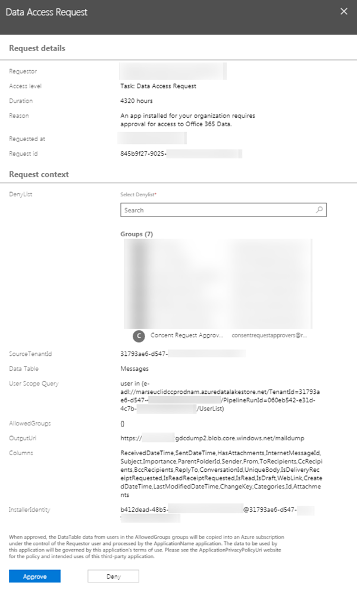
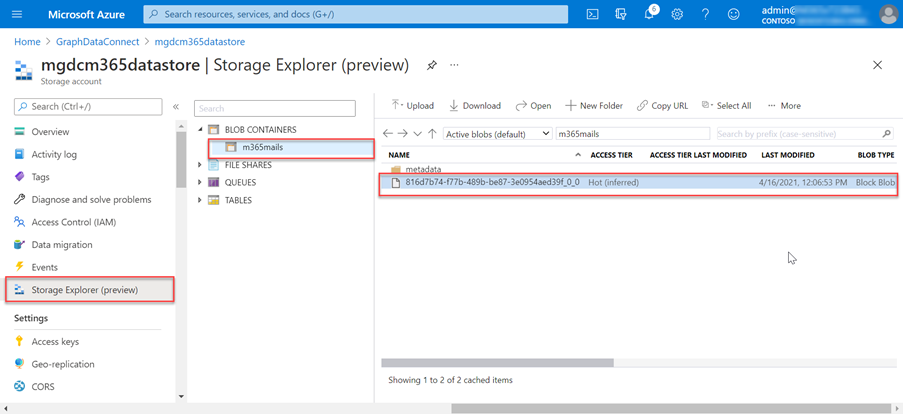

<!-- markdownlint-disable MD002 MD041 -->

Um Microsoft 365 administrador tem a capacidade de aprovar ou negar solicitações de consentimento. Isso pode ser feito por meio do Centro Administração Microsoft 365 ou programaticamente por meio do PowerShell.

## <a name="approve-consent-requests"></a>Aprovar solicitações de consentimento

# <a name="microsoft-365-admin-center"></a>[Administração Microsoft 365 Center](#tab/Microsoft365)

1. Abra um navegador e vá para seu [Administração Microsoft 365 Portal](https://admin.microsoft.com).

1. Para aprovar ou negar solicitações de consentimento, acesse [Acesso Privilegiado](https://portal.office.com/adminportal/home#/Settings/PrivilegedAccess).

1. Selecione uma Solicitação de **Acesso a Dados pendente**.

1. Na chamada **Solicitação de Acesso** a Dados, selecione o **botão Aprovar** .

    

# <a name="powershell"></a>[PowerShell](#tab/PowerShell)

1. Abra o PowerShell do Windows.
1. Certifique-se de que sua sessão do PowerShell tenha habilitado scripts assinados remotamente.

    ```powershell
    Set-ExecutionPolicy RemoteSigned
    ```

1. Conexão para Exchange Online.

    1. Obtenha uma credencial de logom executando o PowerShell a seguir. Entre usando um usuário diferente do que aquele que criou e iniciou o pipeline da Fábrica de Dados do Azure, que tem a função de administrador **global** aplicada, que é membro do grupo que tem direitos para aprovar solicitações a dados no Microsoft 365 e tem a autenticação multifa factor habilitada.

        ```powershell
        $UserCredential = Get-Credential
        ```

    1. Crie uma nova sessão Exchange Online do PowerShell e carregue -a (importe).

        ```powershell
        $Session = New-PSSession -ConfigurationName Microsoft.Exchange -ConnectionUri https://ps.protection.outlook.com/powershell-liveid/ -Credential $UserCredential -Authentication Basic -AllowRedirection
        Import-PSSession $Session -DisableNameChecking
        ```

        > [!IMPORTANT]
        > Depois de terminar essa sessão, certifique-se de desconectar da sessão usando o comando do PowerShell `Remove-PSSession $Session`. Exchange Online permite apenas três sessões do PowerShell remotas abertas para proteger contra ataques de negação de serviço (DoS). Se você simplesmente fechar a janela do PowerShell, ela deixará a conexão aberta.

1. Obter uma lista de todas as solicitações de dados pendentes Conexão de dados do Microsoft Graph executando o PowerShell a seguir.

    ```powershell
    Get-ElevatedAccessRequest | where {$_.RequestStatus -eq 'Pending'} | select RequestorUPN, Service, Identity, RequestedAccess | fl
    ```

    - Examine a lista de solicitações de acesso a dados retornadas. Na imagem a seguir, observe que há duas solicitações pendentes.

        

1. Aprove um acesso de dados retornado na etapa anterior copiando o GUID de identidade de uma solicitação executando o PowerShell a seguir.

    > [!NOTE]
    > Substitua o GUID no trecho de código a seguir pelo GUID dos resultados da etapa anterior.

    ```powershell
    Approve-ElevatedAccessRequest -RequestId fa041379-0000-0000-0000-7cd5691484bd -Comment 'approval request granted'
    ```

1. Depois de alguns instantes, você deve ver a página de status da atualização de executar atividade para mostrar que agora está _extraindo dados_.

    

1. Esse processo de extração de dados pode levar algum tempo, dependendo do tamanho do seu locatário Microsoft 365 local.

---

## <a name="verify-extracted-data-from-microsoft-365-to-azure-storage-blob"></a>Verificar dados extraídos do Microsoft 365 para o Azure Armazenamento Blob

1. Abra um navegador e vá para o [Portal do Azure](https://portal.azure.com/).

1. Entre usando uma conta com direitos **de administrador global** para seus locatários do Azure e Microsoft 365.

1. Na navegação da barra lateral, selecione o item de menu **Todos os recursos** .

1. Na lista de recursos, selecione a **conta de Armazenamento do Azure** que você criou anteriormente neste tutorial.

1. No menu de navegação da barra lateral, selecione **Blobs** na folha **de Armazenamento conta do Azure**.

1. Selecione o **contêiner** criado anteriormente neste tutorial que você configurou o pipeline da Fábrica de Dados do Azure como o pia para os dados extraídos. Você deve ver dados neste contêiner agora.

    
