<!-- markdownlint-disable MD002 MD041 -->

Nesta seção, criaremos seu primeiro aplicativo de projeto ASP.NET para processar os dados Conexão de Dados do Microsoft Graph que foram exportados.

## <a name="create-a-new-aspnet-project"></a>Criar um novo ASP.NET projeto

1. Abra Visual Studio e selecione **Arquivo > Novo > Project**.

1. Na caixa **de diálogo Novo Project,** faça o seguinte.

    1. **Pesquise** ASP.NET Web Application na caixa de pesquisa e selecione a opção ASP.NET **Aplicativo Web (.NET Framework).**
    1. Clique em **Próximo**.

        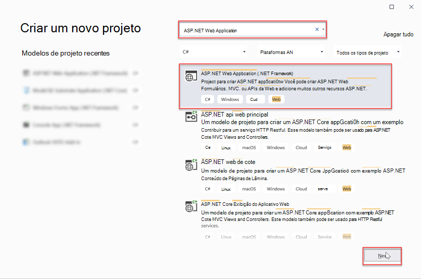

    1. Insira **EmailMetrics** para o nome do projeto.
    1. Selecione **.NET Framework 4.7.2** para a opção de estrutura.
    1. Selecione **Criar**.

    > [!IMPORTANT]
    > Certifique-se de inserir exatamente o mesmo nome para o Visual Studio Project especificado nas instruções de início rápido. O nome do projeto Visual Studio torna-se parte do namespace no código. O código dentro dessas instruções depende do namespace correspondente ao nome do projeto Visual Studio especificado nessas instruções. Se você usar um nome de projeto diferente, o código não será compilado, a menos que você ajuste todos os namespaces para corresponder ao nome do projeto do Visual Studio inserido ao criar o projeto.

    1. Na nova caixa **de ASP.NET de projeto do Aplicativo Web,** selecione MVC.
    1. Selecione **Criar**.

    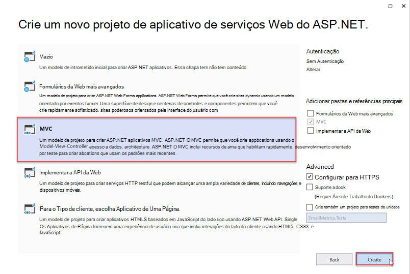

## <a name="add-and-configure-your-azure-storage-as-a-connected-service"></a>Adicionar e configurar seu Azure Armazenamento como um Serviço Conectado

1. Na janela **Ferramenta do Explorador** de Soluções, clique com o botão direito do mouse no nó Serviços **Conectados** e selecione **Adicionar Serviço Conectado**.

    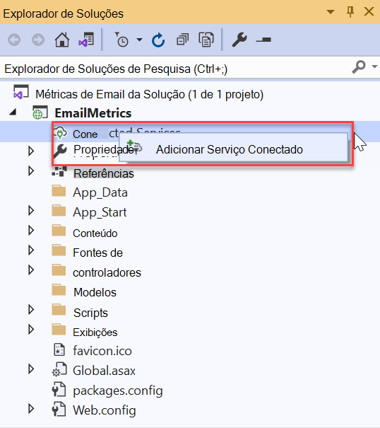

1. Na caixa **de diálogo Serviços Conectados,** selecione o sinal verde localizado no canto superior direito da caixa **+** de diálogo.

1. Na caixa de diálogo Adicionar **dependência,** selecione **Azure Armazenamento** e selecione **Próximo**.

    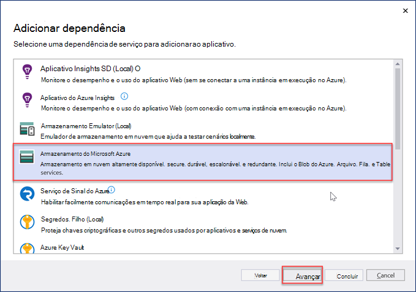

1. Na caixa de diálogo Armazenamento do **Azure,** selecione a conta de assinatura e armazenamento onde você exportou os dados no exercício anterior, selecione **Próximo**.

    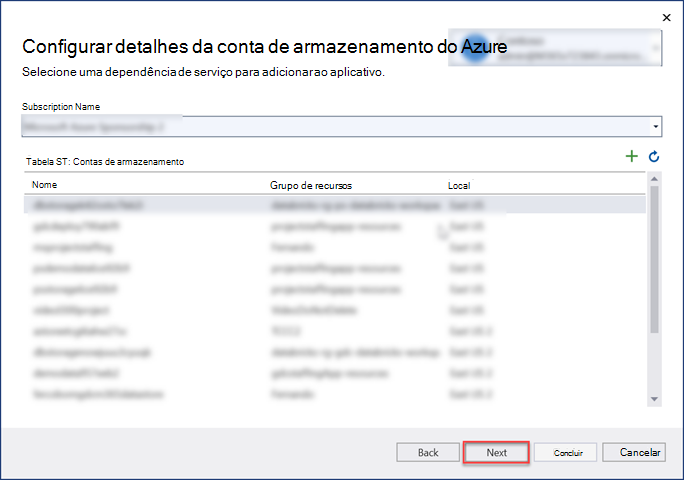

1. Forneça ao **Azure Armazenamento um** nome de **AzureStorageConnectionString** e selecione **Next**.
1. Selecione **Concluir**.

    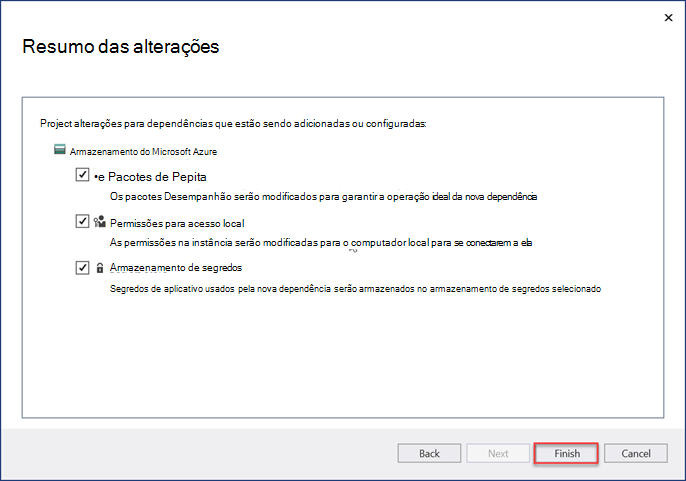

## <a name="create-a-new-model-class-that-will-be-used-to-store-the-email-metrics"></a>Criar uma nova classe de modelo que será usada para armazenar as métricas de email

1. Na janela  **Ferramenta do Explorador** de Soluções, clique com o botão direito do mouse na pasta **Modelos** e selecione Adicionar **> Classe**.

    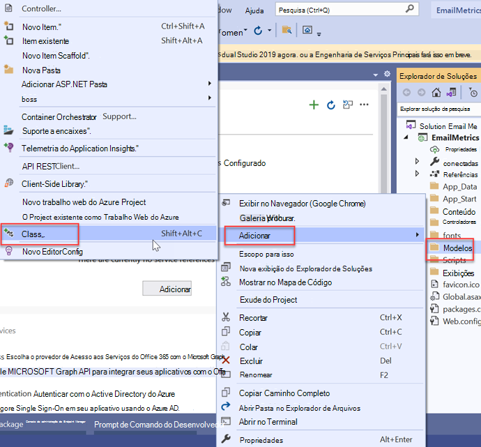

1. Na caixa **de diálogo Adicionar Novo Item,** selecione **Classe**, de definir o nome do arquivo como _EmailMetric.cs_ e **selecione Adicionar**.

1. Adicione o código a seguir à classe EmailMetric que você acabou de criar.

    ```csharp
    public string Email;
    public double RecipientsToEmail;
    ```

## <a name="create-a-new-controller-that-will-calculate-and-display-the-results"></a>Criar um novo controlador que calculará e exibirá os resultados

1. Clique com o botão direito do mouse na **pasta Controladores** e selecione **Adicionar > Controlador**.

1. Na caixa **de diálogo Adicionar Scaffold,** selecione **Controlador MVC 5 - Vazio** e selecione **Adicionar**.

1. Quando solicitado, nomeia o controlador **EmailMetricsController** e selecione **OK**.

1. Adicione as instruções de uso a seguir após as instruções de uso existentes na parte superior do arquivo que contém a **classe EmailMetricsController.**

    ```csharp
    using System.Collections.Generic;
    using System.Configuration;
    using System.IO;
    using System.Linq;
    using System.Threading.Tasks;
    using System.Web.Mvc;
    using Azure.Storage.Blobs;
    using Azure.Storage.Blobs.Models;
    using Newtonsoft.Json.Linq;
    ```

1. Adicione o código a seguir à **classe EmailMetricsController.** Elas serão usadas para se conectar à conta do **Azure Armazenamento que** contém os dados exportados.

    ```csharp
    private const string connectionStringName = "AzureStorageConnectionString";
    private const string emailBlobName = "m365mails";

    ```

1. Adicione o método a seguir à **classe EmailMetricsController.** Isso processará um **Blob do Azure** e atualizará uma coleção que representa as contas de email e quantos destinatários foram combinados em todos os emails encontrados para as contas extraídas.

    ```csharp
    private async Task ProcessBlobEmails(List<Models.EmailMetric> emailMetrics, BlobClient emailBlob)
    {
        using (var stream = new MemoryStream())
        {
            var response = await emailBlob.DownloadToAsync(stream);
            var pos = stream.Seek(0, SeekOrigin.Begin);

            using (var reader = new StreamReader(stream))
            {

                string line;
                while ((line = reader.ReadLine()) != null)
                {
                    var jsonObj = JObject.Parse(line);

                    // extract sender
                    var sender = jsonObj.SelectToken("Sender.EmailAddress.Address")?.ToString();
                    // No sender - skip this one
                    if (string.IsNullOrEmpty(sender)) continue;

                    // extract and count up recipients
                    var totalRecipients = 0;
                    totalRecipients += jsonObj.SelectToken("ToRecipients")?.Children().Count() ?? 0;
                    totalRecipients += jsonObj.SelectToken("CcRecipients")?.Children().Count() ?? 0;
                    totalRecipients += jsonObj.SelectToken("BccRecipients")?.Children().Count() ?? 0;

                    var emailMetric = new Models.EmailMetric();
                    emailMetric.Email = sender;
                    emailMetric.RecipientsToEmail = totalRecipients;

                    // if already have this sender...
                    var existingMetric = emailMetrics.FirstOrDefault(metric => metric.Email == emailMetric.Email);
                    if (existingMetric != null)
                    {
                        existingMetric.RecipientsToEmail += emailMetric.RecipientsToEmail;
                    }
                    else
                    {
                        emailMetrics.Add(emailMetric);
                    }
                }
            }
        }
    }
    ```

1. Adicione o método a seguir à **classe EmailMetricsController.** Isso enumerará todos os blobs no contêiner especificado da conta do **Azure Armazenamento** e enviará cada um para o método adicionado `ProcessBlobEmails()` na última etapa.

    ```csharp
    private async Task<List<Models.EmailMetric>> ProcessBlobFiles()
    {
        var emailMetrics = new List<Models.EmailMetric>();
        var connectionString = ConfigurationManager.ConnectionStrings[connectionStringName];

        // Connect to the storage account
        var containerClient = new BlobContainerClient(connectionString.ConnectionString, emailBlobName);

        foreach (var blob in containerClient.GetBlobs())
        {
            if (blob.Properties.BlobType == BlobType.Block &&
                // Don't process blobs in the metadata folder
                !blob.Name.StartsWith("metadata/"))
            {
                var blobClient = containerClient.GetBlobClient(blob.Name);
                await ProcessBlobEmails(emailMetrics, blobClient);
            }
        }

        return emailMetrics;
    }
    ```

1. Adicione a ação a seguir ao **EmailMetricsController** que usará os métodos adicionados a essa classe para processar os emails e enviar os resultados para o modo de exibição.

    ```csharp
    [HttpPost, ActionName("ShowMetrics")]
    [ValidateAntiForgeryToken]
    public async Task<ActionResult> ShowMetrics()
    {
        var emailMetrics = await ProcessBlobFiles();

        return View(emailMetrics);
    }
    ```

## <a name="create-a-new-view-for-the-emailmetrics-index-action"></a>Criar um novo exibição para a ação de índice EmailMetrics

1. Na janela  **Ferramenta do Explorador** de Soluções, clique com o botão direito do mouse na pasta **Exibições > EmailMetrics** e selecione **Adicionar > Exibir**.

1. Na caixa **de diálogo Adicionar Novo Item** EmFalso, selecione **MVC 5 Exibir** e, em seguida, selecione **Adicionar**.

1. Na caixa **de diálogo Adicionar Modo** de Exibição, desmarque o nome **de** exibição como **Index**, deixe os controles de entrada restantes para seus valores padrão e selecione **Adicionar**.

    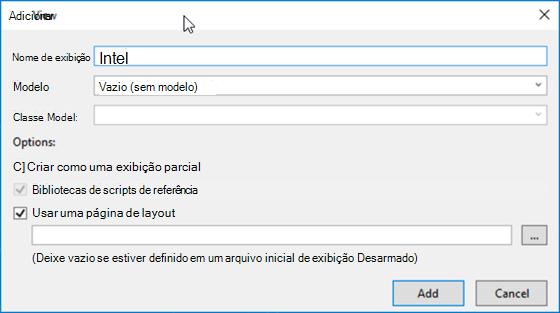

1. Atualize a marcação no novo **Views > EmailMetrics > _Index.cshtml_** para o seguinte. Isso adicionará um formulário com um único botão que enviará um HTTP POST à ação de controlador personalizada adicionada na última etapa.

    ```html
    @{
    ViewBag.Title = "Index";
    }

    <h2>Email Metrics</h2>
    ```

1. Este aplicativo olhará para os dados de email de emails extraídos para a conta do **Azure Blob Armazenamento** e exibirá o número total de destinatários de cada remetente.

    ```html
    @using (Html.BeginForm("ShowMetrics", "EmailMetrics", FormMethod.Post))
    {
    @Html.AntiForgeryToken()
    <div>
        <button type="submit">View email metrics</button>
    </div>

    <div>
        <em>Please be patient as this can take a few moments to calculate depending on the size of the exported data...</em>
    </div>
    }
    ```

## <a name="create-a-new-view-for-the-emailmetrics-showmetrics-action"></a>Criar um novo exibição para a ação EmailMetrics ShowMetrics

1. Na janela **Ferramenta do Explorador** de Soluções, clique com o botão direito do mouse na pasta **Exibições > EmailMetrics** e selecione **Adicionar > Exibir**.

1. Na caixa **de diálogo Adicionar Modo** de Exibição, desmarque os seguintes valores e deixe os controles de entrada restantes para seus valores padrão e selecione **Adicionar**.

    - **Nome da exibição**: ShowMetrics
    - **Modelo**: Lista
    - **Classe Model**: EmailMetric (EmailMetric.Models)

        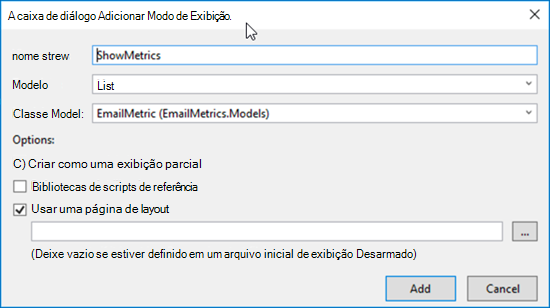

    >[!TIP]
    > Caso você não possa ver o modelo **EmailMetric** na caixa de menu suspenso, crie a solução.

1. Atualize a marcação no novo **Views > EmailMetrics > _ShowMetrics.cshtml_** para o seguinte. Isso exibirá os resultados dos cálculos.

    ```html
    @model IEnumerable<EmailMetrics.Models.EmailMetric>

    @{
    ViewBag.Title = "ShowMetrics";
    }

    <h2>Email Metrics</h2>

    <table class="table">
    <tr>
        <th>Sender</th>
        <th>Number of Recipients</th>
    </tr>

    @foreach (var item in Model)
    {
    <tr>
        <td>@Html.DisplayFor(modelItem => item.Email)</td>
        <td>@Html.DisplayFor(modelItem => item.RecipientsToEmail)</td>
    </tr>
    }

    </table>
    ```

## <a name="update-the-navigation-to-have-a-way-to-get-to-the-new-controller"></a>Atualizar a navegação para ter uma maneira de chegar ao novo controlador

1. Na janela **Ferramenta do Explorador** de Soluções, localize e abra o arquivo Views > shared > **_Layout.cshtml_**.
1. Substitua o conteúdo pelo código a seguir.

    ```html
    <!-- new code -->
    <li>@Html.ActionLink("Email Metrics", "Index", "EmailMetrics")</li>
    ```

## <a name="test-the-application"></a>Teste o aplicativo

1. Em Visual Studio, selecione **Depurar > Iniciar Depuração**.

1. Quando o aplicativo for criado e carregado em uma nova janela do navegador, selecione o item **Métricas** de Email na barra de navegação superior.

1. Na página **Métricas de Email,** selecione o botão Exibir métricas **de email.**

    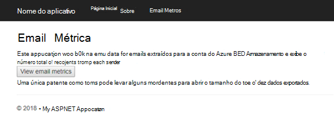

1. Quando a página for carregada, você verá uma lista de endereços de email encontrados entre todos os emails com uma soma de todos os destinatários enviados entre eles, conforme mostrado de um pequeno conjunto de exemplos em um extrato de email de teste na figura a seguir.

    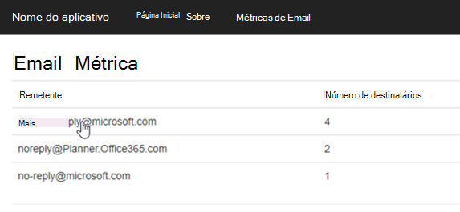
