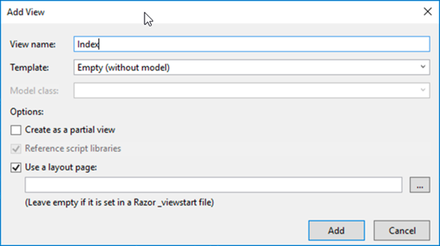
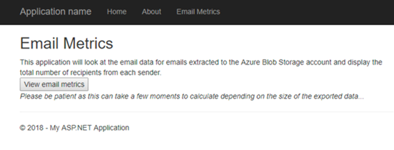

<!-- markdownlint-disable MD002 MD041 -->

<span data-ttu-id="2eabe-101">Nesta seção, criaremos seu primeiro aplicativo de projeto ASP.NET para processar os dados Graph dados Conexão Microsoft que foram exportados.</span><span class="sxs-lookup"><span data-stu-id="2eabe-101">In this section we will be building your first ASP.NET project application for to process the Microsoft Graph Data Connect data that was exported.</span></span>

## <a name="create-a-new-aspnet-project"></a><span data-ttu-id="2eabe-102">Criar um novo ASP.NET projeto</span><span class="sxs-lookup"><span data-stu-id="2eabe-102">Create a new ASP.NET project</span></span>

1. <span data-ttu-id="2eabe-103">Abra Visual Studio e selecione **Arquivo > Novo > Project**.</span><span class="sxs-lookup"><span data-stu-id="2eabe-103">Open Visual Studio and select **File > New > Project**.</span></span>

1. <span data-ttu-id="2eabe-104">Na caixa **de diálogo Novo Project,** faça o seguinte.</span><span class="sxs-lookup"><span data-stu-id="2eabe-104">In the **New Project** dialog, do the following.</span></span>

    1. <span data-ttu-id="2eabe-105">**Pesquise** ASP.NET Web Application na caixa de pesquisa e selecione a opção ASP.NET **Aplicativo Web (.NET Framework).**</span><span class="sxs-lookup"><span data-stu-id="2eabe-105">Search **ASP.NET Web Application** in the search box and select the **ASP.NET Web Application (.NET Framework)** option.</span></span>
    1. <span data-ttu-id="2eabe-106">Clique em **Próximo**.</span><span class="sxs-lookup"><span data-stu-id="2eabe-106">Click on **Next**.</span></span>

        

    1. <span data-ttu-id="2eabe-108">Insira **EmailMetrics** para o nome do projeto.</span><span class="sxs-lookup"><span data-stu-id="2eabe-108">Enter **EmailMetrics** for the name of the project.</span></span>
    1. <span data-ttu-id="2eabe-109">Selecione **.NET Framework 4.7.2** para a opção de estrutura.</span><span class="sxs-lookup"><span data-stu-id="2eabe-109">Select **.NET Framework 4.7.2** for the framework option.</span></span>
    1. <span data-ttu-id="2eabe-110">Selecione **Criar**.</span><span class="sxs-lookup"><span data-stu-id="2eabe-110">Select **Create**.</span></span>

    > [!IMPORTANT]
    > <span data-ttu-id="2eabe-111">Certifique-se de inserir exatamente o mesmo nome para o Visual Studio Project especificado nas instruções de início rápido.</span><span class="sxs-lookup"><span data-stu-id="2eabe-111">Ensure that you enter the exact same name for the Visual Studio Project that is specified in this quick start instructions.</span></span> <span data-ttu-id="2eabe-112">O nome do projeto Visual Studio torna-se parte do namespace no código.</span><span class="sxs-lookup"><span data-stu-id="2eabe-112">The Visual Studio Project name becomes part of the namespace in the code.</span></span> <span data-ttu-id="2eabe-113">O código dentro dessas instruções depende do namespace correspondente ao nome do projeto Visual Studio especificado nessas instruções.</span><span class="sxs-lookup"><span data-stu-id="2eabe-113">The code inside these instructions depends on the namespace matching the Visual Studio Project name specified in these instructions.</span></span> <span data-ttu-id="2eabe-114">Se você usar um nome de projeto diferente, o código não será compilado, a menos que você ajuste todos os namespaces para corresponder ao nome do projeto do Visual Studio inserido ao criar o projeto.</span><span class="sxs-lookup"><span data-stu-id="2eabe-114">If you use a different project name the code will not compile unless you adjust all the namespaces to match the Visual Studio Project name you enter when you create the project.</span></span>

    1. <span data-ttu-id="2eabe-115">Na nova caixa **de ASP.NET de projeto do Aplicativo Web,** selecione MVC.</span><span class="sxs-lookup"><span data-stu-id="2eabe-115">In the new **ASP.NET Web Application** project dialog, select MVC.</span></span>
    1. <span data-ttu-id="2eabe-116">Selecione **Criar**.</span><span class="sxs-lookup"><span data-stu-id="2eabe-116">Select **Create**.</span></span>

    

## <a name="add-and-configure-your-azure-storage-as-a-connected-service"></a><span data-ttu-id="2eabe-118">Adicionar e configurar seu Azure Armazenamento como um Serviço Conectado</span><span class="sxs-lookup"><span data-stu-id="2eabe-118">Add and configure your Azure Storage as a Connected Service</span></span>

1. <span data-ttu-id="2eabe-119">Na janela **Ferramenta do Explorador** de Soluções, clique com o botão direito do mouse no nó Serviços **Conectados** e selecione **Adicionar Serviço Conectado**.</span><span class="sxs-lookup"><span data-stu-id="2eabe-119">In the **Solution Explorer** tool window, right-click the **Connected Services** node and select **Add Connected Service**.</span></span>

    

1. <span data-ttu-id="2eabe-121">Na caixa **de diálogo Serviços Conectados,** selecione o sinal verde localizado no canto superior direito da caixa **+** de diálogo.</span><span class="sxs-lookup"><span data-stu-id="2eabe-121">On the **Connected Services** dialog, select the green **+** sign which is located in the upper-right corner of the dialog.</span></span>

1. <span data-ttu-id="2eabe-122">Na caixa de diálogo Adicionar **dependência,** selecione **Azure Armazenamento** e selecione **Próximo**.</span><span class="sxs-lookup"><span data-stu-id="2eabe-122">In the **Add dependency** dialog, select **Azure Storage** and select **Next**.</span></span>

    

1. <span data-ttu-id="2eabe-124">Na caixa de diálogo Armazenamento do **Azure,** selecione a conta de assinatura e armazenamento onde você exportou os dados no exercício anterior, selecione **Próximo**.</span><span class="sxs-lookup"><span data-stu-id="2eabe-124">In the **Azure Storage** dialog, select the subscription and storage account where you exported the data in the previous exercise, select **Next**.</span></span>

    

1. <span data-ttu-id="2eabe-126">Forneça ao **Azure Armazenamento um** nome de **AzureStorageConnectionString** e selecione **Next**.</span><span class="sxs-lookup"><span data-stu-id="2eabe-126">Provide the **Azure Storage connection** a name of **AzureStorageConnectionString** and select **Next**.</span></span>
1. <span data-ttu-id="2eabe-127">Selecione **Concluir**.</span><span class="sxs-lookup"><span data-stu-id="2eabe-127">Select **Finish**.</span></span>

    

## <a name="create-a-new-model-class-that-will-be-used-to-store-the-email-metrics"></a><span data-ttu-id="2eabe-129">Criar uma nova classe de modelo que será usada para armazenar as métricas de email</span><span class="sxs-lookup"><span data-stu-id="2eabe-129">Create a new model class that will be used to store the email metrics</span></span>

1. <span data-ttu-id="2eabe-130">Na janela  **Ferramenta do Explorador** de Soluções, clique com o botão direito do mouse na pasta **Modelos** e selecione Adicionar **> Classe**.</span><span class="sxs-lookup"><span data-stu-id="2eabe-130">In the  **Solution Explorer** tool window, right-click the **Models** folder and select **Add > Class**.</span></span>

    

1. <span data-ttu-id="2eabe-132">Na caixa **de diálogo Adicionar Novo Item,** selecione **Classe**, de definir o nome do arquivo como _EmailMetric.cs_ e **selecione Adicionar**.</span><span class="sxs-lookup"><span data-stu-id="2eabe-132">In the **Add New Item** dialog, select **Class**, set the name of the file to _EmailMetric.cs_ and select **Add**.</span></span>

1. <span data-ttu-id="2eabe-133">Adicione o código a seguir à classe EmailMetric que você acabou de criar.</span><span class="sxs-lookup"><span data-stu-id="2eabe-133">Add the following code to the class EmailMetric you just created.</span></span>

    ```csharp
    public string Email;
    public double RecipientsToEmail;
    ```

## <a name="create-a-new-controller-that-will-calculate-and-display-the-results"></a><span data-ttu-id="2eabe-134">Criar um novo controlador que calculará e exibirá os resultados</span><span class="sxs-lookup"><span data-stu-id="2eabe-134">Create a new controller that will calculate and display the results</span></span>

1. <span data-ttu-id="2eabe-135">Clique com o botão direito do mouse na **pasta Controladores** e selecione **Adicionar > Controlador**.</span><span class="sxs-lookup"><span data-stu-id="2eabe-135">Right-click the **Controllers** folder and select **Add > Controller**.</span></span>

1. <span data-ttu-id="2eabe-136">Na caixa **de diálogo Adicionar Scaffold,** selecione **Controlador MVC 5 - Vazio** e selecione **Adicionar**.</span><span class="sxs-lookup"><span data-stu-id="2eabe-136">In the **Add Scaffold** dialog, select **MVC 5 Controller - Empty** and select **Add**.</span></span>

1. <span data-ttu-id="2eabe-137">Quando solicitado, nomeia o controlador **EmailMetricsController** e selecione **OK**.</span><span class="sxs-lookup"><span data-stu-id="2eabe-137">When prompted, name the controller **EmailMetricsController** and select **OK**.</span></span>

1. <span data-ttu-id="2eabe-138">Adicione as instruções de uso a seguir após as instruções de uso existentes na parte superior do arquivo que contém a **classe EmailMetricsController.**</span><span class="sxs-lookup"><span data-stu-id="2eabe-138">Add the following using statements after the existing using statements at the top of the file containing the **EmailMetricsController** class.</span></span>

    ```csharp
    using System.Collections.Generic;
    using System.Configuration;
    using System.IO;
    using System.Linq;
    using System.Threading.Tasks;
    using System.Web.Mvc;
    using Azure.Storage.Blobs;
    using Azure.Storage.Blobs.Models;
    using Newtonsoft.Json.Linq;
    ```

1. <span data-ttu-id="2eabe-139">Adicione o código a seguir à **classe EmailMetricsController.**</span><span class="sxs-lookup"><span data-stu-id="2eabe-139">Add the following code to the **EmailMetricsController** class.</span></span> <span data-ttu-id="2eabe-140">Elas serão usadas para se conectar à conta do **Azure Armazenamento que** contém os dados exportados.</span><span class="sxs-lookup"><span data-stu-id="2eabe-140">These will be used to connect to the **Azure Storage Account** that contains the exported data.</span></span>

    ```csharp
    private const string connectionStringName = "AzureStorageConnectionString";
    private const string emailBlobName = "maildump";

    ```

1. <span data-ttu-id="2eabe-141">Adicione o método a seguir à **classe EmailMetricsController.**</span><span class="sxs-lookup"><span data-stu-id="2eabe-141">Add the following method to the **EmailMetricsController** class.</span></span> <span data-ttu-id="2eabe-142">Isso processará um **Blob do Azure** e atualizará uma coleção que representa as contas de email e quantos destinatários foram combinados em todos os emails encontrados para as contas extraídas.</span><span class="sxs-lookup"><span data-stu-id="2eabe-142">This will process an **Azure Blob** and update a collection representing the email accounts and how many recipients there were combined across all emails found for the extracted accounts.</span></span>

    ```csharp
    private async Task ProcessBlobEmails(List<Models.EmailMetric> emailMetrics, BlobClient emailBlob)
    {
        using (var stream = new MemoryStream())
        {
            var response = await emailBlob.DownloadToAsync(stream);
            var pos = stream.Seek(0, SeekOrigin.Begin);

            using (var reader = new StreamReader(stream))
            {

                string line;
                while ((line = reader.ReadLine()) != null)
                {
                    var jsonObj = JObject.Parse(line);

                    // extract sender
                    var sender = jsonObj.SelectToken("Sender.EmailAddress.Address")?.ToString();
                    // No sender - skip this one
                    if (string.IsNullOrEmpty(sender)) continue;

                    // extract and count up recipients
                    var totalRecipients = 0;
                    totalRecipients += jsonObj.SelectToken("ToRecipients")?.Children().Count() ?? 0;
                    totalRecipients += jsonObj.SelectToken("CcRecipients")?.Children().Count() ?? 0;
                    totalRecipients += jsonObj.SelectToken("BccRecipients")?.Children().Count() ?? 0;

                    var emailMetric = new Models.EmailMetric();
                    emailMetric.Email = sender;
                    emailMetric.RecipientsToEmail = totalRecipients;

                    // if already have this sender...
                    var existingMetric = emailMetrics.FirstOrDefault(metric => metric.Email == emailMetric.Email);
                    if (existingMetric != null)
                    {
                        existingMetric.RecipientsToEmail += emailMetric.RecipientsToEmail;
                    }
                    else
                    {
                        emailMetrics.Add(emailMetric);
                    }
                }
            }
        }
    }
    ```

1. <span data-ttu-id="2eabe-143">Adicione o método a seguir à **classe EmailMetricsController.**</span><span class="sxs-lookup"><span data-stu-id="2eabe-143">Add the following method to the **EmailMetricsController** class.</span></span> <span data-ttu-id="2eabe-144">Isso enumerará todos os blobs no contêiner especificado da conta do **Azure Armazenamento** e enviará cada um para o método adicionado `ProcessBlobEmails()` na última etapa.</span><span class="sxs-lookup"><span data-stu-id="2eabe-144">This will enumerate through all blobs in the specified **Azure Storage** account's specified container and send each one to `ProcessBlobEmails()` method added in the last step.</span></span>

    ```csharp
    private async Task<List<Models.EmailMetric>> ProcessBlobFiles()
    {
        var emailMetrics = new List<Models.EmailMetric>();
        var connectionString = ConfigurationManager.ConnectionStrings[connectionStringName];

        // Connect to the storage account
        var containerClient = new BlobContainerClient(connectionString.ConnectionString, emailBlobName);

        foreach (var blob in containerClient.GetBlobs())
        {
            if (blob.Properties.BlobType == BlobType.Block &&
                // Don't process blobs in the metadata folder
                !blob.Name.StartsWith("metadata/"))
            {
                var blobClient = containerClient.GetBlobClient(blob.Name);
                await ProcessBlobEmails(emailMetrics, blobClient);
            }
        }

        return emailMetrics;
    }
    ```

1. <span data-ttu-id="2eabe-145">Adicione a ação a seguir ao **EmailMetricsController** que usará os métodos adicionados a essa classe para processar os emails e enviar os resultados para o modo de exibição.</span><span class="sxs-lookup"><span data-stu-id="2eabe-145">Add the following action to the **EmailMetricsController** that will use the methods added this class to process the emails and send the results to the view.</span></span>

    ```csharp
    [HttpPost, ActionName("ShowMetrics")]
    [ValidateAntiForgeryToken]
    public async Task<ActionResult> ShowMetrics()
    {
        var emailMetrics = await ProcessBlobFiles();

        return View(emailMetrics);
    }
    ```

## <a name="create-a-new-view-for-the-emailmetrics-index-action"></a><span data-ttu-id="2eabe-146">Criar um novo exibição para a ação de índice EmailMetrics</span><span class="sxs-lookup"><span data-stu-id="2eabe-146">Create a new view for the EmailMetrics index action</span></span>

1. <span data-ttu-id="2eabe-147">Na janela  **Ferramenta do Explorador** de Soluções, clique com o botão direito do mouse na pasta **Exibições > EmailMetrics** e selecione **Adicionar > Exibir**.</span><span class="sxs-lookup"><span data-stu-id="2eabe-147">In the  **Solution Explorer** tool window, right-click the **Views > EmailMetrics** folder and select **Add > View**.</span></span>

1. <span data-ttu-id="2eabe-148">Na caixa **de diálogo Adicionar Novo Item** EmFalso, selecione **MVC 5 Exibir** e, em seguida, selecione **Adicionar**.</span><span class="sxs-lookup"><span data-stu-id="2eabe-148">In the **Add New Scaffolded Item** dialog box, select **MVC 5 View**, then select **Add**.</span></span>

1. <span data-ttu-id="2eabe-149">Na caixa **de diálogo Adicionar Modo** de Exibição, desmarque o nome **de** exibição como **Index**, deixe os controles de entrada restantes para seus valores padrão e selecione **Adicionar**.</span><span class="sxs-lookup"><span data-stu-id="2eabe-149">In the **Add View** dialog, set the **View** name to **Index**, leave the remaining input controls to their default values, and select **Add**.</span></span>

    

1. <span data-ttu-id="2eabe-151">Atualize a marcação no novo **Views > EmailMetrics > _Index.cshtml_** para o seguinte.</span><span class="sxs-lookup"><span data-stu-id="2eabe-151">Update the markup in the new **Views > EmailMetrics > _Index.cshtml_** to the following.</span></span> <span data-ttu-id="2eabe-152">Isso adicionará um formulário com um único botão que enviará um HTTP POST à ação de controlador personalizada adicionada na última etapa.</span><span class="sxs-lookup"><span data-stu-id="2eabe-152">This will add a form with a single button that will submit an HTTP POST to the custom controller action added in the last step.</span></span>

    ```html
    @{
    ViewBag.Title = "Index";
    }

    <h2>Email Metrics</h2>
    ```

1. <span data-ttu-id="2eabe-153">Este aplicativo olhará para os dados de email de emails extraídos para a conta do **Azure Blob Armazenamento** e exibirá o número total de destinatários de cada remetente.</span><span class="sxs-lookup"><span data-stu-id="2eabe-153">This application will look at the email data for emails extracted to the **Azure Blob Storage** account and display the total number of recipients from each sender.</span></span>

    ```html
    @using (Html.BeginForm("ShowMetrics", "EmailMetrics", FormMethod.Post))
    {
    @Html.AntiForgeryToken()
    <div>
        <button type="submit">View email metrics</button>
    </div>

    <div>
        <em>Please be patient as this can take a few moments to calculate depending on the size of the exported data...</em>
    </div>
    }
    ```

## <a name="create-a-new-view-for-the-emailmetrics-showmetrics-action"></a><span data-ttu-id="2eabe-154">Criar um novo exibição para a ação EmailMetrics ShowMetrics</span><span class="sxs-lookup"><span data-stu-id="2eabe-154">Create a new view for the EmailMetrics ShowMetrics action</span></span>

1. <span data-ttu-id="2eabe-155">Na janela **Ferramenta do Explorador** de Soluções, clique com o botão direito do mouse na pasta **Exibições > EmailMetrics** e selecione **Adicionar > Exibir**.</span><span class="sxs-lookup"><span data-stu-id="2eabe-155">In the **Solution Explorer** tool window, right-click the **Views > EmailMetrics** folder and select **Add > View**.</span></span>

1. <span data-ttu-id="2eabe-156">Na caixa **de diálogo Adicionar Modo** de Exibição, desmarque os seguintes valores e deixe os controles de entrada restantes para seus valores padrão e selecione **Adicionar**.</span><span class="sxs-lookup"><span data-stu-id="2eabe-156">In the **Add View** dialog, set the following values and leave the remaining input controls to their default values and select **Add**.</span></span>

    - <span data-ttu-id="2eabe-157">**Nome da exibição**: ShowMetrics</span><span class="sxs-lookup"><span data-stu-id="2eabe-157">**View name**: ShowMetrics</span></span>
    - <span data-ttu-id="2eabe-158">**Modelo**: Lista</span><span class="sxs-lookup"><span data-stu-id="2eabe-158">**Template**: List</span></span>
    - <span data-ttu-id="2eabe-159">**Classe Model**: EmailMetric (EmailMetric.Models)</span><span class="sxs-lookup"><span data-stu-id="2eabe-159">**Model class**: EmailMetric (EmailMetric.Models)</span></span>

        

    >[!TIP]
    > <span data-ttu-id="2eabe-161">Caso você não possa ver o modelo **EmailMetric** na caixa de menu suspenso, crie a solução.</span><span class="sxs-lookup"><span data-stu-id="2eabe-161">In case you can't see the **EmailMetric** model in the dropdown box, please build the solution.</span></span>

1. <span data-ttu-id="2eabe-162">Atualize a marcação no novo **Views > EmailMetrics > _ShowMetrics.cshtml_** para o seguinte.</span><span class="sxs-lookup"><span data-stu-id="2eabe-162">Update the markup in the new **Views > EmailMetrics > _ShowMetrics.cshtml_** to the following.</span></span> <span data-ttu-id="2eabe-163">Isso exibirá os resultados dos cálculos.</span><span class="sxs-lookup"><span data-stu-id="2eabe-163">This will display the results of the calculations.</span></span>

    ```html
    @model IEnumerable<EmailMetrics.Models.EmailMetric>

    @{
    ViewBag.Title = "ShowMetrics";
    }

    <h2>Email Metrics</h2>

    <table class="table">
    <tr>
        <th>Sender</th>
        <th>Number of Recipients</th>
    </tr>

    @foreach (var item in Model)
    {
    <tr>
        <td>@Html.DisplayFor(modelItem => item.Email)</td>
        <td>@Html.DisplayFor(modelItem => item.RecipientsToEmail)</td>
    </tr>
    }

    </table>
    ```

## <a name="update-the-navigation-to-have-a-way-to-get-to-the-new-controller"></a><span data-ttu-id="2eabe-164">Atualizar a navegação para ter uma maneira de chegar ao novo controlador</span><span class="sxs-lookup"><span data-stu-id="2eabe-164">Update the navigation to have a way to get to the new controller</span></span>

1. <span data-ttu-id="2eabe-165">Na janela **Ferramenta do Explorador** de Soluções, localize e abra o arquivo Views > shared > **_Layout.cshtml_**.</span><span class="sxs-lookup"><span data-stu-id="2eabe-165">In the **Solution Explorer** tool window, locate and open the file **Views > Shared > _Layout.cshtml_**.</span></span>
1. <span data-ttu-id="2eabe-166">Substitua o conteúdo pelo código a seguir.</span><span class="sxs-lookup"><span data-stu-id="2eabe-166">Replace the contents with the following code.</span></span>

    ```html
    <!-- new code -->
    <li>@Html.ActionLink("Email Metrics", "Index", "EmailMetrics")</li>
    ```

## <a name="test-the-application"></a><span data-ttu-id="2eabe-167">Teste o aplicativo</span><span class="sxs-lookup"><span data-stu-id="2eabe-167">Test the application</span></span>

1. <span data-ttu-id="2eabe-168">Em Visual Studio, selecione **Depurar > Iniciar Depuração**.</span><span class="sxs-lookup"><span data-stu-id="2eabe-168">In Visual Studio, select **Debug > Start Debugging**.</span></span>

1. <span data-ttu-id="2eabe-169">Quando o aplicativo for criado e carregado em uma nova janela do navegador, selecione o item **Métricas** de Email na barra de navegação superior.</span><span class="sxs-lookup"><span data-stu-id="2eabe-169">When the application is built and loads in a new browser window, select the **Email Metrics** item in the top navigation bar.</span></span>

1. <span data-ttu-id="2eabe-170">Na página **Métricas de Email,** selecione o botão Exibir métricas **de email.**</span><span class="sxs-lookup"><span data-stu-id="2eabe-170">On the **Email Metrics** page, select the **View email metrics** button.</span></span>

    

1. <span data-ttu-id="2eabe-172">Quando a página for carregada, você verá uma lista de endereços de email encontrados entre todos os emails com uma soma de todos os destinatários enviados entre eles, conforme mostrado de um pequeno conjunto de exemplos em um extrato de email de teste na figura a seguir.</span><span class="sxs-lookup"><span data-stu-id="2eabe-172">When the page loads, you will see a list of emails addresses that were found among all emails with a sum of all the recipients sent between them, as shown from a small sample set in a test email extract in the following figure.</span></span>

    
