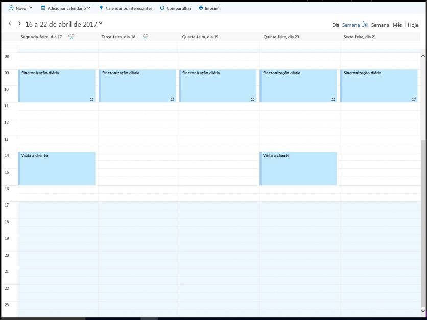
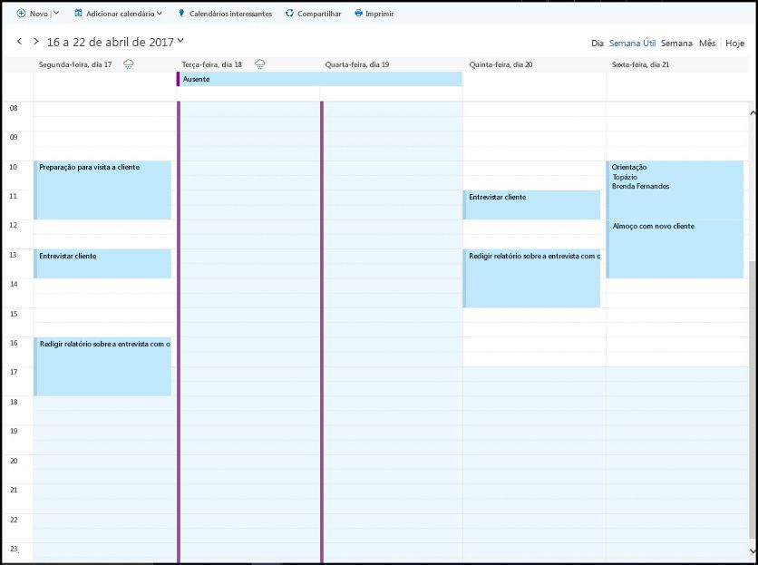

# <a name="find-possible-meeting-times-on-the-outlook-calendar"></a>Encontrar possíveis horários de reunião no calendário do Outlook

Seja no trabalho ou em uma instituição de ensino, procurar um horário e local em comum para uma reunião geralmente significa uma sobrecarga. Os aplicativos do Microsoft Graph podem usar a ação [findMeetingTimes](/graph/api/user-findmeetingtimes?view=graph-rest-1.0) para identificar quaisquer possíveis horários de reunião que atendam aos requisitos de horário, local e outras restrições.   

A ação **findMeetingTimes** permite especificar condições, como o intervalo de horário/data, a duração, os participantes opcionais ou obrigatórios, e a natureza da atividade (**activityDomain**). A ação leva em consideração a agenda de trabalho e o status de disponibilidade dos participantes e dos organizadores, e sugere horários apropriados para os participantes e o tipo de atividade. Por exemplo, as sugestões para uma atividade relacionada ao trabalho sempre ocorrem durante o horário de trabalho do organizador e dos participantes, e as sugestões em que os participantes obrigatórios estão disponíveis são classificadas mais acima na lista de sugestões.

No Microsoft 365, as horas de trabalho e os fusos horários são configuráveis por caixa de correio. A ação **findMeetingTimes** lida com variações de fuso horário entre o organizador e os participantes. Por padrão, a ação **findMeetingTimes** retorna sugestões em UTC. Você pode usar o seguinte cabeçalho de solicitação para que a ação **findMeetingTimes** retorne sugestões expressas em um fuso horário específico.
``` http
Prefer: outlook.timezone="{time-zone-string}}"
```

Especialmente útil para reuniões maiores, você pode especificar um percentual (**minimumAttendeePercentage**) de quorum e fazer com que **findMeetingTimes** retorne sugestões somente se essa disponibilidade mínima de participantes for atingida.

Se **findMeetingTimes** não puder sugerir nenhum horário de reunião, ele indicará um motivo específico (**emptySuggestionsReason**), como o organizador ou um participante obrigatório que não esteja disponível. Com base nesse valor, é possível ajustar melhor os parâmetros e a chamada **findMeetingTimes** novamente.

>**Observação** A ação **findMeetingTimes** está atualmente disponível para caixas de correio de trabalho ou escolares da Microsoft 365, mas não para caixas de correio pessoais do outlook.com.

## <a name="example"></a>Exemplo

O exemplo a seguir mostra como usar a ação **findMeetingTimes** para retornar horários para que 2 usuários se reúnam por algumas horas, levando em conta a agenda de trabalho e a disponibilidade dos usuários, e que o participante estará indisponível por parte do tempo. Como há apenas 2 usuários para esta reunião, as sugestões exigem 100% de participação. A seguir está a agenda de disponibilidade dos usuários.

### <a name="organizers-calendar"></a>Calendário do organizador



### <a name="attendees-calendar"></a>Calendário do participante



O exemplo faz 2 chamadas para **findMeetingTimes**:

1. A primeira chamada analisa no intervalo de datas de 18 a 20 de abril. Como o participante estará ausente de 18 a 19 de abril e não há nenhum horário comum disponível em 20 de abril, a primeira chamada não retornará nenhuma sugestão, com o motivo (**emptySuggestionsReason**) que os participantes não estão disponíveis.
2. A segunda chamada analisa a disponibilidade em 21 de abril e retorna uma sugestão das 14h às 16h.

As duas chamadas para **findMeetingTimes** incluem os seguintes parâmetros. Todos os [parâmetros](/graph/api/user-findmeetingtimes?view=graph-rest-1.0#request-body) para **findMeetingTimes** são opcionais.

- **attendees**: um participante, Sara Melo, definido como `required` para a propriedade **type**
- **locationConstraint**: não requer nenhuma sugestão de localização
- **timeConstraint**: a primeira chamada analisa o intervalo de datas/horário de 18 de abril, às 9h, a 20 de abril, às 17h; depois que a primeira chamada não conseguir sugerir nenhum horário, a segunda chamada analisará 21 de abril, das 9h às 17h
- **meetingDuration**: duas horas
- **returnSuggestionReasons**: este exemplo requer um motivo para cada sugestão
- **minimumAttendeePercentage**: 100%, uma vez que o participante deve ser capaz de participar de qualquer horário sugerido

### <a name="first-request"></a>Primeira solicitação

Procure por um intervalo de tempo disponível de 2 horas para ambos os usuários de 18 a 20 abril.

<!-- {
  "blockType": "ignored",
  "name": "findmeetingtimes_example_first"
}-->
```http
POST https://graph.microsoft.com/v1.0/me/findMeetingTimes
Prefer: outlook.timezone="Pacific Standard Time"
Content-type: application/json

{ 
  "attendees": [ 
    { 
      "type": "required",  
      "emailAddress": { 
        "name": "Samantha Booth",
        "address": "samanthab@contoso.onmicrosoft.com" 
      } 
    }
  ],  
  "locationConstraint": { 
    "isRequired": false,  
    "suggestLocation": false,  
    "locations": [ 
      { 
        "resolveAvailability": false,
        "displayName": "Conf room Hood" 
      } 
    ] 
  },  
  "timeConstraint": {
    "activityDomain":"work", 
    "timeslots": [ 
      { 
        "start": { 
          "dateTime": "2017-04-18T09:00:00",  
          "timeZone": "Pacific Standard Time" 
        },  
        "end": { 
          "dateTime": "2017-04-20T17:00:00",  
          "timeZone": "Pacific Standard Time" 
        } 
      } 
    ] 
  },  
  "meetingDuration": "PT2H",
  "returnSuggestionReasons": true,
  "minimumAttendeePercentage": 100
}
```

### <a name="first-response"></a>Primeira resposta
Não há nenhum intervalo de 2 horas durante o horário de trabalho de 18 a 20 de abril em que ambos os usuários estejam disponíveis.
<!-- {
  "blockType": "ignored",
  "truncated": true,
  "@odata.type": "microsoft.graph.meetingTimeSuggestionsResult",
  "isCollection": false
} -->
```http
HTTP/1.1 200 OK
Content-type: application/json
Preference-Applied: outlook.timezone="Pacific Standard Time"
Content-Length: 184

{
    "@odata.context":"https://graph.microsoft.com/v1.0/$metadata#microsoft.graph.meetingTimeSuggestionsResult",
    "emptySuggestionsReason":"AttendeesUnavailable",
    "meetingTimeSuggestions":[

    ]
}
```

### <a name="second-request"></a>Segunda solicitação
Procure um intervalo de tempo de 2 horas em 21 de abril.
<!-- {
  "blockType": "ignored",
  "name": "findmeetingtimes_example_second"
}-->
```http
POST https://graph.microsoft.com/v1.0/me/findMeetingTimes
Prefer: outlook.timezone="Pacific Standard Time"
Content-type: application/json

{ 
  "attendees": [ 
    { 
      "type": "required",  
      "emailAddress": { 
        "name": "Samantha Booth",
        "address": "samanthab@contoso.onmicrosoft.com" 
      } 
    }
  ],  
  "locationConstraint": { 
    "isRequired": false,  
    "suggestLocation": false,  
    "locations": [ 
      { 
        "resolveAvailability": false,
        "displayName": "Conf room Hood" 
      } 
    ] 
  },  
  "timeConstraint": {
    "activityDomain":"work", 
    "timeslots": [ 
      { 
        "start": { 
          "dateTime": "2017-04-21T09:00:00",  
          "timeZone": "Pacific Standard Time" 
        },  
        "end": { 
          "dateTime": "2017-04-21T17:00:00",  
          "timeZone": "Pacific Standard Time" 
        } 
      } 
    ] 
  },  
  "meetingDuration": "PT2H",
  "returnSuggestionReasons": true,
  "minimumAttendeePercentage": 100
}
```

### <a name="second-response"></a>Segunda resposta
A segunda solicitação **findMeetingTimes** sugere de 21 de abril, das 14h às 16h, para que os dois usuários se reúnam.
<!-- {
  "blockType": "ignored",
  "truncated": true,
  "@odata.type": "microsoft.graph.meetingTimeSuggestionsResult",
  "isCollection": false
} -->
```http
HTTP/1.1 200 OK
Content-type: application/json
Preference-Applied: outlook.timezone="Pacific Standard Time"
Content-Length: 714

{
    "@odata.context":"https://graph.microsoft.com/v1.0/$metadata#microsoft.graph.meetingTimeSuggestionsResult",
    "emptySuggestionsReason":"",
    "meetingTimeSuggestions":[
        {
            "confidence":100.0,
            "organizerAvailability":"free",
            "suggestionReason":"Suggested because it is one of the nearest times when all attendees are available.",
            "meetingTimeSlot":{
                "start":{
                    "dateTime":"2017-04-21T14:00:00.0000000",
                    "timeZone":"Pacific Standard Time"
                },
                "end":{
                    "dateTime":"2017-04-21T16:00:00.0000000",
                    "timeZone":"Pacific Standard Time"
                }
            },
            "attendeeAvailability":[
                {
                    "availability":"free",
                    "attendee":{
                        "type":"required",
                        "emailAddress":{
                            "address":"samanthab@contoso.onmicrosoft.com"
                        }
                    }
                }
            ],
            "locations":[
                {
                    "displayName":"Conf room Hood"
                }
            ]
        }
    ]
}
```


## <a name="next-steps"></a>Próximas etapas

Há momentos em que nem todos os participantes podem participar de uma reunião. Você pode fazer com que a ação **findMeetingTimes** sugira um horário se a _confiança_ para a presença atingir um certo percentual, especificando o parâmetro opcional **minimumAttendeePercentage**. Saiba mais sobre a [confiança de uma sugestão de reunião](/graph/api/user-findmeetingtimes?view=graph-rest-1.0#the-confidence-of-a-meeting-suggestion) e outros [parâmetros](/graph/api/user-findmeetingtimes?view=graph-rest-1.0#request-body), e aplique-os conforme apropriado para reuniões maiores.

Depois de receber sugestões de horário de reunião, você talvez queira:

1. [Criar um evento e enviá-lo como uma solicitação de reunião](/graph/api/user-post-events?view=graph-rest-1.0).
2. [Adicionar um anexo](/graph/api/event-post-attachments?view=graph-rest-1.0) a um evento.

Veja mais detalhes em [integração com o calendário do Outlook](outlook-calendar-concept-overview.md).
