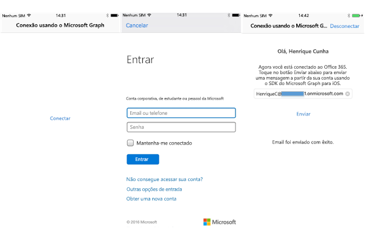

# <a name="get-started-with-microsoft-graph-in-a-swift-ios-app"></a><span data-ttu-id="aa731-101">Introdução ao Microsoft Graph em um aplicativo Swift iOS</span><span class="sxs-lookup"><span data-stu-id="aa731-101">Get started with Microsoft Graph in an iOS App</span></span>

> <span data-ttu-id="aa731-p101">**Criando aplicativos para clientes corporativos?** O aplicativo pode não funcionar caso o cliente corporativo habilite os recursos Enterprise Mobility + Security, como <a href="https://azure.microsoft.com/en-us/documentation/articles/active-directory-conditional-access-device-policies/" target="_newtab">acesso condicional ao dispositivo</a>. Nesse caso, pode ser que você não esteja ciente e seu cliente pode enfrentar problemas de erro.</span><span class="sxs-lookup"><span data-stu-id="aa731-p101">**Building apps for enterprise customers?** Your app may not work if your enterprise customer turns on enterprise mobility security features like <a href="https://azure.microsoft.com/en-us/documentation/articles/active-directory-conditional-access-device-policies/" target="_newtab">conditional device access</a>. In this case, you may not know and your customers may experience errors.</span></span> 

> <span data-ttu-id="aa731-p102">Para fornecer suporte a **todos os clientes corporativos**, em **todos os cenários corporativos**, use o ponto de extremidade do Microsoft Azure AD e gerencie os aplicativos usando o [Portal de Gerenciamento do Microsoft Azure](https://aka.ms/aadapplist). Para saber mais, confira o tópico [Decidindo entre os pontos de extremidade do Azure AD e do Azure AD v2.0](../concepts/auth_overview.md#deciding-between-the-azure-ad-and-azure-ad-v20-endpoints).</span><span class="sxs-lookup"><span data-stu-id="aa731-p102">To support **all enterprise customers** across **all enterprise scenarios**, you must use the Azure AD endpoint and manage your apps using the [Azure Management Portal](https://aka.ms/aadapplist). For more information, see [Deciding between the Azure AD and Azure AD v2.0 endpoints](../concepts/auth_overview.md#deciding-between-the-azure-ad-and-azure-ad-v20-endpoints).</span></span>

<span data-ttu-id="aa731-p103">Este artigo descreve as tarefas obrigatórias para obter um token de acesso do [ponto de extremidade do Azure AD v2.0](https://developer.microsoft.com/en-us/graph/docs/concepts/converged_auth) e chamar o Microsoft Graph. Ele orienta você em relação ao código dentro do [Exemplo de conexão com o Office 365 para iOS (SDK)](https://github.com/microsoftgraph/ios-objectivec-connect-sample) para explicar os principais conceitos que você tem que implementar em um aplicativo que usa o Microsoft Graph. Ele descreve como acessar o Microsoft Graph usando [SDK do Microsoft Graph para iOS](https://github.com/microsoftgraph/msgraph-sdk-ios).</span><span class="sxs-lookup"><span data-stu-id="aa731-p103">This article describes the tasks required to get an access token from the [Azure AD v2.0 endpoint](https://developer.microsoft.com/en-us/graph/docs/concepts/converged_auth) and call Microsoft Graph. It walks you through the code inside the [Office 365 Connect Sample for iOS (SDK)](https://github.com/microsoftgraph/ios-objectivec-connect-sample) to explain the main concepts that you have to implement in an app that uses Microsoft Graph. It describes how to access Microsoft Graph by using the [Microsoft Graph SDK for iOS](https://github.com/microsoftgraph/msgraph-sdk-ios).</span></span>

<span data-ttu-id="aa731-110">Você pode baixar a versão do aplicativo que você criará a partir deste repositório do GitHub:</span><span class="sxs-lookup"><span data-stu-id="aa731-110">You can download the version of the app that you'll create from this GitHub repo:</span></span>

* [<span data-ttu-id="aa731-111">Exemplo de conexão com o Office 365 para iOS usando o SDK do Microsoft Graph</span><span class="sxs-lookup"><span data-stu-id="aa731-111">Office 365 Connect Sample for iOS Using the Microsoft Graph SDK</span></span>](https://github.com/microsoftgraph/ios-objectivec-connect-sample)

<span data-ttu-id="aa731-112">A imagem a seguir mostra o aplicativo que você criará.</span><span class="sxs-lookup"><span data-stu-id="aa731-112">The following image shows the app you'll create.</span></span>




<span data-ttu-id="aa731-114">O fluxo de trabalho será conectar/autenticar ao Microsoft Graph, entrar com sua conta pessoal ou corporativa e finalmente enviar um email para um destinatário.</span><span class="sxs-lookup"><span data-stu-id="aa731-114">The workflow will be to connect/authenticate to Microsoft Graph, sign in with your work or personal account, and finally send a mail to a recipient.</span></span>

<span data-ttu-id="aa731-p104">**Não está com vontade de criar um aplicativo?** Use o [Início rápido do Microsoft Graph](https://graph.microsoft.io/en-us/getting-started) para começar a usar rapidamente.</span><span class="sxs-lookup"><span data-stu-id="aa731-p104">**Don't feel like building an app?** Use the [Microsoft Graph quick start](https://graph.microsoft.io/en-us/getting-started) to get up and running fast.</span></span>

## <a name="prerequisites"></a><span data-ttu-id="aa731-117">Pré-requisitos</span><span class="sxs-lookup"><span data-stu-id="aa731-117">Prerequisites</span></span>

<span data-ttu-id="aa731-118">Para começar, será necessário:</span><span class="sxs-lookup"><span data-stu-id="aa731-118">To get started, you'll need:</span></span> 

* <span data-ttu-id="aa731-119">[Xcode](https://developer.apple.com/xcode/downloads/) da Apple</span><span class="sxs-lookup"><span data-stu-id="aa731-119">[Xcode](https://developer.apple.com/xcode/downloads/) from Apple</span></span>
* <span data-ttu-id="aa731-120">Instalação do [CocoaPods](https://guides.cocoapods.org/using/using-cocoapods.html) como um gerente de dependências</span><span class="sxs-lookup"><span data-stu-id="aa731-120">Installation of [CocoaPods](https://guides.cocoapods.org/using/using-cocoapods.html) as a dependency manager</span></span>
* <span data-ttu-id="aa731-121">Uma [conta da Microsoft](https://www.outlook.com/) ou uma [conta corporativa ou de estudante](http://dev.office.com/devprogram)</span><span class="sxs-lookup"><span data-stu-id="aa731-121">A [Microsoft account](https://www.outlook.com/) or a [work or school account](http://dev.office.com/devprogram)</span></span>
* <span data-ttu-id="aa731-122">O [Projeto inicial do Microsoft Graph para iOS](https://github.com/microsoftgraph/ios-objectivec-connect-sample).</span><span class="sxs-lookup"><span data-stu-id="aa731-122">The [Microsoft Graph Starter Project for iOS](https://github.com/microsoftgraph/ios-objectivec-connect-sample).</span></span> <span data-ttu-id="aa731-123">Este modelo contém classes às quais você adicionará código.</span><span class="sxs-lookup"><span data-stu-id="aa731-123">This template contains classes that you'll add code to.</span></span> <span data-ttu-id="aa731-124">Para obter este projeto, clone ou baixe o exemplo de projeto deste local, e você trabalhará com o espaço de trabalho dentro da pasta **starter-project** (**ios-objectivec-connect-sample.xcworkspace**).</span><span class="sxs-lookup"><span data-stu-id="aa731-124">The Microsoft Graph Starter Project for iOS. This template contains classes that you'll add code to. To get this project, clone or download the sample project from this location, and you'll work with the workspace inside the **starter-project** folder (**O365-iOS-Microsoft-Graph-SDK.xcworkspace**).</span></span>

## <a name="register-the-app"></a><span data-ttu-id="aa731-125">Registrar o aplicativo</span><span class="sxs-lookup"><span data-stu-id="aa731-125">Register the app</span></span>
 
1. <span data-ttu-id="aa731-126">Entre no [Portal de Registro do Aplicativo](https://apps.dev.microsoft.com/) usando sua conta pessoal ou sua conta corporativa ou de estudante.</span><span class="sxs-lookup"><span data-stu-id="aa731-126">Sign into the [App Registration Portal](https://apps.dev.microsoft.com/) using either your personal or work or school account.</span></span>
2. <span data-ttu-id="aa731-127">Selecione **Adicionar um aplicativo**.</span><span class="sxs-lookup"><span data-stu-id="aa731-127">Select **Add an app**.</span></span>
3. <span data-ttu-id="aa731-128">Insira um nome para o aplicativo e selecione **Criar aplicativo**.</span><span class="sxs-lookup"><span data-stu-id="aa731-128">Enter a name for the app, and select **Create application**.</span></span>
    
    <span data-ttu-id="aa731-129">A página de registro é exibida, listando as propriedades do seu aplicativo.</span><span class="sxs-lookup"><span data-stu-id="aa731-129">The registration page displays, listing the properties of your app.</span></span>
 
4. <span data-ttu-id="aa731-130">Em **Plataformas**, selecione **Adicionar plataforma**.</span><span class="sxs-lookup"><span data-stu-id="aa731-130">Under **Platforms**, select **Add platform**.</span></span>
5. <span data-ttu-id="aa731-131">Selecione **Plataforma nativa**.</span><span class="sxs-lookup"><span data-stu-id="aa731-131">Select **Native platform**.</span></span>
6. <span data-ttu-id="aa731-p106">Copie a ID de Cliente para a área de transferência. Você precisará inserir esse valor no exemplo de aplicativo.</span><span class="sxs-lookup"><span data-stu-id="aa731-p106">Copy the Client Id to the clipboard. You'll need to enter this value into the sample app.</span></span>

    <span data-ttu-id="aa731-134">Essa ID de aplicativo é o identificador exclusivo do aplicativo.</span><span class="sxs-lookup"><span data-stu-id="aa731-134">The app id is a unique identifier for your app.</span></span> 

7. <span data-ttu-id="aa731-135">Selecione **Salvar**.</span><span class="sxs-lookup"><span data-stu-id="aa731-135">Select **Save**.</span></span>

## <a name="importing-the-project-dependencies"></a><span data-ttu-id="aa731-136">Importando as dependências do projeto</span><span class="sxs-lookup"><span data-stu-id="aa731-136">Importing the project dependencies</span></span>

1. <span data-ttu-id="aa731-137">Clonar este repositório, [Exemplo de conexão com o Office 365 para iOS usando o SDK do Microsoft Graph](https://github.com/microsoftgraph/ios-objectivec-connect-sample).</span><span class="sxs-lookup"><span data-stu-id="aa731-137">[Office 365 Connect Sample for iOS Using the Microsoft Graph SDK](https://github.com/microsoftgraph/ios-objectivec-connect-sample)</span></span> 
><span data-ttu-id="aa731-138">IMPORTANTE: Use o exemplo na pasta starter-project, não o exemplo na raiz do projeto.</span><span class="sxs-lookup"><span data-stu-id="aa731-138">IMPORTANT: Use the sample in the starter-project folder and not the sample at the root of the project.</span></span>

2. <span data-ttu-id="aa731-p107">Use o CocoaPods para importar as dependências de autenticação e o SDK do Microsoft Graph. Este aplicativo de exemplo já contém um podfile que colocará os pods no projeto. Navegue até a pasta **starter-project** no aplicativo **Terminal** e, do **Terminal**, execute:</span><span class="sxs-lookup"><span data-stu-id="aa731-p107">Use CocoaPods to import the Microsoft Graph SDK and authentication dependencies. This sample app already contains a podfile that will get the pods into the project. Navigate to the folder **starter-project** in the **Terminal** app, and from **Terminal** run:</span></span>

        pod install

   <span data-ttu-id="aa731-p108">Você receberá a confirmação de que os pods foram importados para o projeto. Para saber mais, confira [CocoaPods](https://guides.cocoapods.org/using/using-cocoapods.html).</span><span class="sxs-lookup"><span data-stu-id="aa731-p108">You will receive confirmation that the pods have been imported into the project. For more information, see [CocoaPods](https://guides.cocoapods.org/using/using-cocoapods.html)</span></span>


## <a name="enable-keychain-sharing"></a><span data-ttu-id="aa731-144">Habilitar o compartilhamento de chaves</span><span class="sxs-lookup"><span data-stu-id="aa731-144">Enable keychain sharing</span></span>
 
<span data-ttu-id="aa731-p109">Para o Xcode8, você deve adicionar o grupo de chaves para que o aplicativo não falhe ao acessar a chave. Para adicionar o grupo de chaves:</span><span class="sxs-lookup"><span data-stu-id="aa731-p109">For Xcode8, you need to add the keychain group or your app will fail to access keychain. To add the keychain group:</span></span>
 
1. <span data-ttu-id="aa731-p110">Escolha o projeto, no painel do gerente de projetos do Xcode. (⌘ + 1).</span><span class="sxs-lookup"><span data-stu-id="aa731-p110">Select the project on the project manager panel in Xcode. (⌘ + 1).</span></span>
 
2. <span data-ttu-id="aa731-149">Selecione **iOS-ObjectiveC-Connect-Sample**.</span><span class="sxs-lookup"><span data-stu-id="aa731-149">Select **iOS-ObjectiveC-Connect-Sample**.</span></span>
 
3. <span data-ttu-id="aa731-150">Na guia Recursos, habilite o **Compartilhamento de chaves**.</span><span class="sxs-lookup"><span data-stu-id="aa731-150">On the Capabilities tab, enable **Keychain Sharing**.</span></span>
 
4. <span data-ttu-id="aa731-151">Adicione **com.microsoft.ios-objectivec-connect-sample** aos Grupos de Chaves.</span><span class="sxs-lookup"><span data-stu-id="aa731-151">Add **com.microsoft.O365-iOS-Microsoft-Graph-SDK** to the Keychain Groups.</span></span>

## <a name="authenticating-with-microsoft-graph"></a><span data-ttu-id="aa731-152">Autenticando com o Microsoft Graph</span><span class="sxs-lookup"><span data-stu-id="aa731-152">Authenticating with Microsoft Graph</span></span>

<span data-ttu-id="aa731-153">Para rever o fluxo de trabalho de interface do usuário, o aplicativo fará o usuário autenticar e, em seguida, ele terá a capacidade de enviar um email para um usuário especificado.</span><span class="sxs-lookup"><span data-stu-id="aa731-153">To revisit the UI workflow, the app is going to have the user authenticate, and then they'll have the ability to send a mail to a specified user.</span></span> <span data-ttu-id="aa731-154">Para realizar solicitações ao serviço do Microsoft Graph, um provedor de autenticação deverá ser fornecido para autenticar solicitações HTTPS com um token de portador OAuth 2.0 apropriado.</span><span class="sxs-lookup"><span data-stu-id="aa731-154">To make requests against the Microsoft Graph service, an authentication provider must be supplied which is capable of authenticating HTTPS requests with an appropriate OAuth 2.0 bearer token.</span></span> <span data-ttu-id="aa731-155">No projeto de exemplo, há uma estrutura de autenticação já fragmentada chamada **Authentication.swift.**</span><span class="sxs-lookup"><span data-stu-id="aa731-155">In the sample project there's an authentication structure already stubbed out called **Authentication.swift.**</span></span> <span data-ttu-id="aa731-156">Vamos adicionar uma função para solicitar e adquirir um token de acesso para chamar a API do Microsoft Graph.</span><span class="sxs-lookup"><span data-stu-id="aa731-156">We will add a function to request, and acquire, an access token for calling the Microsoft Graph API.</span></span> 

1. <span data-ttu-id="aa731-157">Abra o espaço de trabalho do projeto Xcode (**Graph-iOS-Swift-Connect.xcworkspace**) e abra o arquivo de extensão de estrutura **Authentication.swift**. Encontre o código a seguir nessa extensão.</span><span class="sxs-lookup"><span data-stu-id="aa731-157">Open the Xcode project workspace (**Graph-iOS-Swift-Connect.xcworkspace**), and open the structure extension file **Authentication.swift** Find the following code in that extension.</span></span>


  ```swift
     /**
     Authenticates to Microsoft Graph. 
     If a user has previously signed in before and not disconnected, silent log in
     will take place. 
     If not, authentication will ask for credentials
     */
    func connectToGraph(withClientId clientId: String,
                                     scopes: [String],
                                     completion:@escaping (_ error: MSGraphError?) -> Void) {
    
        // Set client ID
        NXOAuth2AuthenticationProvider.setClientId(clientId, scopes: scopes)
        
        // Try silent log in. This will attempt to sign in if there is a previous successful
        // sign in user information.
        if NXOAuth2AuthenticationProvider.sharedAuth().loginSilent() == true {
            completion(nil)
        }
        // Otherwise, present log in controller.
        else {
            NXOAuth2AuthenticationProvider.sharedAuth()
                .login(with: nil) { (error: Error?) in
                    
                    if let nserror = error {
                        completion(MSGraphError.nsErrorType(error: nserror as NSError))
                    }
                    else {
                        completion(nil)
                    }
            }
        }
    }
  ```


2. <span data-ttu-id="aa731-158">Chamaremos esse método de **ConnectViewController.swift**.</span><span class="sxs-lookup"><span data-stu-id="aa731-158">We'll call this method from **ConnectViewController.swift**.</span></span> <span data-ttu-id="aa731-159">Este controlador é a exibição padrão que o aplicativo carrega, e há um único botão chamado **Conectar**, no qual o usuário tocará, que iniciará o processo de autenticação.</span><span class="sxs-lookup"><span data-stu-id="aa731-159">Finally we'll call this method from ConnectViewController.m. This controller is the default view that the app loads, and there is a single button named **Connect** that the user will tap that will initiate the authentication process. This method takes in two parameters, the Client ID and scopes, we'll discuss these in more detail below. Add the following action to ConnectViewController.m.</span></span> <span data-ttu-id="aa731-160">Este método usa um parâmetro, **scopes**. Discutiremos scopes de forma mais detalhada abaixo.</span><span class="sxs-lookup"><span data-stu-id="aa731-160">This method takes in one parameter, the **scopes**, we'll discuss scopes in more detail below.</span></span> <span data-ttu-id="aa731-161">Adicione a ação a seguir a **ConnectViewController.swift**.</span><span class="sxs-lookup"><span data-stu-id="aa731-161">Add the following action to **ConnectViewController.swift**.</span></span>

  ```swift
  // MARK: Authentication
  private extension ConnectViewController {
    func authenticate() {
        loadingUI(show: true)
        
        let clientId = ApplicationConstants.clientId
        let scopes = ApplicationConstants.scopes
        
        authentication.connectToGraph(withClientId: clientId, scopes: scopes) {
            (error) in
            
            defer {self.loadingUI(show: false)}
            
            if let graphError = error {
                switch graphError {
                case .nsErrorType(let nsError):
                    print(NSLocalizedString("ERROR", comment: ""), nsError.localizedDescription)
                    self.showError(message: NSLocalizedString("CHECK_LOG_ERROR", comment: ""))
                }
            }
            else {
                self.performSegue(withIdentifier: "showSendMail", sender: nil)
            }
        }
    }
  }

  ```

## <a name="send-an-email-with-microsoft-graph"></a><span data-ttu-id="aa731-162">Enviar um email com o Microsoft Graph</span><span class="sxs-lookup"><span data-stu-id="aa731-162">Send an email with Microsoft Graph</span></span>

<span data-ttu-id="aa731-163">Após configurar o projeto para fazer a autenticação, as próximas tarefas são obter o endereço de email, o nome de exibição e a foto do perfil do usuário autenticado.</span><span class="sxs-lookup"><span data-stu-id="aa731-163">After configuring the project to be able to authenticate, the next tasks are getting the authenticated user's email address, display name, and profile photo.</span></span> <span data-ttu-id="aa731-164">Depois que o exemplo obtém esses valores, carrega a imagem de perfil para o OneDrive e obtém a Url de compartilhamento da imagem.</span><span class="sxs-lookup"><span data-stu-id="aa731-164">After the sample gets these values it uploads the profile picture to OneDrive and gets the sharing Url of the picture.</span></span> <span data-ttu-id="aa731-165">Por fim, ele envia um email a um usuário usando a API do Microsoft Graph.</span><span class="sxs-lookup"><span data-stu-id="aa731-165">Finally, it sends a mail to a user using the Microsoft Graph API.</span></span> 

<span data-ttu-id="aa731-166">Por padrão, o usuário conectado será o destinatário, mas você tem a capacidade de alterá-lo para qualquer outro destinatário.</span><span class="sxs-lookup"><span data-stu-id="aa731-166">By default the logged in user will be the recipient, but you have the ability to change it to any other recipient.</span></span> <span data-ttu-id="aa731-167">O código com o qual trabalharemos aqui está na classe **SendMailViewController.swift.**</span><span class="sxs-lookup"><span data-stu-id="aa731-167">The code we'll work with here is in the class **SendMailViewController.swift.**</span></span> <span data-ttu-id="aa731-168">Você verá que há outro código representado aqui para a interface do usuário e um método auxiliar para recuperar informações de perfil de usuário do serviço do Microsoft Graph.</span><span class="sxs-lookup"><span data-stu-id="aa731-168">You'll see that there is other code represented here for the UI, and a helper method to retrieve user profile information from the Microsoft Graph service.</span></span> <span data-ttu-id="aa731-169">Vamos nos concentrar nos métodos para criar uma mensagem de email e enviar essa mensagem.</span><span class="sxs-lookup"><span data-stu-id="aa731-169">We'll concentrate on the methods for creating a mail message and sending that message.</span></span>

1. <span data-ttu-id="aa731-170">Abrir **SendMailViewController.swift.**</span><span class="sxs-lookup"><span data-stu-id="aa731-170">Open **SendMailViewController.swift.**</span></span>  <span data-ttu-id="aa731-171">e localize o método auxiliar de criação de corpo de email na classe:</span><span class="sxs-lookup"><span data-stu-id="aa731-171">and find the mail body creating helper method in the class:</span></span>

  ```swift
    /**
     Creates sample email message
     
     - parameter emailAddress: recipient email address
     
     - returns: MSGraphMessage object with given recipient. The body is created from EmailBody.html
     */
    func createSampleMessage(to emailAddress: String, picLink pictureUrl: String) -> MSGraphMessage? {
        let message = MSGraphMessage()
        
        // set recipients
        
        let _ = self.userPicture
        let toRecipient = MSGraphRecipient()
        let msEmailAddress = MSGraphEmailAddress()
        msEmailAddress.address = emailAddress
        toRecipient.emailAddress = msEmailAddress
        let toRecipientList = [toRecipient]
        message.toRecipients = toRecipientList
        message.subject = NSLocalizedString("MAIL_SUBJECT", comment: "")
        let messageBody = MSGraphItemBody()
        messageBody.contentType = MSGraphBodyType.html()
        guard let emailBodyFilePath = Bundle.main.path(forResource: "EmailBody", ofType: "html") else {return nil}
        messageBody.content = try! String(contentsOfFile: emailBodyFilePath, encoding: String.Encoding.utf8)
        messageBody.content = messageBody.content.replacingOccurrences(of: "a href=%s", with: ("a href=" + pictureUrl))
        message.body = messageBody

        if let unwrappedImage = self.userPicture {
            let fileAttachment = MSGraphFileAttachment()
            let data = UIImageJPEGRepresentation(unwrappedImage, 1.0)
            fileAttachment.contentType = "image/png"
            fileAttachment.oDataType = "#microsoft.graph.fileAttachment"
            fileAttachment.contentBytes = data?.base64EncodedString()
            fileAttachment.name = "me.png"
            message.attachments.append(fileAttachment)
        }
        return message
    }

  ```
2. <span data-ttu-id="aa731-172">encontre os métodos auxiliares a seguir para obter informações sobre o usuário, obter uma fotografia de perfil e carregar a fotografia no OneDrive:</span><span class="sxs-lookup"><span data-stu-id="aa731-172">find the following helper methods for getting user information, getting a profile photograph, and uploading the photograph to OneDrive:</span></span>

  ```swift
      /**
     Fetches user information such as mail and display name
     */
    func getUserInfo() {
        self.sendButton.isEnabled = false
        self.statusTextView.text = NSLocalizedString("LOADING_USER_INFO", comment: "")
        
        self.graphClient.me().request().getWithCompletion {
            (user: MSGraphUser?, error: Error?) in
            if let graphError = error {
                print(NSLocalizedString("ERROR", comment: ""), graphError)
                DispatchQueue.main.async(execute: {
                    self.statusTextView.text = NSLocalizedString("GRAPH_ERROR", comment: "")
                })
            }
            else {
                guard let userInfo = user else {
                    DispatchQueue.main.async(execute: {
                        self.statusTextView.text = NSLocalizedString("USER_INFO_LOAD_FAILURE", comment: "")
                    })
                    return
                }
                DispatchQueue.main.async(execute: {
                    self.emailTextField.text = userInfo.mail
                    
                    if let displayName = userInfo.displayName {
                        self.headerLabel.text = "Hi " + displayName
                    }
                    else {
                        self.headerLabel.text = NSString(format: NSLocalizedString("HI_USER", comment: "") as NSString, "") as String
                    }
                    
                    self.statusTextView.text = NSLocalizedString("USER_INFO_LOAD_SUCCESS", comment: "")
                    self.sendButton.isEnabled = true
                })
            }
        }
    }
    
    /**
     Uploads the user's profile picture (obtained via the Graph API) to the user's OneDrive drive. The OneDrive sharing url is
     returned in the completion handler.
    */
    func uploadPictureToOneDrive(uploadFile image: UIImage?, with completion: @escaping (_ result: GraphResult<String, NSError>) ->Void) {
        
        var webUrl: String = ""
        guard let unwrappedImage = image else {
            return
        }
        let data = UIImageJPEGRepresentation(unwrappedImage, 1.0)
        self.graphClient
            .me()
            .drive()
            .root()
            .children()
            .driveItem("me.png")
            .contentRequest()
            .upload(from: data, completion: {
                (driveItem: MSGraphDriveItem?, error: Error?) in
                if let nsError = error {
                    print(NSLocalizedString("ERROR", comment: ""), nsError.localizedDescription)
                    DispatchQueue.main.async(execute: {
                        self.statusTextView.text = NSLocalizedString("UPLOAD_PICTURE_FAILURE", comment: nsError.localizedDescription)
                    })
                    return

                } else {
                    webUrl = (driveItem?.webUrl)!
                    completion(.success(webUrl))
                }
            })
    }


    /**
     Gets the user's profile picture. Returns the picture as a UIImage via completion handler
    */
    func getUserPicture(forUser upn: String, with completion: @escaping (_ result: GraphResult<UIImage, NSError>) -> Void) {
        
        //Asynchronous Graph call. Closure is invoked after getUserPicture completes. Requires @escaping attribute
        self.graphClient.me().photoValue().download {
            (url: URL?, response: URLResponse?, error: Error?) in
            
                if let nsError = error {
                    print(NSLocalizedString("ERROR", comment: ""), nsError.localizedDescription)
                    DispatchQueue.main.async(execute: {
                        self.statusTextView.text = NSLocalizedString("GET_PICTURE_FAILURE", comment: nsError.localizedDescription)
                    })
                    return
                }
                guard let picUrl = url else {
                    DispatchQueue.main.async(execute: {
                        self.statusTextView.text = NSLocalizedString("GET_PICTURE_FAILURE", comment: "User profile picture is nil")
                    })
                    return
                }
                print(picUrl)
            
                let picData = NSData(contentsOf: picUrl)
                let picImage = UIImage(data: picData! as Data)
            
                if let validPic = picImage {
                    completion(.success(validPic))
                }
                else {
                    DispatchQueue.main.async(execute: {
                        self.statusTextView.text = NSLocalizedString("GET_PICTURE_FAILURE", comment: "Picture data is invalid")
                    })
                }
            }
    }

  ```

3. <span data-ttu-id="aa731-173">Localize o método de envio de mail a seguir na classe.</span><span class="sxs-lookup"><span data-stu-id="aa731-173">Find the following send mail method in the class.</span></span>  

  ```swift
    @IBAction func sendMail(_ sender: AnyObject) {
        guard let toEmail = self.emailTextField.text else {return}
        guard let picUrl = self.userPictureUrl else {return}
        if let message = self.createSampleMessage(to: toEmail, picLink: picUrl) {
            
            let requestBuilder = graphClient.me().sendMail(with: message, saveToSentItems: false)
            let mailRequest = requestBuilder?.request()
            
            _ = mailRequest?.execute(completion: {
                (response: [AnyHashable: Any]?, error: Error?) in
                if let nsError = error {
                    print(NSLocalizedString("ERROR", comment: ""), nsError.localizedDescription)
                    DispatchQueue.main.async(execute: {
                        self.statusTextView.text = NSLocalizedString("SEND_FAILURE", comment: "")
                    })
                }
                else {
                    DispatchQueue.main.async(execute: {
                        self.descriptionLabel.text = "Check your inbox. You have a new message :)"
                        self.statusTextView.text = NSLocalizedString("SEND_SUCCESS", comment: "")
                    })
                }
            })
        }
    }

  ```


## <a name="run-the-app"></a><span data-ttu-id="aa731-174">Executar o aplicativo</span><span class="sxs-lookup"><span data-stu-id="aa731-174">Run the app</span></span>
1. <span data-ttu-id="aa731-175">Antes de executar o exemplo, será necessário fornecer a identificação do cliente que você recebeu do processo de registro na seção **Registrar o aplicativo.**</span><span class="sxs-lookup"><span data-stu-id="aa731-175">Before running the sample you'll need to supply the client ID you received from the registration process in the section **Register the app.** Open AuthenticationConstants.m under the Application folder. You'll see that the ClientID from the registration process can be added to the top of the file.:</span></span> <span data-ttu-id="aa731-176">Abra **ApplicationConstants.swift**.</span><span class="sxs-lookup"><span data-stu-id="aa731-176">Open **ApplicationConstants.swift**.</span></span> <span data-ttu-id="aa731-177">Observe que você pode adicionar o valor de ClientID do processo de registro, na parte superior do arquivo.</span><span class="sxs-lookup"><span data-stu-id="aa731-177">You'll see that the ClientID from the registration process can be added to the top of the file.:</span></span>  

  ```swift
struct ApplicationConstants {
    static let clientId = "Enter_Client_Id_Here"
    static let scopes   = ["openid", "profile", "Mail.ReadWrite","mail.send","Files.ReadWrite","User.ReadBasic.All"]
}


  ```

> <span data-ttu-id="aa731-p117">Observação: Você notará que foram configurados os seguintes escopos de permissão para esse projeto: **"https://graph.microsoft.com/Mail.Send", "https://graph.microsoft.com/User.Read", "offline_access"**. As chamadas de serviço usadas neste projeto, que enviam emails para sua conta de email e recuperam algumas informações de perfil (Nome de Exibição, Endereço de Email) exigem essas permissões para que o aplicativo seja executado corretamente.</span><span class="sxs-lookup"><span data-stu-id="aa731-p117">Note: You'll notice that the following permission scopes have been configured for this project: **"https://graph.microsoft.com/Mail.Send", "https://graph.microsoft.com/User.Read", "offline_access"**. The service calls used in this project, sending a mail to your mail account and retrieving some profile information (Display Name, Email Address) require these permissions for the app to run properly.</span></span>

2. <span data-ttu-id="aa731-180">Execute o exemplo, toque em **Conexão**, entre com sua conta pessoal ou sua conta corporativa ou de estudante e conceda as permissões solicitadas.</span><span class="sxs-lookup"><span data-stu-id="aa731-180">Run the sample, tap **Connect,** sign in with your personal or work or school account, and grant the requested permissions.</span></span>

3. <span data-ttu-id="aa731-p118">Escolha o botão **Enviar email**. Quando o email for enviado, será exibida uma mensagem de sucesso abaixo do botão.</span><span class="sxs-lookup"><span data-stu-id="aa731-p118">Choose the **Send email** button. When the mail is sent, a success message is displayed below the button.</span></span>

## <a name="next-steps"></a><span data-ttu-id="aa731-183">Próximas etapas</span><span class="sxs-lookup"><span data-stu-id="aa731-183">Next steps</span></span>
- <span data-ttu-id="aa731-184">Experimente a API REST usando o [Explorador do Graph](https://graph.microsoft.io/graph-explorer).</span><span class="sxs-lookup"><span data-stu-id="aa731-184">Try out the REST API using the [Graph explorer](https://graph.microsoft.io/graph-explorer).</span></span>
- <span data-ttu-id="aa731-185">Encontre exemplos de operações comuns para operações de REST e SDK no [Exemplo de trechos de código do iOS Objective C do Microsoft Graph](https://github.com/microsoftgraph/ios-objectiveC-snippets-sample).</span><span class="sxs-lookup"><span data-stu-id="aa731-185">Find examples of common operations for both REST and SDK operations in the [Microsoft Graph iOS Objective C Snippets Sample](https://github.com/microsoftgraph/ios-objectiveC-snippets-sample).</span></span>

## <a name="see-also"></a><span data-ttu-id="aa731-186">Confira também</span><span class="sxs-lookup"><span data-stu-id="aa731-186">See also</span></span>
- [<span data-ttu-id="aa731-187">Protocolos do Azure AD v2.0</span><span class="sxs-lookup"><span data-stu-id="aa731-187">Azure AD v2.0 protocols</span></span>](https://azure.microsoft.com/en-us/documentation/articles/active-directory-v2-protocols/)
- [<span data-ttu-id="aa731-188">Tokens do Azure AD v2.0</span><span class="sxs-lookup"><span data-stu-id="aa731-188">Azure AD v2.0 tokens</span></span>](https://azure.microsoft.com/en-us/documentation/articles/active-directory-v2-tokens/)
