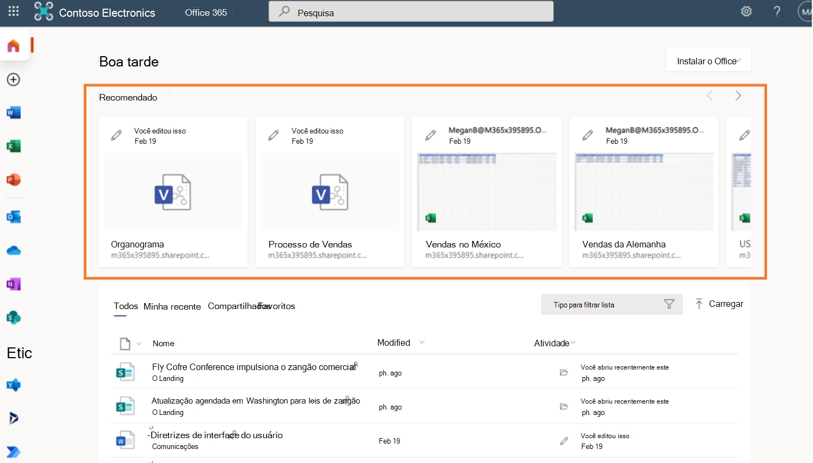
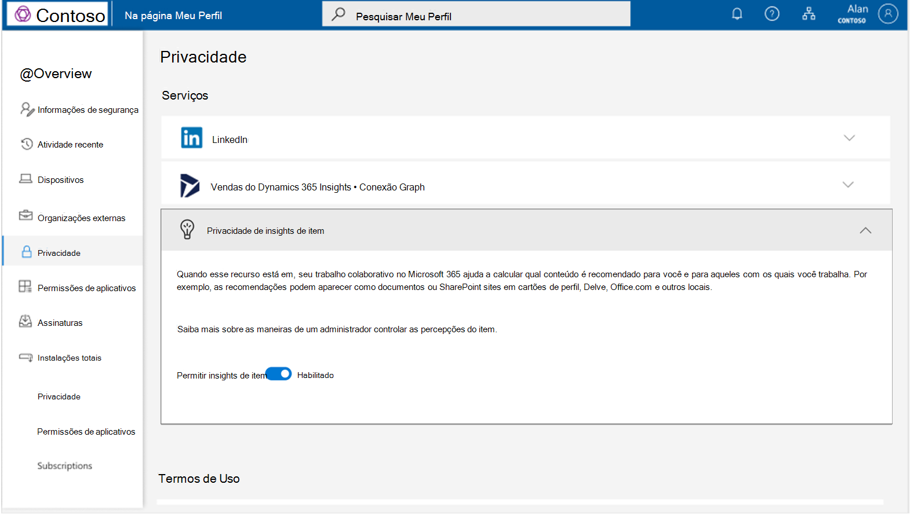
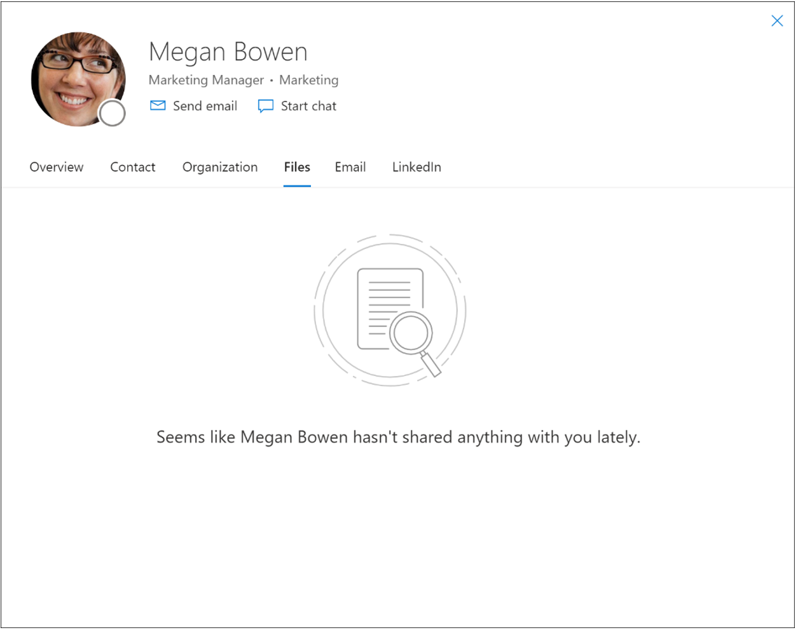
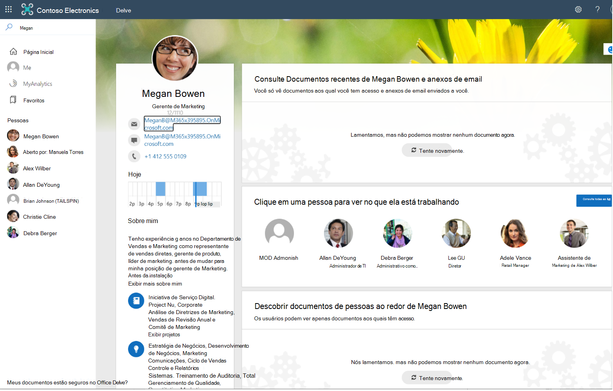

# Visão geral dos insights do item
As percepções do item são recomendações centradas no usuário para você e aqueles com quem você trabalha, com base em seu trabalho colaborativo no Microsoft 365.

## Cálculo de insights do item
O Microsoft 365 é a nuvem de produtividade do mundo, onde muitos recursos são projetados para você, como usuário. Ao interagir com recursos como arquivos no Microsoft 365, você produz sinais que a Microsoft agrega e monta em um gráfico para sua organização. No gráfico, os dados do sinal são representados como relacionamentos entre você e os outros recursos. Derivados de sinais no gráfico, estão os insights que potencializam algumas experiências do Microsoft 365. Exemplos de experiências incluem sugerir o melhor horário para a próxima reunião de equipe, ajudá-lo a organizar informações pessoais e de trabalho em seu telefone e muitos outros cenários de inteligência. 

Como são as interações com os recursos do Microsoft 365 e como os insights dos itens resultam delas? O Microsoft 365 permite que você colabore com colegas de várias maneiras - batendo papo com colegas em chats do Teams ou canalizando conversas, em documentos como listas no Microsoft Office SharePoint Online, relatórios do PowerBI no OneDrive for Business, sites do Microsoft Office SharePoint Online, Teams ou email do Outlook. A Microsoft obtém insights da análise de atividades (como modificar, comentar ou compartilhar) e aplica esses insights para capacitar experiências centradas no usuário com recomendações para usuários do Microsoft 365, aumentando assim a produtividade geral da empresa. As percepções do item são um tipo de percepção que a Microsoft calcula usando técnicas avançadas de aprendizado de máquina e aplica como recomendações de conteúdo para você e seus colegas dentro da organização.

> [!NOTE]
> Este artigo não aborda outras experiências baseadas em insights no Microsoft 365, como Viva Insights, o suplemento Insights para Outlook, recurso WorkWith, MyAnalytics e painel Insights. 

## Insights de itens no Microsoft 365 
As percepções dos itens potencializam algumas experiências proeminentes com base em arquivos no Microsoft 365.

### Arquivos recomendados 
Um exemplo de experiência potencializada por insights de itens são os arquivos em **Recomendado** no Office.com. O Microsoft Graph reúne sinais desses arquivos acessíveis a você que têm atividade contínua, deriva percepções de itens a partir desses sinais e aplica essas percepções para recomendar arquivos para que você possa localizar rapidamente aqueles que são mais importantes para você. Com as informações dos itens, você pode obter rapidamente seus documentos mais relevantes.

### Arquivos para descoberta 
Você pode descobrir conteúdo potencialmente útil que você pode acessar, mas pode não ter visto antes, em **Descobrir** no Delve ou Outlook mobile. Esses são documentos que são tendências ao seu redor, calculados com base na atividade da rede mais próxima de pessoas em sua organização. Eles incluem arquivos armazenados no OneDrive for Business e no Microsoft Office SharePoint Online.  

### Arquivos recentes em interfaces baseadas em cartão 
Em interfaces baseadas em cartão, como Delve, o cartão de pessoa em aplicativos do Microsoft 365 e o cartão de pessoa nos resultados de trabalho do Bing, os insights de item trazem arquivos do OneDrive, Microsoft Office SharePoint Online ou Outlook que você modificou recentemente ou compartilhou com a pessoa que está olhando para o seu perfil, que tem acesso a esse conteúdo. Essas percepções personalizadas ajudam seus colegas a economizar tempo procurando a pessoa ou as informações certas.  

## Microsoft funciona com base na confiança
A Microsoft usa apenas suas atividades em um espaço de trabalho compartilhado (atividades como compartilhamento, modificação, ações de comentários) dentro de sua organização para calcular recomendações para outras pessoas. Isso significa que se você simplesmente deu uma olhada ou clicou em um documento compartilhado sem alterá-lo ou comentá-lo, seus colegas não verão o documento como uma recomendação porque você o navegou. 

A Microsoft não usa suas atividades de trabalho em um espaço privado para calcular recomendações para outras pessoas. Isso significa que ninguém pode obter insights de seus documentos privados.  

Por fim, seus colegas podem ver recomendações baseadas apenas no conteúdo ao qual eles já têm acesso. Se Alice colaborar com Robert na escrita de um documento, Alice e Robert podem obter recomendações com base neste trabalho colaborativo. Kate, que não tem acesso ao documento, não vê recomendações associadas a este arquivo ou à colaboração entre Alice e Robert. Esta regra se aplica a todos os usuários em uma organização. Em nosso exemplo, isso inclui o gerente e os administradores de Kate, que não veriam recomendações com base no conteúdo ao qual não têm acesso. 

## Desativando insights do item
Ao permitir que a Microsoft compute percepções de itens a partir de sinais em seus espaços de trabalho compartilhados, você transforma atividades e conteúdo em recomendações utilizáveis ​​e torna esse conhecimento facilmente detectável e utilizável para você e seus colegas em sua organização. Ao fazer isso, você está ajudando a aumentar o produtividade de toda a sua organização.  

Mesmo que a Microsoft nunca divulgue seus documentos privados e use apenas percepções de conteúdo aos quais os usuários já têm acesso, pode haver casos em que o risco de descobrir o conteúdo por usuários indesejáveis ​​supera os possíveis benefícios. Nesses casos, você deve considerar desativar os insights do item. Lembre-se de que desabilitar insights de itens não é uma medida de segurança e você deve sempre começar revisando seus padrões de trabalho e certifique-se de que seu acesso de segurança está configurado conforme pretendido. Se quiser tornar seu conteúdo e atividades menos detectáveis, você pode desabilitar os insights do item usando o botão de alternância [disponível em Minha conta, em Configurações e Privacidade](https://myaccount.microsoft.com/settingsandprivacy/privacy).  

### Desabilitar ou reabilitar insights de itens 
Por padrão, os insights do item estão habilitados. Os administradores usam configurações específicas para controlar as percepções dos itens. Se um administrador desabilitar os insights do item, você poderá reabilitá-los apenas trabalhando com o administrador. 
[Saiba mais sobre as maneiras de um administrador controlar as percepções do item](insights-customize-item-insights-privacy.md).

A atualização das configurações pode levar até 24 horas para ser aplicada na organização do usuário nas experiências do Microsoft 365.

Depois de desabilitar os insights do item, acontece o seguinte: 
* A Microsoft para de usar seus sinais ao calcular recomendações para outras pessoas. Seus colegas param de receber insights de itens com base nas atividades que você realiza em espaços de trabalho compartilhados, e a experiência baseada em insights de seus colegas torna-se menos rica em locais como os arquivos **recomendados** no Office.com e Delve.

* Seus colegas não podem mais ver insights, como arquivos recentes que você compartilhou com eles do OneDrive for Business e do Microsoft Office SharePoint Online, em experiências como Delve, o cartão de pessoa no Microsoft 365 e os resultados do Bing. O conteúdo ainda pode ser acessado por meio da Pesquisa da Microsoft ou outra experiência conforme apropriado, mas é mais difícil de descobrir e seus colegas teriam que gastar mais tempo para encontrá-lo.  

* Experiências que mostram tendências de conteúdo ao seu redor são bloqueadas para você e inacessíveis para outras pessoas, em lugares como Delve e a seção **Descobrir** do Outlook mobile. A falta de percepções mais populares também afeta sua relevância personalizada no Pesquisa da Microsoft, uma vez que não pode usar seu conteúdo de tendências como sinais de relevância.

* Desabilitar os insights do item impedirá que o [horário de reunião sugerido](https://support.microsoft.com/office/update-your-meeting-hours-using-the-profile-card-0613d113-d7c1-4faa-bb11-c8ba30a78ef1?ui=en-US&rs=en-US&ad=US) seja calculado e mostrado ao usuário em seu cartão pessoal. 
* Para um usuário que desabilitou os insights do item, consultar os recursos [mais populares](/graph/api/resources/insights-trending) e [ usados ​​](/graph/api/resources/insights-used) na API do Microsoft Graph retorna `HTTP 403 Forbidden`.

## Referência da API
Está procurando a referência de API para esse serviço?

- [API do Insights no Microsoft Graph v1.0](/graph/api/resources/officegraphinsights)
- [API do Insights no Microsoft Graph beta](/graph/api/resources/iteminsights?view=graph-rest-beta&preserve-view=true)

## Próximos passos

- Use o [Graph Explorer](https://developer.microsoft.com/graph/graph-explorer) para experimentar a API de insights com seus próprios arquivos. Faça login, expanda **Insights** na coluna à esquerda e experimente as consultas de amostra.
- Saiba mais sobre[ como personalizar a privacidade dos insights de itens para usuários (visualização)](insights-customize-item-insights-privacy.md) e a [API de configurações de insights de itens (visualização)](/graph/api/resources/iteminsightssettings?view=graph-rest-beta&preserve-view=true) que oferece suporte à personalização.
