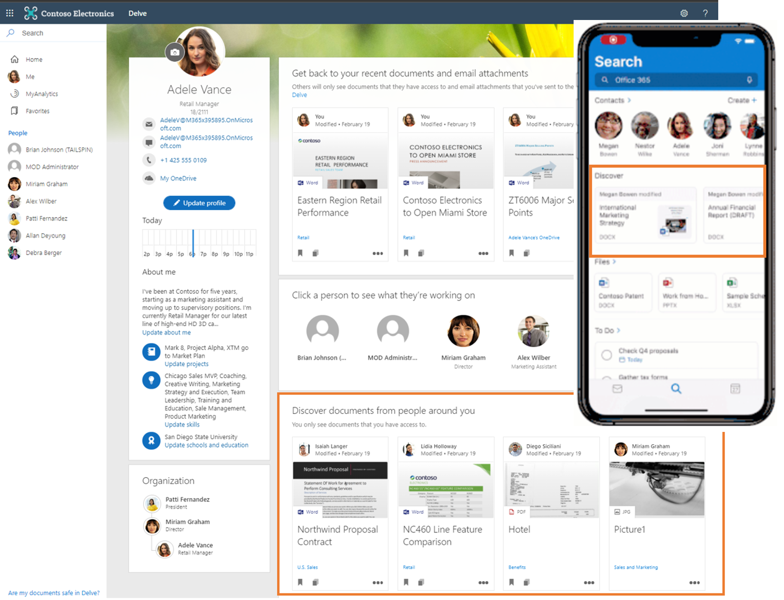
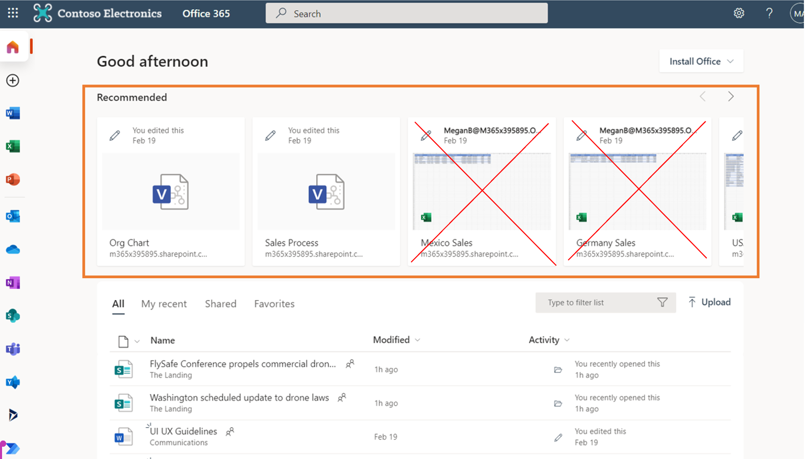

# Visão geral dos insights do itemOverview of item insights
As percepções do item são recomendações centradas no usuário para você e aqueles com quem você trabalha, com base em seu trabalho colaborativo no Microsoft 365.Item insights are user-centric recommendations for you and those you work with, based on your collaborative work in Microsoft 365.

## Cálculo de insights do itemComputation of item insights
O Microsoft 365 é a nuvem de produtividade do mundo, onde muitos recursos são projetados para você, como usuário.Microsoft 365 is the world’s productivity cloud, where many features are designed around you, as the user. Ao interagir com recursos como arquivos no Microsoft 365, você produz sinais que a Microsoft agrega e monta em um gráfico para sua organização.By interacting with resources such as files in Microsoft 365, you produce signals that Microsoft aggregates and assembles into a graph for your organization. No gráfico, os dados do sinal são representados como relacionamentos entre você e os outros recursos.In the graph, the signal data is represented as relationships between you and the other resources. Derivados de sinais no gráfico, estão os insights que potencializam algumas experiências do Microsoft 365.Derived from signals in the graph are insights that power a few Microsoft 365 experiences. Exemplos de experiências incluem sugerir o melhor horário para a próxima reunião de equipe, ajudá-lo a organizar informações pessoais e de trabalho em seu telefone e muitos outros cenários de inteligência.Examples of experiences include suggesting the best time for the next team meeting, helping you sort out personal and work information on your phone, and many other intelligence scenarios. 

Como são as interações com os recursos do Microsoft 365 e como os insights dos itens resultam delas?What are interactions with Microsoft 365 resources like, and how do item insights result from them? O Microsoft 365 permite que você colabore com colegas de várias maneiras - batendo papo com colegas em chats do Teams ou canalizando conversas, em documentos como listas no Microsoft Office SharePoint Online, relatórios do PowerBI no OneDrive for Business, sites do Microsoft Office SharePoint Online, Teams ou email do Outlook.Microsoft 365 lets you collaborate with colleagues in many ways – chatting with colleagues in Teams chats or channel conversations, over documents such as lists in SharePoint, PowerBI reports in OneDrive for Business, SharePoint sites, Teams, or Outlook email. A Microsoft obtém insights da análise de atividades (como modificar, comentar ou compartilhar) e aplica esses insights para capacitar experiências centradas no usuário com recomendações para usuários do Microsoft 365, aumentando assim a produtividade geral da empresa.Microsoft derives insights from analyzing activities (such as modifying, commenting, or sharing), and applies these insights to empower user-centric experiences with recommendations for users of Microsoft 365, thereby increasing overall company productivity. As percepções do item são um tipo de percepção que a Microsoft calcula usando técnicas avançadas de aprendizado de máquina e aplica como recomendações de conteúdo para você e seus colegas dentro da organização.Item insights are a type of insights that Microsoft calculates using advanced machine learning techniques, and applies as content recommendations for you and your colleagues within the organization.

> [!NOTE]
> Este artigo não aborda outras experiências baseadas em insights no Microsoft 365, como Viva Insights, o suplemento Insights para Outlook, recurso WorkWith, MyAnalytics e painel Insights.This article does not address other insight-based experiences in Microsoft 365, such as Viva Insights, the Insights add-in for Outlook, WorkWith feature, MyAnalytics, and Insights dashboard. 

## Insights de itens no Microsoft 365Item insights in Microsoft 365 
As percepções dos itens potencializam algumas experiências proeminentes com base em arquivos no Microsoft 365.Item insights power a few prominent file-based experiences in Microsoft 365.

### Arquivos recomendadosRecommended files 
Um exemplo de experiência potencializada por insights de itens são os arquivos em **Recomendado** no Office.com.An example of an experience empowered by item insights is the files under **Recommended** in Office.com. O Microsoft Graph reúne sinais desses arquivos acessíveis a você que têm atividade contínua, deriva percepções de itens a partir desses sinais e aplica essas percepções para recomendar arquivos para que você possa localizar rapidamente aqueles que são mais importantes para você.Microsoft Graph gathers signals of those files accessible to you that have ongoing activity, derives item insights from these signals, and applies these insights to recommend files so you can quickly find the ones that matter to you most. Com as informações dos itens, você pode obter rapidamente seus documentos mais relevantes.With item insights, you can quickly get to your most relevant documents.

### Arquivos para descobertaFiles for discovery 
Você pode descobrir conteúdo potencialmente útil que você pode acessar, mas pode não ter visto antes, em **Descobrir** no Delve ou Outlook mobile.You can discover potentially useful content that you can access but may not have seen before, under **Discover** in Delve or Outlook mobile. Esses são documentos que são tendências ao seu redor, calculados com base na atividade da rede mais próxima de pessoas em sua organização.These are documents trending around you, calculated based on the activity of your closest network of people in your organization. Eles incluem arquivos armazenados no OneDrive for Business e no Microsoft Office SharePoint Online.They include files stored in OneDrive for Business and SharePoint Online.  

### Arquivos recentes em interfaces baseadas em cartãoRecent files in card-based interfaces 
Em interfaces baseadas em cartão, como Delve, o cartão de pessoa em aplicativos do Microsoft 365 e o cartão de pessoa nos resultados de trabalho do Bing, os insights de item trazem arquivos do OneDrive, Microsoft Office SharePoint Online ou Outlook que você modificou recentemente ou compartilhou com a pessoa que está olhando para o seu perfil, que tem acesso a esse conteúdo.In card-based interfaces such as Delve, the persona card in Microsoft 365 apps, and the people card in Bing work results, item insights bring forward OneDrive, SharePoint, or Outlook files that you have modified recently or shared with the person looking at your profile, which has access to that content. Essas percepções personalizadas ajudam seus colegas a economizar tempo procurando a pessoa ou as informações certas.Such personalized insights help your colleagues save time searching for the right person or information.  

## Microsoft funciona com base na confiançaMicrosoft runs on trust
A Microsoft usa apenas suas atividades em um espaço de trabalho compartilhado (atividades como compartilhamento, modificação, ações de comentários) dentro de sua organização para calcular recomendações para outras pessoas.Microsoft uses only your activities in a shared working space (activities such as sharing, modifying, commenting actions) within your organization to calculate recommendations for others. Isso significa que se você simplesmente deu uma olhada ou clicou em um documento compartilhado sem alterá-lo ou comentá-lo, seus colegas não verão o documento como uma recomendação porque você o navegou.That means, if you simply glanced at or clicked on a shared document without changing or commenting on it, your colleagues will not see the document as a recommendation because you browsed the document. 

A Microsoft não usa suas atividades de trabalho em um espaço privado para calcular recomendações para outras pessoas.Microsoft does not use your activities from working in a private space to calculate recommendations for others. Isso significa que ninguém pode obter insights de seus documentos privados.That means no one can get insights from your private documents.  

Por fim, seus colegas podem ver recomendações baseadas apenas no conteúdo ao qual eles já têm acesso.Finally, your colleagues can see recommendations built only on content that they already have access to. Se Alice colaborar com Robert na escrita de um documento, Alice e Robert podem obter recomendações com base neste trabalho colaborativo.If Alice collaborates with Robert on writing a document, Alice and Robert can both get recommendations based on this collaborative work. Kate, que não tem acesso ao documento, não vê recomendações associadas a este arquivo ou à colaboração entre Alice e Robert.Kate, who does not have access to the document, does not see recommendations associated with this file or the collaboration between Alice and Robert. Esta regra se aplica a todos os usuários em uma organização.This rule applies to all users in an organization. Em nosso exemplo, isso inclui o gerente e os administradores de Kate, que não veriam recomendações com base no conteúdo ao qual não têm acesso.In our example, that includes Kate’s manager and administrators, who would not see recommendations based on content that they do not have access to. 

## Desativando insights do itemDisabling item insights
Ao permitir que a Microsoft compute percepções de itens a partir de sinais em seus espaços de trabalho compartilhados, você transforma atividades e conteúdo em recomendações utilizáveis ​​e torna esse conhecimento facilmente detectável e utilizável para você e seus colegas em sua organização.By allowing Microsoft to compute item insights from signals in your shared workspaces, you turn activities and content into usable recommendations, and make this knowledge easily discoverable and usable to you and your colleagues in your organization. Ao fazer isso, você está ajudando a aumentar o produtividade de toda a sua organização.By doing so, you are helping to boost the productivity of your entire organization.  

Mesmo que a Microsoft nunca divulgue seus documentos privados e use apenas percepções de conteúdo aos quais os usuários já têm acesso, pode haver casos em que o risco de descobrir o conteúdo por usuários indesejáveis ​​supera os possíveis benefícios.Even though Microsoft never discloses your private documents and only uses insights of content that users already have access to, there can be cases where the risk of discovering the content by undesirable users outweighs the possible benefits. Nesses casos, você deve considerar desativar os insights do item.In these cases, you should consider turning off item insights. Lembre-se de que desabilitar insights de itens não é uma medida de segurança e você deve sempre começar revisando seus padrões de trabalho e certifique-se de que seu acesso de segurança está configurado conforme pretendido.Remember that disabling item insights is not a security measure, and you should always start by reviewing your work patterns and ensure that your security access is configured as intended. Se quiser tornar seu conteúdo e atividades menos detectáveis, você pode desabilitar os insights do item usando o botão de alternância [disponível em Minha conta, em Configurações e Privacidade](https://myaccount.microsoft.com/settingsandprivacy/privacy).If you want to make your content and activities less discoverable, you can disable item insights by using the [toggle available in MyAccount, under Settings & Privacy](https://myaccount.microsoft.com/settingsandprivacy/privacy).  

### Desabilitar ou reabilitar insights de itensDisable or re-enable item insights 
Por padrão, os insights do item estão habilitados.By default, item insights are enabled. Os administradores usam configurações específicas para controlar as percepções dos itens.Administrators use specific settings to control item insights. Se um administrador desabilitar os insights do item, você poderá reabilitá-los apenas trabalhando com o administrador.If an administrator disables your item insights, you can re-enable them only by working with the administrator. 
[Saiba mais sobre as maneiras de um administrador controlar as percepções do item](insights-customize-item-insights-privacy.md).[Learn more about ways for an administrator to control item insights](insights-customize-item-insights-privacy.md).

A atualização das configurações pode levar até 24 horas para ser aplicada na organização do usuário nas experiências do Microsoft 365.Updating settings can take up to 24 hours to apply within the user’s organization across Microsoft 365 experiences.

Depois de desabilitar os insights do item, acontece o seguinte:After disabling item insights, the following happens: 
* A Microsoft para de usar seus sinais ao calcular recomendações para outras pessoas.Microsoft stops using your signals when computing recommendations for others. Seus colegas param de receber insights de itens com base nas atividades que você realiza em espaços de trabalho compartilhados, e a experiência baseada em insights de seus colegas torna-se menos rica em locais como os arquivos **recomendados** no Office.com e Delve.Your colleagues stop receiving item insights based on activities that you perform in shared workspaces, and your colleagues’ insights-based experience becomes less rich in places such as the **Recommended** files in Office.com and Delve.

* Seus colegas não podem mais ver insights, como arquivos recentes que você compartilhou com eles do OneDrive for Business e do Microsoft Office SharePoint Online, em experiências como Delve, o cartão de pessoa no Microsoft 365 e os resultados do Bing.Your colleagues can no longer see insights such as recent files that you have shared with them from OneDrive for Business and SharePoint, in experiences such as Delve, the persona card in Microsoft 365 and the Bing results. O conteúdo ainda pode ser acessado por meio da Pesquisa da Microsoft ou outra experiência conforme apropriado, mas é mais difícil de descobrir e seus colegas teriam que gastar mais tempo para encontrá-lo.The content is still accessible via Microsoft Search or other experience as appropriate, but it is harder to discover and your colleagues would have to spend more time to find it.  

* Experiências que mostram tendências de conteúdo ao seu redor são bloqueadas para você e inacessíveis para outras pessoas, em lugares como Delve e a seção **Descobrir** do Outlook mobile.Experiences that show content trending around you is blocked for you and inaccessible to others, in places such as Delve and Outlook mobile’s **Discover** section. A falta de percepções mais populares também afeta sua relevância personalizada no Pesquisa da Microsoft, uma vez que não pode usar seu conteúdo de tendências como sinais de relevância.The lack of the trending-insights also affects your personalized relevance in Microsoft Search since it cannot use your trending content as signals for relevance.

* Desabilitar os insights do item impedirá que o [horário de reunião sugerido](https://support.microsoft.com/office/update-your-meeting-hours-using-the-profile-card-0613d113-d7c1-4faa-bb11-c8ba30a78ef1?ui=en-US&rs=en-US&ad=US) seja calculado e mostrado ao usuário em seu cartão pessoal.Disabling item insights will stop [suggested meeting hours](https://support.microsoft.com/office/update-your-meeting-hours-using-the-profile-card-0613d113-d7c1-4faa-bb11-c8ba30a78ef1?ui=en-US&rs=en-US&ad=US) from being calculated and shown to the user on their persona card. 
* Para um usuário que desabilitou os insights do item, consultar os recursos [mais populares](/graph/api/resources/insights-trending) e [ usados ​​](/graph/api/resources/insights-used) na API do Microsoft Graph retorna `HTTP 403 Forbidden`.For a user who has disabled item insights, querying the [trending](/graph/api/resources/insights-trending) and [used](/graph/api/resources/insights-used) resources in Microsoft Graph API returns `HTTP 403 Forbidden`.

## Referência da APIAPI reference
Está procurando a referência de API para esse serviço?Looking for the API reference for this service?

- [API do Insights no Microsoft Graph v1.0Insights API in Microsoft Graph v1.0](/graph/api/resources/officegraphinsights)
- [API do Insights no Microsoft Graph betaInsights API in Microsoft Graph beta](/graph/api/resources/iteminsights?view=graph-rest-beta&preserve-view=true)

## Próximos passosNext steps

- Use o [Graph Explorer](https://developer.microsoft.com/graph/graph-explorer) para experimentar a API de insights com seus próprios arquivos.Use the [Graph Explorer](https://developer.microsoft.com/graph/graph-explorer) to try out the insights API with your own files. Faça login, expanda **Insights** na coluna à esquerda e experimente as consultas de amostra.Sign in, expand **Insights** in the column on the left, and try the sample queries.
- Saiba mais sobre[ como personalizar a privacidade dos insights de itens para usuários (visualização)](insights-customize-item-insights-privacy.md) e a [API de configurações de insights de itens (visualização)](/graph/api/resources/iteminsightssettings?view=graph-rest-beta&preserve-view=true) que oferece suporte à personalização.Learn more about [customizing item insights privacy for users (preview)](insights-customize-item-insights-privacy.md), and the [item insights settings API (preview)](/graph/api/resources/iteminsightssettings?view=graph-rest-beta&preserve-view=true) that supports the customization.
