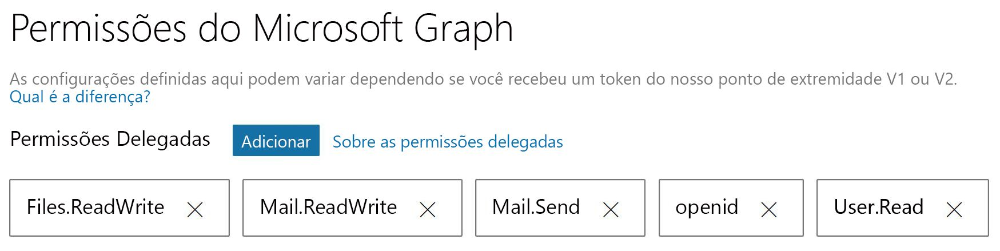

# <a name="get-started-with-microsoft-graph-in-a-java-app"></a><span data-ttu-id="77578-101">Introdução ao Microsoft Graph em aplicativo Java</span><span class="sxs-lookup"><span data-stu-id="77578-101">Get started with Microsoft Graph in a PHP app</span></span>

<span data-ttu-id="77578-102">Este artigo usa o [console-java-connect-sample](https://github.com/microsoftgraph/console-java-connect-sample) para explicar o envio de emails por meio do Microsoft Graph em um aplicativo de console Java.</span><span class="sxs-lookup"><span data-stu-id="77578-102">This article uses the [console-java-connect-sample](https://github.com/microsoftgraph/console-java-connect-sample) to walk through sending mail via Microsoft Graph from a Java console application.</span></span> <span data-ttu-id="77578-103">O artigo mostra o código que é preciso incluir no aplicativo Java para poder usar a API do Microsoft Graph.</span><span class="sxs-lookup"><span data-stu-id="77578-103">The article shows you the code that you need to add to your Java app so that you can use the Microsoft Graph API.</span></span> <span data-ttu-id="77578-104">O aplicativo acessa o Microsoft Graph usando o [SDK do Microsoft Graph para Java](https://github.com/microsoftgraph/msgraph-sdk-java).</span><span class="sxs-lookup"><span data-stu-id="77578-104">The app accesses Microsoft Graph by using the [Microsoft Graph SDK for Java](https://github.com/microsoftgraph/msgraph-sdk-java).</span></span>

## <a name="choose-an-authentication-library"></a><span data-ttu-id="77578-105">Escolher uma biblioteca de autenticação</span><span class="sxs-lookup"><span data-stu-id="77578-105">Choosing an authentication library</span></span>

<span data-ttu-id="77578-106">O Microsoft Graph adotou os padrões do OAuth 2.0 e do Open ID Connect, que permite escolher entre várias bibliotecas OAuth 2 para Java de software livre.</span><span class="sxs-lookup"><span data-stu-id="77578-106">Microsoft Graph adopted the OAuth 2.0 and Open ID Connect standards, which lets you choose from many available open source OAuth 2 Java libraries.</span></span> <span data-ttu-id="77578-107">A equipe do Azure AD recomenda usar o [ScribeJava](https://github.com/scribejava/scribejava), uma biblioteca OAuth2 simples para Java.</span><span class="sxs-lookup"><span data-stu-id="77578-107">The Azure AD team recommends using [ScribeJava](https://github.com/scribejava/scribejava), a simple OAuth2 library for Java.</span></span>

<span data-ttu-id="77578-108">O exemplo implementa o fluxo de Concessão do Código de Autorização, que é a escolha certa para o cenário de autorização de cliente, um usuário, e um ponto de extremidade habilitado do OAuth 2 habilitado.</span><span class="sxs-lookup"><span data-stu-id="77578-108">The sample implements the Authorization Code Grant flow which is the right choice for a client authorization scenario, a user, and an OAuth 2-enabled endpoint.</span></span> <span data-ttu-id="77578-109">Em aplicativos Java de produção de servidor-a-servidor, é usado o fluxo de autorização de Credenciais de Cliente.</span><span class="sxs-lookup"><span data-stu-id="77578-109">In production server-to-server Java applications, the Client Credentials authorization flow is used.</span></span> <span data-ttu-id="77578-110">O **ScribeJava** controla ambos os fluxos de autorização.</span><span class="sxs-lookup"><span data-stu-id="77578-110">**ScribeJava** handles both of these authorization flows.</span></span> <span data-ttu-id="77578-111">Para facilitar o registro, a autenticação e a execução deste exemplo, demonstraremos o fluxo mais simples.</span><span class="sxs-lookup"><span data-stu-id="77578-111">To make this sample easy to register, authenticate, and run, we demonstrate the simplest flow.</span></span>

<span data-ttu-id="77578-112">Antes de seu aplicativo poder fazer chamadas no Microsoft Graph, ele deve conseguir acessar um token do Azure Active Directory (Azure AD).</span><span class="sxs-lookup"><span data-stu-id="77578-112">Before your app can make calls on Microsoft Graph, the app must get an access token from Azure Active Directory (Azure AD).</span></span> <span data-ttu-id="77578-113">Este token deve estar presente em um cabeçalho de autenticação HTTP com cada chamada para o Microsoft Graph.</span><span class="sxs-lookup"><span data-stu-id="77578-113">This token must be present in an HTTP authentication header with each call to Microsoft Graph.</span></span> <span data-ttu-id="77578-114">O **SDK do Microsoft Graph** é responsável por inserir o cabeçalho e adicionar o token para cada chamada quando você implementa o [IAuthenticationProvider](https://github.com/microsoftgraph/msgraph-sdk-java/blob/dev/src/main/java/com/microsoft/graph/authentication/IAuthenticationProvider.java).</span><span class="sxs-lookup"><span data-stu-id="77578-114">The **Microsoft Graph SDK** takes care of inserting the header and adding the token for each call when you implement [IAuthenticationProvider](https://github.com/microsoftgraph/msgraph-sdk-java/blob/dev/src/main/java/com/microsoft/graph/authentication/IAuthenticationProvider.java).</span></span> <span data-ttu-id="77578-115">O **ScribeJava** controla a autenticação e a obtenção do token de acesso.</span><span class="sxs-lookup"><span data-stu-id="77578-115">**ScribeJava** handles authentication and getting an access token.</span></span> <span data-ttu-id="77578-116">O aplicativo fornece o token de acesso ao SDK do Microsoft Graph por meio da interface **IAuthenticationProvider**.</span><span class="sxs-lookup"><span data-stu-id="77578-116">Your app provides the access token to the Microsoft Graph SDK via the **IAuthenticationProvider** interface.</span></span>

## <a name="install-and-run-the-sample"></a><span data-ttu-id="77578-117">Instalar e executar o exemplo</span><span class="sxs-lookup"><span data-stu-id="77578-117">Install and run the solution</span></span>

<span data-ttu-id="77578-118">Para instalar e configurar o aplicativo de exemplo, siga as instruções no documento [Leia-me](https://github.com/microsoftgraph/console-java-connect-sample/blob/master/README.md) no repositório **console-java-connect-sample** no GitHub.</span><span class="sxs-lookup"><span data-stu-id="77578-118">To install and configure the sample app, follow the instructions in the [README](https://github.com/microsoftgraph/console-java-connect-sample/blob/master/README.md) document in the **console-java-connect-sample** repository on GitHub.</span></span> <span data-ttu-id="77578-119">Você pode clonar o exemplo e examinar o código em seu Java IDE favorito usando este comando para clonar repositório:</span><span class="sxs-lookup"><span data-stu-id="77578-119">You can clone the sample and walk through the code in your favorite Java IDE by using this command to clone the repository:</span></span>

```
git@github.com:microsoftgraph/console-java-connect-sample.git
```

<span data-ttu-id="77578-120">Quando você [registra o aplicativo do Console do Java de Conexão](https://github.com/microsoftgraph/console-java-connect-sample/blob/master/README.md#register-your-app), atribui escopos delegados (permissões) ao exemplo.</span><span class="sxs-lookup"><span data-stu-id="77578-120">When you [register the Console Java Connect app](https://github.com/microsoftgraph/console-java-connect-sample/blob/master/README.md#register-your-app), assign delegated scopes (permissions) to the sample.</span></span> <span data-ttu-id="77578-121">Certifique-se de que os escopos estejam conforme mostrado na imagem a seguir:</span><span class="sxs-lookup"><span data-stu-id="77578-121">Be sure to scopes as shown in the following image:</span></span>



<span data-ttu-id="77578-123">Depois de registrar o aplicativo e [configurar o exemplo](https://github.com/microsoftgraph/console-java-connect-sample/blob/master/README.md#configure-your-app) quanto à **ID do aplicativo** que obteve no registro do aplicativo, será possível criar e executar o exemplo.</span><span class="sxs-lookup"><span data-stu-id="77578-123">After you register the application and [configure the sample](https://github.com/microsoftgraph/console-java-connect-sample/blob/master/README.md#configure-your-app) for the **Application Id** you get from the application registration, you can build and run the sample.</span></span>

## <a name="console-java-connect-code"></a><span data-ttu-id="77578-124">Código do Console-Java-Connect</span><span class="sxs-lookup"><span data-stu-id="77578-124">Console-Java-Connect code</span></span> 

<span data-ttu-id="77578-125">Antes de observar o fluxo lógico do exemplo, reserve alguns minutos para obter mais informações sobre a [estrutura do projeto do exemplo](#sample-project-structure).</span><span class="sxs-lookup"><span data-stu-id="77578-125">Before you look at the sample logic flow, take a few minutes to learn about the [sample project's structure](#sample-project-structure).</span></span> <span data-ttu-id="77578-126">Quando estiver tudo pronto, vamos explorar passo a passo a lógica do exemplo:</span><span class="sxs-lookup"><span data-stu-id="77578-126">When you're ready, lets step through the logic in the sample:</span></span>


   
### <a name="walk-through-the-code"></a><span data-ttu-id="77578-127">Examinar o código</span><span class="sxs-lookup"><span data-stu-id="77578-127">Walk through the code</span></span>
<span data-ttu-id="77578-128">Examinaremos o código do exemplo de forma acurada e aprofundarmos os detalhes de como criar uma mensagem de email e enviá-la.</span><span class="sxs-lookup"><span data-stu-id="77578-128">We'll look at the sample code at a high level and then dive into the details of creating an email message and sending it.</span></span>

#### <a name="the-user-experience"></a><span data-ttu-id="77578-129">A experiência do usuário</span><span class="sxs-lookup"><span data-stu-id="77578-129">The user experience</span></span>

<span data-ttu-id="77578-130">Esta seção aborda a lógica que inicia o aplicativo e, em seguida, mostra o exemplo de saída que o usuário vê quando ele executa o exemplo.</span><span class="sxs-lookup"><span data-stu-id="77578-130">This section takes a look at the logic that starts up the application and then shows you the sample output that the user sees when they run the sample.</span></span>

<span data-ttu-id="77578-131">O método estático **principal** [PublicClient](https://github.com/microsoftgraph/console-java-connect-sample/blob/master/src/main/java/com/microsoft/graphsample/PublicClient.java) cria uma instância de **PublicClient** e então inicia o processo de entrada e autenticação.</span><span class="sxs-lookup"><span data-stu-id="77578-131">The [PublicClient](https://github.com/microsoftgraph/console-java-connect-sample/blob/master/src/main/java/com/microsoft/graphsample/PublicClient.java) **main** static method creates an instance of **PublicClient** and then kicks off the sign in and authentication process.</span></span>  

<span data-ttu-id="77578-132">O [AuthenticationManager](https://github.com/microsoftgraph/console-java-connect-sample/blob/master/src/main/java/com/microsoft/graphsample/connect/AuthenticationManager) fornece uma instância singleton que é usada para conectar o usuário ao Microsoft Graph.</span><span class="sxs-lookup"><span data-stu-id="77578-132">[AuthenticationManager](https://github.com/microsoftgraph/console-java-connect-sample/blob/master/src/main/java/com/microsoft/graphsample/connect/AuthenticationManager) provides a singleton instance which is used to connect the user to Microsoft Graph.</span></span> <span data-ttu-id="77578-133">O **AuthenticationManager** expõe um **token de acesso** como uma propriedade de cadeia de caracteres.</span><span class="sxs-lookup"><span data-stu-id="77578-133">**AuthenticationManager** exposes an **access token** as a string property.</span></span> <span data-ttu-id="77578-134">O **Azure AD** retorna o token de acesso quando o usuário é autenticado e fornece a permissão para o exemplo acessar os recursos solicitados no Microsoft Graph.</span><span class="sxs-lookup"><span data-stu-id="77578-134">The access token is returned by **Azure AD** when the user is authenticated and gives the sample permission to access requested Microsoft Graph resources.</span></span> 

<span data-ttu-id="77578-135">O método **PublicClient.startSendMail** executa as seguintes etapas:</span><span class="sxs-lookup"><span data-stu-id="77578-135">The **PublicClient.startSendMail** method performs the following steps:</span></span>

- <span data-ttu-id="77578-136">Cria uma nova instância da classe [GraphSendMail](https://github.com/microsoftgraph/console-java-connect-sample/blob/master/src/main/java/com/microsoft/graphsample/msgraph/GraphSendMail.java).</span><span class="sxs-lookup"><span data-stu-id="77578-136">Creates a new instance of the  [InputComponentSubmission](https://github.com/microsoftgraph/console-java-connect-sample/blob/master/src/main/java/com/microsoft/graphsample/msgraph/GraphSendMail.java) class.</span></span> 
- <span data-ttu-id="77578-137">Chama **GraphSendMail.getMeUser()** para retornar o perfil do usuário atual do **Azure AD** para que o objeto do console do exemplo possa personalizar os prompts que são exibidos ao usuário.</span><span class="sxs-lookup"><span data-stu-id="77578-137">Calls **GraphSendMail.getMeUser()** to return the **Azure AD** profile of the current user so that the sample console object can personalize the prompts that it displays to the user.</span></span> 
- <span data-ttu-id="77578-138">O console exibe:</span><span class="sxs-lookup"><span data-stu-id="77578-138">The console displays:</span></span>

   `Hello, Laura Steele. Would you like to send an email to yourself or someone else?`

   `Enter the address to which you'd like to send a message. If you enter nothing, the message will go to your address`

- <span data-ttu-id="77578-139">Chama o método **GraphSendMail.sendMail** que leva a entrada do usuário.</span><span class="sxs-lookup"><span data-stu-id="77578-139">Calls the **GraphSendMail.sendMail** method which takes the user's input.</span></span> <span data-ttu-id="77578-140">Se for fornecido um endereço de email, **sendMail** envia uma mensagem para esse endereço.</span><span class="sxs-lookup"><span data-stu-id="77578-140">If an email address is provided, **sendMail** sends a message to that address.</span></span> <span data-ttu-id="77578-141">Caso contrário, a mensagem é enviada para o usuário atual.</span><span class="sxs-lookup"><span data-stu-id="77578-141">Otherwise, the message is sent to the current user.</span></span> 

- <span data-ttu-id="77578-142">Solicita ao usuário que envie outro email ou feche o aplicativo do console.</span><span class="sxs-lookup"><span data-stu-id="77578-142">Prompts the user to send another email or quit the console app.</span></span>

   `Email sent!`

   `Want to send another message? Type 'y' for yes and any other key to exit.`

#### <a name="the-send-mail-logic"></a><span data-ttu-id="77578-143">A lógica para envio de email</span><span class="sxs-lookup"><span data-stu-id="77578-143">The send mail logic</span></span>

<span data-ttu-id="77578-144">A lógica para envio de email contém as seguintes etapas:</span><span class="sxs-lookup"><span data-stu-id="77578-144">The mail sending logic takes the following steps:</span></span>


1. <span data-ttu-id="77578-145">**Obter imagem do perfil**:</span><span class="sxs-lookup"><span data-stu-id="77578-145">**Get profile picture**:</span></span><br/> <span data-ttu-id="77578-146">Chama **GraphServiceController.getUserProfilePicture()** para obter uma matriz de bytes que representa a imagem do perfil do usuário do **Azure AD** que entrou no aplicativo de exemplo.</span><span class="sxs-lookup"><span data-stu-id="77578-146">Calls **GraphServiceController.getUserProfilePicture()** to get an array of bytes representing the profile picture of the **Azure AD** user who signed into the sample.</span></span>

   <span data-ttu-id="77578-147">**A chamada de API**</span><span class="sxs-lookup"><span data-stu-id="77578-147">**The API call**</span></span>

```java
            photoStream = mGraphServiceClient
                    .me()
                    .photo()
                    .content()
                    .buildRequest()
                    .get();

```
2. <span data-ttu-id="77578-148">**Carregar imagem no OneDrive**:</span><span class="sxs-lookup"><span data-stu-id="77578-148">**Upload picture to OneDrive**:</span></span>
<br/><span data-ttu-id="77578-149">Chama **GraphServiceController.uploadPictureToOneDrive(bytes)** para POSTAR a imagem de perfil na pasta-raiz do OneDrive do usuário.</span><span class="sxs-lookup"><span data-stu-id="77578-149">Calls **GraphServiceController.uploadPictureToOneDrive(bytes)** to POST the profile picture in the user's OneDrive root folder.</span></span> <span data-ttu-id="77578-150">O objeto **DriveItem** da SDK do Microsoft Graph retorna.</span><span class="sxs-lookup"><span data-stu-id="77578-150">A Microsoft Graph SDK **DriveItem** object is returned.</span></span> 

   <span data-ttu-id="77578-151">**A chamada de API**</span><span class="sxs-lookup"><span data-stu-id="77578-151">**The API call**</span></span>
```java
            driveItem = mGraphServiceClient
                    .me()
                    .drive()
                    .root()
                    .itemWithPath("me2.png")
                    .content()
                    .buildRequest()
                    .put(picture);

```
3. <span data-ttu-id="77578-152">**Obter o link de compartilhamento do OneDrive para a imagem**:</span><span class="sxs-lookup"><span data-stu-id="77578-152">**Get the OneDrive sharing link for the picture**:</span></span><br/><span data-ttu-id="77578-153">Chama **GraphServiceController.getPermissionSharingLink** para criar um novo link de compartilhamento.</span><span class="sxs-lookup"><span data-stu-id="77578-153">Calls **GraphServiceController.getPermissionSharingLink** to create a new sharing link.</span></span> <span data-ttu-id="77578-154">O objeto **Permission** da SDK do Microsoft Graph é retornado.</span><span class="sxs-lookup"><span data-stu-id="77578-154">A Microsoft Graph SDK **Permission** object is returned.</span></span>

   <span data-ttu-id="77578-155">**A chamada de API**</span><span class="sxs-lookup"><span data-stu-id="77578-155">**The API call**</span></span>
```java
            permission = mGraphServiceClient
                    .me()
                    .drive()
                    .items(id)
                    .createLink("view", "organization")
                    .buildRequest()
                    .post();

```
4. <span data-ttu-id="77578-156">**Substituir o conteúdo da marca de ancoragem do modelo HTML ** com o **webUrl** para o link de compartilhamento na etapa anterior.</span><span class="sxs-lookup"><span data-stu-id="77578-156">**Replace the contents of the HTML template anchor tag** with the **webUrl** for the sharing link in the previous step.</span></span> 
> <span data-ttu-id="77578-157">**Observação:** o corpo da mensagem enviada pelo aplicativo origina-se como um modelo HTML armazenado no [Constants.java](https://github.com/microsoftgraph/console-java-connect-sample/blob/master/src/main/java/com/microsoft/graphsample/connect/Constants.java) como uma cadeia de caracteres estática.</span><span class="sxs-lookup"><span data-stu-id="77578-157">**Note:** The body of the message sent by the application originates as an HTML template stored in [Constants.java](https://github.com/microsoftgraph/console-java-connect-sample/blob/master/src/main/java/com/microsoft/graphsample/connect/Constants.java) as a static string.</span></span> <span data-ttu-id="77578-158">Quando enviado, o corpo da mensagem contém um hiperlink de compartilhamento público para uma imagem que o exemplo carrega na pasta-raiz do usuário do OneDrive.</span><span class="sxs-lookup"><span data-stu-id="77578-158">When sent, the body of the message contains a public sharing hyperlink to a picture that the sample uploads to the user's OneDrive root folder.</span></span> 
5. <span data-ttu-id="77578-159">**Criar uma mensagem de rascunho**:</span><span class="sxs-lookup"><span data-stu-id="77578-159">**Create** a draft of a new message.</span></span> <br/><span data-ttu-id="77578-160">Chama **GraphServiceController.createDraftMail**, passando o endereço de email do destinatário, texto do assunto e o modelo HTML atualizado.</span><span class="sxs-lookup"><span data-stu-id="77578-160">Calls **GraphServiceController.createDraftMail**, passing the recipient email address, subject text, and the updated HTML template.</span></span> <span data-ttu-id="77578-161">Uma mensagem de rascunho é criada e POSTada na pasta de mensagem de rascunho do usuário.</span><span class="sxs-lookup"><span data-stu-id="77578-161">A draft message is created and POSTed to the user's draft message folder.</span></span>

   <span data-ttu-id="77578-162">**A chamada de API**</span><span class="sxs-lookup"><span data-stu-id="77578-162">**The API call**</span></span>
```java
            message = mGraphServiceClient
                    .me()
                    .messages()
                    .buildRequest()
                    .post(message);

```
6. <span data-ttu-id="77578-163">**Anexar imagem à mensagem de rascunho**:</span><span class="sxs-lookup"><span data-stu-id="77578-163">**Attach picture to draft message**:</span></span> <br/><span data-ttu-id="77578-164">Chama **GraphServiceController.addPictureToDraftMessage** para obter a mensagem de rascunho e adicionar a imagem à mensagem como um anexo de objeto.</span><span class="sxs-lookup"><span data-stu-id="77578-164">Calls **GraphServiceController.addPictureToDraftMessage** to get the draft message and add the picture to the message as an object attachment.</span></span>

   <span data-ttu-id="77578-165">**A chamada de API**</span><span class="sxs-lookup"><span data-stu-id="77578-165">**The API call**</span></span>
```java
            FileAttachment fileAttachment = new FileAttachment();
            fileAttachment.oDataType = "#microsoft.graph.fileAttachment";
            fileAttachment.contentBytes = attachementBytes;
            fileAttachment.name = "me.png";
            fileAttachment.size = attachementBytes.length;
            fileAttachment.isInline = false;
            fileAttachment.id = "my profile picture";

            attachment = mGraphServiceClient
                    .me()
                    .messages(messageId)
                    .attachments()
                    .buildRequest()
                    .post(fileAttachment);

```
7. <span data-ttu-id="77578-166">**Envia a mensagem de rascunho**:</span><span class="sxs-lookup"><span data-stu-id="77578-166">**Send the draft message**:</span></span><br/><span data-ttu-id="77578-167">Chama **GraphServiceController.sendDraftMessage** para enviar a mensagem de rascunho atualizada para o usuário pretendido.</span><span class="sxs-lookup"><span data-stu-id="77578-167">Calls **GraphServiceController.sendDraftMessage** to send the updated draft message to the intended user.</span></span>

   <span data-ttu-id="77578-168">**A chamada de API**</span><span class="sxs-lookup"><span data-stu-id="77578-168">**The API call**</span></span>
```java
            mGraphServiceClient
                    .me()
                    .mailFolders("Drafts")
                    .messages(messageId)
                    .send()
                    .buildRequest()
                    .post();

```


### <a name="sample-project-structure"></a><span data-ttu-id="77578-169">Estrutura do projeto do exemplo</span><span class="sxs-lookup"><span data-stu-id="77578-169">Sample project structure</span></span>

### <a name="connect-package"></a><span data-ttu-id="77578-170">pacote connect</span><span class="sxs-lookup"><span data-stu-id="77578-170">connect package</span></span>
<span data-ttu-id="77578-171">Esse pacote contém a lógica do fluxo de autenticação OAuth2 e a configuração será atualizada.</span><span class="sxs-lookup"><span data-stu-id="77578-171">This package contains the OAuth2 authentication flow logic and the configuration that you'll be updating.</span></span>

- <span data-ttu-id="77578-172">[AuthenticationManager.java](https://github.com/microsoftgraph/console-java-connect-sample/blob/master/src/main/java/com/microsoft/graphsample/connect/AuthenticationManager.java): esta classe importa os objetos **ScribeJava** usados para o fluxo de Concessão do Código de Autorização.</span><span class="sxs-lookup"><span data-stu-id="77578-172">[AuthenticationManager.java](https://github.com/microsoftgraph/console-java-connect-sample/blob/master/src/main/java/com/microsoft/graphsample/connect/AuthenticationManager.java):  This class imports the  **ScribeJava** objects used for the Authorization Code Grant flow.</span></span>
- <span data-ttu-id="77578-173">[Constants.java](https://github.com/microsoftgraph/console-java-connect-sample/blob/master/src/main/java/com/microsoft/graphsample/connect/Constants.java): mantém cadeias de caracteres estáticas públicas para fornecer valores relacionados ao registro e ao modelo para a mensagem de email que o aplicativo envia.</span><span class="sxs-lookup"><span data-stu-id="77578-173">[Constants.java](https://github.com/microsoftgraph/console-java-connect-sample/blob/master/src/main/java/com/microsoft/graphsample/connect/Constants.java): Holds public static strings for providing app registration related values and the template for the email message that the application sends.</span></span>
- <span data-ttu-id="77578-174">[Debug.Java](https://github.com/microsoftgraph/console-java-connect-sample/blob/master/src/main/java/com/microsoft/graphsample/connect/Debug.java): sinalizador de nível de depurador público.</span><span class="sxs-lookup"><span data-stu-id="77578-174">[Debug.java](https://github.com/microsoftgraph/console-java-connect-sample/blob/master/src/main/java/com/microsoft/graphsample/connect/Debug.java): Public debug level flag.</span></span> <span data-ttu-id="77578-175">Definir o valor dele para alterar o comportamento de registro no log do aplicativo de exemplo.</span><span class="sxs-lookup"><span data-stu-id="77578-175">Set it's value to change the logging behavior of the sample app.</span></span>
- <span data-ttu-id="77578-176">[DebugLogger.java](https://github.com/microsoftgraph/console-java-connect-sample/blob/master/src/main/java/com/microsoft/graphsample/connect/DebugLogger.java): utilitário de log que grava informações no console de acordo com o conjunto de nível de depuração.</span><span class="sxs-lookup"><span data-stu-id="77578-176">[DebugLogger.java](https://github.com/microsoftgraph/console-java-connect-sample/blob/master/src/main/java/com/microsoft/graphsample/connect/DebugLogger.java): Logging utility that writes information to the console according to the debug level set.</span></span>
- <span data-ttu-id="77578-177">[IConnectCallback](https://github.com/microsoftgraph/console-java-connect-sample/blob/master/src/main/java/com/microsoft/graphsample/connect/IConnectCallback.java): define o método de retorno de chamada que você usaria para chamar a sobrecarga assíncrona do método **ScribeJava.getAccessToken**.</span><span class="sxs-lookup"><span data-stu-id="77578-177">[IConnectCallback](https://github.com/microsoftgraph/console-java-connect-sample/blob/master/src/main/java/com/microsoft/graphsample/connect/IConnectCallback.java): Defines the callback method that you'd use if you call the asynchronous overload of the **ScribeJava.getAccessToken** method.</span></span>
- <span data-ttu-id="77578-178">[SendMailException](https://github.com/microsoftgraph/console-java-connect-sample/blob/master/src/main/java/com/microsoft/graphsample/msgraph/SendMailException.java): uma classe derivada da **Exceção** que encapsula informações de exceção específicas do Microsoft Graph.</span><span class="sxs-lookup"><span data-stu-id="77578-178">[SendMailException](https://github.com/microsoftgraph/console-java-connect-sample/blob/master/src/main/java/com/microsoft/graphsample/msgraph/SendMailException.java): A class that is derived from **Exception** and encapsulates Microsoft Graph-specific exception information.</span></span> <span data-ttu-id="77578-179">As classes no pacote **GraphSendMail** podem gerar esse tipo de exceção.</span><span class="sxs-lookup"><span data-stu-id="77578-179">Classes in the **GraphSendMail** package can throw this type of exception.</span></span>

### <a name="msgraph-package"></a><span data-ttu-id="77578-180">pacote msgraph</span><span class="sxs-lookup"><span data-stu-id="77578-180">msgraph package</span></span>

<span data-ttu-id="77578-181">Esse pacote contém toda a lógica que faz chamadas no Microsoft Graph.</span><span class="sxs-lookup"><span data-stu-id="77578-181">This package contains all of the logic that makes calls on Microsoft Graph.</span></span>

- <span data-ttu-id="77578-182">[GraphSendMail](https://github.com/microsoftgraph/console-java-connect-sample/blob/master/src/main/java/com/microsoft/graphsample/msgraph/GraphSendMail.java): vincula chamadas no **GraphServiceController** (uma classe auxiliar do exemplo da API do Microsoft Graph) para criar e enviar uma mensagem de email com um anexo de imagem.</span><span class="sxs-lookup"><span data-stu-id="77578-182">[GraphSendMail](https://github.com/microsoftgraph/console-java-connect-sample/blob/master/src/main/java/com/microsoft/graphsample/msgraph/GraphSendMail.java): Chains together calls into **GraphServiceController** (a Microsoft Graph API sample helper class) to create and send an email message with a picture attachment.</span></span>
- <span data-ttu-id="77578-183">[GraphServiceClientManager.java](https://github.com/microsoftgraph/console-java-connect-sample/blob/master/src/main/java/com/microsoft/graphsample/msgraph/GraphServiceClientManager.java): cria a instância do SDK do Microsoft Graph [GraphServiceClient](https://github.com/microsoftgraph/msgraph-sdk-java/blob/dev/src/main/java/com/microsoft/graph/requests/extensions/GraphServiceClient.java) e adiciona um token de acesso para todas as chamadas da API de saída no ponto de extremidade do Microsoft Graph.</span><span class="sxs-lookup"><span data-stu-id="77578-183">[GraphServiceClientManager.java](https://github.com/microsoftgraph/console-java-connect-sample/blob/master/src/main/java/com/microsoft/graphsample/msgraph/GraphServiceClientManager.java): Instantiates the Microsoft Graph SDK [GraphServiceClient](https://github.com/microsoftgraph/msgraph-sdk-java/blob/dev/src/main/java/com/microsoft/graph/requests/extensions/GraphServiceClient.java) and adds an access token to all outgoing API calls on the Microsoft Graph endpoint.</span></span>

- <span data-ttu-id="77578-184">[GraphServiceController.java](https://github.com/microsoftgraph/console-java-connect-sample/blob/master/src/main/java/com/microsoft/graphsample/msgraph/GraphServiceController.java): usa o SDK do Microsoft Graph para fazer todas as chamadas no **GraphServiceClient**.</span><span class="sxs-lookup"><span data-stu-id="77578-184">[GraphServiceController.java](https://github.com/microsoftgraph/console-java-connect-sample/blob/master/src/main/java/com/microsoft/graphsample/msgraph/GraphServiceController.java): Uses the Microsoft Graph SDK to make all of the calls on the **GraphServiceClient**.</span></span> <span data-ttu-id="77578-185">As chamadas incluem:</span><span class="sxs-lookup"><span data-stu-id="77578-185">Calls include:</span></span>

   - <span data-ttu-id="77578-186">**createDraftMail**: cria uma mensagem de rascunho e a salva na pasta de mensagens de rascunho.</span><span class="sxs-lookup"><span data-stu-id="77578-186">**createDraftMail**: creates a draft email message and saves it in your draft messages folder.</span></span>
   - <span data-ttu-id="77578-187">**sendNewMessageAsync**: cria e envia uma mensagem de email.</span><span class="sxs-lookup"><span data-stu-id="77578-187">**sendNewMessageAsync**: Creates and sends an email message.</span></span>
   - <span data-ttu-id="77578-188">**addPictureToDraftMessage**: posta um anexo de arquivo a uma mensagem de rascunho por ID da mensagem</span><span class="sxs-lookup"><span data-stu-id="77578-188">**addPictureToDraftMessage**: Posts a file attachment in a draft message by message Id</span></span>
   - <span data-ttu-id="77578-189">**addAttachmentToDraftAsync**: adiciona um anexo a uma mensagem de rascunho.</span><span class="sxs-lookup"><span data-stu-id="77578-189">**addAttachmentToDraftAsync**: Adds an attachment to a draft message.</span></span>
   - <span data-ttu-id="77578-190">**sendDraftMessage**: envia uma mensagem da pasta de Rascunhos.</span><span class="sxs-lookup"><span data-stu-id="77578-190">**sendDraftMessage**: Sends a message from the drafts folder.</span></span>
   - <span data-ttu-id="77578-191">**getDraftMessage**: recebe uma mensagem da coleção de mensagens do usuário por ID da mensagem.</span><span class="sxs-lookup"><span data-stu-id="77578-191">**getDraftMessage**: Gets a message from the user' message collection by message id.</span></span>
   - <span data-ttu-id="77578-192">**getUser**: obtém o usuário local que é autenticado com o ponto de extremidade da API do Microsoft Graph.</span><span class="sxs-lookup"><span data-stu-id="77578-192">**getUser**: Gets the local user who is authenticated with the Microsoft Graph API endpoint.</span></span>
   - <span data-ttu-id="77578-193">**getUserProfilePicture**: obtém, do Microsoft Graph, a foto de perfil do usuário que entrou.</span><span class="sxs-lookup"><span data-stu-id="77578-193">**getUserProfilePicture**: Gets the signed in user's profile picture from the Microsoft Graph.</span></span>
   - <span data-ttu-id="77578-194">**uploadPictureToOneDrive**: carrega uma imagem como a matriz de bytes para a pasta-raiz do OneDrive do usuário.</span><span class="sxs-lookup"><span data-stu-id="77578-194">**uploadPictureToOneDrive**: Uploads a picture as byte array to the user's OneDrive root folder.</span></span>
   - <span data-ttu-id="77578-195">**getPermissionSharingLink**: solicita ao OneDrive a criação de um link de compartilhamento público para uma imagem armazenada no OneDrive.</span><span class="sxs-lookup"><span data-stu-id="77578-195">**getPermissionSharingLink**: Requests OneDrive to create a public sharing link to a picture stored in OneDrive.</span></span>

## <a name="other-microsoft-graph-samples"></a><span data-ttu-id="77578-196">Outros exemplos do Microsoft Graph</span><span class="sxs-lookup"><span data-stu-id="77578-196">Other Microsoft Graph Snippets samples</span></span>

<span data-ttu-id="77578-197">[Envie uma questão](https://github.com/microsoftgraph/console-java-connect-sample/issues) para nos informar sobre uma amostra específica que você queira ver.</span><span class="sxs-lookup"><span data-stu-id="77578-197">If there's a particular sample you'd like to see, please let us know by [submitting an issue](https://github.com/microsoftgraph/console-java-connect-sample/issues).</span></span> <span data-ttu-id="77578-198">Gostaríamos de ouvir seus comentários sobre qualquer evento do Microsoft Graph que você queira criar no Java!</span><span class="sxs-lookup"><span data-stu-id="77578-198">We're very interested in your feedback on any Microsoft Graph scenario you'd like to build in Python!</span></span>

<span data-ttu-id="77578-199">A API do Microsoft Graph é uma API unificadora muito poderosa que pode ser usada para interagir com todos os tipos de dados da Microsoft.</span><span class="sxs-lookup"><span data-stu-id="77578-199">The Microsoft Graph API is a very powerful, unifiying API that can be used to interact with all kinds of Microsoft data.</span></span> <span data-ttu-id="77578-200">Confira a [documentação de desenvolvedor](https://developer.microsoft.com/pt-BR/graph/docs/concepts/overview) ou o [Explorador do Graph](https://developer.microsoft.com/pt-BR/graph/graph-explorer) para explorar o que mais você pode realizar com o Microsoft Graph.</span><span class="sxs-lookup"><span data-stu-id="77578-200">Check out the [developer documentation](https://developer.microsoft.com/pt-BR/graph/docs/concepts/overview) or the [Graph Explorer](https://developer.microsoft.com/pt-BR/graph/graph-explorer) to explore what else you can accomplish with Microsoft Graph.</span></span>
