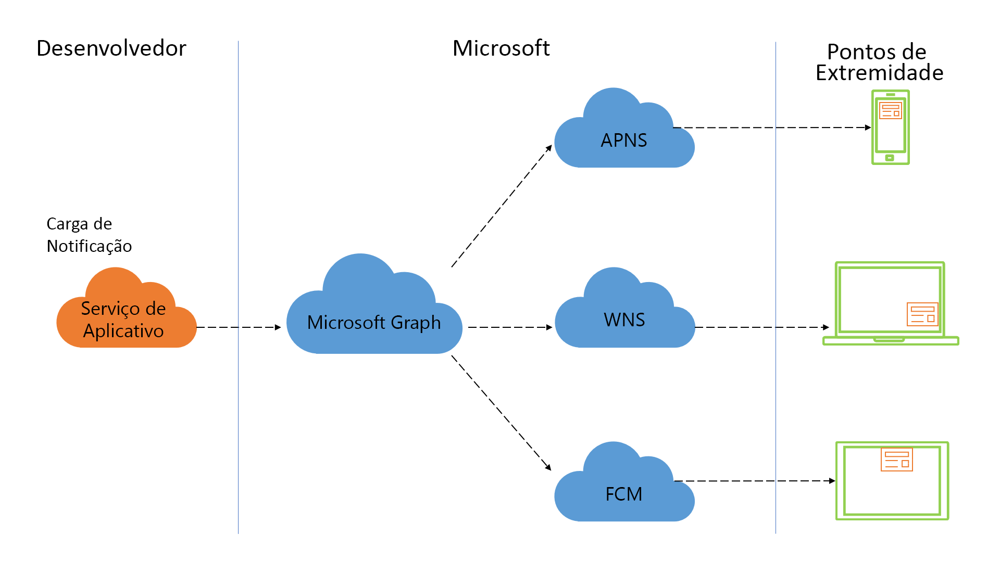

# Ativando experiências de notificação centradas no ser humano usando notificações do Microsoft Graph

As notificações são uma das formas mais eficazes de interagir com os usuários do seu aplicativo. Uma ótima experiência de notificação pode ajudar a abrir um canal de comunicação quase em tempo real entre você e seus usuários, o que pode aumentar o engajamento com o aplicativo no momento certo, tornar os usuários mais produtivos e alertá-los sobre eventos importantes ou ações necessárias.

> [!VIDEO https://www.youtube-nocookie.com/embed/cmpPFhrS8ZA]

Hoje, os usuários podem acessar seus aplicativos e serviços por meio de uma ampla variedade de plataformas e formatos. Essa combinação de dispositivos exige que você entenda e dê suporte a sistemas de notificação multiplataforma, mapeie usuários para pontos de extremidade e mantenha o estado de notificação em todos os dispositivos. 

A maioria dos outros sistemas de notificação elimina a necessidade de entender e direcionar sistemas de notificação por push específicos da plataforma, mas ainda são projetados para cada dispositivo. A plataforma de notificações do Microsoft Graph fornece uma abordagem centrada no ser humano que permite segmentar seus usuários em todo e qualquer ponto de extremidade do dispositivo.

## Por que se integrar às notificações do Microsoft Graph?

A plataforma de notificações do Microsoft Graph fornece um recurso de notificação centrada no usuário que traz cinco benefícios principais para seus aplicativos.

### Direcione sem esforço seu usuário para o fornecimento de notificações em diferentes pontos de extremidade

Você pode usar a API de notificações para direcionar uma conta pessoal da Microsoft ou uma conta do Azure Active Directory (Azure AD) corporativa ou de estudante para fornecer notificações. A plataforma distribui essa notificação para todos os pontos de extremidade de usuários que executam seu aplicativo ou serviço, incluindo o Windows UWP, o iOS, o Android e os pontos de extremidade da web. Esse recurso ajuda a maximizar o alcance, garantindo que as notificações apropriadas possam alcançar seu destino, onde quer que estejam.

### Gerencie as notificações facilmente pelos pontos de extremidade

Com o novo e aprimorado [SDK do cliente de notificações](https://aka.ms/GNSDK) em seu aplicativo cliente, você pode atualizar o estado de uma notificação e sincronizá-lo em todos os pontos de extremidade. Por exemplo, quando um usuário age sobre uma notificação em um dispositivo, você pode atualizar o estado essa notificação (por exemplo, marcá-la como lida ou ignorada), e essa alteração de estado será distribuída a todos os outros pontos de extremidade. A API de notificações do Microsoft Graph acompanha o estado das notificações do usuário de forma centralizada, facilitando a garantia de que suas notificações sejam tratadas uma vez e descartadas em todo lugar, minimizando a redundância e garantindo uma excelente experiência do cliente.

### Recuperar estado e histórico de notificação

Você pode usar a API de notificações para recuperar o histórico de notificações, com base em um período de expiração que você define (até 30 dias). As notificações marcadas como lidas ou dispensadas ainda podem ser recuperadas do histórico, permitindo visualizações no aplicativo do histórico de notificações, além de permitir que você desenvolva insights e inteligência.

### Entrega garantida para notificações de alta prioridade

Em plataformas como o iOS, em certas condições energéticas, a entrega de notificações de dados brutos pode atrasar devido ao processamento em lotes ou pode nem chegar ao ponto de extremidade. Para notificações com alta prioridade entregues a usuários no iOS, a plataforma de notificações do Microsoft Graph permite especificar uma opção de "fallback" de notificação do sistema "raw-to-visual" que envia automaticamente uma notificação do sistema visual para o dispositivo iOS de destino, garantindo que os usuários sejam notificados praticamente em tempo real.   

### Privacidade e conformidade

Nosso modelo push-to-pull garante que as notificações nunca saiam dos limites confiáveis. Os serviços de push específicos da plataforma são usados para enviar um "shoulder-tap" para o dispositivo do usuário e, a partir daí, o SDK do cliente busca com segurança a carga correspondente do serviço de notificações do Microsoft Graph. Atendemos à maioria dos requisitos de conformidade corporativa, incluindo ISO 27001, ISO 27018, EUMC, HIPAA, FERPA, SOC 1, SOC 2 e, é claro, RGPD.

## Por onde começar?

Para começar, consulte a seção de [visão geral da integração](notifications-integration-e2e-overview.md) para saber como integrar as notificações centradas no usuário em seu aplicativo.

## Referência da API
Está procurando a referência de API para esse serviço?

- [Usar API REST de notificações no Microsoft Graph](/graph/api/resources/notifications-api-overview?view=graph-rest-beta)
