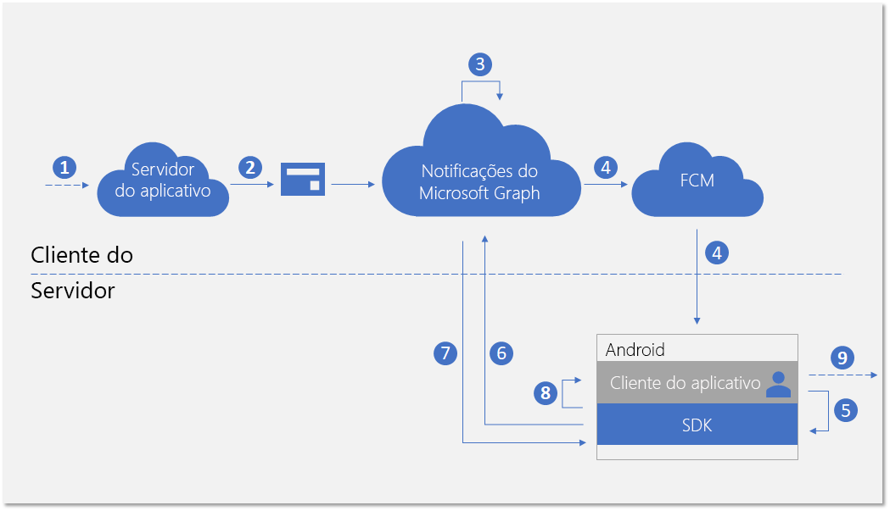
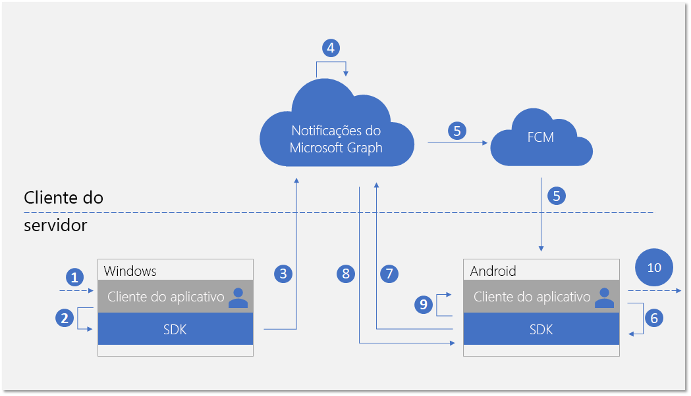

# <a name="integrate-your-android-app-with-the-client-side-sdk-for-user-notifications"></a>Integração do aplicativo Android no SDK do lado do cliente para notificações ao usuário

Após [registrar seu aplicativo](notifications-integration-app-registration.md) no Portal do Azure e integrar suas [experiências entre dispositivos](notifications-integration-cross-device-experiences-onboarding.md) no Partner Center de desenvolvimento, a próxima etapa é integrar seu aplicativo de cliente com o SDK do lado do cliente para aplicativos Android.  

Com o SDK do cliente, o aplicativo pode executar as etapas necessárias de registro para receber notificações publicadas do servidor do aplicativo direcionadas ao usuário conectado atualmente. O SDK então gerencia as notificações no lado do cliente, incluindo receber novas notificações, gerenciar o estado de notificações para alcançar cenários como descartar de forma universal e recuperar o histórico completo de notificações. 

## <a name="new-incoming-notification-flow"></a>Fluxo de notificação de entrada

Para receber novas notificações, o fluxo de dados é mostrado no diagrama a seguir.



O processo envolve alguns componentes:

* Servidor de aplicativo – back-end do aplicativo
* Cliente do aplicativo – front-end do aplicativo (um aplicativo UWP, Android ou iOS)
* Notificações do Microsoft Graph – o componente do serviço que permite que notificações ao usuário sejam publicadas, armazenadas e sincronizadas em instâncias diferentes dos clientes do aplicativo em vários dispositivos e plataformas
* FCM – Firebase Cloud Messaging, o serviço de notificações por push fornecido pelo Android como parte do Google Play Services. As notificações do Microsoft Graph usam esse serviço para sinalizar clientes do aplicativo do Android sobre as alterações de dados de notificação do usuário.  

O diagrama mostra as próximas etapas: 

1. Lógica do aplicativo. Esta etapa captura o que aciona a notificação a ser publicada para o usuário. Esta é uma lógica específica do aplicativo e pode ser um evento ou atualização de dados sobre alguma outra coisa no Microsoft Graph, como um novo evento de calendário ou atribuição de tarefa, ou o que seu serviço de aplicativo desejar notificar ao usuário.
2. O servidor do aplicativo publica uma notificação para o usuário alvo pela API de notificações do Microsoft Graph. Para saber mais, consulte [integração com o lado do servidor](notifications-integrating-app-server.md).
3. Ao receber a solicitação Web com nova notificação, as notificações do Microsoft Graph mantêm o conteúdo da notificação em segurança na nuvem para esse aplicativo e esse usuário.
4. Para cada instância do cliente do aplicativo inscrita para receber notificações para esse usuário, as notificações do Microsoft Graph envia um sinal para notificar cliente do aplicativo, por meio do serviço de envio por push nativo fornecido pelo sistema operacional. Nesse caso, o aplicativo é um aplicativo Android, e ele usa [mensagens de dados FCM](https://firebase.google.com/docs/cloud-messaging/concept-options) para enviar o sinal. 
5. Depois que o aplicativo for sinalizado pelas notificações por push de entrada, ele pede ao SDK para buscar as alterações no repositório de notificações do usuário. 
6. O SDK estabelece uma conexão segura e compatível com o repositório de notificações do usuário no Microsoft Graph.
7. O SDK recebe as alterações de dados – nesse caso, o novo conteúdo de notificação. 
8. O SDK dispara retornos de evento para notificá-o aplicativo após as alterações são recuperadas com êxito. 
9. Lógica do aplicativo. Essa etapa captura o que o aplicativo escolhe fazer dentro retorno de chamada do evento. Normalmente, isso resulta em alterações locais de dados do aplicativo e atualizações de interface do usuário locais. Nesse caso, o aplicativo geralmente cria uma pop-up de notificação do sistema para notificar o usuário sobre o conteúdo de notificação.

## <a name="notification-update-flow"></a>Fluxo de atualização de notificação

Uma das principais vantagens de usar as notificações do Microsoft Graph é que ele mantêm as notificações na nuvem com segurança e as transforma em um tipo de recurso com estado. Portanto, ele pode ajudar o aplicativo a gerenciar e a sincronizar o estado correto das notificações em diferentes dispositivos para o usuário conectado em um cenário entre dispositivos. Quando uma notificação estiver marcada como descartada ou como lida em um dispositivo, os outros dispositivos podem ser notificados em tempo real. "Manipulada uma vez, descartada em qualquer lugar" pode se tornar a promessa real como parte da experiência de notificação para seus usuários. 

O diagrama a seguir mostra o fluxo de dados para alterar o estado de uma notificação ou excluir a notificação em um dispositivo e receber/manipular a alteração de estado ou a exclusão em outro dispositivo.



Observe que a segunda parte do fluxo é semelhante ao fluxo para lidar com novas notificações recebidas. Isso ocorre por design - o padrão de programação do SDK é projetado para que o aplicativo cliente possa lidar com todos os tipos de alterações de dados de notificação do usuário (novas notificações recebidas, alterações de estado de notificação, notificação excluída) de maneira semelhante.  

O diagrama mostra as próximas etapas:

1. Lógica do aplicativo. Algo aciona a notificação para ser alterada ou excluída. Em geral, qualquer evento possível pode acionar a alteração de uma notificação. 
2. Chamada do aplicativo para o SDK do cliente para atualizar ou excluir uma notificação. Atualmente, expomos duas propriedades sobre alterações de estado – **userActionState** e **readState** – mas o aplicativo pode definir esses estados e quando eles precisam ser atualizados. Por exemplo, quando um usuário descartar a notificação pop-up, você pode atualizar o **userActionState** para Descartado. Quando um usuário clica na notificação pop-up e inicia o aplicativo para consumir o conteúdo correspondente do aplicativo, você pode atualizar o **userActionState** para ativado e atualizar o **readState** para Lido. 
3. Depois que a API correspondente é chamada para atualizar ou excluir uma notificação, o SDK irá chamar o repositório na nuvem de notificação de usuário para dispersar essa alteração para as outras instâncias de cliente do aplicativo com o mesmo usuário conectado. 
4. Ao receber a solicitação de atualização/exclusão de um cliente, as notificações do Microsoft Graph irão atualizar o repositório de notificação e identificar as outras instâncias de cliente do aplicativo inscritas para essa alteração.
5. Para cada inscrição do cliente do aplicativo, as notificações do Microsoft Graph envia um sinal para notificar o cliente do aplicativo, por meio do serviço de envio por push nativo fornecido pelo sistema operacional. Nesse caso, esse é um aplicativo Android, e ele usa [mensagens de dados FCM](https://firebase.google.com/docs/cloud-messaging/concept-options) para enviar o sinal. 
6. Depois que o aplicativo for sinalizado pelas notificações por push de entrada, ele pede ao SDK para buscar as alterações no repositório de notificações do usuário. 
7. O SDK estabelece uma conexão segura e compatível com o repositório de notificações do usuário no Microsoft Graph.
8. O SDK recebe as alterações de dados – nesse caso, as alterações são atualizações de notificação de estado ou exclusões de notificação. 
9. O SDK dispara retornos de evento para notificá-o aplicativo após as alterações são recuperadas com êxito. 
10. Lógica do aplicativo. Essa etapa captura o que o aplicativo escolhe fazer dentro retorno de chamada do evento. Normalmente, isso resulta em alterações locais de dados do aplicativo e atualizações de interface do usuário locais. Nesse caso, como há atualizações de notificação, o aplicativo deve atualizar a interface do usuário no local para refletir a alteração de estado. Por exemplo, se uma notificação estiver marcada como ativada, você pode remover a mensagem de notificação correspondente dentro da bandeja de notificação do Android para obter "manipulada uma vez, descartada em todo lugar". 

Para obter mais informações sobre as notificações do Microsoft Graph, consulte a [visão geral das notificações do Microsoft Graph](notifications-concept-overview.md). Para saber mais sobre as etapas necessárias para integrar com as notificações do Microsoft Graph de ponta a ponta, confira a [visão geral de integração](notifications-integration-e2e-overview.md) das notificações do Microsoft Graph.

## <a name="development-environment-and-requirements"></a>Ambiente e os requisitos de desenvolvimento

Para usar as notificações do Microsoft Graph, será necessário um IDE de desenvolvimento de aplicativos Android e um dispositivo Android com uma das arquiteturas suportadas (**armeabi-v7a**, **arm64-v8a**, **x86**, ou **x86_64**) ou um emulador. O sistema deve ser o Android 4.4.2 ou posterior.

## <a name="adding-the-sdk-to-your-project"></a>Adicionar o SDK ao seu projeto

Insira as seguintes referências do repositório para o arquivo *build.gradle* na raiz do seu projeto.

```Java
allprojects {
    repositories {
    jcenter()
    maven { url 'https://maven.google.com' }
    maven { url 'https://projectrome.bintray.com/maven/' }
    }
}
```

Depois insira a dependência a seguir para o arquivo _build.gradle_ que está na pasta do projeto.

```Java
dependencies { 
    ...
    implementation 'com.microsoft.connecteddevices:connecteddevices-sdk:+'
}
```

Se você quiser usar ProGuard em seu aplicativo, adicione as regras ProGuard dessas novas APIs. Crie um arquivo chamado *proguard-rules.txt* na pasta *Aplicativo* do seu projeto e cole nos conteúdos de [ProGuard_Rules_for_Android_Rome_SDK.txt](https://github.com/Microsoft/project-rome/blob/master/Android/ProGuard_Rules_for_Android_Rome_SDK.txt).
No arquivo do projeto *AndroidManifest.xml*, adicione as seguintes permissões dentro do elemento `manifest` (se já não estiverem presentes). Isso dá permissão ao aplicativo para se conectar à Internet e permitem a descoberta Bluetooth em seu dispositivo.
Observe que as permissões relacionadas ao Bluetooth só são necessárias para usar a descoberta Bluetooth; elas não são necessárias para os recursos da plataformas de dispositivos conectados. Além disso, `ACCESS_COARSE_LOCATION` só é necessário em SDKs 21 do Android e versões posteriores. Em SDKs 23 do Android e versões posteriores, você também deve solicitar ao usuário para conceder acesso à localização no tempo de execução.

```xml
<uses-permission android:name="android.permission.INTERNET" />
<uses-permission android:name="android.permission.BLUETOOTH" />
<uses-permission android:name="android.permission.BLUETOOTH_ADMIN" />
<uses-permission android:name="android.permission.ACCESS_COARSE_LOCATION" />
<uses-permission android:name="android.permission.ACCESS_NETWORK_STATE" />
```
Em seguida, vá para as aulas de atividades nas quais deseja que a funcionalidade Dispositivos conectados esteja localizada. Importe os seguintes namespaces.

```java
import com.microsoft.connecteddevices;
import com.microsoft.connecteddevices.userdata;
import com.microsoft.connecteddevices.userdata.usernotifications;
```

## <a name="initializing-the-connected-device-platforms"></a>Inicializar as Plataformas do Dispositivo Conectado

No SDK do lado do cliente é desenvolvido com base em uma infraestrutura chamada Plataforma de Dispositivo Conectado. Antes de poder usar qualquer recurso, a plataforma deve ser inicializada em seu aplicativo. As etapas de inicialização que devem ocorrer em sua classe principal no método **OnCreate**, porque eles são necessários para ocorrer os cenários de notificação.

Você deve criar e inicializar a plataforma ao instanciar a classe [**ConnectedDevicesPlatform**](/java/api/com.microsoft.connecteddevices.connecteddevicesplatform?view=rome-android-latest). Antes de fazer isso, certifique-se de conectar manipuladores de eventos, pois depois que a plataforma é iniciada, os eventos podem começar a acionar. 

```java
ConnectedDevicesPlatform platform = new ConnectedDevicesPlatform(context);

platform.getAccountManager().accessTokenRequested().subscribe((accountManager, args) -> onAccessTokenRequested(accountManager, args));
platform.getAccountManager().accessTokenInvalidated().subscribe((accountManager, args) -> onAccessTokenInvalidated(accountManager, args));
platform.getNotificationRegistrationManager().notificationRegistrationStateChanged().subscribe((notificationRegistrationManager, args) -> onNotificationRegistrationStateChanged(notificationRegistrationManager, args));

platform.start();
```

### <a name="handling-account-access-token"></a>Gerenciar tokens de acesso à conta

Todas as chamadas de Web que o SDK realiza, incluindo a recuperação do conteúdo de uma nova notificação de entrada, atualização de notificação de estado e muito mais, são leituras de ou escrevendo para os dados do usuário e, portanto, sempre exigem um token de acesso válido. O SDK requer que você trate os seguintes eventos – chamados quando um token de acesso for solicitado ou invalidado – para garantir que, depois da plataforma inicializar, o token de acesso do usuário seja tratado corretamente. 

#### <a name="accesstokenrequested"></a>accessTokenRequested 

Para uma implementação completa, confira o [exemplo de aplicativo Android](https://github.com/Microsoft/project-rome/blob/release/1.3.0/Android/samples/graphnotificationssample/app/src/main/java/com/microsoft/connecteddevices/graphnotifications/ConnectedDevicesManager.java). 

```Java
private void onAccessTokenRequested(ConnectedDevicesAccountManager sender, ConnectedDevicesAccessTokenRequestedEventArgs args) {
    ConnectedDevicesAccessTokenRequest request = args.getRequest();
    List<String> scopes = request.getScopes();

    // We always need to complete the request, even if a matching account is not found
    if (account == null) {
        request.completeWithErrorMessage("The app could not find a matching ConnectedDevicesAccount to get a token");
        return;
    }

    // Complete the request with a token
    account.getAccessTokenAsync(scopes)
        .thenAcceptAsync((String token) -> {
            request.completeWithAccessToken(token);
        }).exceptionally(throwable -> {
            request.completeWithErrorMessage("The Account could not return a token with those scopes");
            return null;
    });
}
```

#### <a name="accesstokeninvalidated"></a>accessTokenInvalidated

Para uma implementação completa, confira o [exemplo de aplicativo Android](https://github.com/Microsoft/project-rome/blob/release/1.3.0/Android/samples/graphnotificationssample/app/src/main/java/com/microsoft/connecteddevices/graphnotifications/ConnectedDevicesManager.java). 

```Java
private void onAccessTokenInvalidated(ConnectedDevicesAccountManager sender, ConnectedDevicesAccessTokenInvalidatedEventArgs args, List<Account> accounts) {
    Log.i(TAG, "Token invalidated for account: " + args.getAccount().getId());
}
```

### <a name="handling-push-registration-expiration"></a>Gerenciar validade de registro de push 

As notificações do Microsoft Graph usa o WNS, a plataforma de push nativa no Android, para sinalizar o aplicativo de cliente sobre alterações de dados de notificações do usuário. Isso acontece quando novas notificações recebidas forem publicadas do servidor de aplicativos, ou quando o estado de qualquer notificação é atualizado em outro dispositivo com o mesmo usuário conectado em um cenário entre dispositivos. 

Portanto, é necessário um token FCM válido que permite mensagens de notificação de dados para ter êxito. O seguinte retorno de chamada de evento trata da validade de tokens FCM por push. 

#### <a name="notificationregistrationstatechanged"></a>notificationRegistrationStateChanged

Para uma implementação completa, confira o [exemplo de aplicativo Android](https://github.com/Microsoft/project-rome/blob/release/1.3.0/Android/samples/graphnotificationssample/app/src/main/java/com/microsoft/connecteddevices/graphnotifications/ConnectedDevicesManager.java). 

## <a name="signing-in-your-user"></a>Entrar com seu usuário

As notificações do Microsoft Graph, como vários outros tipos de recursos no Microsoft Graph, são centralizadas em torno dos usuários. Para que o aplicativo assine e comece a receber notificações para o usuário conectado, primeiro é necessário obter um token OAuth válido a ser usado no processo de registro. Você pode usar o método que preferir para gerar e gerenciamento os tokens OAuth. Exemplo de aplicativo que usa ADAL. 

Se você estiver usando uma conta da Microsoft, será necessário incluir as seguintes permissões em uma solicitação de entrada: `wl.offline_access"`, `ccs.ReadWrite`, `wns.connect`, `asimovrome.telemetry`, e `https://activity.windows.com/UserActivity.ReadWrite.CreatedByApp`. 

Se você estiver usando uma conta do Azure AD, você precisará solicitar o seguinte público: `https://cdpcs.access.microsoft.com`.

## <a name="adding-the-user-account-to-the-platform"></a>Adicionar a conta de usuário à plataforma 

Será preciso registrar a conta do usuário conectado com um SDK, o que envolve a adição de contas e o registro de um canal push para receber as notificações por push iniciais através de FCM. 

```Java
public AsyncOperation<Boolean> prepareAccountAsync(final Context context) {
    // Accounts can be in 3 different scenarios:
    // 1: cached account in good standing (initialized in the SDK and our token cache).
    // 2: account missing from the SDK but present in our cache: Add and initialize account.
    // 3: account missing from our cache but present in the SDK. Log the account out async

    // Subcomponents (e.g. UserDataFeed) can only be initialized when an account is in both the app cache
    // and the SDK cache.
    // For scenario 1, initialize our subcomponents.
    // For scenario 2, subcomponents will be initialized after InitializeAccountAsync registers the account with the SDK.
    // For scenario 3, InitializeAccountAsync will unregister the account and subcomponents will never be initialized.
    switch (mState) {
        // Scenario 1
        case IN_APP_CACHE_AND_SDK_CACHE:
            mUserNotificationsManager = new UserNotificationsManager(context, mAccount, mPlatform);
            return registerAccountWithSdkAsync();
        // Scenario 2
        case IN_APP_CACHE_ONLY: {
            // Add the this account to the ConnectedDevicesPlatform.AccountManager
            return mPlatform.getAccountManager().addAccountAsync(mAccount).thenComposeAsync((ConnectedDevicesAddAccountResult result) -> {
                // We failed to add the account, so exit with a failure to prepare bool
                if (result.getStatus() != ConnectedDevicesAccountAddedStatus.SUCCESS) {
                    result.getStatus());
                    return AsyncOperation.completedFuture(false);
                }

                // Set the registration state of this account as in both app and sdk cache
                mState = AccountRegistrationState.IN_APP_CACHE_AND_SDK_CACHE;
                mUserNotificationsManager = new UserNotificationsManager(context, mAccount, mPlatform);
                return registerAccountWithSdkAsync();
            });
        }
        // Scenario 3
        case IN_SDK_CACHE_ONLY:
            // Remove the account from the SDK since the app has no knowledge of it
            mPlatform.getAccountManager().removeAccountAsync(mAccount);
            // This account could not be prepared
            return AsyncOperation.completedFuture(false);
        default:
            // This account could not be prepared
            Log.e(TAG, "Failed to prepare account " + mAccount.getId() + " due to unknown state!");
            return AsyncOperation.completedFuture(false);
    }
}
```

```Java
public AsyncOperation<Boolean> registerAccountWithSdkAsync() {
    if (mState != AccountRegistrationState.IN_APP_CACHE_AND_SDK_CACHE) {
        AsyncOperation<Boolean> toReturn = new AsyncOperation<>();
        toReturn.completeExceptionally(new IllegalStateException("Cannot register this account due to bad state: " + mAccount.getId()));
        return toReturn;
    }

    // Grab the shared GCM/FCM notification token from this app's BroadcastReceiver
    return RomeNotificationReceiver.getNotificationRegistrationAsync().thenComposeAsync((ConnectedDevicesNotificationRegistration notificationRegistration) -> {
        // Perform the registration using the NotificationRegistration
        return mPlatform.getNotificationRegistrationManager().registerAsync(mAccount, notificationRegistration)
            .thenComposeAsync((result) -> {
                if (result.getStatus() == ConnectedDevicesNotificationRegistrationStatus.SUCCESS) {
                    Log.i(TAG, "Successfully registered account " + mAccount.getId() + " for cloud notifications");
                } else {
                    // It would be a good idea for apps to take a look at the different statuses here and perhaps attempt some sort of remediation.
                    // For example, token request failed could mean that the user needs to sign in again. An app could prompt the user for this action 
                    // and retry the operation afterwards.
                    Log.e(TAG, "Failed to register account " + mAccount.getId() + " for cloud notifications!");
                    return AsyncOperation.completedFuture(false);
                }

                return mUserNotificationsManager.registerForAccountAsync();
            });
    });
}
```

## <a name="subscribing-to-receive-users-notifications"></a>Inscrever-se para receber notificações do usuário 

Você precisa instanciar um objeto **UserDataFeed** para o aplicativo para este usuário conectado. O aplicativo é identificado pela ID de aplicativo multiplataforma fornecidas durante a [integração de experiências entre dispositivos](notifications-integration-cross-device-experiences-onboarding.md).

```Java
public UserNotificationsManager(@NonNull Context context, @NonNull ConnectedDevicesAccount account, @NonNull ConnectedDevicesPlatform platform)
{
    Context context = new Context;
    UserDataFeed feed = UserDataFeed.getForAccount(account, platform, Secrets.APP_HOST_NAME);
    UserNotificationChannel channel = new UserNotificationChannel(feed);
    UserNotificationReader reader = channel.createReader();
    reader.dataChanged().subscribe((reader, aVoid) -> readFromCache(reader));
    }
}
```

## <a name="receiving-and-managing-user-notifications"></a>Receber e gerenciar as notificações do usuário

O diagrama de fluxo anterior neste tópico mostra que os padrões de programação para lidar com novas notificações de entrada de um servidor de aplicativo e uma atualização ou exclusão de notificação iniciada a partir de outra instância do aplicativo cliente são semelhantes. A seguir estão as etapas para lidar com essas alterações de dados. 

### <a name="handling-incoming-push-notification-signal"></a>Gerenciar sinal de notificações por push de entrada

Todos os tipos de alterações de dados de notificações do usuário geram um sinal que é entregue para os clientes do aplicativo como uma notificação por push. Para aplicativos Android, o sinal será enviado como uma mensagem de dados FCM por push. Ao receber sinal de mensagem de dados, o aplicativo deve chamar **TryParse** para acionar o SDK para buscar no serviço de notificações do Microsoft Graph para as alterações de dados reais.

```Java
public void onMessageReceived(RemoteMessage message) {
    Map data = message.getData();
    ConnectedDevicesNotification notification = ConnectedDevicesNotification.tryParse(data);

    if (notification != null) {
        try {
            ConnectedDevicesPlatform platform = ConnectedDevicesManager.getConnectedDevicesManager(getApplicationContext()).getPlatform();

            // NOTE: it may be useful to attach completion to this async in order to know when the notification is done being processed.
            // This would be a good time to stop a background service or otherwise cleanup.
            platform.processNotificationAsync(notification);
        } catch (Exception e) {
            Log.e(TAG, "Failed to process FCM notification" + e.getMessage());
        }
    }
}
```

### <a name="handling-user-notification-data-changes"></a>Gerenciar alterações de dados de notificação do usuário

Após o SDK buscar com êxito as alterações de dados, um retorno de chamada do evento é invocado e o cliente de aplicativo deve lidar com a criação, atualização ou exclusão da notificação.

```Java
private void readFromCache(final UserNotificationReader reader)
{
    reader.readBatchAsync(Long.MAX_VALUE).thenAccept(notifications -> {
        synchronized (this) {
            for (final UserNotification notification : notifications) {
                if (notification.getStatus() == UserNotificationStatus.ACTIVE) {
                    removeIf(mNewNotifications, item -> notification.getId().equals(item.getId()));

                    if (notification.getUserActionState() == UserNotificationUserActionState.NO_INTERACTION) {
                        mNewNotifications.add(notification);
                        if (notification.getReadState() != UserNotificationReadState.READ) {
                            clearNotification(mContext.getApplicationContext(), notification.getId());
                            addNotification(mContext.getApplicationContext(), notification.getContent(), notification.getId());
                        }
                    } else {
                        clearNotification(mContext.getApplicationContext(), notification.getId());
                    }

                    removeIf(mHistoricalNotifications, item -> notification.getId().equals(item.getId()));
                    mHistoricalNotifications.add(0, notification);
                } else {
                    removeIf(mNewNotifications, item -> notification.getId().equals(item.getId()));
                    removeIf(mHistoricalNotifications, item -> notification.getId().equals(item.getId()));
                    clearNotification(mContext.getApplicationContext(), notification.getId());
                }
            }
        }

    });
}
```

### <a name="update-state-of-a-notification"></a>Atualização do estado de uma notificação

Se a alteração do estado de notificação é iniciada da instância do cliente do aplicativo (por exemplo, se a notificação pop-up do sistema nesse dispositivo é ativada pelo usuário), o aplicativo deve chamar o SDK para atualizar o estado de notificação para que essa alteração de estado seja sincronizada em todos os dispositivos usados pelo mesmo usuário. 

```Java
notification.setUserActionState(UserNotificationUserActionState.ACTIVATED);
notification.saveAsync().whenCompleteAsync((userNotificationUpdateResult, throwable) -> {
    if (throwable == null && userNotificationUpdateResult != null && userNotificationUpdateResult.getSucceeded()) {
        Log.d(TAG, "Successfully activated the notification");
    }
});
```

### <a name="delete-a-notification"></a>Excluir uma notificação

Se a exclusão de uma notificação é iniciada da instância do cliente de aplicativo (por exemplo, se a tarefa correspondente a essa notificação for marcada como concluída e removida do banco de dados do aplicativo), o aplicativo deve chamar o SDK para excluir a notificação para que essa operação de exclusão seja sincronizada em todos os dispositivos usados pelo mesmo usuário. 

Uma notificação é removida do repositório de notificação do usuário apenas se expirada ou explicitamente excluída. Uma notificação do usuário não é excluída quando você atualiza o **UserActionState** para Descartado, porque a definição semântica do **UserActionState** é definida pelo próprio aplicativo.

```Java
channel.deleteUserNotificationAsync(notification.getId()).whenCompleteAsync((userNotificationUpdateResult, throwable) -> {
    if (throwable == null && userNotificationUpdateResult != null && userNotificationUpdateResult.getSucceeded()) {
        Log.d(TAG, "Successfully deleted the notification");
    }
});
```

## <a name="see-also"></a>Confira também

- [Referência da API](/windows/project-rome/notifications/api-reference-for-android) para o conjunto completo de APIs relacionadas aos recursos de notificação no SDK. 
- [Exemplo do lado do cliente](https://github.com/Microsoft/project-rome/tree/master/Android/samples/graphnotificationssample) para aplicativos Android.
- [Exemplo do servidor do aplicativo](notifications-integrating-app-server.md) para publicar as notificações.
